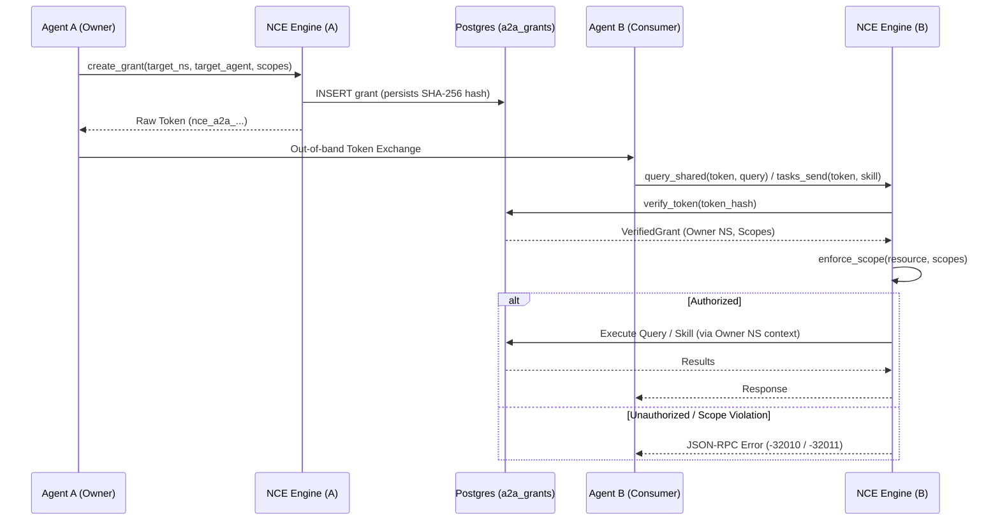
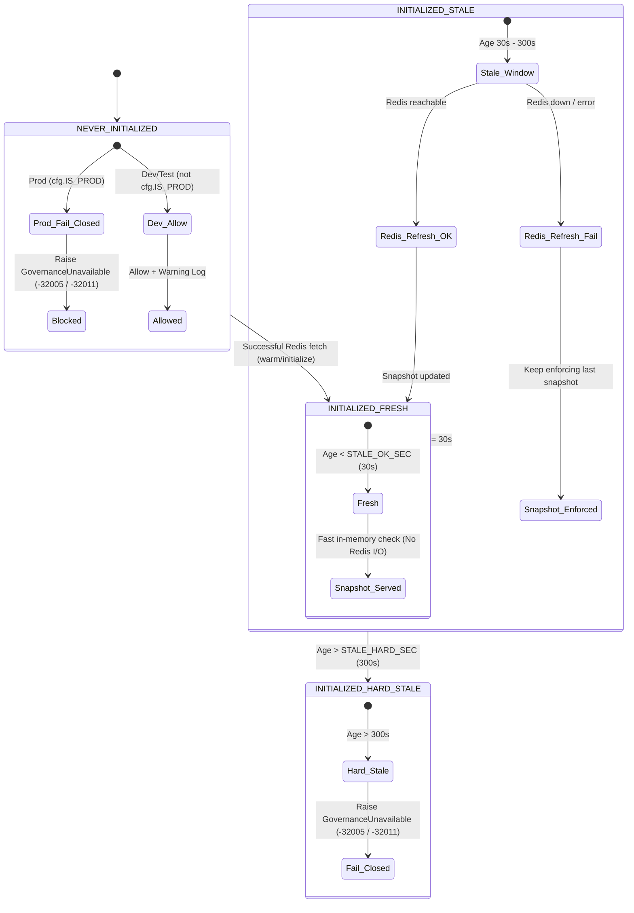

> **Status:** shipped · **Verified-against:** 7304330 (main) · **Last-audited:** 2026-08-17

# Agent-to-Agent (A2A) Protocol

The Agent-to-Agent (A2A) Protocol (Phase 3.1) is a specialized framework for secure, scoped memory sharing and multi-agent service coordination between independent AI agents. It allows Agent A to grant specific permissions to Agent B to access portions of its memory or Knowledge Graph, and invoke vertical engine skills without compromising full namespace isolation.

---

## The Cryptographic Handshake

Sharing is initiated via a handshake that produces a secure sharing token. By default the token is **multi-use** — it can be presented repeatedly until it expires or is revoked. Single-use behavior is opt-in: the `one_time` field on `A2AGrantRequest` defaults to `False`, and must be explicitly set to `True` at grant creation to restrict the token to a single successful usage.

### A2A Sharing Signal Flow

---

## Scopes and Permissions

A grant is defined by one or more **scopes**. A scope specifies exactly what is being shared:

- **`namespace`**: Grants access to the entire memory store of the owner namespace.
- **`memory`**: Grants access to a specific UUID-identified memory.
- **`kg_node`**: Grants access to a specific Knowledge Graph node and its immediate neighbors.
- **`subgraph`**: Grants access to a recursively defined subgraph.

Currently, the protocol supports `read` permissions.

---

## Security Controls

1. **Token Hashing**: The raw sharing token is never stored in the database. NCE only stores the SHA-256 hash, making it impossible to reconstruct tokens from a database leak.
2. **Binding Constraints**: Grants can be optionally restricted to a specific receiving `namespace_id` or `agent_id`, preventing unauthorized agents from using an intercepted token.
3. **Auto-Expiration**: All tokens have a mandatory expiration window (default 1 hour, max 30 days).
4. **Instant Revocation**: Owners can revoke a grant at any time via the `a2a_revoke_grant` tool, instantly invalidating the token.
5. **Zero-Trust Transport Security**: Mutual TLS (mTLS) is mandatory in production (`NCE_ENV=prod`) for the A2A server (`NCE_A2A_MTLS_ENABLED=true`), validated via `assert_server_mtls_or_acknowledged`.

---

## Enriched A2A Lifecycle Management (Phase 3.1 Extensions)

To align with enterprise-grade requirements, the A2A protocol includes advanced, tenant-isolated operations for managing, mutating, and auditing active grants:

### 1. Verification of Grant Status (`a2a_verify_grant_status`)
Enables agents to safely check the validity, active scopes, status, and expiration of a grant at runtime:
- **Tenant Isolation**: Protected by strict `NamespaceContext` boundaries. A caller passes the check if it is the owner *or* the target of the grant. Note that an **unrestricted** grant (one created with `target_namespace_id = None`) has no binding target, so `is_target` is set `True` for *any* authenticated caller — any bearer can inspect such a grant's status. The owner-or-target restriction only meaningfully constrains inspection when the grant is bound to a specific receiving namespace (and optionally agent).
- **Auto-Expiration sweeps**: Performs a timezone-aware check on every lookup, transitioning expired active tokens automatically to `expired` status in the PostgreSQL store.
- **Crypto Safety**: Does not leak the SHA-256 token hash in the response.

### 2. Scope Mutation (`a2a_update_grant_scopes`)
Allows owners to dynamically mutate the scope mapping of an active grant without regenerating the cryptographic key:
- **Modes**:
  - `replace`: Replaces all existing scopes with the new list.
  - `append`: Performs a unique union-merge, appending new scopes without creating duplicate entries.
- **Auditing**: Generates a secure `a2a_grant_updated` event inside the tamper-resistant system event log.
- **Validation**: Enforces that grants must retain at least one valid scope and blocks modifications to inactive/revoked/expired records.

### 3. Grant Inspection (`a2a_inspect_grant`)
Allows the owning agent to safely retrieve a detailed, structured audit log of a grant's metadata. Sensitive cryptographic token hashes are never exposed, making this tool fully safe for automated compliance logging and security scanning.

---

## MCP Tools Reference

The A2A protocol registers exactly seven MCP tools in `tool_registry.py`:

| Tool | Purpose |
| :--- | :--- |
| `a2a_create_grant` | Create a grant and return the raw sharing token (mutation). |
| `a2a_revoke_grant` | Revoke a grant, instantly invalidating its token (mutation). |
| `a2a_list_grants` | List grants owned by the calling agent. |
| `a2a_query_shared` | Consume a sharing token to query the owner's shared resources. |
| `a2a_verify_grant_status` | Check a grant's validity, scopes, status, and expiration. |
| `a2a_update_grant_scopes` | Replace or append scopes on an active grant (mutation). |
| `a2a_inspect_grant` | Retrieve structured grant metadata for the owning agent. |

---

## A2A Public Skills Inventory (Agent Card)

The A2A HTTP server (`nce/a2a_server.py` on port `8004`) exposes an agent capability descriptor at `GET /.well-known/agent-card`. The Agent Card advertises exactly **six public invocable skills** that remote agents can submit via `POST /tasks/send`:

| Skill ID | Display Name | Purpose | Key Parameters |
| :--- | :--- | :--- | :--- |
| `recall_relevant_context` | Recall Relevant Context | Retrieves high-salience episodic and semantic memories for a task or query context. | `namespace_id` (req, UUID), `query` (req, str), `limit` (int, default 5) |
| `archive_session` | Archive Cognitive Session | Concludes and archives an agent working session into durable episodic memory. | `namespace_id` (req, UUID), `session_id` (req, str), `summary` (str) |
| `find_related_decisions` | Find Related Decisions | Traverses the knowledge graph to locate causal provenance and related architectural decisions. | `namespace_id` (req, UUID), `decision_type` (req, str), `topic` (str) |
| `verify_memory_integrity` | Verify Memory Integrity | Computes cryptographic integrity and causal chain hash verification over memory blobs. | `namespace_id` (req, UUID), `memory_id` (req, UUID) |
| `get_cognitive_state` | Get Cognitive State | Returns real-time working memory metrics, active salience maps, and quota utilization. | `namespace_id` (req, UUID), `agent_id` (req, str) |
| `vendors_partner_view` | Vendors Partner View | Retrieves redacted, partner-safe target node fields and contractor profile attributes for external contractor sessions. | `namespace_id` (req, UUID), `node_id` (req), `partner_scope_id` (UUID) |

### Disambiguation: Internal Tools vs. Public Skills

- **Lifecycle & Verification Tools**: `verify_grant_status` (`a2a_verify_grant_status`), `a2a_create_grant`, and `a2a_revoke_grant` are internal verification helpers and native MCP lifecycle tools registered in `nce.a2a` and `tool_registry.py`. They are **not** published as public skills in the Agent Card (`_AGENT_CARD["skills"]`).
- **Public Skill Dispatch**: Only the six public skills listed in the inventory above can be requested via `POST /tasks/send`. Any request with an unknown skill identifier is rejected with JSON-RPC `-32602` (`A2A_CODE_BAD_REQUEST`: "Invalid skill parameters" / "Unknown A2A skill").

---

## Partner Access Model (Contractor Principal Authorization Boundary)

Under the zero-trust isolation model, incoming requests from external contractor sessions are strictly ring-fenced at skill dispatch (`nce/a2a_server.py:665-670`):

- **Principal Identification**: The calling principal is determined exclusively from the verified `NamespaceContext` attached by `JWTAuthMiddleware` (`caller_ctx.principal_kind`).
- **Restricted Whitelist**: When `caller_ctx.principal_kind == "contractor"`, the permitted skill set is restricted exclusively to `{"vendors_partner_view"}`.
- **Exclusive Permission**: **`vendors_partner_view` is the ONLY skill a contractor principal is authorized to invoke.**
- **Enforcement & Rejection**: Any attempt by a contractor principal to invoke any other skill (`contractor_match`, `d365_query_case`, `lead_enrich`, `product_search`, `quote_price`, etc.) is immediately denied before execution, raising `A2AScopeViolationError` (*"A2A skill '{skill}' is not authorized for contractor sessions."*), returning JSON-RPC error code **`-32011`** (`MCP_A2A_SCOPE_VIOLATION`) / HTTP 403 Forbidden.

---

## Rate Limiting & Resource Protection on `POST /tasks/send`

To protect against denial-of-service, abuse, and worker starvation, `POST /tasks/send` enforces multi-layer throttling and resource monitoring:

1. **Sliding-Window Rate Limiting**:
   - **Limit**: **60 requests per 60 seconds** (`NCE_A2A_HTTP_RATE_LIMIT=60`, `NCE_A2A_HTTP_RATE_PERIOD=60`).
   - **Key**: Tracked per client IP address in Redis under `nce:ratelimit:a2a:tasks_send:<client_ip>`.
   - **Rejection**: When the rate limit is exceeded, the server rejects the request with HTTP **429 Too Many Requests** and JSON-RPC error code **`-32013`** (`{"code": -32013, "message": "Rate limit exceeded", "data": {"reason": "too_many_requests"}}`).
2. **Process Memory Protection**:
   - The server monitors RSS memory usage against `NCE_A2A_MEMORY_LIMIT_MB` (default `2048.0` MB).
   - If memory exceeds the threshold, requests are rejected before dispatch with HTTP 503 and JSON-RPC error code `-32017` (*"Resource exhaustion: memory threshold exceeded"*).

---

## Fail-Closed Governance Model with 3-State Cache

All A2A network skills and MCP tools are governed by real-time administrative revocation controls. If an administrator disables a tool or skill from the Tools Control Dashboard (writing to the Redis hash `nce:tools:disabled`), the engine enforces strict revocation.

### Last-Known-Good Governance Architecture (`ToolGovernanceCache`)

Batch 100 (`4da8a4e`, addressing CWE-636 / CWE-1188) eliminated legacy fail-open behavior by introducing a process-local last-known-good cache (`ToolGovernanceCache` in `nce/tool_governance.py`). When Redis is unavailable or sluggish, governance fails **closed** rather than silently un-revoking disabled skills.

### 3-State Cache Lifecycle

The `ToolGovernanceCache` evaluates three explicit operational states based on monotonic time (`time.monotonic()`):

1. **INITIALIZED (Fresh)**:
   - **Condition**: Monotonic age < `NCE_TOOL_GOVERNANCE_STALE_OK_SEC` (default **30 seconds**).
   - **Behavior**: The cache serves the in-memory snapshot (`_snapshot`) directly without querying Redis.
2. **INITIALIZED (Stale, within hard window)**:
   - **Condition**: Monotonic age between `STALE_OK_SEC` (30s) and `NCE_TOOL_GOVERNANCE_STALE_HARD_SEC` (default **300 seconds**).
   - **Behavior**: The system attempts an asynchronous refresh against the Redis `nce:tools:disabled` hash. If Redis is unreachable or raises a transport error, it continues enforcing the last-known-good snapshot.
3. **INITIALIZED (Hard Stale / Cache Exhausted)**:
   - **Condition**: Monotonic age > `STALE_HARD_SEC` (300s).
   - **Behavior**: The cached snapshot is no longer trusted. The cache raises `GovernanceUnavailable`, failing closed.
4. **NEVER-INITIALIZED (Cold Boot)**:
   - **Condition**: Process starts and has never successfully fetched governance state from Redis (`_snapshot is None`).
   - **Production (`cfg.IS_PROD`)**: Fails closed immediately, raising `GovernanceUnavailable` to prevent cold-boot un-revoke bypasses.
   - **Dev / Test (`not cfg.IS_PROD`)**: Defaults to permitted with a warning log to avoid blocking local developer test suites.

### Governance Error Code Mapping

When a skill is administratively disabled or the governance registry is unavailable (`GovernanceUnavailable`), the system maps the exception to strict scope violation error codes:

| Surface | Exception Raised | Error Code | HTTP Status | Error Detail |
| :--- | :--- | :--- | :--- | :--- |
| **MCP Stdio Dispatch** (`mcp_stdio_dispatch.py`) | `GovernanceUnavailable` / Disabled Tool | **`-32005`** (`MCP_SCOPE_FORBIDDEN`) | — | *"governance registry unavailable"* / *"tool disabled by administrator"* |
| **A2A Server** (`a2a_server.py`) | `GovernanceUnavailable` → `A2AScopeViolationError` | **`-32011`** (`MCP_A2A_SCOPE_VIOLATION`) | HTTP 403 Forbidden | *"A2A skill governance registry unavailable; dispatch blocked"* |
| **A2A Server** (`a2a_server.py`) | Disabled Skill → `A2AScopeViolationError` | **`-32011`** (`MCP_A2A_SCOPE_VIOLATION`) | HTTP 403 Forbidden | *"A2A skill '{skill}' has been disabled by the administrator."* |

All degraded governance decisions (hard-stale fail-closed, cold boot prod block, or cold boot dev allow) increment the Prometheus counter `nce_tool_governance_degraded_total`.

---

## HTTP Task Path Requires a Namespace-Scoped Grant

The A2A HTTP server's `/tasks/send` path always calls `enforce_scope(...)` with `resource_type="namespace"` against the verified grant's scopes before dispatching. As a result, a grant created with **only** `memory`, `kg_node`, or `subgraph` scopes (and no `namespace` scope) is **rejected at the server** on this path — the finer-grained scopes alone do not satisfy the namespace check. In effect, cross-agent access over the HTTP task path requires a namespace-scoped grant; the narrower resource scopes are not sufficient to clear this gate.
