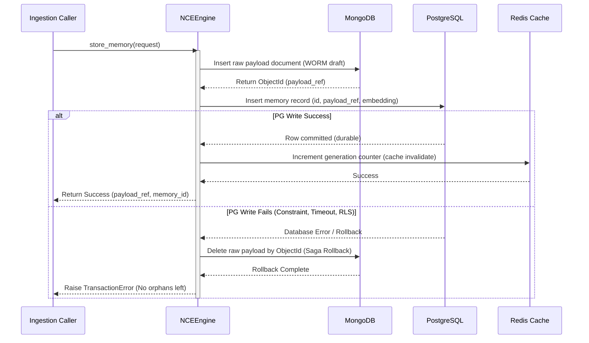
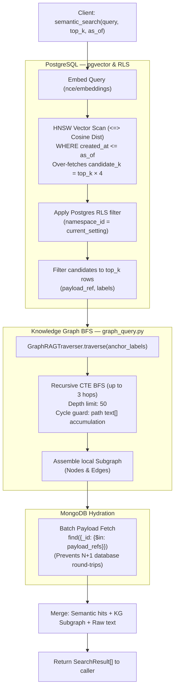

> **Status:** shipped · **Verified-against:** 7304330 (main) · **Last-audited:** 2026-08-17

# NCE v3.0.0 — System Architecture & C4 Context (Spec v1.0)

This document provides a comprehensive, code-aligned specification of the **Neuro Cognitive Engine (NCE) version 3.0.0** runtime architecture. It details the C4 System Context and Container structures, the primary processes and entry points, the Quad-Database stack, the transactional Saga pattern, the GraphRAG query hydration pipeline, and background asynchronous/scheduled tasks.

> **Version note:** The software version is `3.0.0` (authoritative source: `pyproject.toml:3`). This document is the v1.0 revision of the architecture specification (as listed in the sidebar). No authoritative in-code constant tracks the doc-spec revision separately from the package version.

---

## 1. C4 Architecture Specification

### 1.1 Level 1: System Context Diagram
The System Context Diagram shows how users, IDEs, and other agent systems interface with the NCE, and how NCE depends on downstream LLM/embedding platforms and external file/document sources.

```mermaid
flowchart TB
  subgraph Users["Users & Agents"]
    User["Developer / Operator\n(Admin Basic Auth / HMAC)"]
    IDE["IDE Client (Cursor / Claude Desktop)\n(NCE_MCP_API_KEY stdio)"]
    Agent["Downstream Agent Fleet\n(JWT Bearer / mTLS)"]
  end

  subgraph System["Sovereign Cognitive Boundary"]
    NCE["Neuro Cognitive Engine (NCE)\nv3.0.0"]
  end

  subgraph Downstream["External & Edge Dependencies"]
    LLM["LLM Provider (Consolidation/NLI)\n(OpenAI / Anthropic / Local)"]
    Emb["Cognitive Sidecar / Embedding Engine\n(Jina 768-dim / Edge Server)"]
  end

  subgraph Sources["Enterprise Document Bridges"]
    SP["SharePoint / MS Graph\n(Webhook Client Secret)"]
    GD["Google Drive\n(Webhook Client Token)"]
    DP["Dropbox\n(Webhook HMAC-SHA256)"]
  end

  User -->|HTTP REST / UI| NCE
  IDE -->|MCP stdio JSON-RPC 2.0| NCE
  Agent -->|HTTP REST Skills (A2A)| NCE
  Sources -->|Webhooks / Change Feeds| NCE
  NCE -->|Syncs/Pulls Documents| Sources
  NCE -->|Vector Embeddings HTTP| Emb
  NCE -->|Consolidation / NLI Reasoning| LLM
```

---

### 1.2 Level 2: Container Diagram
The Container Diagram illustrates NCE's primary runtime processes, entry points, background execution lanes, and the Quad-Database stack managed by `NCEEngine`.

```mermaid
flowchart TB
  subgraph Clients["Inbound Interfaces"]
    IDE_Client["IDE Client (Cursor / Claude)"]
    Admin_Client["Operator Dashboard / Browser"]
    A2A_Client["External Agent Callers"]
    Web_Hook["Bridge Webhook Publishers"]
  end

  subgraph Containers["NCE Processes"]
    MCP["server.py\nMCP Server (stdio)"]
    Admin["admin_server.py\nHTTP Admin (Basic/HMAC)"]
    A2A["nce/a2a_server.py\nHTTP REST Task API (mTLS/JWT)"]
    Webhook["nce/webhook_receiver/main.py\nFastAPI Webhook Receiver\n(Sliding Window Rate Limiter)"]
    Worker["start_worker.py\nRQ Async Worker\n(Default/High/Batch lanes)"]
    Cron["nce/cron.py\nAPScheduler Cron Engine\n(Distributed CronLock)"]
  end

  subgraph Orchestrator["Unified Persistence Layer"]
    Engine["NCEEngine\n(Saga transaction rollback)\n(nce/orchestrator.py)"]
  end

  subgraph Datastores["Quad-Database Stack"]
    PG[("PostgreSQL + pgvector\n(Metadata, Graph, RLS session setting,\nRange partitioning)")]
    Mongo[("MongoDB\n(Raw Episodic & Code Archive\nWORM layout)")]
    Redis[("Redis\n(Job Queue, Locks, TTL Cache)")]
    MinIO[("MinIO S3-Compatible\n(Media, Replay Payload Cache)")]
  end

  IDE_Client -->|stdio JSON-RPC| MCP
  Admin_Client -->|HTTP REST (:8003)| Admin
  A2A_Client -->|HTTP REST (:8004)| A2A
  Web_Hook -->|HTTP Webhooks (:8080)| Webhook

  MCP -->|Orchestrates| Engine
  Admin -->|Orchestrates| Engine
  A2A -->|Orchestrates| Engine
  Webhook -->|Rate Limits & Enqueues| Redis
  Worker -->|Processes Jobs| Engine
  Cron -->|Schedules Sagas & Outbox| Engine

  Engine -->|Queries & RLS| PG
  Engine -->|Saves Raw Payloads| Mongo
  Engine -->|Locks / Caching| Redis
  Engine -->|Saves Objects| MinIO

  Worker -->|Subscribes to lanes| Redis
  Cron -->|Orchestrates locks| Redis
```

---

## 2. Primary Entry Points

NCE version 3.0.0 exposes six distinct entry points, isolating workloads across dedicated runtimes:

### 2.1 `server.py` — MCP stdio Server
- **Role**: Entry point for IDE integration (Cursor, Claude Desktop). Envelopes the core cognitive engine in the Model Context Protocol (MCP) using the stdio transport.
- **Protocol**: JSON-RPC 2.0 over standard input/output.
- **Authentication**: `mcp_api_key` matching `NCE_MCP_API_KEY`.
- **Lifecycle**: Initiated when the IDE launches the agent. A garbage collector background loop (`run_gc_loop`), a quota Redis-flush loop, a re-embedder task, and an outbox relay loop are co-launched as tracked asyncio tasks by `nce/mcp_stdio_main.py:run_stdio_server()` after the engine connects.

### 2.2 `admin_server.py` — Admin UI & REST API
- **Role**: Web administration dashboard and REST endpoints for operations management.
- **Protocol**: HTTP/HTTPS (Port 8003).
- **Authentication**: HTTP Basic Auth (for the web UI) and HMAC-SHA256 API verification with Redis-backed nonce replay protection.
- **Operations**: Namespace management, quota modification, DLQ inspecting/replaying, signing key rotation, and diagnostic health checks.

### 2.3 `start_worker.py` — RQ Background Worker
- **Role**: Background task consumer driving expensive, asynchronous operations.
- **Protocol**: Redis queue polling.
- **Lanes & Priority Scopes**:
  - `high_priority`: Fast, user-facing operations (e.g. real-time document indexing, PII scrubbing verification).
  - `batch_processing`: Heavy, non-interactive sweeps (e.g. database re-embedding migrations).
  - `default`: Backward-compatibility fallback.

### 2.4 `nce/a2a_server.py` — A2A Skills Server
- **Role**: Starlette-based ASGI application exposing the public Agent-to-Agent (A2A) network bridge.
- **Protocol**: HTTP/HTTPS REST (Port 8004). Wire format is JSON; error responses use JSON-RPC 2.0-style error objects (numeric codes), but the transport is standard HTTP REST, not JSON-RPC 2.0 framing.
- **Routes**: `GET /.well-known/agent-card` (public discovery), `POST /tasks/send`, `GET /tasks/{task_id}`, `POST /tasks/{task_id}/cancel`, `GET /health`.
- **Authentication**: `POST /tasks/*` routes protected by `JWTAuthMiddleware` (Bearer token, `NamespaceContext`). Optional mTLS via `MTLSAuthMiddleware` on the same prefix (controlled by `NCE_A2A_MTLS_ENABLED`).
- **Exposed Skills**: `recall_relevant_context`, `archive_session`, `find_related_decisions`, `verify_memory_integrity`, `get_cognitive_state`, and `verify_grant_status`.

### 2.5 `nce/cron.py` — APScheduler Cron Engine
- **Role**: Master cron daemon scheduling administrative, cognitive, integrity, and reconciliation tasks. Only a single instance should be active per cluster.
- **Locking**: Distributed locking backed by Redis (`CronLock` via `nce/cron_lock.py`) prevents race conditions when scaling horizontally across replicas.
- **Startup Jitter**: Applies a randomized startup delay (`CRON_STARTUP_JITTER_MAX_SECONDS`) to prevent thundering-herd database load spikes.
- **Alert Dispatch**: Catches operational errors without crashing the scheduler; dispatches throttled alert notifications via `nce.notifications.dispatcher` (5-minute suppression window).
- **Dynamic Rescheduling**: Exposes `reschedule_jobs()` to update job interval triggers at runtime based on overrides stored in `SettingsStore`.

### 2.6 `nce/webhook_receiver/main.py` — Webhook Receiver
- **Role**: FastAPI-based listener endpoint receiving third-party document and CRM notifications.
- **Protocol**: HTTP/HTTPS (Port 8080).
- **Security**: Validates signatures (SharePoint client secret, Google client token, Dropbox HMAC-SHA256, and Dynamics 365 `x-ms-signaturecontent` HMAC-SHA256). Webhooks decode events and enqueue corresponding sync jobs in Redis to be processed by the RQ worker. Dynamics 365 events are routed to the `high_priority` lane to ensure low latency.

---

## 3. Quad-Stack & Saga Transaction Engine

`NCEEngine` (defined in `nce/orchestrator.py`) serves as the central orchestration controller, unifying the four datastores:

```
┌─────────────────────────────────────────────────────────────────┐
│                           NCEEngine                             │
│ ┌────────────────┐ ┌────────────────┐ ┌───────────┐ ┌─────────┐ │
│ │   PostgreSQL   │ │    MongoDB     │ │   Redis   │ │  MinIO  │ │
│ │ (asyncpg pool) │ │ (Motor client) │ │  (async)  │ │ (S3 SDK)│ │
│ └────────────────┘ └────────────────┘ └───────────┘ └─────────┘ │
└─────────────────────────────────────────────────────────────────┘
```

### 3.1 Distributed Transaction Safety (Saga Pattern)
Ingestion tasks (e.g. `store_memory`) must guarantee transactional integrity across NoSQL, SQL, and Cache boundaries. If the SQL constraint checks fail (e.g. RLS checks, format boundaries, or pool timeout), MongoDB changes must be rolled back.



### 3.2 Datastore Roles and Schema Configurations
- **PostgreSQL**: Implements RANGE partitioning on temporal columns (e.g. `memories` on `created_at`, `event_log` on `created_at`). Row-Level Security (RLS) is strictly enforced for multi-tenancy. Vector similarity search is enabled using the HNSW index on `memories.embedding` with the cosine operator (`<=>`).
- **MongoDB**: Stores heavy payloads (unstructured conversation text, code documents, media metadata) indexable via `payload_ref` pointers.
- **Redis**: Houses the RQ task queues, serves as a distributed locking provider for cron routines, and hosts high-speed TTL-limited caches (`semantic_search` result caches invalidated when a namespace writing operation increments the namespace's write-generation counter).
- **MinIO**: Acts as the object store hosting raw file artifacts (audio, video, images) under corresponding scopes (`nce-memories`, `nce-media`, `nce-replay-cache`, `nce-tamper-anchors`).

---

## 4. GraphRAG Hydration Pipeline

NCE's retrieval engine combines vector space proximity searching, security gating, and Knowledge Graph (KG) relation walking to assemble multi-dimensional context.



---

## 5. Background Worker & Cron Tasks

Background systems operate outside the MCP stdio path to maintain data purity, renew subscriptions, enforce retention, anchor tamper-proof proofs, and trigger cognitive updates:

### 5.1 RQ Workflows
The `start_worker.py` daemon processes operations enqueued by entry points:
- **Asynchronous Code Indexing**: The `index_code_file` tool accepts files, parses their structure asynchronously via the `tree-sitter` AST parser (generating separate code chunks for classes and functions), extracts relationships, and publishes vectors. Workloads run on `high_priority` to avoid delays from batch processes.
- **Document Bridge Processing**: File change events from the webhook receiver are converted to sync jobs, pulling raw content from Google Drive, SharePoint, or Dropbox and piping them into the ingestion engine.
- **Dynamics 365 Webhook & Ingestion Processing**: Webhooks from Microsoft Dynamics 365 trigger real-time updates enqueued directly to the `high_priority` queue lane via `process_d365_event` to process CRM events (e.g., annotations, case notes, emails, case updates) immediately. High-priority updates are prioritized to minimize response times, while structural changes prompt targeted GraphRAG relationship updates.

### 5.2 Scheduled Cron Tasks (APScheduler)
The `nce/cron.py` process drives **17 scheduled jobs** orchestrated through APScheduler (`AsyncIOScheduler`) with distributed locking (`CronLock` via Redis), failure alerting, and dynamic reconfiguration:

| # | Job ID | Schedule / Trigger | Distributed Lock & TTL | Purpose & Execution Semantics |
| :-: | :--- | :--- | :--- | :--- |
| **1** | `bridge_subscription_renewal` | Every $N$ min (`BRIDGE_CRON_INTERVAL_MINUTES`, def 60) | `bridge_subscription_renewal`<br>TTL: $N\text{m} + 60\text{s}$ | Scans document-bridge OAuth subscriptions expiring within `BRIDGE_RENEWAL_LOOKAHEAD_HOURS` (SharePoint, Google Drive, Dropbox) and executes provider renewal API calls via `renew_expiring_subscriptions(pool)`. Failed renewals transition rows to `DEGRADED`. |
| **2** | `phase_2_1_reembedding` | Every $M$ min (`REEMBED_CRON_INTERVAL_MINUTES`, def 60) | `reembedding`<br>TTL: $M\text{m} + 60\text{s}$ | Sweeps PostgreSQL and MongoDB via `ReembeddingWorker` to generate updated vectors when the active embedding model configuration changes. Coalesced (`max_instances=1`) to prevent overlapping runs. |
| **3** | `sleep_consolidation` | Every $C$ min (`CONSOLIDATION_CRON_INTERVAL_MINUTES`, def 360) | `sleep_consolidation`<br>TTL: $\min(C\text{m}, 7200\text{s}) + 60\text{s}$ | Scans namespaces with `metadata.consolidation.enabled=true`, clusters episodic memories via HDBSCAN, and synthesizes abstract consolidated memory records via `ConsolidationWorker`. |
| **4** | `event_log_partition_maintenance` | Monthly (`0 0 1 * *` UTC) | `event_log_partition_maintenance`<br>TTL: 3600s | Invokes `SELECT nce_ensure_event_log_monthly_partitions(cfg.NCE_PARTITION_LOOKAHEAD_MONTHS)` to ensure future monthly table partitions exist in PostgreSQL; updates `EVENT_LOG_PARTITION_MONTHS_AHEAD` Prometheus gauge. |
| **5** | `saga_recovery` | Every 5 min (fixed interval) | `saga_recovery`<br>TTL: 600s | Sweeps `saga_execution_log` for sagas stuck in `pg_committed` state older than 5 minutes. Verifies memory existence in PostgreSQL and completes the saga with a `saga_recovered` event, or marks `failed` for human review. |
| **6** | `outbox_relay` | Every $S$ sec (`OUTBOX_RELAY_INTERVAL_SECONDS`, def 5) | `outbox_relay`<br>TTL: $\max(2S\text{s}, 30\text{s})$ | Polls pending outbox notification events (`run_outbox_relay_once`) from the WORM ledger and delivers them to external webhook subscribers with exponential retry backoff. |
| **7** | `d365_entity_sync` | Every $D$ min (`NCE_D365_SYNC_INTERVAL_MINUTES`, def 60) | `d365_entity_sync`<br>TTL: $D\text{m} + 60\text{s}$ | Performs Dataverse entity sync for namespaces with `metadata.d365.enabled=true` (when `NCE_D365_ENABLED=true`). Uses incremental delta watermarks (`modifiedon gt <cursor>`) when enabled, falling back to full entity pull. |
| **8** | `d365_weekly_full_sync` | Weekly (`0 2 * * 0` UTC Sun) | `d365_weekly_full_sync`<br>TTL: 82800s (23h) | Executes an unfiltered full-refresh pass against Dynamics 365 Dataverse for all D365-enabled namespaces to detect/retire deleted records (`detect_and_retire_deletions`) and re-seed watermark cursor baselines. |
| **9** | `d365_netbox_bridge` | Every $B$ min (`NCE_D365_NETBOX_BRIDGE_INTERVAL_MINUTES`, def 120, min 10) | `d365_netbox_bridge`<br>TTL: $B\text{m} + 60\text{s}$ | Cross-references D365 Accounts and FunctionalLocations with NetBox Tenants and Sites via `D365NetBoxBridge.run_full_bridge_sync`. Active when `NCE_D365_NETBOX_BRIDGE_ENABLED=true`. |
| **10** | `actor_trust_scores` | Hourly (`IntervalTrigger(hours=1)`) | `actor_trust_scores`<br>TTL: 3660s | Recomputes Laplace-smoothed trust scores in `actor_trust` per namespace by aggregating `quarantine_confirmed` and `quarantine_rejected` WORM events with logarithmic contradiction penalties ($\text{trust} \in [0.1, 0.95]$), preserving WORM invariants. |
| **11** | `phase_2_2_decay_prune` | Every $P$ min (`DECAY_PRUNE_INTERVAL_MINUTES`, def 60) | `decay_prune`<br>TTL: $P\text{m} + 60\text{s}$ | Ebbinghaus temporal decay sweep (`register_decay_jobs` in `nce/temporal_decay.py`). Soft-deletes (`valid_to = now()`) expired memories whose retention score drops below threshold ($R < 0.15$) based on memory class half-life stability. |
| **12** | `product_eol_watcher` | Every $E$ min (`NCE_PRODUCT_EOL_WATCHER_INTERVAL_MINUTES`, def 1440, min 5) | `product_eol_watcher`<br>TTL: $E\text{m} + 60\text{s}$ | Scans product catalogs across all namespaces for End-of-Life / End-of-Sale SKUs and creates `replaced_by` Knowledge Graph edges to successor SKUs (`do_check_eol`), without mutating prices or catalog rows directly. |
| **13** | `agreements_coverage_watcher` | Every $A$ min (`NCE_AGREEMENTS_COVERAGE_WATCHER_INTERVAL_MINUTES`, def 1440, min 5) | `agreements_coverage_watcher`<br>TTL: $A\text{m} + 60\text{s}$ | Evaluates SLA and contract coverage matrices (`do_coverage_matrix`) for namespaces with `metadata.agreements.enabled=true` and emits throttled alerts for `expiry` and revenue `leakage` flags. |
| **14** | `economy_recurring_recognition` | Daily (def 1440 min / 24h, min 60) | `economy_recurring_recognition`<br>TTL: 86460s (24h + 60s) | Runs ratable 1/12 monthly recurring revenue recognition (`do_recognize_recurring`) for namespaces with `metadata.economy.enabled=true`, fetching contracts from `economy_contracts` and writing balance-guaranteed GL postings with `action_idempotency` deduplication. |
| **15** | `economy_contract_renewal_watcher` | Daily (def 1440 min / 24h, min 60) | `economy_contract_renewal_watcher`<br>TTL: 86460s (24h + 60s) | Executes 90-day contract renewal horizon scans (`do_scan_renewals`) for economy-enabled namespaces and dispatches grouped, throttled alerts for contracts approaching renewal deadlines. |
| **16** | `chain_verification` | Every $V$ min (`NCE_CHAIN_VERIFY_INTERVAL_MINUTES`, def 120, min 5) | `chain_verification`<br>TTL: $V\text{m} + 60\text{s}$ | Verifies cryptographic Merkle provenance hash chains in `event_log` for all namespaces via `verify_merkle_chain`; updates the `MERKLE_CHAIN_VALID` Prometheus gauge (1/0) and dispatches critical alerts + appends `chain_verification_failed` audit events on failure. |
| **17** | `tamper_anchor` | Every $K$ min (`NCE_ANCHOR_INTERVAL_MINUTES`, def 60) | `tamper_anchor`<br>TTL: $K\text{m} + 60\text{s}$ | Exports per-namespace Merkle chain heads (`event_seq` + `chain_hash`) to object-locked (WORM compliance retention) MinIO buckets under `<namespace_id>/<max_seq>.json` for external tamper-evident proof. |
| **18** | `event_retention` | Daily (`NCE_RETENTION_INTERVAL_MINUTES`, def 1440) | `event_retention`<br>TTL: $1440\text{m} + 120\text{s}$ | Daily GDPR and retention sweep (`run_retention_pass`): archives aged `event_log` partitions to MinIO S3 cold storage and drops local tables, purges resolved contradictions from `contradictions`, and reaps low-confidence orphaned `kg_edges`. |

> *Note on job inventory count:* The 17 core scheduled workloads comprise 18 registered APScheduler job definitions (inclusive of the weekly full-refresh variant `d365_weekly_full_sync`). On daemon startup, 17 coroutines are gathered concurrently via `asyncio.gather(*startup_coros, return_exceptions=True)` to execute immediate baseline ticks before regular interval timers engage.

---

### 5.3 Co-Launched Background Tasks (MCP stdio process)
`nce/mcp_stdio_main.py:run_stdio_server()` launches four tracked asyncio tasks after `NCEEngine.connect()` completes. These run for the lifetime of the MCP stdio process:

| Task | Purpose |
| :--- | :--- |
| `gc_loop` (`run_gc_loop`) | Periodic sweep identifying and removing orphaned MongoDB payloads that lack active PostgreSQL metadata records. Runs with system-level privileges bypassing Postgres RLS, using a single cascading CTE (`_clean_orphaned_cascade`). |
| `quota_redis_flush_loop` | Flushes in-memory quota counters to PostgreSQL at a configured interval to bound Redis memory usage. |
| `re_embedder` | Background re-embedding sweep that updates vectors when the active embedding model configuration changes (in-process complement to the cron `phase_2_1_reembedding` job). |
| `outbox_relay_loop` | Drains pending outbox notification events and forwards them to registered webhook targets (in-process complement to the cron `outbox_relay` job). |
