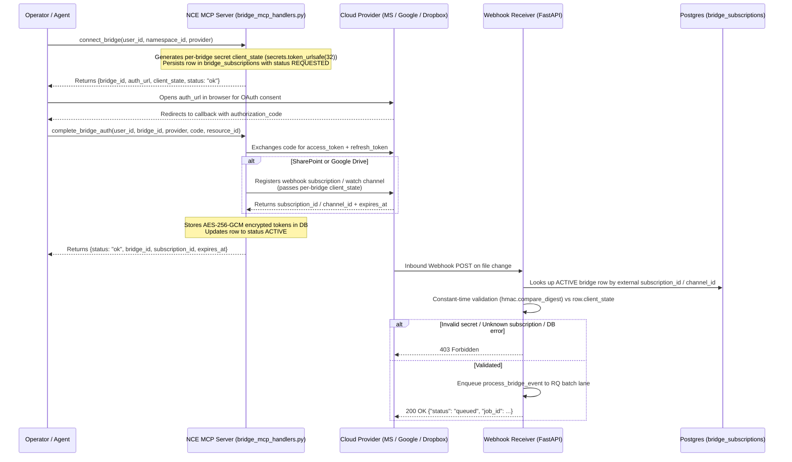
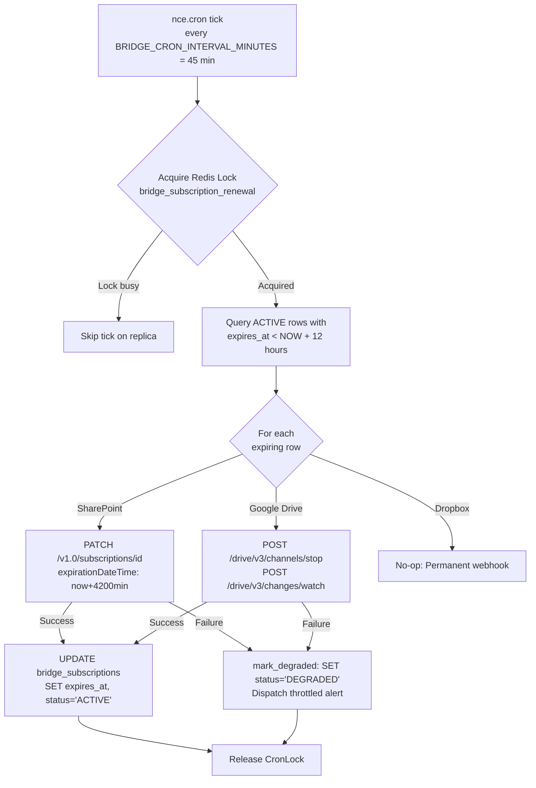

> **Status:** shipped · **Verified-against:** 7304330 (main) · **Last-audited:** 2026-08-17

# Bridge Setup Guide

This guide provides the complete, authoritative operational instructions for configuring the Document Bridge System (Push Architecture) for NCE. The push architecture ensures that document changes trigger near-instant indexing (seconds, not hours) without polling waste, as only changed files are processed.

Connecting document bridges requires a publicly reachable HTTPS endpoint to receive webhook callbacks from cloud providers.

---

## Architecture & MCP Bridge Lifecycle



---

## 1. SharePoint / OneDrive (Microsoft Graph)

### 1a. Azure AD / Entra ID Application Setup

1. Navigate to the [Microsoft Entra ID (Azure AD) Portal](https://portal.azure.com/).
2. Go to **App registrations** and click **New registration**.
3. Set the name (e.g. `NCE-SharePoint-Bridge`) and configure supported account types (typically *Accounts in this organizational directory only* or *Multitenant*).
4. Set the **Redirect URI** (Web) to your configured `BRIDGE_OAUTH_REDIRECT_URI` (e.g. `http://127.0.0.1:8765/bridge/oauth/callback` or your production domain).
5. Navigate to **API Permissions** → **Add a permission** → **Microsoft Graph** → **Delegated permissions** and grant:
   - `offline_access` (Required for refresh token issuance)
   - `Files.Read.All` (Required to read drive contents)
   - `Sites.Read.All` (Required to read SharePoint site document libraries)
6. Click **Grant admin consent for <tenant>** if your tenant requires administrative consent for delegated scopes.
7. Navigate to **Certificates & secrets** → **Client secrets** → **New client secret**. Copy the secret value immediately.

> [!IMPORTANT]
> **Delegated vs Application Permissions:** NCE uses delegated (user-consent) OAuth2 for document bridges. The `offline_access` scope is required so that NCE receives a `refresh_token` and can renew access in the background without repeated manual user logins.

### 1b. Required Environment Variables

| Variable | Required | Default | Description |
|---|---|---|---|
| `AZURE_CLIENT_ID` | **Yes** | `""` | Azure App Registration Application (client) ID |
| `AZURE_CLIENT_SECRET` | **Yes** | `""` | Azure App Registration Client Secret Value |
| `AZURE_TENANT_ID` | No | `common` | Azure Tenant ID or `common` for multi-tenant |
| `BRIDGE_OAUTH_REDIRECT_URI` | **Yes** | `http://127.0.0.1:8765/bridge/oauth/callback` | Redirect URI registered in Azure App Registration |
| `BRIDGE_WEBHOOK_BASE_URL` | **Yes** | `""` | Public HTTPS base URL of NCE receiver (e.g. `https://nce.example.com`) |
| `GRAPH_CLIENT_STATE` | Optional / Legacy | `""` | Unused by webhook receiver (replaced by per-bridge DB secret) |

### 1c. Subscription Registration & Format

When `complete_bridge_auth` is called for SharePoint, NCE registers the subscription by sending `POST https://graph.microsoft.com/v1.0/subscriptions`:

```json
{
  "changeType": "updated",
  "notificationUrl": "https://<BRIDGE_WEBHOOK_BASE_URL>/webhooks/graph",
  "resource": "/sites/{site_id}/drives/{drive_id}/root",
  "expirationDateTime": "<now + 4200 minutes in ISO format>",
  "clientState": "<per_bridge_client_state>"
}
```

- **Resource ID Format:** The `resource_id` parameter supplied to `complete_bridge_auth` must be in the format: `site_id|drive_id`.
- **Subscription Lifetime:** Microsoft Graph imposes a 4230-minute (~3 days) maximum lifetime for drive subscriptions. NCE requests 4200 minutes. The renewal cron automatically renews the subscription via `PATCH /v1.0/subscriptions/{id}` every 45 minutes when less than 12 hours remain.

### 1d. Per-Bridge Secret & Webhook Validation

1. During `connect_bridge`, NCE generates a cryptographic token:
   ```python
   client_state = secrets.token_urlsafe(32)
   ```
2. The token is stored in the Postgres row: `bridge_subscriptions.client_state`.
3. When Microsoft Graph delivers a notification batch to `POST /webhooks/graph`:
   - If the request includes `?validationToken=<token>`, the receiver immediately echoes the token as `text/plain` with HTTP 200.
   - For notification deliveries (`{"value": [...]}`), the receiver extracts `subscriptionId` and `clientState` for each item.
   - It queries `bridge_subscriptions` for the matching active SharePoint row: `WHERE provider = 'sharepoint' AND subscription_id = notification['subscriptionId']`.
   - It compares the received `clientState` against `row["client_state"]` using `hmac.compare_digest(client_state, expected)`.
   - **Fail-Closed Policy:** If the `clientState` is missing, the subscription ID is not found, the secret does not match, or any DB error occurs, the receiver raises `HTTPException(status_code=403, detail="Invalid clientState")`.
   - Upon successful verification, the notification payload is enqueued to the `batch_processing` RQ queue lane (`process_bridge_event`) and returns HTTP 200 `{"status": "queued", "job_id": ...}`.

---

## 2. Google Workspace / Drive

### 2a. Google Cloud Console Application Setup

1. Open the [Google Cloud Console](https://console.cloud.google.com/).
2. Select your project (or create a new project).
3. Navigate to **APIs & Services** → **Library** and enable the **Google Drive API**.
4. Navigate to **APIs & Services** → **OAuth consent screen**:
   - Configure User Type (Internal or External).
   - Add scope: `https://www.googleapis.com/auth/drive.readonly`.
5. Navigate to **APIs & Services** → **Credentials** → **Create Credentials** → **OAuth client ID**:
   - Select **Web application**.
   - Under **Authorized redirect URIs**, add your `BRIDGE_OAUTH_REDIRECT_URI` (e.g. `http://127.0.0.1:8765/bridge/oauth/callback`).
   - Download the JSON or record the **Client ID** and **Client Secret**.

### 2b. Required Environment Variables

| Variable | Required | Default | Description |
|---|---|---|---|
| `GDRIVE_OAUTH_CLIENT_ID` | **Yes** | `""` | Google OAuth 2.0 Client ID |
| `GDRIVE_OAUTH_CLIENT_SECRET` | **Yes** | `""` | Google OAuth 2.0 Client Secret |
| `BRIDGE_OAUTH_REDIRECT_URI` | **Yes** | `http://127.0.0.1:8765/bridge/oauth/callback` | Shared redirect URI |
| `BRIDGE_WEBHOOK_BASE_URL` | **Yes** | `""` | Public HTTPS base URL of NCE receiver |
| `DRIVE_CHANNEL_TOKEN` | Optional / Legacy | `""` | Unused by webhook receiver (replaced by per-bridge DB secret) |

### 2c. Watch Channel Registration & Format

When `complete_bridge_auth` is called for Google Drive, NCE registers a watch channel by sending `POST https://www.googleapis.com/drive/v3/changes/watch`:

```json
{
  "id": "<generated_channel_uuid>",
  "type": "web_hook",
  "address": "https://<BRIDGE_WEBHOOK_BASE_URL>/webhooks/drive",
  "token": "<per_bridge_client_state>",
  "expiration": <now + 6d 23h in milliseconds>
}
```

- **Subscription Lifetime:** Google Drive allows a maximum watch channel lifetime of 7 days. NCE requests 6 days 23 hours.
- **Watch Channel Renewal:** Google Drive does not support `PATCH` updates for watch channels. The renewal cron stops the old channel (`POST /drive/v3/channels/stop`) and creates a new channel with a new UUID.

### 2d. Per-Bridge Secret & Webhook Validation

1. When `connect_bridge` is called, NCE generates a per-bridge random token (`secrets.token_urlsafe(32)`) and stores it in `bridge_subscriptions.client_state`.
2. When Google Drive delivers change notifications to `POST /webhooks/drive`:
   - It extracts the `X-Goog-Channel-Token` and `X-Goog-Channel-Id` headers.
   - If either header is missing, it raises `HTTPException(status_code=403, detail="Invalid or missing X-Goog-Channel-Token")`.
   - It looks up the active subscription in Postgres where `provider = 'gdrive' AND subscription_id = channel_id`.
   - It compares `channel_token` against `row["client_state"]` using `hmac.compare_digest`.
   - **Fail-Closed Policy:** Any token mismatch, missing channel row, or DB lookup failure raises `HTTPException(status_code=403, detail="Invalid or missing X-Goog-Channel-Token")`.
   - If header `X-Goog-Resource-State: sync` is present, it returns HTTP 200 `{"status": "acknowledged", "reason": "sync_handshake"}` immediately without enqueuing background tasks.
   - For valid change events, the payload is enqueued to the `batch_processing` RQ queue lane (`process_bridge_event`) and returns HTTP 200 `{"status": "queued", "job_id": ...}`.

---

## 3. Dropbox

### 3a. Dropbox App Console Setup

1. Open the [Dropbox App Console](https://www.dropbox.com/developers/apps).
2. Click **Create app**:
   - Choose **Scoped access**.
   - Choose access type (e.g. **Full Dropbox** or **App folder**).
3. Under the **Permissions** tab, enable:
   - `files.metadata.read`
   - `files.content.read`
4. Under the **Settings** tab:
   - Add your `BRIDGE_OAUTH_REDIRECT_URI` under **Redirect URIs**.
   - Record the **App key** (`DROPBOX_OAUTH_CLIENT_ID`) and **App secret** (`DROPBOX_APP_SECRET`).
5. Under the **Webhooks** section:
   - Add your webhook URI: `https://<BRIDGE_WEBHOOK_BASE_URL>/webhooks/dropbox`.
   - Dropbox will immediately send a `GET /webhooks/dropbox?challenge=<token>` request. NCE automatically responds with the challenge token as plain text.

### 3b. Required Environment Variables

| Variable | Required | Default | Description |
|---|---|---|---|
| `DROPBOX_OAUTH_CLIENT_ID` | **Yes** | `""` | Dropbox App Key |
| `DROPBOX_APP_SECRET` | **Yes** | `""` | Dropbox App Secret (used for webhook HMAC verification) |
| `BRIDGE_OAUTH_REDIRECT_URI` | **Yes** | `http://127.0.0.1:8765/bridge/oauth/callback` | Shared redirect URI |

### 3c. Webhook Signature Validation

1. **Challenge Response:** Inbound `GET /webhooks/dropbox?challenge=<challenge>` requests return the challenge string as `text/plain` with HTTP 200.
2. **Notification Delivery:** Inbound `POST /webhooks/dropbox` deliveries include the header:
   ```
   X-Dropbox-Signature: <hex_hmac_sha256>
   ```
3. The webhook receiver reads the raw request body, computes `hmac.new(DROPBOX_APP_SECRET, body, hashlib.sha256).hexdigest()`, and compares it against `X-Dropbox-Signature` using `hmac.compare_digest`.
4. **Fail-Closed Policy:** If the header is missing or the signature fails verification, the receiver raises `HTTPException(status_code=403, detail="Missing X-Dropbox-Signature header" / "Invalid signature")`.
5. **Subscription Lifetime:** Permanent. Dropbox webhooks do not expire and do not require renewal ticks.

---

## 4. MCP Tools Reference

The following tools are available via the MCP server interface (`nce/bridge_mcp_handlers.py`):

### 4a. `connect_bridge`
Initiates a bridge registration and generates the OAuth authorization URL.
- **Arguments:**
  - `user_id` (string, required): Owning user identifier.
  - `namespace_id` (UUID string, required): Owning namespace.
  - `provider` (string, required): One of `'sharepoint'`, `'gdrive'`, `'dropbox'`.
- **Response:** JSON containing `status: "ok"`, `bridge_id`, `provider`, `auth_url`, and `client_state`.

### 4b. `complete_bridge_auth`
Completes the OAuth flow, registers the webhook with the provider, and stores encrypted tokens.
- **Arguments:**
  - `user_id` (string, required): Owning user identifier.
  - `bridge_id` (UUID string, required): Bridge subscription ID returned by `connect_bridge`.
  - `provider` (string, required): One of `'sharepoint'`, `'gdrive'`, `'dropbox'`.
  - `code` (string, required): Authorization code received from the OAuth callback.
  - `resource_id` (string, required): Watched resource identifier (e.g. `'site_id|drive_id'` for SharePoint, Google resourceId for Drive, or Dropbox account ID).
- **Response:** JSON containing `status: "ok"`, `bridge_id`, `subscription_id`, `expires_at`, and `resource_id`.

### 4c. `list_bridges`
Lists all bridge subscriptions for a user.
- **Arguments:**
  - `user_id` (string, required): Owning user identifier.
  - `include_disconnected` (boolean, optional, default `false`): Whether to include disconnected bridges.

### 4d. `disconnect_bridge`
Disconnects a bridge, unsubscribes from the provider webhook API, wipes stored tokens, and sets status to `DISCONNECTED`.
- **Arguments:**
  - `user_id` (string, required): Owning user identifier.
  - `bridge_id` (UUID string, required): Bridge ID to disconnect.

### 4e. `force_resync_bridge`
Clears the incremental sync cursor and enqueues a full re-indexing job for the bridge.
- **Arguments:**
  - `user_id` (string, required): Owning user identifier.
  - `bridge_id` (UUID string, required): Bridge ID to resync.

### 4f. `bridge_status`
Returns metadata and time-to-expiry for a bridge subscription.
- **Arguments:**
  - `user_id` (string, required): Owning user identifier.
  - `bridge_id` (UUID string, required): Bridge ID.

---

## 5. Webhook Receiver Runtime Configuration

### Webhook Secrets

| Variable | Required at Boot | Validated Against |
|---|---|---|
| `DROPBOX_APP_SECRET` | **Yes** | `X-Dropbox-Signature` header on `/webhooks/dropbox` |
| `NCE_D365_WEBHOOK_SECRET` | If D365 enabled | `x-ms-signaturecontent` header on `/webhooks/dynamics365` |
| `GRAPH_CLIENT_STATE` | No (Legacy) | Replaced by per-bridge `bridge_subscriptions.client_state` |
| `DRIVE_CHANNEL_TOKEN` | No (Legacy) | Replaced by per-bridge `bridge_subscriptions.client_state` |

### Tuning Parameters

| Variable | Default | Purpose |
|---|---|---|
| `WEBHOOK_MAX_BODY_BYTES` | `1048576` (1 MB) | Maximum request body size; oversized requests rejected with HTTP 413 |
| `WEBHOOK_RATE_LIMIT` | `120` | Max requests per IP per window (HTTP 429 on limit) |
| `WEBHOOK_RATE_PERIOD_SECONDS` | `60` | Sliding rate limit window duration in seconds |
| `WEBHOOK_DEDUP_TTL_SECONDS` | `86400` | Redis TTL for deduplication keys (24 hours) |
| `WEBHOOK_DEDUP_FAIL_OPEN` | `false` | When Redis is down, allow delivery instead of dropping |
| `NCE_WEBHOOK_TRUST_PROXY` | `false` | Trust `X-Forwarded-For` header for client IP (only enable behind trusted proxy) |

---

## 6. Bridge Subscription Renewal Cron (`bridge_subscription_renewal`)

Subscriptions for SharePoint and Google Drive expire automatically. The background cron job `bridge_subscription_renewal` runs continuously inside `nce.cron` (APScheduler) to guarantee uninterrupted ingestion.



- **Cron Registration:** Defined in `nce/cron.py` as job ID `bridge_subscription_renewal` with `IntervalTrigger(minutes=cfg.BRIDGE_CRON_INTERVAL_MINUTES)` (default: 45 min).
- **Lookahead Window:** `BRIDGE_RENEWAL_LOOKAHEAD_HOURS` (default: 12 h).
- **Proactive Token Refresh:** `ensure_fresh_oauth_token()` checks if the access token expires within 5 minutes and refreshes it synchronously or asynchronously under the Redis lock `bridge_refresh:{provider}:{bridge_id}`.
- **Degraded Status:** Subscriptions that fail renewal are transitioned to `status = 'DEGRADED'` so operators can re-authenticate or diagnose permission revocations.

---

## 7. Complete Environment Variable Reference

| Variable | Provider | Default | Description |
|---|---|---|---|
| `AZURE_CLIENT_ID` | SharePoint | `""` | Microsoft Entra ID Application ID |
| `AZURE_CLIENT_SECRET` | SharePoint | `""` | Microsoft Entra ID Client Secret |
| `AZURE_TENANT_ID` | SharePoint | `common` | Microsoft Entra ID Tenant ID |
| `GDRIVE_OAUTH_CLIENT_ID` | Google Drive | `""` | Google Cloud OAuth Client ID |
| `GDRIVE_OAUTH_CLIENT_SECRET` | Google Drive | `""` | Google Cloud OAuth Client Secret |
| `DROPBOX_OAUTH_CLIENT_ID` | Dropbox | `""` | Dropbox App Key |
| `DROPBOX_APP_SECRET` | Dropbox | `""` | Dropbox App Secret |
| `BRIDGE_OAUTH_REDIRECT_URI` | All Bridges | `http://127.0.0.1:8765/bridge/oauth/callback` | Shared OAuth callback endpoint |
| `BRIDGE_WEBHOOK_BASE_URL` | SharePoint, Drive | `""` | Public HTTPS base URL for incoming webhooks |
| `GRAPH_BRIDGE_TOKEN` | SharePoint | `""` | Static access token fallback (bypasses OAuth store) |
| `GDRIVE_BRIDGE_TOKEN` | Google Drive | `""` | Static access token fallback (bypasses OAuth store) |
| `DROPBOX_BRIDGE_TOKEN` | Dropbox | `""` | Static access token fallback (bypasses OAuth store) |
| `BRIDGE_CRON_INTERVAL_MINUTES` | Cron | `45` | Renewal cadence in minutes |
| `BRIDGE_RENEWAL_LOOKAHEAD_HOURS` | Cron | `12` | Hours before expiration when renewal triggers |
| `NCE_ECHO_TTL_S` | Webhooks | `600` | Redis TTL for echo-suppression tombstones (seconds) |
