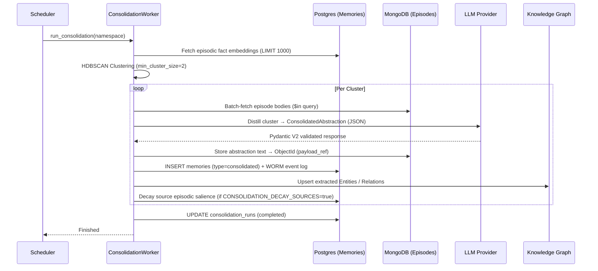
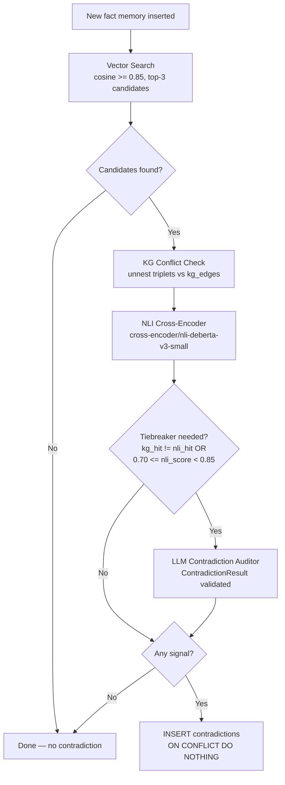

> **Status:** shipped · **Verified-against:** 7304330 (main) · **Last-audited:** 2026-08-17

# Cognitive Layer: Consolidation and Salience

The Cognitive Layer is the "brain" of NCE, transforming raw episodic events into structured semantic knowledge and managing the lifecycle of information based on its relevance and age.

---

## 1. Memory Consolidation (The Sleep Cycle)

As an agent accumulates episodic memories, the `ConsolidationWorker` periodically runs to identify patterns and distil them into durable **Semantic Abstractions**.

### Consolidation Signal Flow



### Key Technologies

| Technology | Role |
|---|---|
| **HDBSCAN** (`sklearn.cluster`, `min_cluster_size=2`) | Density-based clustering of memory embeddings; no pre-defined cluster count required; noise points (label `-1`) are silently skipped |
| **Pydantic V2** (`ConsolidatedAbstraction`) | Validates every LLM response before storage; rejects hallucinated IDs, enforces `confidence >= 0.3`, and routes conflicting clusters to the contradiction pipeline |
| **MongoDB** | Stores the raw abstraction text; the resulting `ObjectId` becomes the `payload_ref` on the Postgres `memories` row |
| **WORM event log** | Every consolidated memory is recorded via `append_event()` — the only authorised event writer |

### `ConsolidatedAbstraction` Schema

```python
class ConsolidatedAbstraction(BaseModel):
    abstraction: str                        # single factual paragraph
    key_entities: list[str]                 # named entities for KG nodes
    key_relations: list[dict[str, str]]     # {subject, predicate, object} triples
    supporting_memory_ids: list[str]        # must be a subset of cluster input IDs
    contradicting_memory_ids: list[str]     # non-empty → routed to Phase 1.3 pipeline
    confidence: float                       # 0.0–1.0; runs < 0.3 are discarded
```

All fields are validated by Pydantic V2 with `extra="forbid"`.

### `consolidation_runs` Table (key columns)

| Column | Type | Notes |
|---|---|---|
| `id` | UUID PK | Auto-generated |
| `namespace_id` | UUID | RLS-scoped |
| `status` | TEXT | `running` / `completed` / `failed` |
| `events_processed` | INTEGER | Count of valid memories clustered |
| `clusters_formed` | INTEGER | HDBSCAN non-noise clusters |
| `abstractions_created` | INTEGER | Clusters successfully stored |
| `completed_at` | TIMESTAMPTZ | Set on finish or failure |
| `error_message` | TEXT | Populated on `failed` runs |

### Configuration

| Variable | Default | Effect |
|---|---|---|
| `CONSOLIDATION_DECAY_SOURCES` | `false` | Enable salience decay of source memories after consolidation |
| `CONSOLIDATION_HALF_LIFE_DAYS` | `30.0` | Half-life used for source-memory decay |

---

## 2. Salience and the Forgetting Curve

NCE uses the **Ebbinghaus Forgetting Curve** to model how the importance of a memory decays over time without access.

### Salience Score

The salience of a memory is a real value in `[0.0, 1.0]`. It decays exponentially:

```
s(t) = s_last * exp(-lambda * delta_t_days)
where lambda = ln(2) / half_life_days
```

`half_life_days` is set via `CONSOLIDATION_HALF_LIFE_DAYS` (default `30.0`). A **deterministic per-memory jitter** of ±5% is applied to the effective half-life (derived from `SHA-256(memory_id)`) to prevent thundering-herd GC contention when many memories share the same `updated_at` timestamp.

Edge cases handled in `nce/salience.py`:

- `half_life_days <= 0` — returns `s_last` unchanged (no-op decay)
- `delta_t < 0` (clock skew / future timestamp) — clamped to `0.0`; score returned unmodified
- Very large `delta_t` — exponent clamped at `709.0` to prevent `OverflowError`

### Reinforcement

Every time a memory is retrieved or boosted, its salience is reinforced:

```
s_new = min(1.0, s_current + delta)
```

The `reinforce()` function in `nce/salience.py` is the sole write path; the `CognitiveOrchestrator.boost_memory()` method calls it with a configurable `factor` (default `0.2`). Both paths are RLS-enforced via `scoped_session`.

### `memory_salience` Table

```sql
CREATE TABLE memory_salience (
    memory_id       UUID        NOT NULL,
    agent_id        TEXT        NOT NULL,
    namespace_id    UUID        NOT NULL REFERENCES namespaces(id),
    salience_score  REAL        NOT NULL DEFAULT 1.0,
    updated_at      TIMESTAMPTZ NOT NULL DEFAULT now(),
    access_count    INTEGER     NOT NULL DEFAULT 0,
    created_at      TIMESTAMPTZ NOT NULL DEFAULT now(),
    PRIMARY KEY (memory_id, agent_id)
) PARTITION BY HASH (memory_id, agent_id);
```

Four hash partitions (`_0`–`_3`) distribute read/write load. Namespace-scoped index `idx_memory_salience_namespace_id` supports fleet admin rollup queries.

---

## 3. Contradiction Detection

NCE automatically flags logical conflicts when new factual information contradicts existing knowledge. Detection is best-effort — it never blocks memory insertion.

### Detection Pipeline



### Step-by-Step

1. **Semantic Match** — vector search on `memories` (episodic facts, `valid_to IS NULL`) using `embedding <=>` cosine distance. Config: `NCE_CONTRADICTION_SIMILARITY_THRESHOLD` (default `0.85`), `NCE_CONTRADICTION_MAX_CANDIDATES` (default `3`).

2. **KG Conflict** — for each candidate, checks whether any subject/predicate triplet from the new memory matches a `kg_edges` row for the candidate with a *different* object. One round-trip using `unnest` parallel arrays.

3. **NLI Cross-Encoder** — `CrossEncoder` loaded from `cfg.NLI_MODEL_ID` (default `cross-encoder/nli-deberta-v3-small`). Runs `softmax` over `[entail, neutral, contradiction]` label probabilities; contradiction class is index `2`. Config threshold: `NCE_CONTRADICTION_NLI_THRESHOLD` (default `0.8`). Can be offloaded to a cognitive sidecar via `NCE_COGNITIVE_BASE_URL`.

4. **LLM Contradiction Auditor** (tiebreaker) — triggered when `kg_hit != nli_hit` OR when `0.70 <= nli_score < 0.85`. Returns a `ContradictionResult` (Pydantic V2 validated, `extra="forbid"`). LLM confidence below `NCE_CONTRADICTION_LLM_MIN_CONFIDENCE` (default `0.6`) is discarded; falls back to signal-only detection. On timeout or parse failure, degrades gracefully to KG/NLI signals.

### `contradictions` Table

```sql
CREATE TABLE contradictions (
    id             UUID        NOT NULL DEFAULT gen_random_uuid(),
    namespace_id   UUID        NOT NULL REFERENCES namespaces(id),
    memory_a_id    UUID        NOT NULL,   -- lower UUID of the pair
    memory_b_id    UUID        NOT NULL,   -- higher UUID of the pair
    agent_id       TEXT        NOT NULL DEFAULT 'system',
    detected_at    TIMESTAMPTZ NOT NULL DEFAULT now(),
    detection_path TEXT        NOT NULL,   -- 'sync' | 'deferred'
    signals        JSONB       NOT NULL,   -- [{source, confidence}] + explanation
    confidence     REAL        NOT NULL,
    resolution     TEXT,                  -- NULL = unresolved
    resolved_at    TIMESTAMPTZ,
    resolved_by    TEXT,
    note           TEXT,
    PRIMARY KEY (id, detected_at)
) PARTITION BY RANGE (detected_at);
```

UUID pairs are normalised to `(min, max)` before insert; `ON CONFLICT DO NOTHING` prevents duplicates.

### Allowlisted Resolution Codes

`accepted_a` · `accepted_b` · `merged` · `rejected` · `superseded` · `duplicate` · `false_positive`

Resolving with `accepted_a`, `accepted_b`, `superseded`, or `rejected` triggers **ATMS cascade**: the losing memory and all derived memories are soft-deleted via `valid_to = now()`.

### MCP Tools

| Tool | Handler | Scope |
|---|---|---|
| `list_contradictions` | `handle_list_contradictions` | any |
| `resolve_contradiction` | `handle_resolve_contradiction` | `admin` |

`list_contradictions` accepts `namespace_id` (required), `resolution`, `agent_id`, `limit` (1–200, default 50), `offset`.

### Configuration

| Variable | Default | Effect |
|---|---|---|
| `NLI_MODEL_ID` | `cross-encoder/nli-deberta-v3-small` | NLI CrossEncoder model loaded at startup |
| `NCE_CONTRADICTION_SIMILARITY_THRESHOLD` | `0.85` | Minimum cosine similarity for candidate selection |
| `NCE_CONTRADICTION_MAX_CANDIDATES` | `3` | Maximum candidates per new memory |
| `NCE_CONTRADICTION_NLI_THRESHOLD` | `0.8` | NLI score that triggers a positive NLI signal |
| `NCE_CONTRADICTION_LLM_MIN_CONFIDENCE` | `0.6` | Minimum LLM confidence to record a contradiction |
