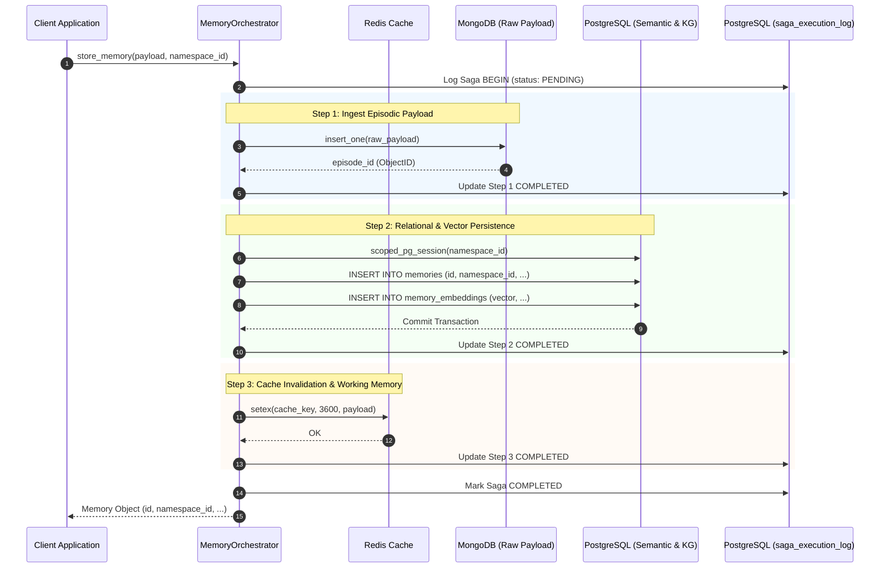

> **Status:** shipped · **Verified-against:** 7304330 (main) · **Last-audited:** 2026-08-17

# NCE Database Architecture

Deep-dive into the Neuro Cognitive Engine (NCE) data persistence layer: the Quad-Database stack, connection pool sizing, transaction boundaries, Row-Level Security (RLS) context initialization, the Saga pattern implementation, Saga crash-recovery logging, the GraphRAG hydration pipeline, partition strategies, and the PostgreSQL schema lifecycle.

---

## 1. Quad-Database Role Assignment

To meet enterprise requirements for performance, scalability, and strict temporal isolation, NCE distributes its data across four distinct databases, each matched to the specific storage model for which it is optimized:

| Storage Layer | Database | Access Library | Primary Role | Data Lifecycle & Retention |
| :--- | :--- | :--- | :--- | :--- |
| **Semantic Index** | PostgreSQL (with `pgvector` & `pgcrypto`) | `asyncpg` (async pool) | Enforces the relational schema, vector embeddings (768-dim, stored as `halfvec`), Knowledge Graph (KG) triplets, Row-Level Security (RLS), and the append-only (WORM) event log. | Long-term persistent storage; partitioned monthly or via hash. |
| **Episodic Archive** | MongoDB | `motor` (async driver) | Stores heavy unstructured raw payloads (full conversation transcripts, raw document pages, bulk code file contents, and media metadata). | Persistent archive; referenced via hex-encoded 24-character ObjectIDs. |
| **Working Memory & Queues** | Redis | `redis.asyncio` (async) & `redis` (sync for RQ) | Handles short-term context cache, distributed locks, rate-limiting, HMAC nonces, active token checks, and background worker queues (RQ). | Transient; TTL-evicted (default 3600s) or job-completed pruned. |
| **Object Store** | MinIO (S3 compatible) | `minio` (thread-pooled via `asyncio.to_thread`) | Archival storage of large media objects (audio recordings, images, video segments) and LLM response caches for deterministic replay. | Persistent bucket storage with path indexing. |

Global database connections are initialized and managed by the `NCEEngine` class within `nce/orchestrator.py` during application boot.

---

## 2. Connection Pools & Resource Control

### 2a. PostgreSQL Connection Pooling
NCE utilizes a high-performance, non-blocking connection pool via `asyncpg` configured in `nce/orchestrator.py`:

```python
self.pg_pool = await asyncpg.create_pool(
    cfg.PG_DSN,
    min_size=cfg.PG_MIN_POOL,    # Default: 1
    max_size=cfg.PG_MAX_POOL,    # Default: 10
    command_timeout=30,           # Hard statement timeout in seconds
)
```

* **Read Replicas**: If `DB_READ_URL` is set and differs from `PG_DSN` (`cfg.DB_READ_URL and cfg.DB_READ_URL != cfg.PG_DSN`), NCE instantiates an independent `pg_read_pool`. The pool is passed to `MemoryOrchestrator`, which routes read-only operations (such as `verify_memory`) through it via its `_db_pool(read_only=True)` helper. `graph_search` traversals use the primary `pg_pool` directly.
* **Checkout Timeouts**: Connections acquired from the pool are strictly bound by a checkout timeout constant `POOL_ACQUIRE_TIMEOUT = 10.0` seconds defined in `nce/db_utils.py`. This ensures that pool exhaustion raises a catchable timeout error rather than stalling the ASGI event loop:
  ```python
  async with pool.acquire(timeout=POOL_ACQUIRE_TIMEOUT) as conn:
      # Perform database operations
  ```

### 2b. MongoDB Connection Pooling
MongoDB access is coordinated by the `AsyncIOMotorClient` pool:

```python
self.mongo_client = AsyncIOMotorClient(
    cfg.MONGO_URI,
    serverSelectionTimeoutMS=5_000,
)
```

Motor's default internal pool sizing applies; no explicit `maxPoolSize` override is set. The `serverSelectionTimeoutMS=5000` governs how long the driver will wait to find a suitable server before raising a timeout.

* **Indexes**: At boot time, `NCEEngine._init_mongo_indexes()` ensures indexes exist on `user_id` (episodes), `filepath` (code_files), and `user_id` (code_files) to guarantee lookup performance of raw documents.

### 2c. Redis Connection Pooling
Redis uses a dual-client model to accommodate asynchronous web request routing and synchronous worker queue orchestration:

```python
# Async client for cache, rate-limits, and session management
self.redis_client = redis.from_url(
    cfg.REDIS_URL,
    socket_connect_timeout=5,
    socket_timeout=5,
    max_connections=cfg.REDIS_MAX_CONNECTIONS,  # Default: 20
    health_check_interval=30,
)

# Synchronous client for the RQ background worker queue thread pool
self.redis_sync_client = redis_sync.from_url(
    cfg.REDIS_URL,
    socket_connect_timeout=5,
    socket_timeout=5,
    max_connections=cfg.REDIS_MAX_CONNECTIONS,  # Default: 20
    health_check_interval=30,
)
```

---

## 3. Transaction Boundaries & Row-Level Security (RLS)

All tenant-specific PostgreSQL operations must execute inside a transaction-scoped RLS context using the `scoped_pg_session` context manager.

### 3a. The scoped_pg_session Pattern
The `scoped_pg_session` manager guarantees that every checkout enforces the active namespace ID.

```python
# nce/db_utils.py
from contextlib import asynccontextmanager

@asynccontextmanager
async def scoped_pg_session(pool: asyncpg.Pool, namespace_id: str | UUID):
    ns_uuid = UUID(str(namespace_id)) if not isinstance(namespace_id, UUID) else namespace_id
    async with pool.acquire(timeout=POOL_ACQUIRE_TIMEOUT) as conn:
        from nce.auth import set_namespace_context
        async with conn.transaction():
            await set_namespace_context(conn, ns_uuid)
            yield conn
            # SET LOCAL is automatically cleared at transaction end.
            # No explicit reset: a reset inside the finally block can
            # mask the original SQL error when the transaction is
            # already in an aborted state.
```

### 3b. Why RLS Context Requires SET LOCAL
Using `SET LOCAL` (or its equivalent `SELECT set_config('nce.namespace_id', $1, true)`) scopes the configuration setting to the immediate transaction block. When the transaction commits or aborts, PostgreSQL automatically clears the session setting, preventing cross-tenant leakage across pooled connections.

* **RLS Surface & Catalog Verification**: The authoritative tenant isolation surface encompasses 64 tables defined in `EXPECTED_TENANT_RLS_TABLES` (`nce/event_log.py`). At server startup, `verify_rls_catalog_consistency()` asserts that every tenant table has active RLS (`relrowsecurity = true`) and carries the required `tenant_isolation_policy` policy. Shared reference tables without RLS (`product_catalog`, plus 5 platform tables) are defined in `EXPECTED_GLOBAL_TABLES`. Confidential commercial pricing (`product_prices`) remains tenant-isolated.
* **Admin Bypass (`unmanaged_pg_connection`)**: A narrow set of global background maintenance operations check out connections via `unmanaged_pg_connection(pool, *, site=...)` (`nce/db_utils.py:145-160`), which skips `SET LOCAL nce.namespace_id`. Every call site must provide a registered string validated against the 21 audited sites in `UNMANAGED_PG_AUDITED_SITES` (`nce/db_utils.py:24-60`). Unregistered sites raise `ValueError` at runtime.
* **Worker principal segregation (`nce_gc`)**: The `nce_gc` role exists in `schema.sql` with the `BYPASSRLS` attribute for least-privilege worker isolation. Background maintenance **workers** (the garbage collector and the re-embedding worker) resolve their connection DSN via `db_utils.resolve_worker_dsn()`, which returns `NCE_GC_DSN` when set (so the worker connects as `nce_gc` with its own credentials) and otherwise falls back to `PG_DSN` (the app role) for backward compatibility. Note that the GC itself runs RLS-scoped per namespace (calling `set_namespace_context`), so segregation functions primarily as a credential-isolation boundary.

---

## 4. The Saga Pattern — Distributed Multi-Database Write Path

Because writing memory requires updating MongoDB (episodic archive), PostgreSQL (semantic index and graph relations), and Redis (active cache), NCE implements a Saga Pattern orchestrator to ensure eventual consistency. 

### 4a. Write Path Sequence Diagram



### 4b. Compensating Transactions & Rollback Details
If any step in the write pipeline fails, the orchestrator triggers compensating backward transactions:
1. **PostgreSQL Failure**: If vector insertion or relational writes fail, the MongoDB episode is deleted via `AsyncIOMotorClient.delete_one({"_id": episode_id})`.
2. **Redis Failure**: Redis failures do not trigger PostgreSQL or MongoDB rollback; instead, a cache tombstone is written with a minimal TTL (5 seconds) to force cache re-hydration on subsequent reads.
3. **Audit Log Failure**: If the `saga_execution_log` entry itself cannot be created or updated, the transaction halts immediately and returns an unrecoverable database error.

### 4c. Crash-Recovery & The Garbage Collection Backstop
To handle hard process crashes midway through a multi-database write, NCE runs a background GC process (`SagaRecoveryWorker`) scheduled via `cron.py` (`cron.saga_recovery.*`):
* The worker queries `saga_execution_log` for sagas stuck in `PENDING` status older than `SAGA_TIMEOUT_SECONDS` (default: 60s).
* Uncommitted steps are rolled back in reverse order (Redis key eviction -> PostgreSQL deletion -> MongoDB payload purge).
* The saga state is updated to `ROLLED_BACK`.

---

## 5. GraphRAG Hydration Pipeline

NCE’s Knowledge Graph persistence model balances high-speed retrieval of semantic concepts with deterministic graph traversal:

```
┌────────────────────────────────────────────────────────┐
│               memories (PostgreSQL / RLS)              │
│       namespace_id = get_nce_namespace()               │
└───────────┬────────────────────────────────┬───────────┘
            │ 1:N                            │ 1:N
            ▼                                ▼
┌────────────────────────┐      ┌────────────────────────┐
│  kg_nodes (PostgreSQL) │      │  kg_edges (PostgreSQL) │
├────────────────────────┤      ├────────────────────────┤
│ - id (UUID)            │      │ - id (UUID)            │
│ - namespace_id (UUID)  │      │ - namespace_id (UUID)  │
│ - label (TEXT)         │◄────►│ - subject_label (TEXT) │
│ - entity_type (TEXT)   │      │ - predicate (TEXT)     │
│ - properties (JSONB)   │      │ - object_label (TEXT)  │
└────────────────────────┘      └────────────────────────┘
```

### 5a. Performance & Safety Guards
* **Traversal Depth Limits**: Recursive GraphRAG queries (`graph_query.py`) are hard-capped at a maximum traversal depth (default: 3 hops) to prevent cyclic dependency stalls.
* **Maximum Node Fan-Out**: Graph neighbor expansion uses `LIMIT` clauses on edge traversals (default: 50 edges per node) to guard against high-degree hub nodes exhausting memory.

---

## 6. Partitioning Strategies

NCE uses partitioned tables for high-throughput tables to maintain query performance and predictable storage index sizing over time.

### 6a. Range Partitioning (Monthly)
Tables partitioned by time range (`RANGE`) route writes to monthly partitions:
* **Partitioned Tables**:
  * `memories` (partitioned on `created_at`)
  * `event_log` (partitioned on `occurred_at`)
  * `contradictions` (partitioned on `detected_at`)
  * `pii_redactions` (partitioned on `created_at`)
* **Partition Maintenance**: At boot time and on periodic cron ticks (`cron.partition_maintenance`), `nce_ensure_event_log_monthly_partitions(p_months_ahead)` executes a PL/pgSQL function to ensure partitions exist for the current month and up to 3 months in advance.
* **Foreign Key Constraints Constraint**: PostgreSQL does not allow referencing tables partitioned by range unless the foreign key constraint includes the partition key columns. Therefore, tables like `pii_redactions` or `memory_salience` maintain **application-layer integrity** (enforced via Saga orchestrators and the Garbage Collector) rather than database-level FK constraints.

### 6b. Hash Partitioning (Scalability)
Tables partitioned by hash (`HASH`) distribute tenant data uniformly across a static modulus of partitions (default: 4):
* **Partitioned Tables**:
  * `kg_nodes` (partitioned by hash on `label`)
  * `kg_edges` (partitioned by hash on `subject_label`, `predicate`, `object_label`)
  * `memory_salience` (partitioned by hash on `memory_id`, `agent_id`)
  * `memory_embeddings` (partitioned by hash on `memory_id`)
  * `embedding_aspects` (partitioned by hash on `memory_id`, `aspect`)

---

## 7. Event Log (WORM) Architecture

The event log table (`event_log`) is configured as a Write-Once, Read-Many (WORM) store:
* **Immutability Enforcement**: An execution trigger `prevent_mutation` is attached to `event_log` and `event_parents` to block all `UPDATE` and `DELETE` queries:
  ```sql
  CREATE OR REPLACE FUNCTION prevent_mutation() RETURNS TRIGGER AS $$
  BEGIN
      RAISE EXCEPTION '% is immutable (WORM). % operation is forbidden.', TG_TABLE_NAME, TG_OP;
      RETURN NULL;
  END;
  $$ LANGUAGE plpgsql;
  ```
* **Role-Level Revocation**: PostgreSQL roles enforce append-only security directly:
  ```sql
  REVOKE UPDATE, DELETE ON TABLE public.event_log FROM nce_app;
  REVOKE UPDATE, DELETE ON TABLE public.event_parents FROM nce_app;
  ```
* **Merkle Chain Integrity**: Each event log entry includes a `chain_hash` byte array representing the SHA-256 digest of the current record data concatenated with the previous record's `chain_hash`. A periodic cron job (`_chain_verification_tick`, default interval 120 min via `NCE_CHAIN_VERIFY_INTERVAL_MINUTES`) validates the cryptographic chain across all namespaces to ensure no logs have been modified at the database layer; verification depth per namespace per run is controlled by `NCE_CHAIN_VERIFY_STARTUP_DEPTH` (default 500 events).

---

## 8. Dynamics 365 Integration Schema

To support tenant-scoped integrations with Microsoft Dynamics 365 (Dataverse), NCE uses the `d365_integrations` table in PostgreSQL. This table is fully protected by Row-Level Security (RLS) to enforce tenant isolation.

### 8a. Table Schema & Column Specifications
| Column | Type | Constraints | Description |
| :--- | :--- | :--- | :--- |
| `id` | `UUID` | `PRIMARY KEY`, `DEFAULT gen_random_uuid()` | Unique identifier for the integration configuration. |
| `namespace_id` | `UUID` | `NOT NULL`, `REFERENCES namespaces(id) ON DELETE CASCADE` | The tenant namespace isolation boundary. |
| `org_url` | `TEXT` | `NOT NULL` | The target Dynamics 365 / Dataverse organization URL. |
| `status` | `TEXT` | `NOT NULL DEFAULT 'ACTIVE'`, `CHECK (status IN ('ACTIVE', 'DEGRADED', 'DISABLED'))` | Operational state of the integration channel. |
| `token_enc` | `BYTEA` | | AES-256-GCM encrypted JSON representation of the Access Token and Refresh Token details. |
| `token_expires_at` | `TIMESTAMPTZ` | | Expiration timestamp of the active access token. |
| `webhook_secret_enc`| `BYTEA` | | AES-256-GCM encrypted webhook validation secret. |
| `last_sync_at` | `TIMESTAMPTZ` | | Timestamp of the last execution of the synchronization worker. |
| `last_sync_stats` | `JSONB` | | Statistics and execution metrics from the last sync (e.g. accounts/contacts/opportunities count). |
| `created_at` | `TIMESTAMPTZ` | `NOT NULL DEFAULT NOW()` | Record creation timestamp. |
| `updated_at` | `TIMESTAMPTZ` | `NOT NULL DEFAULT NOW()` | Record modification timestamp. |

* **Unique Constraints**: A composite unique constraint `UNIQUE (namespace_id, org_url)` guarantees that a tenant namespace can configure at most one integration profile per target Dataverse organization.

### 8b. AES-256-GCM Envelope Encryption
Sensitive credentials (`token_enc`, `webhook_secret_enc`) are encrypted before serialization to PostgreSQL using the NCE cryptographic signing infrastructure defined in [`nce/signing.py`](https://github.com/sindrehaugen/NCE/blob/main/nce/signing.py):
* **KDF & Master Key**: The AES wrapping key is derived from the master secret (`NCE_MASTER_KEY`) via **Argon2id** (with a salt size of 16 bytes, time cost = 3, memory cost = 64 MiB, parallelism = 4) or falls back to **PBKDF2-HMAC-SHA256** (600,000 iterations) if `argon2-cffi` is unavailable.
* **Cipher Mode**: **AES-256-GCM** (authenticated envelope encryption) wraps the plaintext using a cryptographically random 12-byte nonce generated for each encryption operation.
* **Wire / Storage Format**:
  * For Argon2id: `b'TC3\x01' || salt (16 bytes) || nonce (12 bytes) || ciphertext + tag`
  * For PBKDF2: `b'TC4\x01' || salt (16 bytes) || nonce (12 bytes) || ciphertext + tag`
* **Zeroing Buffers**: Decrypted credentials reside in process memory exclusively within `SecureKeyBuffer` context blocks to ensure that heap buffers are zeroed immediately upon block exit.

### 8c. Indexing Strategy
To ensure query performance for high-frequency runtime operations, the following indexes are defined:
* **Namespace Scan**:
  ```sql
  CREATE INDEX IF NOT EXISTS idx_d365_integrations_namespace ON d365_integrations (namespace_id);
  ```
  Improves lookup performance when loading configuration profiles within a tenant's transaction-scoped RLS context.
* **Active Status Filtering**:
  ```sql
  CREATE INDEX IF NOT EXISTS idx_d365_integrations_status ON d365_integrations (status) WHERE status = 'ACTIVE';
  ```
  A partial index that optimizes background synchronization tasks querying for active integration channels across all tenants.

### 8d. Row-Level Security (RLS) Policy
The table participates in the global tenant database boundary:
* **RLS Policies**:
  ```sql
  CREATE POLICY tenant_isolation_policy ON public.d365_integrations
      FOR ALL TO nce_app
      USING (namespace_id IS NOT NULL AND namespace_id = get_nce_namespace())
      WITH CHECK (namespace_id IS NOT NULL AND namespace_id = get_nce_namespace());
  ```
  Any connection checking out from the connection pool under the `nce_app` role must set the active `nce.namespace_id` in its transaction context, preventing cross-tenant reads or writes.
* **Grants**:
  ```sql
  REVOKE ALL ON TABLE public.d365_integrations FROM nce_app;
  GRANT SELECT, INSERT, UPDATE, DELETE ON TABLE public.d365_integrations TO nce_app;
  ```

---

## 9. PostgreSQL Schema Source & Lifecycle Management

> **Authoritative DDL Source:** The canonical DDL is maintained in [`nce/schema.sql`](https://github.com/sindrehaugen/NCE/blob/main/nce/schema.sql) and the sequential migration chain in [`nce/migrations/`](https://github.com/sindrehaugen/NCE/tree/main/nce/migrations/) (`001_enable_rls.sql` through `061_system_design_node_state.sql`).
>
> ⚠ **Important Provisioning Notice:** Do not copy or execute static embedded SQL snippets from documentation to provision database tables. Doing so bypasses the migration lifecycle and risks provisioning tenant tables without mandatory Row-Level Security (RLS) policies and security triggers. Always allow the engine to initialize its schema automatically via `NCEEngine._init_pg_schema()` or execute the versioned migrations in order.

### 9a. Schema Boot Initialization
At engine startup, `NCEEngine.connect()` ([`nce/orchestrator.py`](https://github.com/sindrehaugen/NCE/blob/main/nce/orchestrator.py)) invokes `_init_pg_schema()`, executing [`nce/schema.sql`](https://github.com/sindrehaugen/NCE/blob/main/nce/schema.sql) inside an asyncpg connection. All DDL statements are strictly idempotent (`IF NOT EXISTS` / `CREATE OR REPLACE`), ensuring safe execution on existing and freshly provisioned databases alike.

> [!WARNING]
> **Test Environment Setup (`schema.sql` is not enough)**
> `nce/schema.sql` alone is not a usable database. A schema-only initialization will yield a false green on test runs by skipping hundreds of tests (e.g. missing `public.event_log.chain_hash`, missing `v3_cognitive_ledger`). All files in `nce/migrations/*.sql` **must be applied on top**, in filename order, to reach a full green test run.

### 9b. Complete Versioned Migrations Catalog (001 through 061)

Schema evolution is governed by chronological migration scripts located in [`nce/migrations/`](https://github.com/sindrehaugen/NCE/tree/main/nce/migrations/):

| Migration File | Primary Focus / Description | Tables Created | Tables Altered / Hardened | Triggers / Functions / Policies |
| :--- | :--- | :--- | :--- | :--- |
| [`001_enable_rls.sql`](https://github.com/sindrehaugen/NCE/blob/main/nce/migrations/001_enable_rls.sql) | Baseline Row-Level Security hardening; creates `get_nce_namespace()` helper. | None (alters baseline schema) | `memories`, `kg_nodes`, `kg_edges`, `pii_redactions`, `memory_salience`, `contradictions`, `snapshots`, `event_log`, `resource_quotas`, `consolidation_runs`, `bridge_subscriptions`, `dead_letter_queue`, `embedding_migrations`, `memory_embeddings`, `a2a_grants` | `get_nce_namespace()`; `tenant_isolation_policy` |
| [`003_quota_check.sql`](https://github.com/sindrehaugen/NCE/blob/main/nce/migrations/003_quota_check.sql) | Quota lower-bound safety: adds DB-level `CHECK (limit_amount >= 0)` and `CHECK (used_amount >= 0)`. | None | `resource_quotas` | CHECK constraints |
| [`004_event_sequences_backfill.sql`](https://github.com/sindrehaugen/NCE/blob/main/nce/migrations/004_event_sequences_backfill.sql) | Idempotent backfill: aligns `event_sequences` with existing `event_log` sequence values. | None | `event_sequences` | Monotonic sequence backfill |
| [`005_query_catalog_and_schema_registry.sql`](https://github.com/sindrehaugen/NCE/blob/main/nce/migrations/005_query_catalog_and_schema_registry.sql) | Query template catalog (Phase 1) and graph schema registry (Phase 3). | `query_templates`, `graph_schema_registry` | None | `tenant_isolation_policy` on both tables |
| [`006_event_log_correlation.sql`](https://github.com/sindrehaugen/NCE/blob/main/nce/migrations/006_event_log_correlation.sql) | Distributed tracing: adds `correlation_id` column and index to `event_log`. | None | `event_log` | `idx_event_log_correlation_id` |
| [`007_rename_db_roles.sql`](https://github.com/sindrehaugen/NCE/blob/main/nce/migrations/007_rename_db_roles.sql) | Formalizes application role naming: renames legacy `trimcp_app` / `trimcp_gc` to `nce_app` / `nce_gc`. | None | Role definitions | `REASSIGN OWNED BY` & role rename |
| [`008_v3_cognitive_ledger.sql`](https://github.com/sindrehaugen/NCE/blob/main/nce/migrations/008_v3_cognitive_ledger.sql) | Empathic Tensor storage: creates `v3_cognitive_ledger` table for emotional / cognitive state. | `v3_cognitive_ledger` | None | `tenant_isolation` policy |
| [`010_citus_sharding.sql`](https://github.com/sindrehaugen/NCE/blob/main/nce/migrations/optional/010_citus_sharding.sql) *(optional)* | Distributed Citus multi-node sharding definitions and fallback `topology_graph` DDL. | `topology_graph` | `memories`, `event_log`, `v3_cognitive_ledger` | `topology_graph_tenant_isolation` |
| [`011_audit_log.sql`](https://github.com/sindrehaugen/NCE/blob/main/nce/migrations/011_audit_log.sql) | Cascade pruning vector zero-fills: creates `audit_log` table for data mutation audits. | `audit_log` | `topology_graph` | `audit_log_tenant_isolation` |
| [`012_reembedding_runs.sql`](https://github.com/sindrehaugen/NCE/blob/main/nce/migrations/012_reembedding_runs.sql) | Embedding migration state: creates global `reembedding_runs` tracking table. | `reembedding_runs` | None | Global table (no RLS) |
| [`013_event_log_sig_version.sql`](https://github.com/sindrehaugen/NCE/blob/main/nce/migrations/013_event_log_sig_version.sql) | Cryptographic signature evolution: adds `sig_version` and binds `prev_chain_hash` into signatures. | None | `event_log` | Signature compatibility check |
| [`014_replay_runs_digest.sql`](https://github.com/sindrehaugen/NCE/blob/main/nce/migrations/014_replay_runs_digest.sql) | Deterministic state verification: adds `state_digest` columns to `replay_runs`. | None | `replay_runs` | State digest verification |
| [`015_settings_table.sql`](https://github.com/sindrehaugen/NCE/blob/main/nce/migrations/015_settings_table.sql) | Dynamic configuration: creates global `settings` key-value table. | `settings` | None | Global configuration store |
| [`016_a2a_can_delegate.sql`](https://github.com/sindrehaugen/NCE/blob/main/nce/migrations/016_a2a_can_delegate.sql) | A2A delegation: adds `can_delegate` boolean flag to `a2a_grants`. | None | `a2a_grants` | Delegation capability flag |
| [`017_a2a_one_time.sql`](https://github.com/sindrehaugen/NCE/blob/main/nce/migrations/017_a2a_one_time.sql) | One-time A2A grants: adds `is_one_time` and `consumed_at` timestamp columns to `a2a_grants`. | None | `a2a_grants` | Single-use grant consumption |
| [`018_memories_envelope_dek.sql`](https://github.com/sindrehaugen/NCE/blob/main/nce/migrations/018_memories_envelope_dek.sql) | Provable forgetting (Part II.4): adds envelope-encryption DEK columns (`dek_ciphertext`, `dek_key_id`) to `memories`. | None | `memories` | Envelope DEK wrapping |
| [`019_halfvec_embeddings.sql`](https://github.com/sindrehaugen/NCE/blob/main/nce/migrations/019_halfvec_embeddings.sql) | Disk I/O optimization (VI.5c): migrates vector columns in `memories` and `kg_nodes` to 768-dim `halfvec`. | None | `memories`, `kg_nodes` | Halfvec vector indexing |
| [`020_kg_node_embeddings_grants.sql`](https://github.com/sindrehaugen/NCE/blob/main/nce/migrations/020_kg_node_embeddings_grants.sql) | Role privilege grants on `kg_node_embeddings` (CRUD) and `pii_redactions` (DELETE) for `nce_app`. | None | `kg_node_embeddings`, `pii_redactions` | Privilege grants |
| [`021_embedding_aspects.sql`](https://github.com/sindrehaugen/NCE/blob/main/nce/migrations/021_embedding_aspects.sql) | Multi-vector / aspect search: creates hash-partitioned `embedding_aspects` (partitions 0–3). | `embedding_aspects`, `embedding_aspects_0`..`3` | None | `tenant_isolation_policy` |
| [`022_muscles_schema_contract.sql`](https://github.com/sindrehaugen/NCE/blob/main/nce/migrations/022_muscles_schema_contract.sql) | Cognitive Muscles & Governance freeze: causal DAG tracking, trust, and approval queues. | `processed_outbox_events`, `actor_trust`, `event_parents`, `action_approval_queue`, `action_idempotency` | `memories`, `kg_nodes`, `kg_edges`, `dead_letter_queue` | `trg_event_parents_worm` (WORM trigger); `tenant_isolation_policy` |
| [`023_d365_sync_runs.sql`](https://github.com/sindrehaugen/NCE/blob/main/nce/migrations/023_d365_sync_runs.sql) | Dynamics 365 sync audit: per-entity sync run metrics and error reporting. | `d365_sync_runs` | None | `tenant_isolation_policy` |
| [`024_d365_change_tracking.sql`](https://github.com/sindrehaugen/NCE/blob/main/nce/migrations/024_d365_change_tracking.sql) | Dataverse delta sync: delta change tokens, entity retirement tombstones on `kg_nodes` / `kg_edges`. | `d365_delta_tokens` | `kg_nodes`, `kg_edges` | `tenant_isolation_policy` |
| [`025_diagnostics.sql`](https://github.com/sindrehaugen/NCE/blob/main/nce/migrations/025_diagnostics.sql) | Hardware diagnostics: device log ingestions, anomaly events, and health rollups. | `diag_ingestions`, `diag_anomalies`, `device_health_rollup` | `topology_graph` | `tenant_isolation_policy` |
| [`026_pg_trgm_extension.sql`](https://github.com/sindrehaugen/NCE/blob/main/nce/migrations/026_pg_trgm_extension.sql) | Fuzzy search: enables `pg_trgm` extension for trigram similarity lookups. | None | Database extensions | `CREATE EXTENSION IF NOT EXISTS pg_trgm` |
| [`027_node_ownership_registry.sql`](https://github.com/sindrehaugen/NCE/blob/main/nce/migrations/027_node_ownership_registry.sql) | Contract-A registry: sole-writer engine definitions per shared node type. | `node_ownership_registry` | None | `tenant_isolation_policy` |
| [`028_entity_merge_queue.sql`](https://github.com/sindrehaugen/NCE/blob/main/nce/migrations/028_entity_merge_queue.sql) | Entity resolution: sub-threshold candidate merge proposals awaiting confirmation. | `entity_merge_queue` | None | `tenant_isolation_policy` |
| [`029_c3_external_scope_rls.sql`](https://github.com/sindrehaugen/NCE/blob/main/nce/migrations/029_c3_external_scope_rls.sql) | External principal RLS: adds `get_nce_external_scope()` helper and `external_isolation_policy`. | None | None | `get_nce_external_scope()`; `external_isolation_policy` |
| [`030_c5_source_mode_config.sql`](https://github.com/sindrehaugen/NCE/blob/main/nce/migrations/030_c5_source_mode_config.sql) | Source mode routing: per-namespace entity source mode (NCE / D365 / Both) configuration. | `source_mode_config` | None | `tenant_isolation_policy` |
| [`031_c5_divergence_log.sql`](https://github.com/sindrehaugen/NCE/blob/main/nce/migrations/031_c5_divergence_log.sql) | Divergence audit: append-only log of cross-engine data divergences. | `divergence_log` | None | `tenant_isolation_policy` |
| [`032_product_catalog_schema.sql`](https://github.com/sindrehaugen/NCE/blob/main/nce/migrations/032_product_catalog_schema.sql) | Product Engine (PIM): ETIM product catalog and multi-tier pricing. | `product_catalog`, `product_prices` | None | `tenant_isolation_policy` on both tables |
| [`033_node_ownership_constraints.sql`](https://github.com/sindrehaugen/NCE/blob/main/nce/migrations/033_node_ownership_constraints.sql) | Registry integrity: partial unique index and non-empty CHECK constraints on `node_ownership_registry`. | None | `node_ownership_registry` | Unique index & CHECK constraints |
| [`034_product_match_feedback.sql`](https://github.com/sindrehaugen/NCE/blob/main/nce/migrations/034_product_match_feedback.sql) | Active learning: append-only feedback log for BOM line matching decisions. | `product_match_feedback` | None | `tenant_isolation_policy` |
| [`035_product_enrichment_log.sql`](https://github.com/sindrehaugen/NCE/blob/main/nce/migrations/035_product_enrichment_log.sql) | Enrichment audit: review queue backing store for on-demand product enrichment proposals. | `product_enrichment_log` | None | `tenant_isolation_policy` |
| [`036_procurement_bid_prices.sql`](https://github.com/sindrehaugen/NCE/blob/main/nce/migrations/036_procurement_bid_prices.sql) | Procurement cache: consumer projection cache for product BID pricing. | `procurement_bid_prices` | None | `tenant_isolation_policy` |
| [`037_procurement_source_id.sql`](https://github.com/sindrehaugen/NCE/blob/main/nce/migrations/037_procurement_source_id.sql) | Vertical tracking: adds `procurement_source_id` to `kg_nodes` and `kg_edges`. | None | `kg_nodes`, `kg_edges` | Source ID tracking columns |
| [`038_system_design_source_id.sql`](https://github.com/sindrehaugen/NCE/blob/main/nce/migrations/038_system_design_source_id.sql) | Vertical tracking: adds `system_design_source_id` to `kg_nodes` and `kg_edges`. | None | `kg_nodes`, `kg_edges` | Source ID tracking columns |
| [`039_system_design_device_capabilities.sql`](https://github.com/sindrehaugen/NCE/blob/main/nce/migrations/039_system_design_device_capabilities.sql) | System Design Phase-2: device capability constraints, port limits, and BOM rules. | `system_design_device_capabilities` | None | `tenant_isolation_policy` |
| [`040_sales_read_model.sql`](https://github.com/sindrehaugen/NCE/blob/main/nce/migrations/040_sales_read_model.sql) | Sales Engine: native tenant-isolated pipeline read models and sales quota targets. | `sales_read_model`, `sales_targets` | None | `tenant_isolation_policy` on both tables |
| [`041_sales_signed_baselines.sql`](https://github.com/sindrehaugen/NCE/blob/main/nce/migrations/041_sales_signed_baselines.sql) | Immutable quote baselines: append-only signed baseline freeze table. | `sales_signed_baselines` | None | `tenant_isolation_policy` |
| [`042_vendors_source_id.sql`](https://github.com/sindrehaugen/NCE/blob/main/nce/migrations/042_vendors_source_id.sql) | Vertical tracking: adds `vendors_source_id` to `kg_nodes` and `kg_edges`. | None | `kg_nodes`, `kg_edges` | Source ID tracking columns |
| [`043_vendor_scorecards.sql`](https://github.com/sindrehaugen/NCE/blob/main/nce/migrations/043_vendor_scorecards.sql) | Vendor performance: supplier delivery, RMA, and quality evaluation scorecards. | `vendor_scorecards` | None | `tenant_isolation_policy` |
| [`044_contractor_profiles.sql`](https://github.com/sindrehaugen/NCE/blob/main/nce/migrations/044_contractor_profiles.sql) | Partner contractor scoping: contractor profiles with external principal RLS. | `contractor_profiles` | None | `external_isolation_policy` |
| [`045_agreement_review.sql`](https://github.com/sindrehaugen/NCE/blob/main/nce/migrations/045_agreement_review.sql) | Agreements Engine: contract OCR extraction runs and human review queue. | `agreement_review_queue`, `agreement_extraction_runs` | None | `tenant_isolation_policy` on both tables |
| [`046_agreements_source_id.sql`](https://github.com/sindrehaugen/NCE/blob/main/nce/migrations/046_agreements_source_id.sql) | Vertical tracking: adds `agreements_source_id` to `kg_nodes` and `kg_edges`. | None | `kg_nodes`, `kg_edges` | Source ID tracking columns |
| [`047_economy_bom_actual_cost.sql`](https://github.com/sindrehaugen/NCE/blob/main/nce/migrations/047_economy_bom_actual_cost.sql) | Economy Engine: BOM line actual-cost cascades from procurement to financial actuals. | `economy_bom_actual_costs` | None | `tenant_isolation_policy` |
| [`048_economy_postings.sql`](https://github.com/sindrehaugen/NCE/blob/main/nce/migrations/048_economy_postings.sql) | Double-entry ledger: general ledger journal postings with balanced-sum trigger assertion. | `economy_postings` | `kg_nodes`, `kg_edges` | `trg_economy_postings_assert_balanced` (balances `sum=0`); `tenant_isolation_policy` |
| [`049_economy_contracts.sql`](https://github.com/sindrehaugen/NCE/blob/main/nce/migrations/049_economy_contracts.sql) | Recurring revenue: recurring service contracts and subscription schedule tracking. | `economy_contracts` | None | `tenant_isolation_policy` |
| [`050_inventory_core.sql`](https://github.com/sindrehaugen/NCE/blob/main/nce/migrations/050_inventory_core.sql) | Inventory Engine: warehouse location hierarchies (zones/bins/vans) and SKU stock balances. | `stock_locations`, `inventory_items` | None | `tenant_isolation_policy` on both tables |
| [`051_inventory_transactions.sql`](https://github.com/sindrehaugen/NCE/blob/main/nce/migrations/051_inventory_transactions.sql) | Inventory Engine: append-only ledger for stock transactions and valuation. | `inventory_transactions` | None | `tenant_isolation_policy` |
| [`052_goods_receipts.sql`](https://github.com/sindrehaugen/NCE/blob/main/nce/migrations/052_goods_receipts.sql) | Inventory Engine: inbound stock increments (goods receipts). | `goods_receipts` | None | `tenant_isolation_policy` |
| [`053_inventory_rma.sql`](https://github.com/sindrehaugen/NCE/blob/main/nce/migrations/053_inventory_rma.sql) | Inventory Engine: customer returns and WEEE dispositions. | `inventory_rma` | None | `tenant_isolation_policy` |
| [`054_assets.sql`](https://github.com/sindrehaugen/NCE/blob/main/nce/migrations/054_assets.sql) | Assets Engine: relational asset register seeded from BOM lines. | `assets` | None | `tenant_isolation_policy` |
| [`055_namespace_fk_cascade.sql`](https://github.com/sindrehaugen/NCE/blob/main/nce/migrations/055_namespace_fk_cascade.sql) | Infrastructure: updates all tenant-scoped foreign keys to `namespaces` with `ON DELETE CASCADE`. | None | Multiple tables | Cascade deletes |
| [`056_sales_signed_baselines_bigserial.sql`](https://github.com/sindrehaugen/NCE/blob/main/nce/migrations/056_sales_signed_baselines_bigserial.sql) | Schema correction: converges `sales_signed_baselines.id` to `BIGSERIAL`. | None | `sales_signed_baselines` | `BIGSERIAL` type |
| [`057_telemetry_samples.sql`](https://github.com/sindrehaugen/NCE/blob/main/nce/migrations/057_telemetry_samples.sql) | Assets Engine telemetry adapter (Module 9, Wave 5): high-write reading stream backing `do_pull_telemetry`, one row per (asset, metric, sample instant). | `telemetry_samples` | None | `tenant_isolation_policy` |
| [`058_bom_line_content.sql`](https://github.com/sindrehaugen/NCE/blob/main/nce/migrations/058_bom_line_content.sql) | Module 0, Wave 31 (Batch 132a): the BOM_LINE content store -- qty/unit_price/line_total/currency, Sales-frozen at contract signature via a BEFORE UPDATE trigger that rejects mutation of a frozen line. | `bom_line_content` | None | `trg_reject_frozen_bom_line_mutation`; `tenant_isolation_policy` |
| [`060_system_design_geometry.sql`](https://github.com/sindrehaugen/NCE/blob/main/nce/migrations/060_system_design_geometry.sql) | System Design W14: canvas geometry (`x`/`y` in grid units, origin top-left, y-down; `rack_position`/`rack_face` in NetBox's binding vocabulary; room dimensions in `meta.copper.room.w/d/h`, in metres) **and** the per-DESIGN optimistic-concurrency token. Two key grains in one table, distinguished by `version IS NOT NULL`. | `system_design_geometry` | None | `tenant_isolation_policy`; `system_design_geometry_ns_node_uq`; `system_design_geometry_rack_face_check` (`front`/`rear`); `system_design_geometry_version_non_negative`; `system_design_geometry_node_label_not_blank` |
| [`061_system_design_node_state.sql`](https://github.com/sindrehaugen/NCE/blob/main/nce/migrations/061_system_design_node_state.sql) | System Design M6.W16: per-node lifecycle state — NetBox `status` (validated by a **composite CHECK per `node_type`**, not a union, with the `status IS NULL` allowance INSIDE each arm so a NULL cannot short-circuit the deny-by-default `ELSE FALSE`), inert `revision`, and a finite non-negative `salience` — for DEVICE / RACK / CABLE. `status` is **nullable with no column DEFAULT**: a default would be a second, independent source of a retirable lifecycle. Creates the table and backfills **nothing**, and the writer records a row only for a node that is genuinely new or that the caller sent a lifecycle key for — a node with no row has no state, and that absence is what the W17 retirement guard denies on. | `system_design_node_state` | None | `tenant_isolation_policy` |
| [`062_outbox_saga_namespace_fk.sql`](https://github.com/sindrehaugen/NCE/blob/main/nce/migrations/062_outbox_saga_namespace_fk.sql) | Debt item D1: adds the FK to `namespaces` (`ON DELETE CASCADE`) that `outbox_events` and `saga_execution_log` never had, so one deleted tenant's undelivered rows no longer abort the relay pass for every tenant. | None | `outbox_events`, `saga_execution_log` | `outbox_events_namespace_id_fkey`, `saga_execution_log_namespace_id_fkey` (both `ON DELETE CASCADE`) |
| [`063_bom_line_priced.sql`](https://github.com/sindrehaugen/NCE/blob/main/nce/migrations/063_bom_line_priced.sql) | D48: adds `priced BOOLEAN NOT NULL DEFAULT TRUE` to `bom_line_content` so a design-generated placeholder `0.00` line is distinguishable from a line genuinely priced at zero. | None | `bom_line_content` | None (column addition to an already-RLS'd table) |
| [`064_product_catalog_global.sql`](https://github.com/sindrehaugen/NCE/blob/main/nce/migrations/064_product_catalog_global.sql) | Reclassifies `product_catalog` as GLOBAL reference data (Sindre's ruling 2026-09-04): drops `tenant_isolation_policy`, disables RLS and FORCE RLS, drops `namespace_id` (and with it the `namespaces(id)` FK), and re-keys identity to `(manufacturer, mfr_part_no)` -- one row per real part. `product_prices` is deliberately unchanged and remains tenant-scoped. | None | `product_catalog` | Removes RLS (table moves to `EXPECTED_GLOBAL_TABLES`) |
| [`066_system_namespace.sql`](https://github.com/sindrehaugen/NCE/blob/main/nce/migrations/066_system_namespace.sql) | Seeds the reserved, non-tenant `_system` namespace (same pattern as the pre-RLS `_global_legacy` row) so global security events have a `namespaces(id)` to reference: `event_log.namespace_id` is NOT NULL, which is why `signing_key_rotated` had no producer. Data seeding only -- no DDL. | None | `namespaces` (one row) | None (no policy change; the row is excluded from tenant enumeration by `nce.system_namespace.RESERVED_NON_TENANT_SLUGS`) |

### 9c. Automated RLS Catalog Consistency Gate
To guarantee that newly added tables cannot be deployed without tenant isolation, NCE executes `verify_rls_catalog_consistency()` ([`nce/event_log.py`](https://github.com/sindrehaugen/NCE/blob/main/nce/event_log.py)) during startup. The validator compares live PostgreSQL catalog metadata (`pg_tables`, `pg_class`, `pg_policies`) against the 64 tables in `EXPECTED_TENANT_RLS_TABLES`:
* Asserts that `relrowsecurity` is enabled on all 64 tenant tables.
* Asserts that `tenant_isolation_policy` (or `a2a_grants` dual-ownership policy) is attached.
* Raises `RuntimeError` and halts server startup if any unisolated tenant table is detected.
