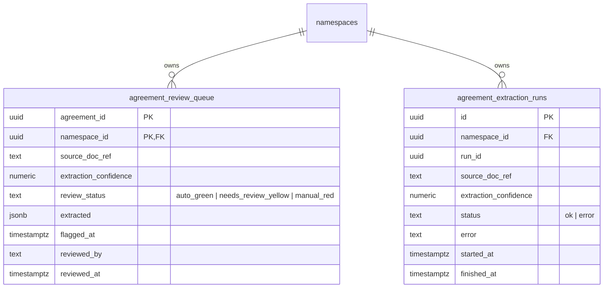

> **Status:** shipped · **Verified-against:** 7304330 (main) · **Last-audited:** 2026-08-17

# Agreements Engine Admin Guide (Doc 78)

> **Status:** shipped · **Verified-against:** 7304330 (main) · **Last-audited:** 2026-08-17

The **Agreements Engine** (`nce/vertical_modules/agreements/`) is the contract lifecycle management, OCR extraction, and legal compliance enforcement platform for the Neuro-Cognitive Engine (NCE). It extracts terms from customer, supplier, and vendor contracts, enforces strict confidence gates (capping money and legal fields), manages human review workflows, integrates with e-signing transports, and runs cross-engine coverage and leakage checks.

This guide provides platform engineers and system administrators with technical instructions to configure, run, and audit the Agreements Engine against commit `7304330`.

---

## 1. Surface of Truth & Network Exposure

The Agreements vertical module exposes strictly **1 MCP Tool** and **5 Admin REST Routes** mounted in `nce/admin_app.py` via `nce/admin_handlers/agreements.py`:

### 1.1 Mounted MCP Tools (1 Tool)
| MCP Tool | Cacheable | Mutation | Admin Only | AI-Role | Description |
|---|:---:|:---:|:---:|---|---|
| `agreements_lookup_terms` | ✔ (`True`) | ✘ (`False`) | ✘ (`False`) | Advisor | Look up extracted contractual terms (discounts, payment terms, SLAs) for one or multiple agreements from `agreement_review_queue`. |

### 1.2 Mounted Admin REST Routes (5 Routes)
| Route | Method | Handler | Purpose |
|---|---|---|---|
| `/api/agreements` | `GET` | `agreements_handlers.api_agreements_list` | List active agreement documents with status KPIs (draft/active/pending/signed). |
| `/api/agreements/coverage` | `GET` | `agreements_handlers.api_agreements_coverage` | Compute and return the spend-without-agreement leakage matrix. |
| `/api/agreements/{id}` | `GET` | `agreements_handlers.api_agreements_detail` | Fetch full agreement details, extracted terms, and review status. |
| `/api/agreements/extract` | `POST` | `agreements_handlers.api_agreements_extract` | Submit a document reference (`source_doc_ref`) for Claude Vision OCR extraction. |
| `/api/agreements/review` | `POST` | `agreements_handlers.api_agreements_review` | Confirm, reject, or submit corrected terms for a review queue entry. |

> [!NOTE]
> Internal domain cores (`do_extract_agreement`, `do_review_extraction`, `do_reconcile_kickback`, `do_coverage_matrix`, `do_run_compliance_audit`) execute as pure Python coroutines and are reached via the REST surface above or direct library calls. Only `agreements_lookup_terms` is registered into the global MCP tool registry.

---

## 2. Engine Configuration & Enablement

### 2.1 Global Environment Configuration (`nce/config.py`)
All parameters are prefix-enforced (`NCE_AGREEMENTS_*`) and parsed via `nce/config.py`:

* **`NCE_AGREEMENTS_ENABLED`** (Boolean, default `True`):  
  Global toggle controlling whether Agreements vertical routes, MCP handlers, and background watchers are mounted.
* **`NCE_AGREEMENTS_OCR_AUTOGREEN_THRESHOLD`** (Integer, default `90`):  
  Confidence score threshold [1–100] above which non-money/legal extracted terms are automatically approved.
* **`NCE_AGREEMENTS_OCR_REVIEW_THRESHOLD`** (Integer, default `70`):  
  Confidence score threshold [1–100] below which extracted terms are marked `manual_red`.
* **`NCE_AGREEMENTS_EXPIRY_WARN_DAYS`** (Integer, default `60`):  
  Warning lookahead horizon in days for contract expiration alerts.
* **`NCE_AGREEMENTS_SIGN_PROVIDER`** (String, default `"scrive"`):  
  Configured signing provider adapter (`"bankid"`, `"scrive"`, or `"manual"`).
* **`NCE_AGREEMENTS_SHAREPOINT_URL` / `NCE_AGREEMENTS_BLOB_URL`** (String / Secret):  
  References to source-document storage buckets. Resolved dynamically at runtime and never logged.

### 2.2 Tenant Namespace Activation & Guarding
The Agreements vertical enforces tenant-level activation via `require_agreements_enabled()` in `nce/vertical_modules/agreements/_guard.py`. Tenant namespaces opt in via the JSONB `metadata` column in the `namespaces` table:

```json
{
  "agreements": {
    "enabled": true
  }
}
```

If `metadata->'agreements'->>'enabled'` is not `true` or is omitted, `require_agreements_enabled()` raises `AgreementsDisabledError`. Both the MCP handler (returning JSON-RPC error `-32005` / `MCP_SCOPE_FORBIDDEN`) and the REST handlers (returning `HTTP 403 Forbidden`) fail-closed.

---

## 3. Database Schema & Row-Level Security (RLS)

The Agreements Engine operates two operational PostgreSQL tables created in migration `045_agreement_review.sql` (`nce/schema.sql`). Both tables enforce PostgreSQL Row-Level Security (`ENABLE` and `FORCE ROW LEVEL SECURITY`).



### 3.1 DDL & Isolation Policies
```sql
CREATE TABLE IF NOT EXISTS agreement_review_queue (
    agreement_id           UUID        NOT NULL,
    namespace_id           UUID        NOT NULL REFERENCES namespaces(id) ON DELETE CASCADE,
    source_doc_ref         TEXT        NOT NULL,
    extraction_confidence  NUMERIC     NOT NULL,
    review_status          TEXT        NOT NULL DEFAULT 'needs_review_yellow'
                                       CHECK (review_status IN ('auto_green', 'needs_review_yellow', 'manual_red')),
    extracted              JSONB       NOT NULL,
    flagged_at             TIMESTAMPTZ NOT NULL DEFAULT now(),
    reviewed_by            TEXT,
    reviewed_at            TIMESTAMPTZ,
    PRIMARY KEY (agreement_id, namespace_id)
);

CREATE TABLE IF NOT EXISTS agreement_extraction_runs (
    id                     UUID        NOT NULL DEFAULT gen_random_uuid(),
    namespace_id           UUID        NOT NULL REFERENCES namespaces(id) ON DELETE CASCADE,
    run_id                 UUID        NOT NULL,
    source_doc_ref         TEXT        NOT NULL,
    extraction_confidence  NUMERIC,
    status                 TEXT        NOT NULL DEFAULT 'ok'
                                       CHECK (status IN ('ok', 'error')),
    error                  TEXT,
    started_at             TIMESTAMPTZ NOT NULL DEFAULT now(),
    finished_at            TIMESTAMPTZ NOT NULL DEFAULT now(),
    PRIMARY KEY (id)
);

-- RLS Enforcement
ALTER TABLE agreement_review_queue ENABLE ROW LEVEL SECURITY;
ALTER TABLE agreement_review_queue FORCE ROW LEVEL SECURITY;

ALTER TABLE agreement_extraction_runs ENABLE ROW LEVEL SECURITY;
ALTER TABLE agreement_extraction_runs FORCE ROW LEVEL SECURITY;

CREATE POLICY tenant_isolation_policy ON agreement_review_queue
    FOR ALL TO nce_app
    USING (namespace_id IS NOT NULL AND namespace_id = get_nce_namespace())
    WITH CHECK (namespace_id IS NOT NULL AND namespace_id = get_nce_namespace());

CREATE POLICY tenant_isolation_policy ON agreement_extraction_runs
    FOR ALL TO nce_app
    USING (namespace_id IS NOT NULL AND namespace_id = get_nce_namespace())
    WITH CHECK (namespace_id IS NOT NULL AND namespace_id = get_nce_namespace());
```

### 3.2 Access Control & Grants
The application role `nce_app` is granted operational DML privileges:
```sql
REVOKE ALL ON TABLE agreement_review_queue FROM nce_app;
GRANT SELECT, INSERT, UPDATE, DELETE ON TABLE agreement_review_queue TO nce_app;

REVOKE ALL ON TABLE agreement_extraction_runs FROM nce_app;
GRANT SELECT, INSERT, UPDATE, DELETE ON TABLE agreement_extraction_runs TO nce_app;
```

---

## 4. Confidence Gate Capping Guards (§9.3 Money/Legal Guard)

The OCR extraction pipeline (`nce/vertical_modules/agreements/extract.py`) parses PDF/image documents and assigns confidence scores from `0.0` to `100.0` for individual terms.

> [!IMPORTANT]
> **The §9.3 Money & Legal Capping Rule:**  
> Commercial and financial terms have severe downstream legal and cashflow consequences. A misread term can corrupt automated pricing or invoice matching. Therefore, the following four fields are permanently classified as **money/legal fields**:
> * `kickbackTiers`
> * `frameDiscountPct`
> * `paymentTermsDays`
> * `volumeCommitment`
>
> **Enforcement:** Even if the OCR model self-reports 100% confidence, these fields are **strictly capped at `needs_review_yellow`**. They **never** resolve to `auto_green`. An operator must explicitly review and confirm them before promotion.

### 4.1 Confidence Status Mapping Table
| Field Category | Confidence Score | Workflow Status | Execution Result |
|---|---|---|---|
| **Standard Fields** (e.g. IDs, Dates) | $\ge$ `AUTOGREEN_THRESHOLD` (90) | `auto_green` | Auto-promoted to graph and knowledge base |
| **Standard Fields** | `REVIEW_THRESHOLD` (70) $\le$ Score $< 90$ | `needs_review_yellow` | Enters operator review queue |
| **Standard Fields** | $< 70$ | `manual_red` | Enters operator review queue |
| **Money / Legal Fields** | $\ge 70$ (including $\ge 90$) | `needs_review_yellow` | **Auto-approval blocked.** Enters operator review queue |
| **Money / Legal Fields** | $< 70$ | `manual_red` | Enters operator review queue |

---

## 5. C7 SignTransport Integration

The e-signing framework uses the unified interface defined in `nce/signing_service/transport.py`.

```python
class SignTransport(Protocol):
    def request_signature(
        self,
        doc: bytes,
        signer: dict[str, Any],
        method: TransportMethod,
    ) -> dict[str, Any]:
        """Initiate an e-signing session."""
        ...

    def on_signed(
        self,
        session_id: str,
        callback_payload: dict[str, Any],
    ) -> dict[str, Any]:
        """Handle a 'signed' webhook callback."""
        ...

    def on_declined(
        self,
        session_id: str,
        callback_payload: dict[str, Any],
    ) -> dict[str, Any]:
        """Handle a 'declined' webhook callback."""
        ...
```

* **Supported Methods:** `"oneflow"`, `"criipto"`, `"signicat"`, and `"manual"`.
* **Document Fingerprinting:** The SHA-256 fingerprint is calculated deterministically on raw document bytes via `hashlib.sha256(doc).hexdigest()`.
* **Manual Transport:** For testing and CI, `ManualTransport` (`nce/signing_service/manual.py`) records signing transitions in-memory with structured audit trails (`requested`, `signed`, `declined`).

---

## 6. AIContractGuard & A2A Compliance Auditing

`AIContractGuard` (`compliance.py`) enforces policy compliance against JSON configuration-as-IP files located in `nce/config_data/`:
* `agreement-compliance-rules.json`: Enforces max discount ceilings (default `15%`), standard SLA turnaround hours, and prohibited clauses.
* `agreement-benchmark.json`: Contains market benchmarks for payment terms (Net 30/60) and vendor discount baselines.

### 6.1 Procurement Fail-Closed Protocol
When a purchase order contains a rebate override (`rebate_override=True`), the Procurement Engine invokes compliance checks against the active vendor agreement:
1. If the terms violate `agreement-compliance-rules.json` or exceed active contract tiers, the transaction returns `approved = false`.
2. If the Agreements Engine is unavailable or times out, the call **fails closed**—the PO remains in `pending_approval` requiring explicit human override, and the event is recorded in `event_log`.

---

## 7. Coverage Matrix & Leakage Detection

`do_coverage_matrix` detects spend leakage across three entities:
1. **Finago GL Spend:** Live General Ledger lines queried via A2A from the Economy Engine.
2. **Agreement Entity:** The counterparty `supplierId` bound to the contract.
3. **Vendors Module:** The canonical `VENDOR` registry entity.

All identity comparisons route through the **shared entity-resolution primitive** (`Vendors` engine), ensuring fuzzy naming variations in invoice text resolve to the canonical vendor before raising leakage alerts in the Morning Brief.

---

> **Verified-against: 7304330**
