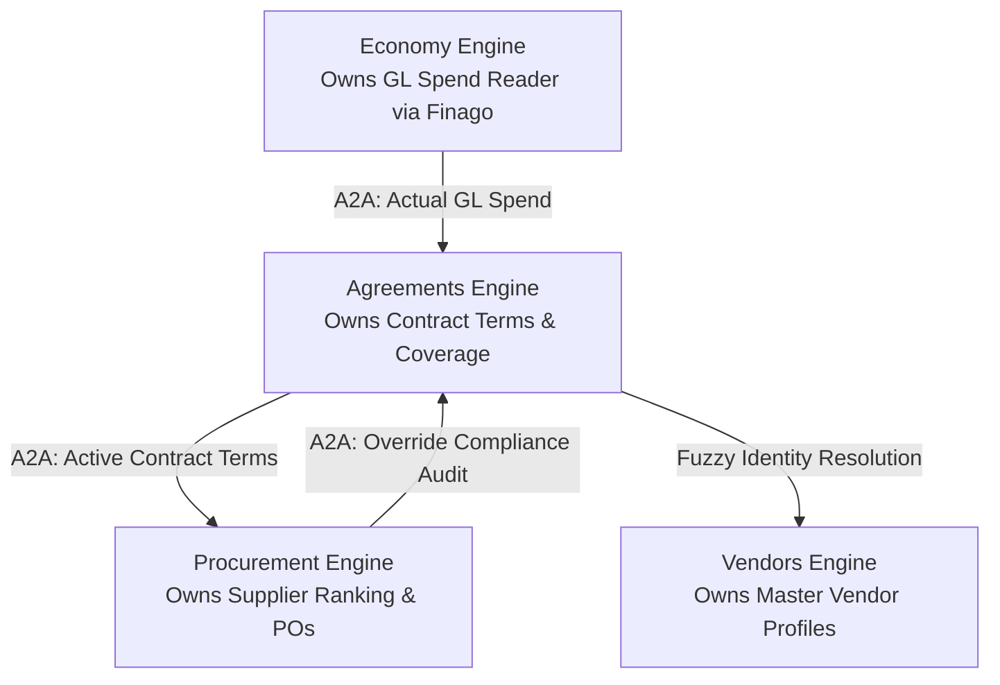
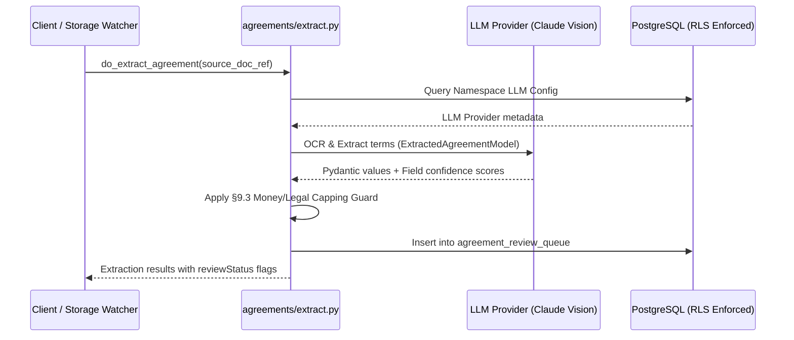

> **Status:** shipped · **Verified-against:** 7304330 (main) · **Last-audited:** 2026-08-17

# Agreements Engine User Guide (Doc 77)

> **Status:** shipped · **Verified-against:** 7304330 (main) · **Last-audited:** 2026-08-17

The **Agreements Engine** (`nce/vertical_modules/agreements/`) acts as the contract lifecycle management (CLM) intelligence and term-extraction platform for the Neuro-Cognitive Engine (NCE). It extracts terms from vendor and customer agreements (PDF/image format), subjects all extracted values to an automated confidence gate, routes high-risk or low-confidence values to a human review queue, and maintains active terms in the cognitive knowledge graph for downstream consumption by Sales, Procurement, and Economy engines.

---

## 1. Architectural Boundaries & Cross-Engine Contracts

The Agreements Engine operates within a clean separation-of-concerns boundary across four core commercial engines:



### The Four-Way Separation of Concerns:
1. **Agreements Engine:** Holds master contract terms, kickback tiers, payment term parameters, and framework discounts. It verifies compliance and detects spend-without-agreement leakage.
2. **Economy Engine:** Integrates directly with Finago General Ledger. Owns the live ledger readers (`getAccountBalances`, `fetchGlLines`). Agreements queries Economy via A2A to fetch actual spend, never reading the GL database directly.
3. **Procurement Engine:** Consumes extracted contract terms (discount tiers, payment terms) to rank suppliers and calculate Total Cost of Ownership (TCO).
4. **Vendors Engine:** Canonical master identity profiles (`VENDOR` and `CONTRACTOR` entities). Agreements delegates identity resolution to Vendors to prevent false leakage alerts.

---

## 2. Ingestion & Term Extraction (`do_extract_agreement`)

When an agreement document is uploaded or ingested from blob storage, NCE launches the automated OCR extraction pipeline.



### Extraction Schema
Parsed data is structured using the following Pydantic schemas:
```python
class KickbackTier(BaseModel):
    threshold: float = Field(description="The spend threshold value")
    pct: float = Field(description="The rebate percentage for this tier")

class ExtractedAgreementModel(BaseModel):
    supplierId: ExtractedFieldString = Field(default_factory=ExtractedFieldString)
    customerId: ExtractedFieldString = Field(default_factory=ExtractedFieldString)
    validFrom: ExtractedFieldString = Field(default_factory=ExtractedFieldString)
    validTo: ExtractedFieldString = Field(default_factory=ExtractedFieldString)
    paymentTermsDays: ExtractedFieldInt = Field(default_factory=ExtractedFieldInt)
    frameDiscountPct: ExtractedFieldFloat = Field(default_factory=ExtractedFieldFloat)
    volumeCommitment: ExtractedFieldFloat = Field(default_factory=ExtractedFieldFloat)
    kickbackTiers: ExtractedKickbackTiers = Field(default_factory=ExtractedKickbackTiers)
```

---

## 3. Confidence Gates & §9.3 Money/Legal Guard

The OCR extraction model returns confidence scores between `0.0` and `100.0` for individual fields. These scores are evaluated against configurable namespace thresholds:

* **Auto-Green (`auto_green`):** High confidence; automatically approved without manual intervention.
* **Needs Review Yellow (`needs_review_yellow`):** Moderate confidence, or flagged as legally/financially sensitive; held in the review queue.
* **Manual Red (`manual_red`):** Low confidence ($< 70$); requires manual data entry.

> [!IMPORTANT]
> **The §9.3 Money/Legal Guard Rule:**  
> Commercial and financial terms have direct monetary impact. Under the §9.3 Guard, the fields `kickbackTiers`, `frameDiscountPct`, `paymentTermsDays`, and `volumeCommitment` **can never resolve to `auto_green`**. Even if the model self-reports 100.0% confidence, these fields are capped at `needs_review_yellow` and require human operator confirmation before activation.

### Field Status Mapping Logic
```python
is_money_legal = field_name in {
    "kickbackTiers",
    "frameDiscountPct",
    "paymentTermsDays",
    "volumeCommitment",
}

if confidence >= autogreen_thresh:
    if is_money_legal:
        return "needs_review_yellow"
    return "auto_green"
elif confidence >= review_thresh:
    return "needs_review_yellow"
else:
    return "manual_red"
```

---

## 4. Operator Review Queue Workflow

Flagged terms (`needs_review_yellow` and `manual_red`) are stored in `agreement_review_queue`. Operators manage the queue via the admin REST API.

### Review Actions (`do_review_extraction`)
* **Confirm:** Promotes status to `auto_green`, activating terms in the knowledge graph.
* **Reject:** Demotes status to `manual_red` and flags the agreement for full manual re-entry.
* **Override:** Allows the operator to supply `corrected_terms` that override the OCR payload.
* **Tenant Isolation:** All review mutations execute under tenant-scoped sessions (`get_nce_namespace()`), preventing cross-tenant data modification.

---

## 5. Compliance Auditing & AIContractGuard

The Agreements Engine acts as the governance enforcement point for contract compliance.

### 5.1 AIContractGuard
`AIContractGuard` audits draft or active agreements against configuration-as-IP rules:
* `agreement-compliance-rules.json`: Enforces max discount ceilings (default `15%`), standard SLA windows, and prohibited clauses.
* `agreement-benchmark.json`: Compares payment terms (Net 30/60) against industry averages.

### 5.2 A2A Governance Verification
When a purchase order contains a rebate override (`rebate_override=True`), the Procurement Engine calls Agreements to audit compliance. If the terms violate contract parameters, the check returns `approved = false`. If Agreements is unreachable, the call **fails closed**, leaving the PO in `pending_approval`.

---

## 6. Coverage, Gap, & Kickback Reconciliation

> **Terminology.** *Kickback* is used here in its Norwegian commercial sense — a **volume-based
> supplier rebate**, openly negotiated in a framework agreement and settled against actual spend.
> It is not a bribe or a secret commission. The compliance matcher treats `kickback_prohibited`
> and `anti_bribery` as separate, independently detected clause flags. See the Terminology
> section of `README.md`.

### 6.1 Spend Leakage Detection (`do_coverage_matrix`)
* **GL Join:** Queries live spend lines from the Economy Engine via A2A (`fetchGlLines`).
* **Entity Resolution:** Standardizes vendor names across invoices and contracts using NCE's shared entity-resolution primitive.
* **Leakage Alerts:** Identifies uncontracted spend with counterparties and flags warnings in the Morning Brief.

### 6.2 Kickback Reconciliation (`do_reconcile_kickback`)
Calculates earned rebates against live spend:
$$\text{Earned Rebate} = \text{Spend} \times \text{Active Tier Pct}$$
Tracks progress toward higher rebate tiers and surfaces savings forecasts.

---

## 7. Knowledge Graph Contributions

Signed contracts instantiate nodes and edges in the cognitive knowledge graph:
* **Node Types:** `AGREEMENT`, `AGREEMENT_TERM`, `AGREEMENT_SIGNATURE`.
* **Spine Connections:** `VENDOR -[under]-> AGREEMENT`, `CUSTOMER -[under]-> AGREEMENT`, `AGREEMENT -[covers]-> FUNCTIONAL_LOCATION`.

---

## 8. Surface of Truth & Network API Reference

The Agreements Engine exposes strictly **1 MCP Tool** and **5 REST Routes**:

### 8.1 Mounted MCP Tools (1 Tool)
| MCP Tool | Cacheable | Mutation | Admin Only | AI-Role | Description |
|---|:---:|:---:|:---:|---|---|
| `agreements_lookup_terms` | ✔ (`True`) | ✘ (`False`) | ✘ (`False`) | Advisor | Query extracted terms (discounts, payment terms, SLAs) for one or multiple agreements from `agreement_review_queue`. |

### 8.2 Mounted Admin REST Routes (5 Routes)
| Route | Method | Purpose |
|---|---|---|
| `GET /api/agreements` | `GET` | Fetch active agreement list with status KPI summaries. |
| `GET /api/agreements/coverage` | `GET` | Compute and return the spend-without-agreement leakage matrix. |
| `GET /api/agreements/{id}` | `GET` | Fetch agreement detail, extracted terms, and review status. |
| `POST /api/agreements/extract` | `POST` | Trigger Claude Vision OCR extraction on a document reference. |
| `POST /api/agreements/review` | `POST` | Submit operator confirmation, rejection, or corrected terms. |

> [!NOTE]
> Internal domain cores (`do_extract_agreement`, `do_review_extraction`, `do_reconcile_kickback`, `do_coverage_matrix`, `do_run_compliance_audit`) execute as pure in-process coroutines and are reached via the REST surface above or direct library calls. Only `agreements_lookup_terms` is mounted as an MCP tool.

---

## 9. Configuration Parameters (`nce/config.py`)

| Configuration Key | Type | Default | Description |
|---|---|---|---|
| `NCE_AGREEMENTS_ENABLED` | `bool` | `True` | Master toggle for the Agreements vertical module. |
| `NCE_AGREEMENTS_OCR_AUTOGREEN_THRESHOLD` | `int` | `90` | Confidence score threshold [1–100] for auto-approval of standard fields. |
| `NCE_AGREEMENTS_OCR_REVIEW_THRESHOLD` | `int` | `70` | Confidence score threshold [1–100] below which fields are marked `manual_red`. |
| `NCE_AGREEMENTS_EXPIRY_WARN_DAYS` | `int` | `60` | Days before contract expiration to raise a warning in the Morning Brief. |
| `NCE_AGREEMENTS_SIGN_PROVIDER` | `str` | `"scrive"` | Configured e-signature provider (`"bankid"`, `"scrive"`, or `"manual"`). |
| `NCE_AGREEMENTS_SHAREPOINT_URL` | `str` | `""` | SharePoint document storage URL. **(Secret, never logged)** |
| `NCE_AGREEMENTS_BLOB_URL` | `str` | `""` | Blob storage URL for contract document storage. **(Secret, never logged)** |

---

> **Verified-against: 7304330**
