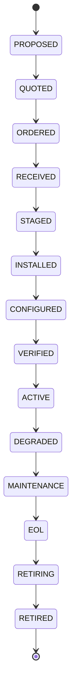

> **Status:** shipped (partial) · **Verified-against:** b75c873 (main) · **Last-audited:** 2026-09-06

# Assets Engine User Guide (Doc 90)

> **Status:** shipped (partial) · **Verified-against:** b75c873 (main) · **Last-audited:** 2026-09-06

The **Assets Engine** (`nce/vertical_modules/assets/`) owns the relational **register of installed devices** — one row per physical unit, seeded from the BOM line it was installed from, tracked through a 14-state lifecycle, and (optionally) linked to a room-level SLA. It is the engine that answers "what device is in this room, what state is it in, and is it healthy" for anything a Field Tech installs.

> [!IMPORTANT]
> **Surface summary (main @ `b75c873`):**
> - **8 exposed MCP tools**, all registered in `nce/tool_registry.py:971-1026`: `assets_ping`, `assets_get`, `assets_list`, `assets_advance_lifecycle`, `assets_seed_from_bom`, `assets_pull_telemetry`, `assets_attach_sla`, `assets_compute_health`.
> - **8 mounted REST routes** in `nce/admin_app.py:951-990` (`nce/admin_handlers/assets.py`) — 7 distinct endpoints, since `/api/assets/health` and `/api/assets/{id}/health` both route to the same handler.
> - **7 internal `do_*` cores**, every one of them wired to both an MCP tool and a REST route — there is no orphaned core left in this module (`nce/vertical_modules/assets/{seed,telemetry,sla,health,mcp_handlers}.py`).
> - **What is *not* shipped, stated plainly:** the engine spec (`docs/vertical_engines/09-assets-engine.md`) also describes a NetBox bridge (`do_sync_netbox`), a warranty/EOL watcher (`do_check_warranty_eol`), a replacement advisor (`do_recommend_replacement`), asset-QR generation (`do_generate_asset_qr`), and a Digital Product Passport export (`do_export_dpp`). **None of these five functions exist anywhere in the repository** — this is not a wiring gap, the code itself was never written. See `docs/engines/assets-admin.md` §7 for the full spec-vs-shipped delta.

---

## 1. What an "asset" is here

An **asset** is one row in the `assets` table (migration 054): a physical device that originated from a specific **BOM line** at install time. Its identity is the row's UUID (`assets.id`), returned by `assets_seed_from_bom` — **never** the device's `serial`, which is optional and often unknown at seed time (an installer may seed the row before scanning the barcode).

Every asset carries:
- `bom_line_id` — the BOM line it was installed from (the idempotency key — seeding the same BOM line twice returns the *same* row, `nce/vertical_modules/assets/seed.py:252-334`).
- `serial` — nullable; "not captured yet" is a valid, honest state, not an error.
- `functional_location_id` — the room it lives in; also nullable.
- `lifecycle_state` — one of the 14 states below.

### 1.1 The 14-state lifecycle



The full sequence and the legal-edge map live in `nce/config_data/asset-lifecycle.json` (config-as-IP — no state name is a Python literal anywhere in `nce/vertical_modules/assets/lifecycle.py`). Two properties worth knowing before you call `assets_advance_lifecycle`:

1. **Only forward, one-hop transitions are legal.** Each state has exactly one declared successor (`VALID_TRANSITIONS`), and there is **no repair/return edge** — e.g. `MAINTENANCE -> ACTIVE` or `DEGRADED -> ACTIVE` does not exist. A degraded asset can only continue forward toward retirement; nothing in the shipped config lets it recover to `ACTIVE`. This is a named scope limit (`lifecycle.py:45-56`), not an oversight — if your fleet needs a repair loop, it is a config change to the JSON, not a code change.
2. **Re-applying the current state is a no-op success**, never an error — this makes at-least-once redelivery of an install-completion event safe to replay.
3. **`VERIFIED` is the only state that sets warranty** (`WARRANTY_SET_ON_ENTER`), and even there `assets_advance_lifecycle` never resolves a `warranty_months` duration — it always calls the pure state machine with no duration argument (`advance({"lifecycle_state": current_state}, target_state)`, `mcp_handlers.py:292`), so `warranty_set` is always `False` on this tool's transitions today. There is also no `warranty_until` column on the `assets` table to persist one into. Warranty is spec'd, not shipped.

---

## 2. The eight tools

| Tool | AI-role | cacheable | admin_only | mutation |
|---|---|:---:|:---:|:---:|
| `assets_ping` | — (liveness) | ✔ | ✘ | ✘ |
| `assets_get` | Watcher | ✔ | ✘ | ✘ |
| `assets_list` | Watcher | ✔ | ✘ | ✘ |
| `assets_advance_lifecycle` | Actor | ✘ | ✘ | ✔ |
| `assets_seed_from_bom` | Actor | ✘ | ✘ | ✔ |
| `assets_pull_telemetry` | — (operator/cron) | ✘ | **✔** | ✔ |
| `assets_attach_sla` | Actor | ✘ | ✘ | ✔ |
| `assets_compute_health` | Watcher | ✘ | ✘ | ✔ |

Flags per `nce/tool_registry.py:971-1026`. Note `assets_pull_telemetry` is the only `admin_only` tool in the set — everything else is callable by any authenticated caller in the namespace.

### 2.1 `assets_ping` — is the engine alive
Call this to confirm the Assets vertical is mounted. Requires only `namespace_id`; returns `{"ok": true, "engine": "assets"}`. No REST route — MCP-only liveness probe (`mcp_handlers.py:83-92`).

### 2.2 `assets_get` — fetch one asset
Call when you have an `asset_id` (the register row's UUID) and need its current state. Returns `{"ok": true, "asset": {...} | null}` — `null` is a normal "no such asset here," never an error (`mcp_handlers.py:158-189`). REST: `GET /api/assets/{id}?namespace_id=...`.

### 2.3 `assets_list` — browse the register
Call to page through a namespace's register, optionally filtered by `functional_location_id` (one room) or `lifecycle_state`. Capped at 500 rows (`_LIST_ROW_CAP`, `mcp_handlers.py:117`) — there is no cursor/pagination parameter in this wave, so a namespace with a larger fleet needs a narrower filter. REST: `GET /api/assets?namespace_id=...&functional_location_id=...&lifecycle_state=...`.

### 2.4 `assets_advance_lifecycle` — move a state forward
Call after a physical milestone (install complete, verification signed off, degradation confirmed, etc.). Pass `asset_id` and `target_state`. Three outcomes, never a raised business error:
- Asset not found → `{"ok": false, "not_found": true, ...}` (REST: 404).
- Legal transition (including a same-state no-op) → `{"ok": true, "changed": bool, "previous_state", "new_state", ...}` (REST: 200).
- Illegal transition (not a declared successor) → `{"ok": false, "changed": false, "error": "illegal transition: ..."}` (REST: 409).

No ledger row is written on a transition today (`v3_cognitive_ledger` is not touched from this path) — only the `assets.lifecycle_state` column changes. REST: `POST /api/assets/{id}/lifecycle`.

### 2.5 `assets_seed_from_bom` — register a new device
Call at install handover: `{namespace_id, bom_line_id, serial?, functional_location_id?}`. Idempotent on `(namespace_id, bom_line_id)` — seeding the same BOM line twice returns `created: false` and the **original** row, ignoring any new `serial`/`functional_location_id` values you pass the second time (there is no update path in this module — the conflict branch re-selects the existing row rather than writing, `seed.py:310-324`). The entry lifecycle state is read from `asset-lifecycle.json`, not hard-coded. REST: `POST /api/assets/seed-from-bom` (201 on create, 200 on replay).

### 2.6 `assets_pull_telemetry` — pull a reading batch
See §3 below before relying on this for anything beyond a smoke test — **the only manufacturer with real behaviour today is the mock adapter.** Call with `{namespace_id, asset_id, platform?}` (`platform` defaults to `mock`). Returns `{"ok": true, "pulled": int, "written": int, "duplicates": int, "adapter_platform": str, ...}` — `platform` is what you asked for, `adapter_platform` is what actually served it, and they differ whenever a vendor platform's real-adapter flag is unset (the normal state). REST: `POST /api/assets/{id}/telemetry`.

### 2.7 `assets_attach_sla` — link a room to its coverage
Call with `{namespace_id, agreement_id, functional_location_id}` to attach the room to an already-authored Agreements SLA. This tool **reads** Agreements' terms and **writes one edge** — it never creates SLA terms itself, and it fails loudly (`ValueError`) if the named `agreement_id` has no SLA terms on record yet (`sla.py:289-292`). See §5. REST: `POST /api/assets/sla/attach`.

### 2.8 `assets_compute_health` — score and check for degradation
Call with `{namespace_id, asset_id}` to fuse whatever inputs exist (telemetry, MTBF, open tickets, age) into a 0-100 score, and — if the score drops below the degraded threshold while the asset is `ACTIVE` — persist an `ACTIVE -> DEGRADED` transition automatically. See §4. REST: `GET /api/assets/{id}/health` or `GET /api/assets/health?asset_id=...`.

---

## 3. Telemetry: the mock is the only real adapter — say this plainly

`nce/vertical_modules/assets/telemetry.py` names five manufacturer platforms in `VENDOR_PLATFORMS` (`crestron`, `qsys`, `neat`, `huddly`, `poly`), each mapped to the vendor API a real adapter would call (e.g. "Crestron XiO Cloud / Fusion xAPI"). **None of the five has a real HTTP client.** `select_telemetry_adapter` (`telemetry.py:315-343`) always returns `MockTelemetryAdapter` unless the deployment sets `NCE_ASSETS_TELEMETRY_<PLATFORM>_REAL` — and even then, what it returns is `UnimplementedVendorAdapter`, whose `fetch_samples` raises `NotImplementedError` naming the vendor API that a future adapter would call (`telemetry.py:265-292`). There is no `httpx` import, no network call, and no credential handling anywhere in this file.

**What `MockTelemetryAdapter` actually returns** (`telemetry.py:233-256`): a fixed, deterministic synthetic history of three metrics (`uptime_seconds`, `temperature_celsius`, `packet_loss_percent`) derived from the asset's UUID and a fixed epoch (2026-01-01), so re-pulling the same asset is a genuine replay (proves the idempotency constraint) rather than new-looking data every time. It is a stand-in for a live sensor feed, not a live sensor feed.

Every sample this adapter produces is tagged `"source": "mock"` in its `raw` payload — and that tag is exactly what §4's health scorer and predictive-failure watcher key off of to know they are looking at simulated data.

---

## 4. Health scoring: coverage-aware, and silent when the input is fake

`assets_compute_health` (`nce/vertical_modules/assets/health.py`) fuses up to four inputs — age (always available), telemetry, NetBox MTBF failure probability, and open service tickets — into a single 0-100 score, weighted by `nce/vertical_modules/assets/asset-health-weights.json` (`telemetry_weight: 0.35`, `mtbf_weight: 0.25`, `tickets_weight: 0.20`, `age_weight: 0.20`). Missing inputs are dropped from the weighted average rather than defaulted to a fake value, and the response's `coverage` field says exactly what went into the number — e.g. `"age-only, no telemetry"` when nothing else is available, matching the engine spec's demand to "expose coverage, don't fake confidence."

> [!WARNING]
> **Predictive-failure alerts are suppressed when the telemetry behind them is the mock adapter.** `compute_asset_health` (`health.py:254-296`) checks every sample's `raw.source` tag (§3); if telemetry indicates a high failure risk (score < 40, or the mock adapter's MTBF input crosses the configured threshold) but the samples came from `MockTelemetryAdapter`, the function sets `predictive_failure: false` and `predictive_failure_suppressed: true` with `suppression_reason: "RS-3: predictive failure watcher silenced on mock telemetry adapter"` — it never raises a fabricated predictive-failure alert off synthetic numbers. The alert only fires (`predictive_failure: true`) once telemetry is coming from a real (non-mock) source — which, per §3, does not exist in this codebase yet. **In practice: today, `assets_compute_health` never raises a real predictive-failure alert**, because the only working telemetry source is mock.

Separately from the predictive-failure suppression, a real, persisted side effect **does** happen on this tool: if the fused score falls below `degraded_threshold` (default `60.0`) while the asset is `ACTIVE`, the tool transitions it to `DEGRADED` and updates `assets.lifecycle_state` — this part is not gated on telemetry source, since age alone is enough to trigger it. The computation is also appended to `v3_cognitive_ledger` as an `asset_health_computed` event on a best-effort basis (a ledger write failure is logged and swallowed, not raised — `health.py:490-491`).

The health score itself is **not persisted anywhere** — there is no `health_score` column on the `assets` table (migration 054 never added one, despite the engine spec listing one). Every call recomputes it fresh from the current telemetry/ticket/age inputs.

---

## 5. SLA coverage: a per-room link, not a driftsavtale writer

`assets_attach_sla` implements exactly one aspect of what the engine spec calls a "4-way co-owned" SLA concept: **Agreements** owns the driftsavtale *terms*, **Economy** owns the MRR/revenue, **Support** owns the running clock and breach state, and **Assets** owns only the per-room *coverage link* — `FUNCTIONAL_LOCATION -[covered_by]-> Agreement`. Calling this tool:
1. **Reads** the already-authored SLA terms from Agreements (`agreements/sla.py:get_sla_coverage`) — a read-only call, never a write into Agreements' data.
2. **Refuses** (raises `ValueError`) if Agreements has no SLA terms on record for the given `agreement_id` — attaching "coverage" to an agreement with nothing behind it would fabricate coverage that was never authored.
3. **Writes** exactly one `kg_edges` row: `FUNCTIONAL_LOCATION -[covered_by]-> Agreement`.

There is **no standalone `SLA` graph node** written by this tool, despite an earlier sketch of the engine's graph contribution suggesting one (`ASSET -[covered_by]-> SLA -[for]-> FUNCTIONAL_LOCATION`). The room links directly to the `Agreement` node instead — the shipped shape, confirmed by `nce/config_data/node-ownership.json` carrying no `SLA` row for the `assets` engine.

---

## 6. Graph contribution — coded, but not wired to any tool you can call today

`nce/vertical_modules/assets/graph.py` implements `project_asset_to_graph`, which would write an `ASSET` `kg_nodes` row plus `BOM_LINE -[installed_as]-> ASSET` and `ASSET -[lives_in]-> FUNCTIONAL_LOCATION` edges from a seeded asset. **No MCP tool, REST route, or `do_*` core calls this function anywhere in the repository** — it is imported only by its own tests (`tests/test_assets_graph.py`, `tests/test_bom_line_store.py`). Calling `assets_seed_from_bom` today creates the relational `assets` row only; it does **not** create any graph node or edge. If your workflow depends on querying the cognitive graph for an asset's install provenance or room, that data is not there yet — use `assets_get`/`assets_list` against the relational register instead. See `docs/engines/assets-admin.md` §6 for the full detail on why this half shipped unwired.

---

## 7. Worked example: install handover to health check

```python
# 1. Seed the asset at install handover (Field Tech A2A)
seed = await do_seed_asset_from_bom(engine, {
    "namespace_id": ns_id,
    "bom_line_id": "Q001:AMP01",
    "serial": None,                 # not scanned yet
    "functional_location_id": "AUD-101",
})
asset_id = seed["asset_id"]         # seed["lifecycle_state"] == "PROPOSED"

# 2. Advance one hop at a time — target_state must be the CURRENT state's
#    declared successor, or the call returns {"ok": false, "error": "illegal
#    transition: ..."} rather than raising. Jumping PROPOSED -> VERIFIED
#    directly is illegal; each hop below is its own call.
await do_advance_lifecycle(engine, {"namespace_id": ns_id, "asset_id": asset_id, "target_state": "QUOTED"})
# ... repeat one hop at a time through ORDERED, RECEIVED, STAGED, INSTALLED,
# CONFIGURED, VERIFIED, and finally ACTIVE — 8 calls total from PROPOSED.

# 3. Pull a (mock) telemetry batch
telemetry = await do_pull_telemetry(engine, {"namespace_id": ns_id, "asset_id": asset_id})
# telemetry["adapter_platform"] == "mock" unless a vendor key + real-adapter flag exist (none do today)

# 4. Compute health — coverage tells you what actually went into the score
health = await do_compute_health(engine, {"namespace_id": ns_id, "asset_id": asset_id})
# health["coverage"] == "partial (age, mock telemetry; no mtbf, no tickets)"
# health["predictive_failure_suppressed"] is True if risk crossed the threshold — never a live alert on mock data
```

---

> **Verified-against: b75c873**
