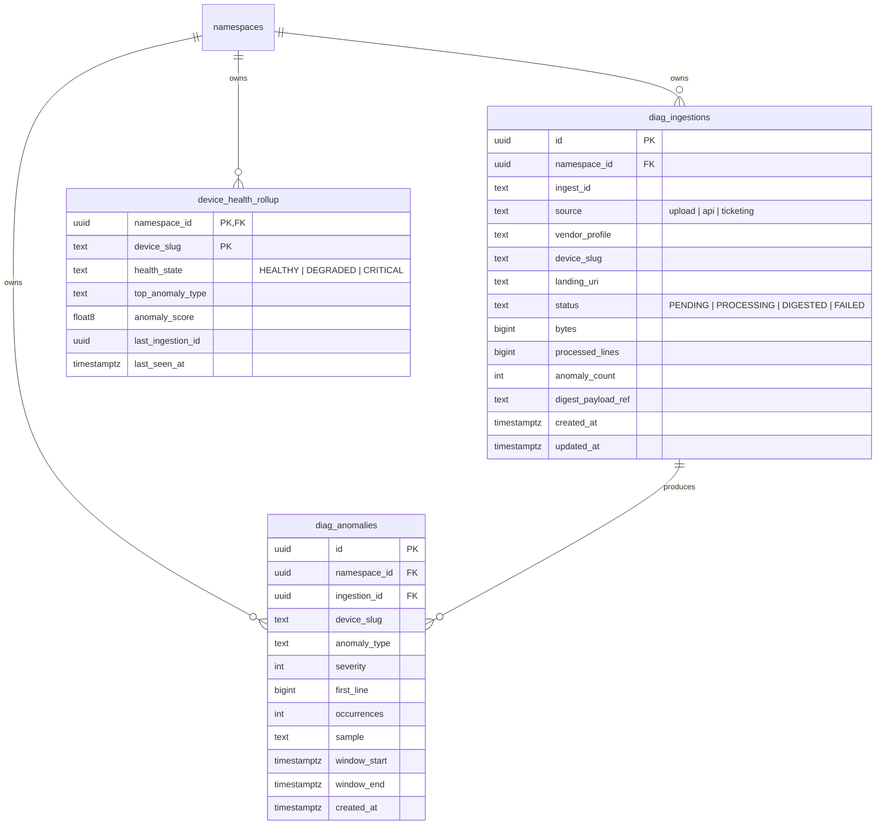
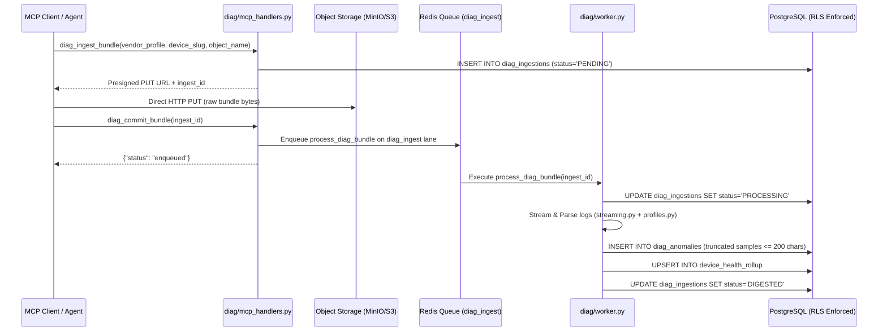

> **Status:** shipped · **Verified-against:** 7304330 (main) · **Last-audited:** 2026-08-17

# Diagnostics Engine Admin Guide (Doc 47)

> **Status:** shipped · **Verified-against:** 7304330 (main) · **Last-audited:** 2026-08-17

The **Diagnostic Log Digestion Engine** (`nce/vertical_modules/diagnostics/`) ingests large diagnostic bundles, log dumps, and telemetry packages from AV hardware, controllers, and network equipment. It streams large files without memory exhaustion, parses logs using vendor-specific diagnostic profiles (e.g. Q-SYS, Crestron, Cisco), extracts anomalies, maintains device health rollups, and integrates with the cognitive layer for automated crash-storm and anomaly analysis.

This guide details configuration, database schemas, Row-Level Security (RLS), background worker lanes, vendor profiles, and operational runbooks for system administrators and platform engineers.

---

## 1. Surface of Truth & Network Architecture

The Diagnostics Engine operates entirely through MCP tool handlers and asynchronous Redis Queue (RQ) workers. At commit `7304330`, it exposes **5 MCP Tools** and **0 REST Routes**:

### 1.1 Mounted MCP Tools (5 Tools)
| MCP Tool | Cacheable | Mutation | Admin Only | AI-Role | Description |
|---|:---:|:---:|:---:|---|---|
| `diag_ingest_bundle` | ✘ (`False`) | ✔ (`True`) | ✘ (`False`) | Actor | Mint a tenant-prefixed presigned PUT URL and register a `PENDING` row in `diag_ingestions`. |
| `diag_commit_bundle` | ✘ (`False`) | ✔ (`True`) | ✘ (`False`) | Actor | Mark upload complete and enqueue `process_diag_bundle` on the `diag_ingest` RQ worker lane. |
| `diag_digest_status` | ✔ (`True`) | ✘ (`False`) | ✘ (`False`) | Watcher | Fetch digestion status, processed line count, anomaly count, and error state for an `ingest_id`. |
| `diag_device_health` | ✔ (`True`) | ✘ (`False`) | ✘ (`False`) | Watcher | Retrieve the latest device health rollup (`HEALTHY`, `DEGRADED`, `CRITICAL`) and top anomaly for a device. |
| `diag_list_anomalies` | ✔ (`True`) | ✘ (`False`) | ✘ (`False`) | Advisor | List extracted anomalies (severity, sample text, occurrences) for an ingestion run. |

> [!NOTE]
> There are currently **0 REST routes** mounted for Diagnostics in `nce/admin_app.py`. All ingestion initiation and queries execute via the MCP surface above. Bundle processing executes asynchronously in background workers.

---

## 2. Global Environment Configuration (`nce/config.py`)

Diagnostics parameters are prefix-enforced (`NCE_DIAG_*`) and parsed via `nce/config.py`:

| Configuration Key | Type | Default | Description |
|---|:---:|:---:|---|
| `NCE_DIAG_ENABLED` | `bool` | `False` | Master feature flag. If `False`, all diagnostic MCP tools return a clean rejection error. |
| `NCE_DIAG_LANDING_BUCKET` | `str` | `"nce-diag-landing"` | MinIO / S3 bucket used for staging incoming diagnostic bundles. |
| `NCE_DIAG_LANDING_TTL_DAYS` | `int` | `7` | Retention period in days for raw uploaded bundles in object storage before lifecycle cleanup. |
| `NCE_DIAG_MAX_BUNDLE_MB` | `int` | `700` | Maximum allowable diagnostic bundle size in megabytes. |
| `NCE_DIAG_MAX_ANOMALIES` | `int` | `50` | Maximum anomaly records retained in `diag_anomalies` per ingestion. |
| `NCE_DIAG_JOB_TIMEOUT_MIN` | `int` | `45` | Hard timeout in minutes for background RQ bundle digestion jobs. |
| `NCE_DIAG_CRASH_STORM_THRESHOLD` | `int` | `10` | Anomaly count within the window threshold triggering crash-storm alert state. |
| `NCE_DIAG_CRASH_STORM_WINDOW_SEC` | `int` | `300` | Rolling time window in seconds (5 min) for crash-storm detection. |
| `NCE_DIAG_TMPDIR` | `str` | `""` | Local scratch directory for worker unbundling and streaming (defaults to system temp). |

---

## 3. Database Schema & Row-Level Security (RLS)

The Diagnostics vertical operates three relational PostgreSQL tables defined in migration `025_diagnostics.sql` (`nce/schema.sql`). All tables enforce `ENABLE` and `FORCE ROW LEVEL SECURITY`.



### 3.1 DDL & Security Policies
```sql
CREATE TABLE IF NOT EXISTS diag_ingestions (
    id                 UUID        NOT NULL DEFAULT gen_random_uuid(),
    namespace_id       UUID        NOT NULL REFERENCES namespaces(id) ON DELETE CASCADE,
    ingest_id          TEXT        NOT NULL,
    source             TEXT        CHECK (source IN ('upload', 'api', 'ticketing')),
    vendor_profile     TEXT,
    device_slug        TEXT,
    landing_uri        TEXT,
    status             TEXT        NOT NULL DEFAULT 'PENDING'
                                   CHECK (status IN ('PENDING', 'PROCESSING', 'DIGESTED', 'FAILED')),
    bytes              BIGINT,
    processed_lines    BIGINT,
    anomaly_count      INT,
    digest_payload_ref TEXT,
    created_at         TIMESTAMPTZ DEFAULT now(),
    updated_at         TIMESTAMPTZ DEFAULT now(),
    PRIMARY KEY (id),
    UNIQUE (namespace_id, ingest_id)
);

CREATE TABLE IF NOT EXISTS diag_anomalies (
    id             UUID        NOT NULL DEFAULT gen_random_uuid(),
    namespace_id   UUID        NOT NULL REFERENCES namespaces(id) ON DELETE CASCADE,
    ingestion_id   UUID        NOT NULL REFERENCES diag_ingestions(id) ON DELETE CASCADE,
    device_slug    TEXT,
    anomaly_type   TEXT,
    severity       INT,
    first_line     BIGINT,
    occurrences    INT,
    sample         TEXT,
    window_start   TIMESTAMPTZ,
    window_end     TIMESTAMPTZ,
    created_at     TIMESTAMPTZ DEFAULT now(),
    PRIMARY KEY (id)
);

CREATE TABLE IF NOT EXISTS device_health_rollup (
    namespace_id      UUID        NOT NULL REFERENCES namespaces(id) ON DELETE CASCADE,
    device_slug       TEXT        NOT NULL,
    health_state      TEXT        CHECK (health_state IN ('HEALTHY', 'DEGRADED', 'CRITICAL')),
    top_anomaly_type  TEXT,
    anomaly_score     FLOAT8,
    last_ingestion_id UUID,
    last_seen_at      TIMESTAMPTZ,
    PRIMARY KEY (namespace_id, device_slug)
);

-- RLS Enforcement
ALTER TABLE diag_ingestions ENABLE ROW LEVEL SECURITY;
ALTER TABLE diag_ingestions FORCE ROW LEVEL SECURITY;

ALTER TABLE diag_anomalies ENABLE ROW LEVEL SECURITY;
ALTER TABLE diag_anomalies FORCE ROW LEVEL SECURITY;

ALTER TABLE device_health_rollup ENABLE ROW LEVEL SECURITY;
ALTER TABLE device_health_rollup FORCE ROW LEVEL SECURITY;

CREATE POLICY tenant_isolation_policy ON diag_ingestions
    FOR ALL TO nce_app
    USING (namespace_id IS NOT NULL AND namespace_id = get_nce_namespace())
    WITH CHECK (namespace_id IS NOT NULL AND namespace_id = get_nce_namespace());

CREATE POLICY tenant_isolation_policy ON diag_anomalies
    FOR ALL TO nce_app
    USING (namespace_id IS NOT NULL AND namespace_id = get_nce_namespace())
    WITH CHECK (namespace_id IS NOT NULL AND namespace_id = get_nce_namespace());

CREATE POLICY tenant_isolation_policy ON device_health_rollup
    FOR ALL TO nce_app
    USING (namespace_id IS NOT NULL AND namespace_id = get_nce_namespace())
    WITH CHECK (namespace_id IS NOT NULL AND namespace_id = get_nce_namespace());
```

---

## 4. Ingestion Pipeline & Worker Architecture



### 4.1 Log Streaming & Memory Protection
Large diagnostic bundles (up to 700 MB) are parsed via chunked streaming iterators in `streaming.py`:
* Bundles (`.tar.gz`, `.zip`, `.log`) are extracted in temp storage and read line-by-line.
* Line buffers are capped; samples written to `diag_anomalies` are strictly truncated to $\le 200$ characters.
* PII scrubbers sanitize IP addresses, passwords, and user tokens before anomaly insertion.

### 4.2 Vendor Diagnostic Profiles (`profiles.py`)
Diagnostic profiles define regular expressions, timestamp formats, and severity classification rules:
* `qsys`: Core crash logs, Lua script errors, DSP clock slip errors, network packet drop events.
* `crestron`: SIMPL# exception logs, NVRAM corruptions, CIP socket timeouts.
* `cisco_room`: Codec crash reports, SIP registration dropouts, HDMI sync failures.
* `generic_syslog`: Standard RFC 5424 syslog streams.

---

## 5. Operational Runbooks & Troubleshooting

### 5.1 Verifying Diagnostics Ingestion
To verify worker processing:
1. Inspect RQ queue length on the `diag_ingest` lane:
   ```bash
   python -c "import redis, rq; r = redis.Redis(); q = rq.Queue('diag_ingest', connection=r); print('Jobs in diag_ingest:', len(q))"
   ```
2. Query pending or stuck ingestions:
   ```sql
   SELECT id, ingest_id, vendor_profile, device_slug, status, created_at, updated_at
   FROM diag_ingestions
   WHERE status IN ('PENDING', 'PROCESSING')
   ORDER BY created_at ASC;
   ```
3. Re-queue a failed digestion:
   If a worker died mid-processing, reset status to `PENDING` and call `diag_commit_bundle(ingest_id)`.

---

> **Verified-against: 7304330**
