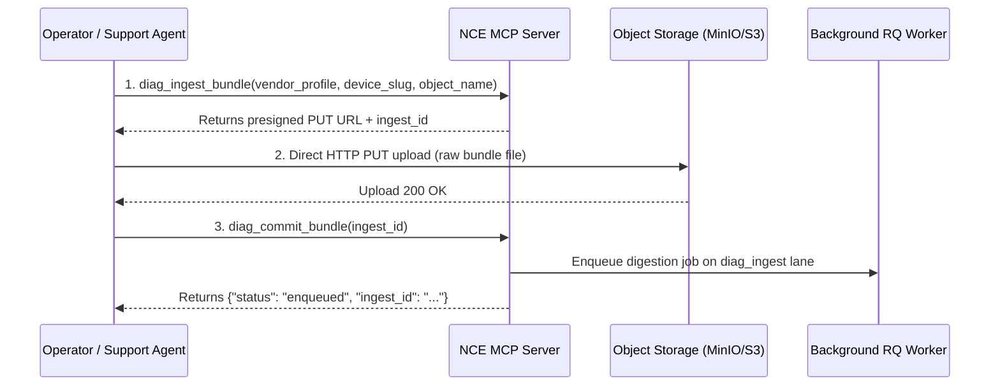

> **Status:** shipped · **Verified-against:** 7304330 (main) · **Last-audited:** 2026-08-17

# Diagnostics Engine User Guide (Doc 48)

> **Status:** shipped · **Verified-against:** 7304330 (main) · **Last-audited:** 2026-08-17

The **Diagnostic Log Digestion Engine** (`nce/vertical_modules/diagnostics/`) provides automated parsing, anomaly detection, and health monitoring for AV hardware, network codecs, and control processors. When field equipment malfunctions, operators upload diagnostic bundles (e.g. Q-SYS event logs, Crestron error dumps, Cisco codec crash logs). The engine extracts anomalies, calculates device health ratings, and provides structured signals for Support and Field Tech engineers.

---

## 1. Surface of Truth & Network Exposure

The Diagnostics Engine operates strictly through **5 MCP Tools** and **0 REST Routes** at commit `7304330`:

### 1.1 Mounted MCP Tools (5 Tools)
| MCP Tool | Cacheable | Mutation | Admin Only | AI-Role | Description |
|---|:---:|:---:|:---:|---|---|
| `diag_ingest_bundle` | ✘ (`False`) | ✔ (`True`) | ✘ (`False`) | Actor | Request a presigned URL to upload a raw diagnostic bundle (`.zip`, `.tar.gz`, `.log`). |
| `diag_commit_bundle` | ✘ (`False`) | ✔ (`True`) | ✘ (`False`) | Actor | Signal that bundle upload has completed and trigger asynchronous background digestion. |
| `diag_digest_status` | ✔ (`True`) | ✘ (`False`) | ✘ (`False`) | Watcher | Poll the parsing progress, processed lines, and anomaly count of an active ingestion. |
| `diag_device_health` | ✔ (`True`) | ✘ (`False`) | ✘ (`False`) | Watcher | Get the current health status (`HEALTHY`, `DEGRADED`, `CRITICAL`) and top anomaly for a device. |
| `diag_list_anomalies` | ✔ (`True`) | ✘ (`False`) | ✘ (`False`) | Advisor | Retrieve the list of extracted anomalies (severity, occurrences, sample text) for a bundle. |

> [!NOTE]
> There are currently **0 REST routes** mounted for Diagnostics in `nce/admin_app.py`. All interactions take place via the MCP tools above.

---

## 2. Ingestion Workflow: 3-Step Upload Protocol

Diagnostic log bundles can range from a few megabytes to hundreds of megabytes. To prevent gateway timeouts and memory pressure, NCE uses a 3-step presigned streaming protocol:



### Step 1: Request Ingestion Slot
Call `diag_ingest_bundle` with the device identifier and vendor profile:
```json
{
  "namespace_id": "3fa85f64-5717-4562-b3fc-2c963f66afa6",
  "vendor_profile": "qsys",
  "device_slug": "room-101-core110f",
  "object_name": "diag_bundle_20260817.zip",
  "source": "upload"
}
```
**Response:**
```json
{
  "ingest_id": "7a8b9c0d1e2f3a4b...",
  "landing_uri": "s3://nce-diag-landing/3fa85f64.../diag_bundle_20260817.zip",
  "upload_url": "https://storage.nce.local/nce-diag-landing/3fa85f64...?X-Amz-Signature=..."
}
```

### Step 2: Upload Raw Bundle
Upload the file directly to the `upload_url` via HTTP PUT:
```bash
curl -X PUT --upload-file diag_bundle_20260817.zip "https://storage.nce.local/nce-diag-landing/..."
```

### Step 3: Commit and Enqueue
Signal completion by calling `diag_commit_bundle`:
```json
{
  "namespace_id": "3fa85f64-5717-4562-b3fc-2c963f66afa6",
  "ingest_id": "7a8b9c0d1e2f3a4b..."
}
```
**Response:**
```json
{
  "status": "enqueued",
  "ingest_id": "7a8b9c0d1e2f3a4b...",
  "task": "nce.tasks.process_diag_bundle"
}
```

---

## 3. Monitoring Digestion & Inspecting Anomalies

### 3.1 Checking Processing Progress (`diag_digest_status`)
Call `diag_digest_status` to monitor the digestion state:
```json
{
  "namespace_id": "3fa85f64-5717-4562-b3fc-2c963f66afa6",
  "ingest_id": "7a8b9c0d1e2f3a4b..."
}
```
**Response (when complete):**
```json
{
  "ingest_id": "7a8b9c0d1e2f3a4b...",
  "status": "DIGESTED",
  "processed_lines": 148200,
  "anomaly_count": 4,
  "device_slug": "room-101-core110f",
  "vendor_profile": "qsys",
  "updated_at": "2026-08-17T11:20:00Z"
}
```

### 3.2 Listing Extracted Anomalies (`diag_list_anomalies`)
Retrieve structured anomaly records parsed from the log stream:
```json
{
  "namespace_id": "3fa85f64-5717-4562-b3fc-2c963f66afa6",
  "ingest_id": "7a8b9c0d1e2f3a4b..."
}
```
**Response:**
```json
{
  "ingest_id": "7a8b9c0d1e2f3a4b...",
  "anomaly_count": 2,
  "anomalies": [
    {
      "anomaly_type": "PTP_CLOCK_DRIFT",
      "severity": 4,
      "occurrences": 18,
      "sample": "PTP follower offset exceeded 500ns threshold (offset: 1420ns)",
      "window_start": "2026-08-17T09:12:00Z",
      "window_end": "2026-08-17T09:15:30Z"
    },
    {
      "anomaly_type": "DANTE_PACKET_LOSS",
      "severity": 5,
      "occurrences": 3,
      "sample": "Dante uncorrectable packet error count incremented: 42 drops on eth0",
      "window_start": "2026-08-17T09:14:00Z",
      "window_end": "2026-08-17T09:14:15Z"
    }
  ]
}
```

---

## 4. Device Health Rollups & Crash-Storms

### 4.1 Device Health Score (`diag_device_health`)
The digestion worker computes a roll-up score for the device in `device_health_rollup`:
* **`HEALTHY`**: 0 anomalies or low-severity warnings only.
* **`DEGRADED`**: Moderate errors (PTP drift, intermittent packet loss) without kernel crash.
* **`CRITICAL`**: Fatal kernel panics, repeated process reboots, or hardware temperature faults.

```json
{
  "namespace_id": "3fa85f64-5717-4562-b3fc-2c963f66afa6",
  "device_slug": "room-101-core110f"
}
```
**Response:**
```json
{
  "device_slug": "room-101-core110f",
  "health_state": "DEGRADED",
  "top_anomaly_type": "DANTE_PACKET_LOSS",
  "anomaly_score": 0.72,
  "last_seen_at": "2026-08-17T11:20:00Z"
}
```

### 4.2 Crash-Storm Detection & Root Cause Analysis
When anomaly frequency exceeds `NCE_DIAG_CRASH_STORM_THRESHOLD` within `NCE_DIAG_CRASH_STORM_WINDOW_SEC` (default 10 anomalies in 5 minutes), the engine flags a **Crash Storm** event.

> [!NOTE]
> **Root Cause Analysis in NCE:**  
> An earlier design spec referenced a dedicated `diag_root_cause` tool. In the shipped architecture @ `7304330`, **no `diag_root_cause` tool exists**. Instead, root cause determination is performed by synthesizing `diag_list_anomalies` with the cognitive Knowledge Graph (`graph_search`) and topological connection data (`netbox` extensions).

---

## 5. Configuration Summary

| Key | Default | Description |
|---|---|---|
| `NCE_DIAG_ENABLED` | `false` | Master toggle for diagnostics tools. |
| `NCE_DIAG_LANDING_BUCKET` | `"nce-diag-landing"` | Ingestion S3/MinIO bucket. |
| `NCE_DIAG_MAX_BUNDLE_MB` | `700` | Max bundle size in MB. |
| `NCE_DIAG_MAX_ANOMALIES` | `50` | Max anomalies stored per ingestion. |
| `NCE_DIAG_CRASH_STORM_THRESHOLD` | `10` | Anomaly count triggering storm alert. |
| `NCE_DIAG_CRASH_STORM_WINDOW_SEC` | `300` | Rolling detection window (seconds). |

---

> **Verified-against: 7304330**
