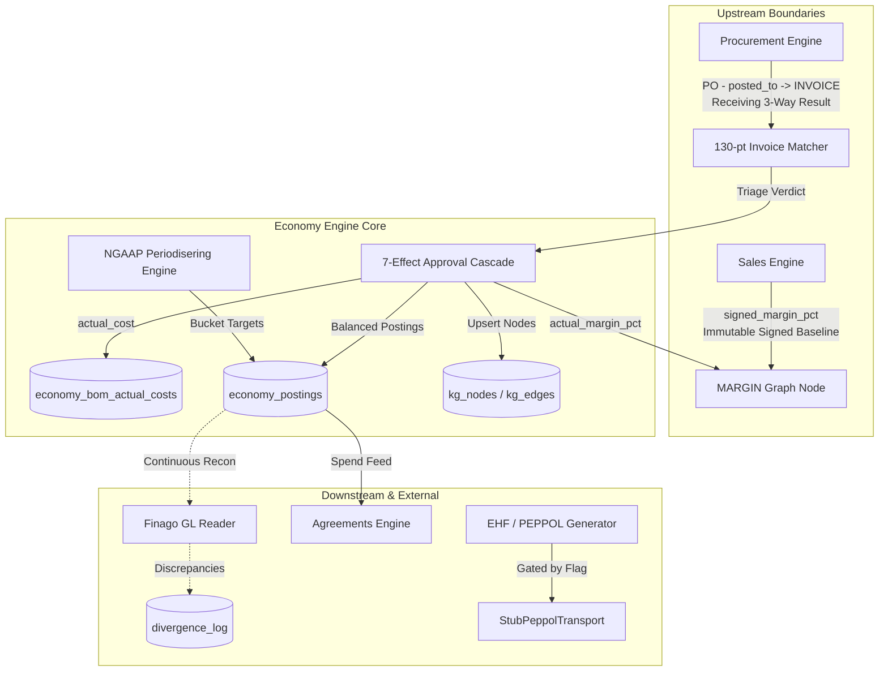

> **Status:** shipped · **Verified-against:** 7304330 (main) · **Last-audited:** 2026-08-17

# Economy Engine Admin Guide (Doc 76)

> **Status:** shipped · **Verified-against:** 7304330 (main) · **Last-audited:** 2026-08-17

This guide documents the administrative, operational, architectural, and security boundaries of the **Economy Engine** (`nce/vertical_modules/economy/`). It covers tenant enablement, the 3 SQL migrations, database Row Level Security (RLS) and Write-Once-Read-Many (WORM) ledger enforcement, statement-level balance triggers, the 3 mounted admin REST endpoints, external system integration (Finago GL and PEPPOL/EHF), cross-engine data ownership boundaries, and operational runbooks.

---

## 1. Engine Enablement & Configuration

### 1.1 Namespace Enablement & Guarding
Unlike the Product engine (`_guard.py`), the Economy engine does not enforce a dedicated middleware guard on its pure domain cores. However, the vertical module structure adheres to the following enablement conventions:
- **Namespace Metadata Opt-in:** Tenants enable the Economy vertical by setting `metadata.economy.enabled = true` on the `namespaces` record (`docs/vertical_engines/08-economy-engine.md` "Config keys").
- **REST Admin Gating:** The 3 mounted REST routes in `nce/admin_handlers/economy.py` validate that the global engine state is connected (`admin_state.engine`) and enforce valid namespace UUID syntax via `validate_agent_id(namespace_id)` (`:127,175,232`), returning `HTTP 422` on malformed tenant identifiers.

### 1.2 Configuration Keys Reference (`nce/config.py`)
The Economy vertical consumes configuration keys registered in `nce/config.py` and resolves secrets dynamically at runtime:

| Config Key | Default | Type | Description |
|---|---|:---:|---|
| `NCE_ECONOMY_ENABLED` | `false` | bool | Master toggle for the Economy engine background workers and cron tasks. |
| `NCE_ECONOMY_FINAGO_URL` | `""` | str | Finago REST API base URL for General Ledger reconciliation. |
| `NCE_ECONOMY_FINAGO_TOKEN` | `""` | secret | API authentication token / credential for the Finago GL reader. |
| `NCE_ECONOMY_PEPPOL_ENABLED` | `false` | bool | Master safety gate for outbound PEPPOL/EHF network communications (`peppol.py:47`). Off by default. |
| `NCE_ECONOMY_PEPPOL_MODE` | `"sandbox"` | str | Network selector (`"sandbox"` or `"production"`). |
| `NCE_ECONOMY_PEPPOL_API_KEY` | `""` | secret | Resolved dynamically via `resolve_secret()` at call-time; never logged (`peppol.py:67`). |
| `NCE_ECONOMY_PEPPOL_BASE_URL` | `""` | str | Resolved dynamically via `resolve_secret()` at call-time (`peppol.py:67`). |
| `NCE_ECONOMY_MATCH_RECALIBRATE_AFTER_N` | `100` | int | Event threshold triggering ledger-backed match score recalibration (`recalibration.py`). |
| `NCE_ECONOMY_BALANCE_EPSILON` | `0.01` | float | Default journal balance tolerance in NOK (1 øre) (`events.py`, `economy.py:49`). |
| `NCE_ECONOMY_SYNC_INTERVAL_MINUTES` | `60` | int | Interval for background GL reconciliation and sync jobs. |

### 1.3 Config-as-IP Files (`nce/config_data/`)
Business rules and accounting plans are defined in version-controlled JSON files in `nce/config_data/`, completely decoupled from engine logic:

1. **`economy-match-thresholds.json`:**
   - Defines the default `green` (115) and `yellow` (70) triage cutoffs for the 130-pt invoice matcher.
   - Contains `supplier_overrides` mapping organisation numbers to customized threshold dictionaries.
2. **`finago-chart-of-accounts.json`:**
   - Defines the Norwegian standard chart of accounts: Account numbers for the 7 canonical buckets across roles (`cogs`, `revenue`, `accrued`, `deferred`, `wip`).
   - Shared balance accounts: WIP (Account 1771), Accrued Revenue (Account 1531), Customer Advances / Deferred Revenue (Account 2901).
3. **`finago-account-mapping.json`:**
   - Maps accounting roles to Norwegian VAT/MVA codes (e.g. Code 3: 25% High rate for domestic revenue; Code 0: exempt/non-taxable for balance-sheet accruals).
   - Maps natural balance sides (`debit` / `credit`) for account metadata.

---

## 2. Database Architecture, Migrations & RLS

The Economy engine owns 3 database migrations (`nce/migrations/047`–`049`), establishing strict tenant isolation, WORM ledger properties, and structural database constraints:

| Migration | Table | Natural Key | Storage Invariant / Backstop | RLS & `nce_app` Privileges |
|---|---|---|---|---|
| `047_economy_bom_actual_cost.sql` | `economy_bom_actual_costs` | `(namespace_id, bom_line_label, source_approval_id)` | One row per approval run; `INSERT ... ON CONFLICT DO NOTHING`; `actual_cost` NUMERIC(18,2) | `ENABLE + FORCE RLS`<br>`GRANT SELECT, INSERT, UPDATE, DELETE` |
| `048_economy_postings.sql` | `economy_postings` | `(namespace_id, event_id, line_no)` | Statement-level AFTER INSERT trigger `trg_economy_postings_assert_balanced` enforcing $\sum \text{amount} = 0 \pm 0.01$; single signed `amount` NUMERIC(18,2); non-empty account CHECK | `ENABLE + FORCE RLS`<br>**`GRANT SELECT, INSERT` ONLY** (WORM; UPDATE/DELETE strictly revoked) |
| `049_economy_contracts.sql` | `economy_contracts` | `(namespace_id, contract_id)` | `annual_amount` NUMERIC(18,2) CHECK > 0 (single source of truth); `cpi_cap` NUMERIC(5,4) CHECK (cpi_cap >= 0 AND cpi_cap <= 0.05); `next_renewal_date` DATE NOT NULL | `ENABLE + FORCE RLS`<br>`GRANT SELECT, INSERT, UPDATE, DELETE` |

---

### 2.1 Migration 047: `economy_bom_actual_costs` (BOM Actual Cost)
- **Problem Solved:** Resolves the "5-writer race" on `BOM_LINE` nodes (roadmap §9.1). The graph node `BOM_LINE` is label-addressed and contains no numeric cost payload column. `economy_bom_actual_costs` provides the dedicated relational home for actual cost data, with the Economy approval cascade (`do_cascade_on_approval`) as the **sole writer**.
- **Round-2 Critical Concurrency Fix:** Round 1 utilized a 2-column natural key `(namespace_id, bom_line_label)` with `ON CONFLICT DO UPDATE SET actual_cost = EXCLUDED.actual_cost`. This caused subsequent split-invoice approvals or partial deliveries against the same BOM line to overwrite previous costs instead of accumulating them (e.g. approval A for 60,000 followed by approval B for 40,000 resulted in 40,000 instead of 100,000).
- **Final Architecture:** The natural key was expanded to `(namespace_id, bom_line_label, source_approval_id)`. Writes use `INSERT ... ON CONFLICT DO NOTHING`. A line's total actual cost is computed as `SUM(actual_cost)` grouped by line label. Credit notes are legitimately stored as negative `actual_cost` rows.

```sql
CREATE TABLE IF NOT EXISTS economy_bom_actual_costs (
    id                 UUID          NOT NULL DEFAULT gen_random_uuid(),
    namespace_id       UUID          NOT NULL REFERENCES namespaces(id) ON DELETE CASCADE,
    bom_line_label     TEXT          NOT NULL,
    actual_cost        NUMERIC(18,2) NOT NULL,
    source_approval_id TEXT          NOT NULL,
    created_at         TIMESTAMPTZ   NOT NULL DEFAULT now(),
    updated_at         TIMESTAMPTZ   NOT NULL DEFAULT now(),
    PRIMARY KEY (id),
    CONSTRAINT economy_bom_actual_costs_natural_key
        UNIQUE (namespace_id, bom_line_label, source_approval_id)
);
```

---

### 2.2 Migration 048: `economy_postings` (Balanced Double-Entry Ledger)
- **Role:** Backs the `POSTING` graph node (`POSTING:{event_id}`) with an append-only relational ledger.
- **Signed Amount Discipline:** Stores a single signed `amount` column (`NUMERIC(18,2)`), completely eliminating debit/credit column pairs and associated sign-inversion bugs.
- **Storage-Level Balance Backstop:** While `do_emit_financial_event` validates balance in Python, `048_economy_postings.sql` installs a statement-level PostgreSQL trigger (`trg_economy_postings_assert_balanced`) executing `economy_postings_assert_balanced()`. Using transition tables (`REFERENCING NEW TABLE AS new_postings`), it computes $\sum \text{amount}$ across the entire event in PostgreSQL and aborts the transaction if $|\sum \text{amount}| > 0.01$ NOK:

```sql
CREATE OR REPLACE FUNCTION economy_postings_assert_balanced() RETURNS TRIGGER AS $BODY$
DECLARE
    bad RECORD;
BEGIN
    FOR bad IN
        SELECT ep.namespace_id AS ns, ep.event_id AS eid, SUM(ep.amount) AS total
        FROM economy_postings ep
        JOIN (SELECT DISTINCT namespace_id, event_id FROM new_postings) np
          ON np.namespace_id = ep.namespace_id AND np.event_id = ep.event_id
        GROUP BY ep.namespace_id, ep.event_id
        HAVING ABS(SUM(ep.amount)) > 0.01
    LOOP
        RAISE EXCEPTION
            'economy_postings: event % (namespace %) does not balance to zero (sum=%, tolerance=+/-0.01)',
            bad.eid, bad.ns, bad.total;
    END LOOP;
    RETURN NULL;
END;
$BODY$ LANGUAGE plpgsql;

CREATE TRIGGER trg_economy_postings_assert_balanced
    AFTER INSERT ON economy_postings
    REFERENCING NEW TABLE AS new_postings
    FOR EACH STATEMENT
    EXECUTE FUNCTION economy_postings_assert_balanced();
```

- **WORM Ledger Security:** Grants to `nce_app` are restricted to `SELECT, INSERT` only. `UPDATE` and `DELETE` are revoked at the PostgreSQL role level. Ledger corrections must be made via compensating reversal entries.
- **Account Non-Empty Check:** Includes `CONSTRAINT ck_economy_postings_account_nonempty CHECK (TRIM(account) <> '')` preventing empty or whitespace-only account numbers.
- **Graph Provenance:** Adds the `economy_source_id TEXT` column and partial indexes to `kg_nodes` and `kg_edges` for hard-retirement tagging.

---

### 2.3 Migration 049: `economy_contracts` (Recurring Revenue Master Store)
- **Role:** Replaces the temporary Wave 9 `namespaces.metadata->'economy'->'recurring_contracts'` JSON shim with a dedicated master table backing MRR/ARR/churn tracking and ratable 1/12 recognition cron jobs (`recurring.py`).
- **Single Source of Truth for Money:** Intentionally contains **no `mrr` column** to prevent data drift. `annual_amount NUMERIC(18,2) CHECK (annual_amount > 0)` is the sole source of truth; monthly MRR is derived on read (`annual_amount / 12`).
- **No Static `finago_ref` Column:** `finagoRef = ms:{contractId}:{YYYY-MM}` is period-specific, not a static contract property.
- **Structural CPI Cap Check:** Enforces `cpi_cap NUMERIC(5,4) NOT NULL DEFAULT 0.05 CHECK (cpi_cap >= 0 AND cpi_cap <= 0.05)` at the database level. No contract row can ever exceed a 5.0% annual CPI indexation ceiling.
- **Mutable Record Grants:** Unlike the append-only `economy_postings` ledger, contracts are live mutable business records. `nce_app` is granted full `SELECT, INSERT, UPDATE, DELETE` privileges, with `do_upsert_contract` acting as the sole writer via `ON CONFLICT (namespace_id, contract_id) DO UPDATE`.

```sql
CREATE TABLE IF NOT EXISTS economy_contracts (
    id                 UUID          NOT NULL DEFAULT gen_random_uuid(),
    namespace_id       UUID          NOT NULL REFERENCES namespaces(id) ON DELETE CASCADE,
    contract_id        TEXT          NOT NULL,
    status             TEXT          NOT NULL CHECK (status IN ('active', 'churned')),
    annual_amount      NUMERIC(18,2) NOT NULL CHECK (annual_amount > 0),
    start_period       TEXT          NOT NULL,
    cpi_cap            NUMERIC(5,4)  NOT NULL DEFAULT 0.05 CHECK (cpi_cap >= 0 AND cpi_cap <= 0.05),
    next_renewal_date  DATE          NOT NULL,
    raw                JSONB         NOT NULL DEFAULT '{}'::jsonb,
    created_at         TIMESTAMPTZ   NOT NULL DEFAULT now(),
    updated_at         TIMESTAMPTZ   NOT NULL DEFAULT now(),
    PRIMARY KEY (id),
    CONSTRAINT economy_contracts_natural_key UNIQUE (namespace_id, contract_id)
);
```

---

## 3. REST Administration & Handlers (`admin_handlers/economy.py`)

The Economy vertical mounts 3 HTTP endpoints in `nce/admin_handlers/economy.py`:

```
POST /api/economy/match-invoice   -> economy_handlers.api_economy_match_invoice
POST /api/economy/periodisering   -> economy_handlers.api_economy_periodisering
POST /api/economy/emit-event      -> economy_handlers.api_economy_emit_event
```

### 3.1 Security & Serialization Guarantees
1. **No Client-Supplied Configuration:** Handlers always load configuration from disk via `load_economy_thresholds()`, `load_finago_chart_of_accounts()`, and `load_finago_account_mapping()`. A client request body cannot supply custom thresholds, account numbers, or tolerance values.
2. **Non-Finite Float Neutralisation (`_neutralise_non_finite`):** Starlette's `JSONResponse` uses `allow_nan=False` and crashes on `NaN`, `Infinity`, or `-Infinity`. The handler intercepts non-finite floats and neutralises them to strings before serialization (`:61-85`), preventing malicious or malformed floating-point payloads from masquerading as internal 500 errors.
3. **Exact Decimal Serialization (`_json_safe`):** Quantised `Decimal` objects are serialized directly to exact decimal strings (`:88-100`), ensuring transport representations never lose precision through binary float conversions.
4. **Reserved Key Shield (`_RESERVED_EVENT_KEYS`):** In `api_economy_emit_event`, client event payloads containing the top-level keys `"status"` or `"error"` are rejected with `HTTP 422` prior to core execution (`:243-248`), preventing response envelope collision.

---

## 4. External Integrations & System Boundaries



### 4.1 Finago GL Reader Policy (Permanent Divergence Model)
- **Policy Invariant:** **NCE periodises and mirrors before GL commit; Finago remains the legal General Ledger system-of-record.**
- **Locked Normal-Mode Posting:** Direct GL posting into Finago is deliberately locked by CFO policy. NCE computes operational reality (accruals, project margins, actual costs), and reconciles against Finago read-only via `do_reconcile_gl(engine, params)`.
- **Operational Reality:** Internal periodisation will diverge from Finago's legal cash/accrual book. The reconciliation loop logs discrepancies to `divergence_log` and alerts when differences exceed `NCE_DIVERGENCE_ALERT_THRESHOLD` (default 10%).

### 4.2 PEPPOL / EHF Integration & Regulatory Clock
- **Inbound Ingestion:** Parsed via `defusedxml` EHF parser in `ingestion.py`, with Claude Vision OCR acting as the fallback for scanned PDF invoices.
- **Outbound EHF Safety Interlock:** `do_generate_ehf` in `peppol.py` builds compliant UBL XML format. However, outbound network transport is guarded by `NCE_ECONOMY_PEPPOL_ENABLED=false` (default) and `StubPeppolTransport` (which raises `NotImplementedError`). Real external transmission remains disabled until an official PEPPOL Access Point provider (Tickstar/Pagero) is contracted.
- **Regulatory Deadline:** Mandatory Norwegian B2B EHF electronic invoicing takes effect **January 1, 2027**.

### 4.3 Cross-Engine Data Ownership Contracts
1. **Procurement vs. Economy Matching Boundary:**
   - **Procurement Engine:** Owns the PO × Goods Receipt × Invoice 3-way match (`do_evaluate_three_way_match`). Focuses on *receiving & goods substitution* (order vs delivery).
   - **Economy Engine:** Owns the 130-pt contextual invoice match (`do_match_invoice`). Focuses on *financial commitment & ledger posting*. Consumes Procurement's 3-way verdict as an immutable input.
2. **Margin-Trinity Dimension Ownership:**
   - **`signed`:** Frozen by Sales during e-signing (`sales_signed_baselines`). Immutable; Economy never overwrites it.
   - **`estimated`:** Owned and maintained by Project (`PROJECT_PROJECT` node).
   - **`actual`:** Owned exclusively by the Economy approval cascade (`cascade.py`), updating the `actual_margin_pct` property on `MARGIN` nodes.
3. **Agreements Engine Spend Feed:**
   - Economy owns the `do_reconcile_gl` reader and feeds GL spend data to the Agreements engine for vendor contract spend tracking.

---

## 5. Autonomy, Governance & Human-in-the-Loop Gates

| Operation | Autonomy Tier | Governance & Confirmation Gate |
|---|:---:|---|
| **Invoice Match Triage** | Advisor | Auto-computes score. `GREEN` (≥115) marks invoice as **auto-eligible** for approval, but does **not** auto-post to the ledger. |
| **Approval Cascade (`cascade.py`)** | Actor | Requires explicit **Stage-2 operator/PL confirmation**. The cascade is the sole write path for `BOM_LINE.actual_cost`. |
| **OCR Financial Ingestion** | Advisor / Gated | OCR-extracted invoice figures are confidence-flagged and **require mandatory human verification** prior to cascade execution. Never auto-eligible. |
| **Dunning Escalation** | Watcher / Gated | Default risk score `> 60` triggers mandatory **100% HW-signing** on all future sales quotes and automatic referral to **Lindorff debt collection**. |
| **Recurring Revenue Cron** | Autonomous | Runs via scheduled background cron (`cron.py`), recording idempotent `finagoRef` records in `action_idempotency` with SHA-256 `response_hash` verification. |

---

## 6. Operational Checklist & Runbooks

### 6.1 Tenant Provisioning Checklist
1. Enable Economy for the namespace: Set `metadata.economy.enabled = true` on the `namespaces` table row.
2. Verify Chart of Accounts: Confirm that `finago-chart-of-accounts.json` contains account mapping for all 7 buckets (`hardware`, `materials`, `freight`, `pm`, `tek`, `programming`, `travel`).
3. Set GL Sync Credentials: Set `NCE_ECONOMY_FINAGO_URL` and `NCE_ECONOMY_FINAGO_TOKEN` in the tenant secret store.

### 6.2 Remediation: Unbalanced Postings Alert
- **Symptom:** `UnbalancedPostingsError` raised during event processing or PostgreSQL trigger failure: `trg_economy_postings_assert_balanced: event ... does not balance to zero`.
- **Diagnosis:**
  1. Inspect the offending event payload in the dead-letter queue (DLQ) or application logs.
  2. Sum all posting amounts in the voucher using exact decimal arithmetic: $\sum \text{amount}$.
- **Resolution:**
  1. Identify the missing leg (e.g. unassigned rounding cent, missing VAT account, or incorrect WIP credit).
  2. Do **not** attempt raw SQL updates against `economy_postings` (WORM permissions will reject `UPDATE`).
  3. Re-emit a corrected, balanced event through `do_emit_financial_event` or issue a balanced reversing journal entry.

### 6.3 Recurring Revenue Month-End Close Runbook
1. Ensure all active recurring contracts are registered in `economy_contracts` via `do_upsert_contract`.
2. Trigger the recognition cron or execute `do_recognize_recurring(engine, {"namespace_id": ns, "period": "YYYY-MM", "contracts": [...]})`.
3. Verify that `mrr_snapshot` reflects expected ARR, active MRR, and churn metrics.
4. Execute `do_reconcile_gl` to cross-check periodised internal revenue against Finago GL balances.

---

## Appendix: Drift, Blockers & Known Gaps

1. **PEPPOL Provider Pending:** External outbound transmission is blocked pending selection of an official PEPPOL provider (Tickstar/Pagero). `do_generate_ehf` format output is complete, but transport remains stubbed (`peppol.py:55`).
2. **KID MOD11 Variant Pending:** `do_generate_kid` and `do_validate_kid` raise `NotImplementedError` when `variant="MOD11"` is passed. MOD10 (Luhn) is the only active variant.
3. **Finago Normal-Mode GL Lock:** By CFO policy, NCE operates as an internal mirror and does not post direct journals into Finago GL.
4. **Standalone Admin Routes Unwired:** REST endpoints for cascade (`/api/economy/cascade`), MRR (`/api/economy/mrr`), cashflow (`/api/economy/cashflow`), and reconciliation (`/api/economy/reconcile`) exist as internal `do_*` cores but are not yet mounted as dedicated routes in `admin_handlers/economy.py`.
