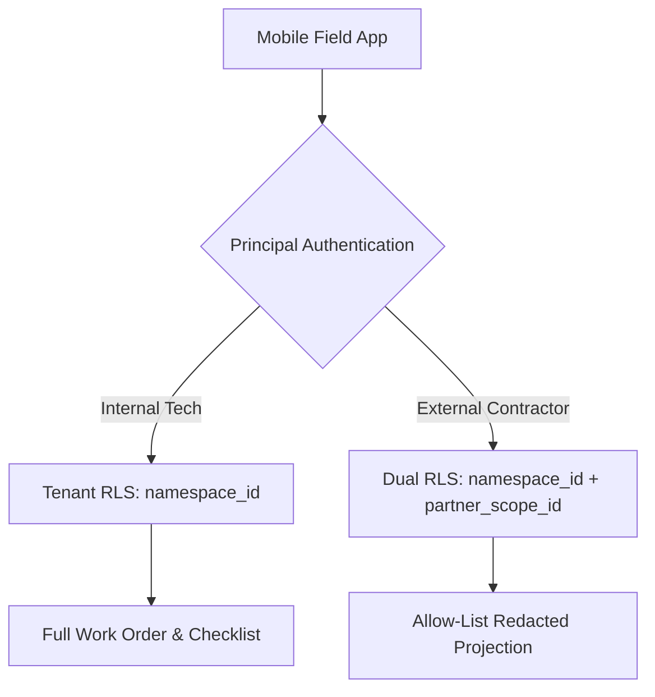

> **Status:** shipped · **Verified-against:** 7304330 (main) · **Last-audited:** 2026-08-17

# Field Tech Engine Admin Guide (Doc 91)

> **Status:** shipped · **Verified-against:** 7304330 (main) · **Last-audited:** 2026-08-17

The **Field Tech Engine** (`nce/vertical_modules/field_tech/`) is the physical delivery and onsite execution platform for the Neuro-Cognitive Engine (NCE). It turns frozen project Bills of Materials (BOMs) and support tickets into dispatched **Work Orders**, captures checklist verification records (ISO9001 compliance), registers hardware serial numbers during installation (`BOM_LINE -[installed_as]-> ASSET`), tracks GPS-verified labor hours, and provides offline-capable synchronization for mobile technicians and external contractors.

This guide provides platform engineers and system administrators with technical specifications for configuration, multi-tenant and partner-scoped Row-Level Security (RLS), offline sync reconciliation contracts, and autonomy ceilings.

---

## 1. Surface of Truth & Implementation Status

> [!IMPORTANT]
> **Production Status (Commit `7304330`):**
> * **Mounted MCP Tools:** **0 tools** mounted on `main` at `7304330`.
> * **Mounted REST Routes:** **0 routes** mounted in `nce/admin_app.py` at `7304330`.
> * **Codebase State:** Architectural specification and schema design complete (`docs/vertical_engines/12-field-tech-engine.md`). Backend implementation is scheduled for development in Tier 3 build waves.

### 1.1 Planned Tool & Route Interface (Design Specification)
When implemented in subsequent build waves, the Field Tech Engine will mount:

| Interface Type | Target Identifier | Access Level | Description |
|---|---|---|---|
| MCP Tool | `field_tech_dispatch` | Advisor | Rank candidate technicians by skill, location, load, and outcome history. |
| MCP Tool | `field_tech_partner_view` | Advisor (Partner) | Redacted, partner-safe work order projection for external contractors. |
| MCP Tool | `field_tech_create_work_order` | Actor (Admin) | Generate work order from Project BOM or Support Ticket. |
| MCP Tool | `field_tech_assign` | Actor (Admin) | Assign work order to internal technician or contractor. |
| MCP Tool | `field_tech_complete_checklist` | Actor | Record checklist item verifications (ISO9001 compliance). |
| MCP Tool | `field_tech_scan_serial` | Actor | Record hardware serial number and create asset seed edge. |
| MCP Tool | `field_tech_log_time` | Actor | Log labor hours (manual or GPS geofence span). |
| MCP Tool | `field_tech_sync` | Internal | Offline batch reconciliation endpoint. |
| REST Route | `POST /api/field-tech/sync` | Mobile Client | Idempotent offline queue replay for the mobile field app. |
| REST Route | `GET /api/field-tech/partner-view` | Mobile Client | Partner-scoped, allow-list redacted work order feed. |

---

## 2. Multi-Tenancy & Partner Access Model (Dual-RLS)

External contractors and internal technicians use the same mobile application interface, but contractors must be strictly restricted to their own assigned jobs and relevant BOM lines, with **zero visibility** into project margins, equipment costs, or pipeline strategy.

Field Tech implements the three-layer Partner Access Model:



### 2.1 Database Schema & Dual RLS Policies
The engine operates three dedicated relational tables. All tables enforce `FORCE ROW LEVEL SECURITY` with dual isolation policies:

```sql
CREATE TABLE IF NOT EXISTS work_orders (
    work_order_id     UUID        NOT NULL DEFAULT gen_random_uuid(),
    namespace_id     UUID        NOT NULL REFERENCES namespaces(id) ON DELETE CASCADE,
    partner_scope_id UUID,
    kind             TEXT        NOT NULL CHECK (kind IN ('install', 'service')),
    source_kind      TEXT        CHECK (source_kind IN ('project', 'ticket')),
    source_ref       TEXT,
    location_id      UUID,
    assignee_id      UUID,
    assignee_kind    TEXT        CHECK (assignee_kind IN ('employee', 'contractor')),
    status           TEXT        NOT NULL DEFAULT 'open'
                                 CHECK (status IN ('open', 'dispatched', 'in_progress', 'completed', 'cancelled')),
    due_at           TIMESTAMPTZ,
    raw              JSONB,
    updated_at       TIMESTAMPTZ NOT NULL DEFAULT now(),
    PRIMARY KEY (work_order_id, namespace_id)
);

CREATE TABLE IF NOT EXISTS checklists (
    checklist_id     UUID        NOT NULL DEFAULT gen_random_uuid(),
    work_order_id    UUID        NOT NULL,
    namespace_id     UUID        NOT NULL REFERENCES namespaces(id) ON DELETE CASCADE,
    partner_scope_id UUID,
    template_id      TEXT        NOT NULL,
    items            JSONB       NOT NULL DEFAULT '[]',
    completed_at     TIMESTAMPTZ,
    raw              JSONB,
    PRIMARY KEY (checklist_id, namespace_id)
);

CREATE TABLE IF NOT EXISTS time_entries (
    time_entry_id    UUID        NOT NULL DEFAULT gen_random_uuid(),
    work_order_id    UUID        NOT NULL,
    namespace_id     UUID        NOT NULL REFERENCES namespaces(id) ON DELETE CASCADE,
    partner_scope_id UUID,
    started_at       TIMESTAMPTZ NOT NULL,
    ended_at         TIMESTAMPTZ,
    source           TEXT        CHECK (source IN ('gps', 'manual')),
    approved         BOOLEAN     NOT NULL DEFAULT false,
    op_id            TEXT        NOT NULL,
    raw              JSONB,
    PRIMARY KEY (time_entry_id, namespace_id),
    UNIQUE (namespace_id, op_id)
);

-- RLS Enforcement
ALTER TABLE work_orders ENABLE ROW LEVEL SECURITY;
ALTER TABLE work_orders FORCE ROW LEVEL SECURITY;

ALTER TABLE checklists ENABLE ROW LEVEL SECURITY;
ALTER TABLE checklists FORCE ROW LEVEL SECURITY;

ALTER TABLE time_entries ENABLE ROW LEVEL SECURITY;
ALTER TABLE time_entries FORCE ROW LEVEL SECURITY;

-- Tenant Isolation (Internal Staff)
CREATE POLICY tenant_isolation_policy ON work_orders
    FOR ALL TO nce_app
    USING (namespace_id IS NOT NULL AND namespace_id = get_nce_namespace())
    WITH CHECK (namespace_id IS NOT NULL AND namespace_id = get_nce_namespace());

-- Partner Isolation (External Contractors)
CREATE POLICY partner_isolation_policy ON work_orders
    FOR ALL TO nce_app
    USING (
        namespace_id = get_nce_namespace() AND 
        (partner_scope_id IS NULL OR partner_scope_id = get_nce_partner_scope())
    );
```

---

## 3. Offline Synchronization & Conflict Protocol

Technicians frequently operate in RF-shielded server rooms, basements, and remote commercial facilities without cellular connectivity.

### 3.1 Idempotency & Operation Envelope
The mobile app stores mutations locally in SQLite and batches them upon network restoration. Every offline mutation is wrapped in an idempotent operation envelope:
```json
{
  "op_id": "client-uuid-12345",
  "work_order_id": "wo-9912",
  "op_type": "complete_checklist_item",
  "device_clock": 1723891200,
  "payload": {
    "item_id": "check-04",
    "verified": true,
    "notes": "Firmware updated to v4.2.1"
  }
}
```

### 3.2 Safety & Conflict Rules
1. **No Silent Last-Writer-Wins (LWW) on Attestations:** Device clocks cannot be trusted to resolve ordering. For safety and ISO9001 verification fields, concurrent modifications from multiple devices surface as structured conflicts requiring manual confirmation.
2. **Contract B Replay Governance:** Autonomous acts queued offline (e.g. GPS auto-timesheet entries) must re-evaluate autonomy ceilings and idempotency keys upon sync replay.

---

## 4. Planned Configuration Keys (`nce/config.py`)

| Configuration Key | Type | Default | Description |
|---|:---:|:---:|---|
| `NCE_FIELD_TECH_ENABLED` | `bool` | `False` | Master switch to mount Field Tech handlers and sync endpoints. |
| `NCE_FIELD_TECH_AUTONOMY_WO_CEILING` | `float` | `0.0` | Maximum monetary value of jobs that may be auto-assigned without manual dispatcher review. |
| `NCE_FIELD_TECH_SLA_RISK_WARN_HOURS` | `int` | `4` | Lead time in hours to trigger Watcher alerts before work order SLA expiration. |
| `NCE_FIELD_TECH_GPS_GEOFENCE_METERS` | `int` | `150` | Radial distance in meters for automated site arrival/departure timesheet triggers. |
| `NCE_FIELD_TECH_SYNC_MAX_OPS` | `int` | `500` | Maximum operation count accepted in a single offline sync payload. |
| `NCE_FIELD_TECH_PHOTO_MAX_BYTES` | `int` | `10485760` | Maximum size in bytes for attached installation documentation photos (10 MB). |
| `NCE_FIELD_TECH_REQUIRE_CHECKLIST_TO_CLOSE` | `bool` | `True` | Enforce complete mandatory checklist item verification before work order closure. |

---

> **Verified-against: 7304330**
