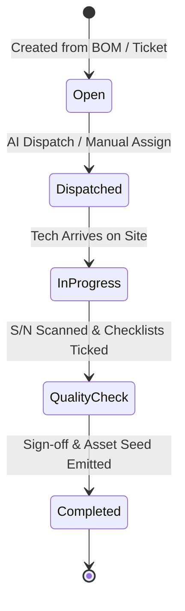
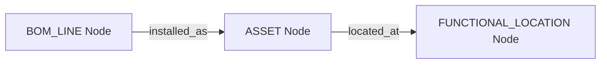

> **Status:** shipped · **Verified-against:** 7304330 (main) · **Last-audited:** 2026-08-17

# Field Tech Engine User Guide (Doc 89)

> **Status:** shipped · **Verified-against:** 7304330 (main) · **Last-audited:** 2026-08-17

The **Field Tech Engine** (`nce/vertical_modules/field_tech/`) coordinates onsite technical work across audiovisual installations, commissioning, and service repairs. It bridges digital engineering designs (BOMs from Project Engine) and customer tickets (from Support Engine) to physical hardware executed by field technicians and external subcontractors.

---

## 1. Surface of Truth & Implementation Status

> [!IMPORTANT]
> **Production Status (Commit `7304330`):**
> * **Mounted MCP Tools:** **0 tools** mounted on `main` at `7304330`.
> * **Mounted REST Routes:** **0 routes** mounted in `nce/admin_app.py` at `7304330`.
> * **State:** Full architectural specification and operational data models defined in `docs/vertical_engines/12-field-tech-engine.md`. Live network endpoints are planned for delivery in Tier 3 build waves.

### Planned Tool & Route Interface
When deployed, the engine will expose:
* `field_tech_dispatch`: Match technicians and contractors to work orders based on skill, location, and past performance.
* `field_tech_partner_view`: Provide an allow-list redacted work order view for external subcontractors.
* `field_tech_create_work_order`: Instantiate work orders from frozen project BOMs or service tickets.
* `field_tech_complete_checklist`: Record step-by-step quality inspections (ISO9001 compliance).
* `field_tech_scan_serial`: Register hardware serial numbers to create asset records.
* `field_tech_log_time`: Record labor hours with automated GPS geofence verification.
* `POST /api/field-tech/sync`: Replay offline mobile batches idempotently.

---

## 2. Core Work Order Lifecycle

A Work Order represents a scheduled unit of physical labor at a client site.

### 2.1 Creation & Sourcing
* **Install Work Orders:** Generated when a Project advances through phase gate G4 (Frozen Baseline Locked). The engine reads project BOM lines and creates installation tasks grouped by room.
* **Service Work Orders:** Generated by Support when remote troubleshooting confirms onsite hardware failure or physical cabling faults.

### 2.2 AI Dispatch & Tech Matching
The dispatch advisor matches available technicians and contractors by scoring:
$$\text{Score} = w_{\text{skill}} \cdot \text{CertMatch} + w_{\text{loc}} \cdot \text{Distance} + w_{\text{load}} \cdot \text{Availability} + w_{\text{hist}} \cdot \text{PastQuality}$$
* Internal technicians are resolved via Academy certifications (HR Engine).
* External contractors are resolved via the Contractor Registry (Vendors Engine).

---

## 3. Onsite Execution & Quality Assurance

### 3.1 Checklist Verification (ISO9001 Compliance)
Every work order is bound to a template-driven checklist (e.g. *Video Wall Calibration*, *Dante Clock Sync*, *Hearing Loop Certification*).
* Technicians verify each required item before closing the job.
* Attestation entries are stored immutably with timestamp and technician ID, forming the compliance record for quality audits.

### 3.2 Serial Number Scan — The Asset Seed
During installation, technicians scan device barcodes/QR codes using the mobile app:

1. Scanning a serial number writes the `BOM_LINE -[installed_as]-> ASSET` edge in the cognitive knowledge graph.
2. This event triggers an A2A message to the **Assets Engine**, which initiates warranty tracking, firmware lifecycle monitoring, and SLA entitlement.

### 3.3 Automated GPS Time Tracking
* When a technician enters the client site's geofence radius (`NCE_FIELD_TECH_GPS_GEOFENCE_METERS`), the mobile app creates a draft timesheet entry.
* Upon departure, the technician reviews and confirms the recorded duration before submitting hours to the Economy Engine for project cost tracking.

---

## 4. Mobile Offline Synchronization

Technicians often work in environments without network coverage (e.g., subterranean rack rooms, Faraday-shielded auditoriums).

1. **Local SQLite Storage:** Mutations (checklist ticks, serial number scans, notes, photos) are stored locally in an append-only transaction log.
2. **Operation Envelopes:** Each mutation is assigned a client-generated UUID (`op_id`).
3. **Idempotent Replay:** When connectivity resumes, the mobile client sends the queued operations to `POST /api/field-tech/sync`. The server processes each `op_id` idempotently, preventing duplicate time entries or double-scanned serial numbers.

---

## 5. Partner Access Model (External Contractors)

NCE supports an elastic workforce of 5–15 external freelance technicians.

* **What Subcontractors See:** Their own assigned work orders, client location details, room access instructions, assigned BOM line names, and required checklists.
* **What Subcontractors NEVER See:** Project profit margins, internal labor hourly cost rates, equipment purchase prices, customer commercial agreements, or company-wide pipeline metrics.
* **Enforcement:** Enforced at the PostgreSQL level via `partner_isolation_policy` on `work_orders`, `checklists`, and `time_entries` tables, combined with field-level redaction rules.

---

> **Verified-against: 7304330**
