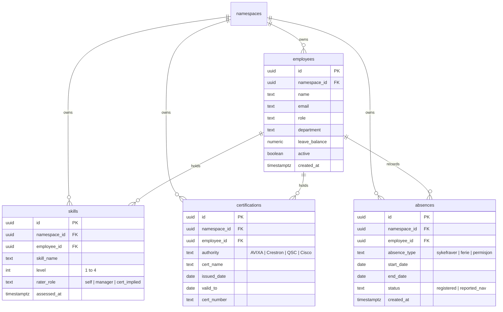
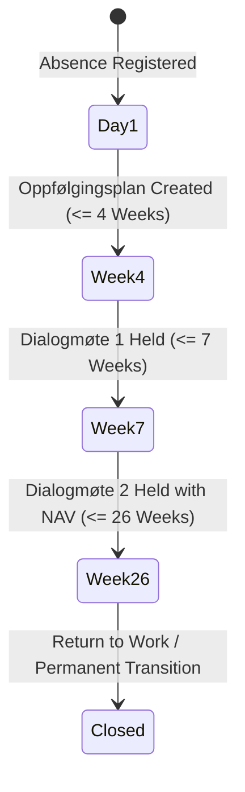

> **Status:** shipped · **Verified-against:** 7304330 (main) · **Last-audited:** 2026-08-17

# HR & Academy Engine Admin Guide (Doc 93)

> **Status:** shipped · **Verified-against:** 7304330 (main) · **Last-audited:** 2026-08-17

The **HR & Academy Engine** (`nce/vertical_modules/hr/`) turns workforce competency, certifications, and availability into a queryable operational layer of the cognitive graph. Rather than functioning as a passive administrative tool, the HR Engine serves as **assignment infrastructure** for project lead selection (Project Engine) and technician dispatch (Field Tech Engine).

This guide provides platform engineers, compliance officers, and system administrators with technical specifications for configuration, Row-Level Security (RLS), GDPR privacy controls, Norwegian statutory employment compliance state machines, and legal red lines under the EU AI Act.

---

## 1. Surface of Truth & Implementation Status

> [!IMPORTANT]
> **Production Status (Commit `7304330`):**
> * **Mounted MCP Tools:** **0 tools** mounted on `main` at `7304330`.
> * **Mounted REST Routes:** **0 routes** mounted in `nce/admin_app.py` at `7304330`.
> * **State:** Full specification and compliance schemas defined in `docs/vertical_engines/13-hr-engine.md`. Live network endpoints are planned for delivery in Tier 4 build waves.

### 1.1 Planned Tool & Route Interface (Design Specification)
When implemented in subsequent build waves, the HR Engine will mount:

| Interface Type | Target Identifier | Access Scope | Description |
|---|---|---|---|
| MCP Tool | `hr_get_employee` | Watcher (Access-Scoped) | Retrieve employee profile card, certified skill levels, and capacity. |
| MCP Tool | `hr_match_skills` | Advisor | Match workforce competency against project/install requirements (returns fit, **NEVER ranking**). |
| MCP Tool | `hr_capacity` | Advisor | Query team and individual availability from assigned projects, work orders, and absences. |
| MCP Tool | `hr_cert_status` | Watcher | Monitor certification lifecycle and expiration horizons (CTS, Crestron, QSC, Cisco). |
| MCP Tool | `hr_register_absence` | Actor (with Confirmation) | Register vacation, illness, or leave via Norwegian NLP parser. |
| MCP Tool | `hr_coach` | Advisor (Private) | Private development advisor for individual training paths (**strictly non-comparative**). |
| REST Route | `GET /api/hr/employees` | Role-Gated REST | List employees, filtered and scoped by caller authorization level. |
| REST Route | `POST /api/hr/match-skills` | Role-Gated REST | Assignment fit calculation for Project Manager and Dispatch screens. |
| REST Route | `GET /api/hr/cert-status` | Role-Gated REST | Certification expiration tracking board. |

---

## 2. Privacy Architecture & EU AI Act Legal Red Lines

The HR Engine operates under the strictest privacy and governance boundaries in the NCE platform:

### 2.1 EU AI Act Article 5 Compliance (Prohibition of Workplace Emotion AI)
Under Article 5 of the EU AI Act (in force February 2, 2025), artificial intelligence systems that infer emotions or psychological states of persons in the workplace are strictly prohibited under penalty of fines up to €35M / 7% global turnover.

* **Objective Signals ONLY:** The HR Engine does **not** perform sentiment analysis on 1-on-1 notes or infer emotional states.
* **Sustained Overload Flags:** Workload alerts are computed solely from objective, verifiable parameters:
  $$\text{Overload Flag} = \text{Assigned Work Orders} + \text{Scheduled Project Hours} - \text{Approved Leave}$$
* Alerts are surfaced **privately** to the individual employee and their direct manager as a scheduling/capacity metric, never as an emotional assessment.

### 2.2 Permanent Ban on Employee Leaderboards & Stored Rankings
* **`NCE_HR_RANKING_DISABLED=true` (Hard-Pinned):** The engine refuses by design to rank employees against each other, publish leaderboards, or score individual worth.
* Match queries return **fit-to-requirement** for a specific project task, never a standing list of "top performers."

---

## 3. Database Schema & Row-Level Security (RLS)

All workforce data tables enforce PostgreSQL Row-Level Security (`ENABLE` and `FORCE ROW LEVEL SECURITY`) and are bound to the tenant namespace.



### 3.1 DDL & Isolation Policies
```sql
CREATE TABLE IF NOT EXISTS employees (
    id             UUID        NOT NULL DEFAULT gen_random_uuid(),
    namespace_id   UUID        NOT NULL REFERENCES namespaces(id) ON DELETE CASCADE,
    name           TEXT        NOT NULL,
    email          TEXT        NOT NULL,
    role           TEXT        NOT NULL,
    department     TEXT        NOT NULL,
    leave_balance  NUMERIC     NOT NULL DEFAULT 25.0,
    active         BOOLEAN     NOT NULL DEFAULT true,
    created_at     TIMESTAMPTZ NOT NULL DEFAULT now(),
    PRIMARY KEY (id, namespace_id),
    UNIQUE (namespace_id, email)
);

CREATE TABLE IF NOT EXISTS skills (
    id             UUID        NOT NULL DEFAULT gen_random_uuid(),
    namespace_id   UUID        NOT NULL REFERENCES namespaces(id) ON DELETE CASCADE,
    employee_id    UUID        NOT NULL,
    skill_name     TEXT        NOT NULL,
    level          INT         NOT NULL CHECK (level BETWEEN 1 AND 4),
    rater_role     TEXT        NOT NULL CHECK (rater_role IN ('self', 'manager', 'cert_implied')),
    assessed_at    TIMESTAMPTZ NOT NULL DEFAULT now(),
    PRIMARY KEY (id, namespace_id)
);

CREATE TABLE IF NOT EXISTS certifications (
    id             UUID        NOT NULL DEFAULT gen_random_uuid(),
    namespace_id   UUID        NOT NULL REFERENCES namespaces(id) ON DELETE CASCADE,
    employee_id    UUID        NOT NULL,
    authority      TEXT        NOT NULL,
    cert_name      TEXT        NOT NULL,
    issued_date    DATE        NOT NULL,
    valid_to       DATE        NOT NULL,
    cert_number    TEXT,
    PRIMARY KEY (id, namespace_id)
);

CREATE TABLE IF NOT EXISTS absences (
    id             UUID        NOT NULL DEFAULT gen_random_uuid(),
    namespace_id   UUID        NOT NULL REFERENCES namespaces(id) ON DELETE CASCADE,
    employee_id    UUID        NOT NULL,
    absence_type   TEXT        NOT NULL CHECK (absence_type IN ('sykefraver', 'ferie', 'permisjon', 'egenmelding')),
    start_date     DATE        NOT NULL,
    end_date       DATE        NOT NULL,
    status         TEXT        NOT NULL DEFAULT 'registered',
    created_at     TIMESTAMPTZ NOT NULL DEFAULT now(),
    PRIMARY KEY (id, namespace_id)
);

-- Force RLS
ALTER TABLE employees ENABLE ROW LEVEL SECURITY;
ALTER TABLE employees FORCE ROW LEVEL SECURITY;

ALTER TABLE skills ENABLE ROW LEVEL SECURITY;
ALTER TABLE skills FORCE ROW LEVEL SECURITY;

ALTER TABLE certifications ENABLE ROW LEVEL SECURITY;
ALTER TABLE certifications FORCE ROW LEVEL SECURITY;

ALTER TABLE absences ENABLE ROW LEVEL SECURITY;
ALTER TABLE absences FORCE ROW LEVEL SECURITY;

-- Tenant Isolation Policies
CREATE POLICY tenant_isolation_policy ON employees
    FOR ALL TO nce_app
    USING (namespace_id IS NOT NULL AND namespace_id = get_nce_namespace())
    WITH CHECK (namespace_id IS NOT NULL AND namespace_id = get_nce_namespace());

CREATE POLICY tenant_isolation_policy ON skills
    FOR ALL TO nce_app
    USING (namespace_id IS NOT NULL AND namespace_id = get_nce_namespace())
    WITH CHECK (namespace_id IS NOT NULL AND namespace_id = get_nce_namespace());

CREATE POLICY tenant_isolation_policy ON certifications
    FOR ALL TO nce_app
    USING (namespace_id IS NOT NULL AND namespace_id = get_nce_namespace())
    WITH CHECK (namespace_id IS NOT NULL AND namespace_id = get_nce_namespace());

CREATE POLICY tenant_isolation_policy ON absences
    FOR ALL TO nce_app
    USING (namespace_id IS NOT NULL AND namespace_id = get_nce_namespace())
    WITH CHECK (namespace_id IS NOT NULL AND namespace_id = get_nce_namespace());
```

---

## 4. Norwegian Statutory Compliance (Sykefravær State Machine)

To replace expensive external HR SaaS platforms (Huma / Simployer), statutory Norwegian employment rules are encoded natively in the engine:



* **Week 4 Milestone:** Trigger automated reminder for mandatory `Oppfølgingsplan` between employee and manager (Arbeidsmiljøloven § 4-6).
* **Week 7 Milestone:** Schedule `Dialogmøte 1` (Folketrygdloven § 8-7).
* **Week 26 Milestone:** Coordinate `Dialogmøte 2` with NAV involvement.
* **Verneombud & AMU Cadence:** Track health, safety, and working environment committee meeting schedules and statutory reporting requirements.

---

## 5. Planned Configuration Keys (`nce/config.py`)

| Configuration Key | Type | Default | Description |
|---|:---:|:---:|---|
| `NCE_HR_ENABLED` | `bool` | `False` | Master switch to mount HR tools and REST endpoints. |
| `NCE_HR_RANKING_DISABLED` | `bool` | `True` | **Hard-pinned security barrier.** Prevents generation of employee comparison rankings. |
| `NCE_HR_CERT_EXPIRY_WARN_DAYS` | `int` | `90` | Lookahead window in days for expiring CTS/Crestron certifications. |
| `NCE_HR_CAPACITY_HORIZON_DAYS` | `int` | `30` | Planning horizon in days for team capacity and utilization projections. |
| `NCE_HR_SICK_LEAVE_PATTERN_THRESHOLD` | `int` | `4` | Statutory threshold of recurring short-term absence events triggering follow-up. |
| `NCE_HR_COACH_ENABLED` | `bool` | `True` | Toggle for the private, non-comparative AI development coach. |
| `NCE_HR_SYNC_INTERVAL_MINUTES` | `int` | `1440` | Daily sync interval for statutory NAV reporting events. |

---

> **Verified-against: 7304330**
