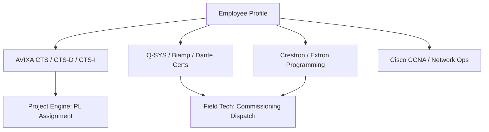

> **Status:** shipped · **Verified-against:** 7304330 (main) · **Last-audited:** 2026-08-17

# HR & Academy Engine User Guide (Doc 92)

> **Status:** shipped · **Verified-against:** 7304330 (main) · **Last-audited:** 2026-08-17

The **HR & Academy Engine** (`nce/vertical_modules/hr/`) manages workforce competencies, certifications, leave, and professional development across the organization. It integrates employee skill profiles directly into the operational platform, enabling Project Managers to find certified Project Leads and Dispatchers to assign technicians with verified hardware proficiencies.

---

## 1. Surface of Truth & Implementation Status

> [!IMPORTANT]
> **Production Status (Commit `7304330`):**
> * **Mounted MCP Tools:** **0 tools** mounted on `main` at `7304330`.
> * **Mounted REST Routes:** **0 routes** mounted in `nce/admin_app.py` at `7304330`.
> * **State:** Architectural specification and statutory rules defined in `docs/vertical_engines/13-hr-engine.md`. Live network endpoints are planned for delivery in Tier 4 build waves.

### Planned Tool & Route Interface
When deployed, the engine will expose:
* `hr_get_employee`: Access-controlled employee profile (skills, certifications, leave balance).
* `hr_match_skills`: Task requirement fit calculator for Project and Field Tech assignments (**strictly non-ranking**).
* `hr_capacity`: Workload and availability analyzer across project timelines.
* `hr_cert_status`: Expiration monitor for industry credentials.
* `hr_register_absence`: Natural language leave and absence intake assistant.
* `hr_coach`: Private development advisor for individual training paths.

---

## 2. Academy Skills Matrix & Certifications

The Academy is the single source of truth for technical capabilities across audiovisual engineering, software programming, network infrastructure, and project management.



### 2.1 Multi-Rater Competency Model
Skill proficiencies are rated on a 4-level competency scale:
1. **Level 1 (Fundamental):** Understands concepts and assists senior staff.
2. **Level 2 (Autonomous):** Executes standard installations and configurations independently.
3. **Level 3 (Advanced):** Troubleshoots complex system integration faults and leads room commissioning.
4. **Level 4 (Master/Instructor):** System architect; designs custom programming architectures and trains colleagues.

Proficiencies are recorded with an assessment source: `self`, `manager`, or `cert_implied` (e.g., passing Crestron Master programmer automatically implies Level 3/4 control proficiency).

### 2.2 Certification Watcher & Expiration Alerts
The engine tracks credential validity dates (e.g., CTS 3-year renewal cycle). Ninety days prior to expiration, the engine alerts the technician and their manager to schedule renewal coursework.

---

## 3. Skill-Based Task Matching (NEVER Ranking)

When Project Managers or Dispatchers need staff for an installation or service call, they query the engine with task requirements:

```json
{
  "required_skills": ["Dante Audio Networking", "Q-SYS Designer"],
  "required_certs": ["AVIXA CTS"],
  "start_date": "2026-09-01",
  "end_date": "2026-09-05"
}
```

### The "No-Ranking" Cultural and Legal Guarantee
* **Fit-to-Task ONLY:** The engine calculates whether a candidate meets the prerequisites of the job and is available in the requested time window.
* **No Standing Scores:** The system **never** creates employee leaderboards, comparative performance indices, or "top performer" lists.
* **EU AI Act Article 5 Compliance:** The platform strictly forbids emotion detection, stress surveillance, or comparative automated worker scoring.

---

## 4. Smart Leave Assistant & Norwegian Statutory Compliance

### 4.1 Natural Language Absence Registration
Employees register sick leave, parental leave, or vacation through the Smart Leave Assistant:
> *"Jeg er syk med influensa i dag og i morgen (egenmelding)."*

The engine parses the Norwegian text, determines the leave category, updates the capacity graph, and tracks egenmelding day limits.

### 4.2 Statutory Sykefravær Follow-Up Timeline
The engine automates mandatory Norwegian follow-up milestones under Arbeidsmiljøloven § 4-6 and Folketrygdloven § 8-7:
1. **Week 4 (Oppfølgingsplan):** Automated prompt for manager and employee to establish a return-to-work plan.
2. **Week 7 (Dialogmøte 1):** Scheduling of the first mandatory dialogue meeting.
3. **Week 26 (Dialogmøte 2):** Coordination of NAV-assisted dialogue meeting for long-term absence.

---

## 5. Private AI Development Coach

The private AI coach acts as an individual mentor for each employee:
* **Private to the Employee:** Coaching recommendations and skill-gap observations are strictly visible only to the individual employee and their manager.
* **Training Recommendations:** Connects project requirements and upcoming company technology rollouts to recommended Academy courses.
* **Workload Balance:** Analyzes objective scheduled hours and deadlines to help employees protect their focus and prevent scheduling overload.

---

> **Verified-against: 7304330**
