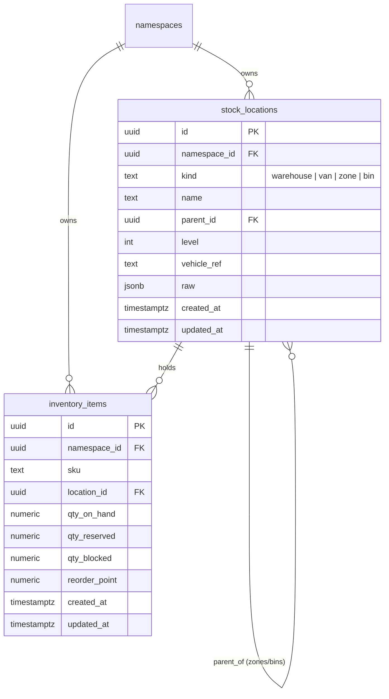

> **Status:** shipped · **Verified-against:** 7304330 (main) · **Last-audited:** 2026-08-17

# Inventory Engine Admin Guide

> **Status:** shipped · **Verified-against:** 7304330 (main) · **Last-audited:** 2026-08-17

This guide provides system administrators and platform engineers with operational, schema, and security documentation for the **Inventory Engine** (`nce/vertical_modules/inventory/`). It covers the physical database schema, Row-Level Security (RLS) policies, hierarchy constraints, seeding procedures, concurrency guarantees, and the roadmap of planned administrative configurations as the engine progresses through its 12 build waves.

> [!IMPORTANT]
> **Production Status (Wave 1 of 12 Shipped):**
> *   **Shipped in Database:** Migration `050_inventory_core.sql` defines the `stock_locations` and `inventory_items` tables with `FORCE ROW LEVEL SECURITY` and tenant isolation policies.
> *   **Shipped in Python Core:** `schema_seed.py` provides the idempotent warehouse + van seeding logic; `stock.py` provides atomic row-locked decrements and deadlock-free transfers.
> *   **Exposed HTTP / MCP Surface:** Currently **0 MCP tools** and **0 REST routes** are exposed. No administrative endpoints are mounted under `/api/admin/inventory/*` in `nce/admin_app.py` at commit `7304330`.

---

## 1. Engine Enablement & Multi-Tenancy

### 1.1 Tenant Namespace Opt-In
The Inventory Engine follows the NCE tenant-isolation model. Tenant namespaces opt into inventory management via the `metadata` JSONB column in the `namespaces` table:

```json
{
  "inventory": {
    "enabled": true
  }
}
```

When unconfigured or set to `false`, downstream integrations degrade gracefully, and inventory operations for that tenant fail closed.

### 1.2 Multi-Tenant RLS Guarantee
All inventory tables enforce PostgreSQL Row-Level Security (`ENABLE` and `FORCE ROW LEVEL SECURITY`). Every query executed by the application role `nce_app` is isolated via:
```sql
CREATE POLICY tenant_isolation_policy ON stock_locations
    FOR ALL TO nce_app
    USING  (namespace_id IS NOT NULL AND namespace_id = get_nce_namespace())
    WITH CHECK (namespace_id IS NOT NULL AND namespace_id = get_nce_namespace());
```
Tenants cannot observe or mutate stock locations or inventory records belonging to any other namespace.

---

## 2. Database Schema & RLS Policies (Migration `050_inventory_core.sql`)



### 2.1 Table Definitions

#### `stock_locations`
Represents the company-internal logistics location hierarchy.
```sql
CREATE TABLE IF NOT EXISTS stock_locations (
    id            UUID        NOT NULL DEFAULT gen_random_uuid(),
    namespace_id  UUID        NOT NULL REFERENCES namespaces(id) ON DELETE CASCADE,
    kind          TEXT        NOT NULL
                              CHECK (kind IN ('warehouse', 'van', 'zone', 'bin')),
    name          TEXT        NOT NULL,
    parent_id     UUID,
    level         INT         NOT NULL DEFAULT 0 CHECK (level >= 0),
    vehicle_ref   TEXT,
    raw           JSONB       NOT NULL DEFAULT '{}'::jsonb,
    created_at    TIMESTAMPTZ NOT NULL DEFAULT now(),
    updated_at    TIMESTAMPTZ NOT NULL DEFAULT now(),
    PRIMARY KEY (id),
    CONSTRAINT stock_locations_id_ns_uq UNIQUE (id, namespace_id),
    CONSTRAINT stock_locations_parent_fk
        FOREIGN KEY (parent_id, namespace_id)
        REFERENCES stock_locations (id, namespace_id)
        ON DELETE CASCADE,
    CONSTRAINT stock_locations_hierarchy_shape CHECK (
        (kind IN ('warehouse', 'van') AND parent_id IS NULL AND level = 0)
        OR
        (kind IN ('zone', 'bin') AND parent_id IS NOT NULL AND level > 0)
    )
);

CREATE UNIQUE INDEX IF NOT EXISTS uq_stock_locations_top_level_name
    ON stock_locations (namespace_id, kind, name)
    WHERE parent_id IS NULL;

CREATE INDEX IF NOT EXISTS idx_stock_locations_namespace_kind
    ON stock_locations (namespace_id, kind);

CREATE INDEX IF NOT EXISTS idx_stock_locations_parent
    ON stock_locations (namespace_id, parent_id);
```

#### `inventory_items`
Represents the authoritative per-SKU, per-location stock record.
```sql
CREATE TABLE IF NOT EXISTS inventory_items (
    id            UUID          NOT NULL DEFAULT gen_random_uuid(),
    namespace_id  UUID          NOT NULL REFERENCES namespaces(id) ON DELETE CASCADE,
    sku           TEXT          NOT NULL,
    location_id   UUID          NOT NULL,
    qty_on_hand   NUMERIC(18,3) NOT NULL DEFAULT 0 CHECK (qty_on_hand >= 0),
    qty_reserved  NUMERIC(18,3) NOT NULL DEFAULT 0 CHECK (qty_reserved >= 0),
    qty_blocked   NUMERIC(18,3) NOT NULL DEFAULT 0 CHECK (qty_blocked >= 0),
    reorder_point NUMERIC(18,3) NOT NULL DEFAULT 0 CHECK (reorder_point >= 0),
    created_at    TIMESTAMPTZ   NOT NULL DEFAULT now(),
    updated_at    TIMESTAMPTZ   NOT NULL DEFAULT now(),
    PRIMARY KEY (id),
    CONSTRAINT inventory_items_location_fk
        FOREIGN KEY (location_id, namespace_id)
        REFERENCES stock_locations (id, namespace_id)
        ON DELETE CASCADE,
    CONSTRAINT inventory_items_natural_key
        UNIQUE (namespace_id, sku, location_id)
);

CREATE INDEX IF NOT EXISTS idx_inventory_items_namespace_sku
    ON inventory_items (namespace_id, sku);
```

### 2.2 Structural Constraints & Database Guarantees
1.  **Hierarchy Shape Enforcement (`stock_locations_hierarchy_shape`):**
    *   Warehouses and vans must be flat top-level nodes (`parent_id IS NULL AND level = 0`). A van can never be assigned a parent warehouse.
    *   Zones and bins must be nested child nodes (`parent_id IS NOT NULL AND level > 0`). A zone or bin cannot float without a parent.
2.  **Cross-Tenant Isolation on Foreign Keys:**
    *   `stock_locations_parent_fk` is composite on `(parent_id, namespace_id)`. A hierarchy edge can never reference a location in another tenant.
    *   `inventory_items_location_fk` is composite on `(location_id, namespace_id)`. A stock item row can never point to another tenant's warehouse or van.
3.  **Idempotent Top-Level Index (`uq_stock_locations_top_level_name`):**
    *   Guarantees that duplicate top-level locations with the same `(namespace_id, kind, name)` are refused by the database itself, backing `schema_seed.py`'s idempotency.
4.  **Quantity Safety:**
    *   `CHECK (qty_on_hand >= 0)` guarantees at the database level that physical stock cannot be driven negative.
5.  **Decimal Precision (`NUMERIC(18,3)`):**
    *   All quantities use exact 3-decimal-place numbers in Postgres and Python `Decimal` instances internally, preventing binary float rounding anomalies for fractional items (e.g., cabling or liquids).

### 2.3 Role Grants & Access Control
The application user `nce_app` receives full CRUD privileges on these mutable live inventory records:
```sql
DO $$
BEGIN
    IF EXISTS (SELECT 1 FROM pg_roles WHERE rolname = 'nce_app') THEN
        REVOKE ALL ON TABLE stock_locations FROM nce_app;
        GRANT SELECT, INSERT, UPDATE, DELETE ON TABLE stock_locations TO nce_app;

        REVOKE ALL ON TABLE inventory_items FROM nce_app;
        GRANT SELECT, INSERT, UPDATE, DELETE ON TABLE inventory_items TO nce_app;
    END IF;
END $$;
```

---

## 3. Operational Hardening Rules & Invariants

### 3.1 Hardening Rule #1: `STOCK_LOCATION` is NOT a `FUNCTIONAL_LOCATION`
*   **Ontological Separation:** A `STOCK_LOCATION` (warehouse, van, shelf) is a company-internal **logistics** facility owned by the Inventory Engine.
*   **Customer Sites:** A `FUNCTIONAL_LOCATION` (site, building, room, rack) is a **customer installation site** owned by System Design and Dynamics 365.
*   **Schema Isolation:** The `stock_locations` table intentionally contains **no** `functional_location_id` column and no foreign key toward customer site tables.

### 3.2 Hardening Rule #2: Row-Truth vs. Graph-Projection Authority
*   **Authoritative State:** The PostgreSQL `inventory_items` row is the sole authority for stock balances.
*   **Projection State:** The knowledge graph nodes (`StockLocation:<id>`, `InventoryItem:<sku>:<id>`) and edges (`-[at]->`) are eventually-consistent projections.
*   **Read Discipline:** Critical operations (Procurement's "own stock first" check, reservations, and transfers) **must always query `inventory_items` directly**, never the graph mirror.

### 3.3 Concurrency & Lock Ordering
To prevent race conditions and cross-location deadlocks:
*   **Atomic Decrements:** Decrements execute as a single SQL `UPDATE ... WHERE qty_on_hand >= n`. PostgreSQL's `READ COMMITTED` row lock blocks competing transactions and re-evaluates the condition, failing safely if stock is exhausted.
*   **Ascending UUID Lock Order:** During transfers between two locations, `do_transfer_stock` sorts location UUIDs via `_canonical_lock_order(from_id, to_id)` and acquires locks in ascending order. This completely eliminates deadlock cycles between concurrent bi-directional transfers.

---

## 4. Planned Configuration & Autonomy Governance (Waves 2–12)

When subsequent waves implement the runtime configuration and autonomy layers, the following parameters and governance rules will be introduced:

### 4.1 Planned Environment Variables (`nce/config.py`) *(planned — not yet implemented)*

| Environment Variable | Type | Default | Description |
|---|---|---|---|
| `NCE_INVENTORY_ENABLED` | Boolean | `false` | Global feature flag for Inventory Engine routes and MCP tools. |
| `NCE_INVENTORY_DEFAULT_VAN_COUNT` | Integer | `6` | Default number of service vans seeded per new namespace. |
| `NCE_INVENTORY_REORDER_LOOKBACK_DAYS` | Integer | `30` | Lookback window for computing historical consumption velocity. |
| `NCE_INVENTORY_DEAD_STOCK_DAYS` | Integer | `90` | Inactivity threshold for flagging unmoving warehouse inventory. |
| `NCE_INVENTORY_FORECAST_HORIZON_DAYS` | Integer | `60` | Forward-looking window for pipeline demand forecasting. |
| `NCE_INVENTORY_AUTONOMY_RESTOCK_CEILING` | Float | `50000.0` | Maximum monetary value (NOK) for automated restock PO requests to Procurement. |
| `NCE_INVENTORY_VALUATION_METHOD` | String | `"fifo"` | Inventory valuation strategy (`"fifo"` or `"average"`). |

### 4.2 Planned Config-as-IP JSON Files *(planned — not yet implemented)*
*   **`inventory-reorder-points.json`:** Namespace-scoped reorder thresholds per SKU and van capacity profiles.
*   **`inventory-forecast-weights.json`:** Probability weighting matrix mapping pipeline deal stages (Lead, Opportunity, Draft Quote, Signed Baseline) to demand multiplier coefficients.

### 4.3 Contract B: Compounding Autonomy & Chained Gates
When Wave 4 implements automated restocking (`do_create_restock_po`):
1.  **Chained Autonomy Chain:** An automated restock request from Inventory triggers Procurement's PO creation, which in turn passes through Procurement's value gate.
2.  **Idempotency Propagation:** A single end-to-end `idempotency_key` is generated by Inventory and passed across the A2A boundary to Procurement, ensuring retries cannot duplicate purchase orders.
3.  **Spanning Audit Trail:** Both the restock recommendation and the PO submission are logged with causal links in `event_log`.

---

## 5. Planned Schema Additions (Waves 3–12)

Subsequent waves will introduce additional database tables and node registrations:

### 5.1 Planned Database Tables *(planned — not yet implemented)*
*   **`goods_receipts`** (Wave 3): Stores inbound shipment arrivals, PO references, receiving locations, and raw barcode scan arrays.
*   **`inventory_transactions`** (Wave 4): Append-only movement ledger recording all stock deltas (`receipt`, `transfer`, `consumption`, `adjustment`) and tracking FIFO valuation layers.
*   **`rma`** (Wave 5): Tracks return merchandise authorizations, vendor returns, customer replacements, and WEEE disposal certificates.

### 5.2 Planned Graph Ownership (`node-ownership.json`) *(planned — not yet implemented)*
In future waves, the Inventory Engine will be registered as the sole owner in `nce/config_data/node-ownership.json` for the following entity types:
*   `STOCK_LOCATION`
*   `INVENTORY_ITEM`
*   `GOODS_RECEIPT`
*   `INVENTORY_RMA`

---

## 6. Test Suite & Verification Reference

The shipped Wave 1 and Wave 2 capabilities are continuously validated against PostgreSQL using real `nce_app` application role connections:

*   **`tests/test_inventory_tables.py`:**
    *   `test_stock_locations_table_exists_with_expected_columns`: Validates table schema and columns.
    *   `test_inventory_items_table_exists_with_expected_columns`: Validates table schema and columns.
    *   `test_stock_locations_table_has_no_functional_location_column`: Asserts no customer-site columns exist on logistics tables.
    *   `test_seed_creates_one_warehouse_and_default_van_count`: Validates default seeding of 1 warehouse + 6 vans.
    *   `test_seed_is_idempotent_second_call_creates_no_duplicate_rows`: Tests unique index idempotency.
    *   `test_van_cannot_be_given_a_parent` & `test_zone_cannot_float_without_a_parent`: Validates hierarchy shape CHECK constraints.
    *   `test_parent_id_cannot_cross_a_namespace_boundary`: Validates composite foreign key tenant isolation.
    *   `test_rls_isolates_stock_locations_between_namespaces`: Tests cross-tenant isolation under `nce_app`.
    *   `test_rls_isolates_inventory_items_between_namespaces`: Tests cross-tenant isolation under `nce_app`.
*   **`tests/test_inventory_stock.py`:**
    *   `test_cross_sku_opposite_direction_transfers_do_not_deadlock`: Verifies that concurrent opposite-direction transfers between the same locations never deadlock.
    *   `test_insufficient_stock_refuses_write_and_preserves_balance`: Tests atomic row-level guards and `InsufficientStockError`.
    *   `test_quantity_coercion_and_decimal_precision`: Verifies Decimal 3dp scale preservation and rejection of boolean/invalid inputs.
