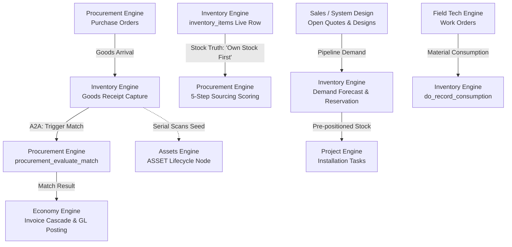

> **Status:** shipped · **Verified-against:** 7304330 (main) · **Last-audited:** 2026-08-17

# Inventory Engine User Guide

> **Status:** shipped · **Verified-against:** 7304330 (main) · **Last-audited:** 2026-08-17

The **Inventory Engine** (`nce/vertical_modules/inventory/`) provides the enterprise with the real-time physical inventory and logistics nervous system across the central warehouse and service van fleet. In current production (`main @ 7304330`), **Wave 1 of 12 has shipped**, establishing the multi-tenant database foundation (migration `050_inventory_core.sql`), tenant-isolated stock locations, and authoritative stock item records.

> [!IMPORTANT]
> **No MCP tools and no REST routes are exposed yet for the Inventory Engine.**
> As documented in `docs/_generated/surface.md`, the Inventory surface is currently:
> ```
> | inventory | - | - | - |
> ```
> There are **0 MCP tools**, **0 REST routes**, and **0 external API endpoints** mounted in `nce/tool_registry.py` or `nce/admin_app.py`. The engine's core domain functions exist as internal Python callables (`do_stock_levels`, `do_transfer_stock`, `do_record_consumption` in `nce/vertical_modules/inventory/stock.py`, and `seed_warehouse_and_vans` in `nce/vertical_modules/inventory/schema_seed.py`). Frontend components and external AI agents must **not** attempt to invoke unexposed HTTP or MCP inventory endpoints until subsequent waves land.

---

## 1. Architectural Mission & Cross-Engine Role

Historically, operations ran with no digital inventory tracking ("alt i én persons hode" — planning module 10 Logistics). The Inventory Engine is a greenfield operational subsystem designed to manage physical stock in real time across the primary warehouse and all mobile service vans.



### 1.1 Core Architectural Principles
1. **The Goods Receipt is the Trigger of Record:** When physical shipments arrive, Inventory records the Goods Receipt (GR) and initiates the canonical **Receive→Match→Cascade** A2A flow by invoking Procurement's `procurement_evaluate_match`.
2. **Authority Model (Row-Truth vs. Graph-Projection):** The PostgreSQL `inventory_items` row is the single source of truth for stock quantities. The knowledge graph `INVENTORY_ITEM` node and `-[at]->` edge are eventually-consistent projections. All stock-truth decisions (such as Procurement's "own stock first" check) query the row directly to prevent race conditions and overselling.
3. **Internal Logistics vs. Customer Sites:** A warehouse or van is a company-internal `STOCK_LOCATION`. It is strictly distinct from the customer-site `FUNCTIONAL_LOCATION` tree owned by System Design and D365.
4. **Predictive & Pipeline-Aware:** Restocking recommendations combine historical consumption velocity, upcoming Field Tech work-orders, and pipeline demand (quotes and designs) rather than static min/max stock cards.

---

## 2. Shipped Capabilities (Wave 1 of 12)

Wave 1 (Batch 129, `locations-stock-tables`) and the foundational concurrency core provide the operational storage and atomic mutation primitives.

### 2.1 Shipped Storage Schema (Migration `050_inventory_core.sql`)
Two tables are active with strict Row-Level Security (`ENABLE` and `FORCE ROW LEVEL SECURITY`):
*   **`stock_locations`:** Hierarchical internal logistics location tree (`warehouse`, `van`, `zone`, `bin`).
    *   Warehouses and vans are flat top-level locations (`parent_id IS NULL`, `level = 0`).
    *   Zones and bins are hierarchical children of a warehouse (`parent_id IS NOT NULL`, `level > 0`).
    *   Enforced structurally via the `stock_locations_hierarchy_shape` database CHECK constraint.
    *   Vans carry an optional `vehicle_ref` string linking to the Staff & Resources `VEHICLE` shared node.
*   **`inventory_items`:** Per-SKU, per-location stock record.
    *   Quantities (`qty_on_hand`, `qty_reserved`, `qty_blocked`, `reorder_point`) are stored with exact decimal precision using `NUMERIC(18,3)` to support fractional items (e.g., bulk cabling).
    *   Natural key constraint: `UNIQUE (namespace_id, sku, location_id)`.

### 2.2 Warehouse and Van Fleet Seeding (`schema_seed.py`)
The idempotent helper `seed_warehouse_and_vans(engine, namespace_id, van_count=6)` creates the default logistics profile for a tenant:
*   Creates 1 central warehouse (`"Main Warehouse"`).
*   Creates $N$ service vans (`"Van-1"` through `f"Van-{van_count}"`), defaulting to the reference implementation's baseline of 6 vans.
*   Idempotency is guaranteed by the partial unique index `uq_stock_locations_top_level_name` (`ON stock_locations (namespace_id, kind, name) WHERE parent_id IS NULL`). Re-running the seed creates no duplicate locations.

### 2.3 Reservation Algebra & Available Stock
The engine calculates available inventory using the three-term reservation algebra:
$$\text{available} = \text{qty\_on\_hand} - \text{qty\_reserved} - \text{qty\_blocked}$$

*   `qty_on_hand`: Physical units currently located at the bin/van.
*   `qty_reserved`: Stock committed to active projects or planned work orders.
*   `qty_blocked`: Units quarantined for RMA, quality inspection, or damaged goods.

### 2.4 Atomic Concurrency & Deadlock-Free Transfers (`stock.py`)
Stock deductions are protected against race conditions and deadlocks:
1.  **Row-Locked Atomic Decrement:** Every deduction is executed in a single atomic SQL statement:
    ```sql
    UPDATE inventory_items
    SET qty_on_hand = qty_on_hand - $4, updated_at = now()
    WHERE namespace_id = $1::uuid AND sku = $2 AND location_id = $3::uuid
      AND qty_on_hand >= $4
    RETURNING qty_on_hand;
    ```
    If available stock is insufficient, the statement affects zero rows and raises `InsufficientStockError`. Stock cannot go negative.
2.  **Canonical Lock Ordering:** During transfers (`do_transfer_stock`), locks for both source and destination locations (both in `inventory_items` and `kg_nodes`) are acquired in deterministic ascending UUID order (`_canonical_lock_order(from_id, to_id)`). This eliminates cross-location deadlock cycles even during concurrent opposite-direction transfers between the same warehouse and van.
3.  **Graph Projection Synchronization:** After row updates commit in Postgres, `stock.py` mirrors the updated state into the knowledge graph (`StockLocation:<id>` and `InventoryItem:<sku>:<id>` nodes with `-[at]->` predicate edges).

---

## 3. Core Functions (Internal Python API)

These domain functions in `nce/vertical_modules/inventory/` are active in code and test-verified, though not yet surfaced over HTTP/MCP:

| Function | Module | Parameters | Description |
|---|---|---|---|
| `seed_warehouse_and_vans` | `schema_seed.py` | `namespace_id`, `van_count=6`, `warehouse_name`, `van_name_prefix` | Idempotently initializes default warehouse and van fleet locations. |
| `do_stock_levels` | `stock.py` | `namespace_id`, `sku?`, `location?` | Queries live stock quantities (`on_hand`, `reserved`, `blocked`, `available`) from `inventory_items`. |
| `do_transfer_stock` | `stock.py` | `namespace_id`, `sku`, `qty`, `from_location`, `to_location` | Moves stock between locations atomically with canonical UUID lock ordering. |
| `do_record_consumption` | `stock.py` | `namespace_id`, `sku`, `qty`, `location`, `work_order?` | Atomically deducts consumed stock for a field service job or project task. |

---

## 4. Planned Capabilities & Remaining Waves (Waves 2–12)

The remaining 11 waves of the Inventory Engine are specified in `docs/vertical_engines/11-inventory-engine.md` and `docs/vertical_engines/00-ENGINES-ROADMAP.md` but are **not yet implemented** on `main`:

### 4.1 Goods Receipt & Barcode Scanning *(planned — not yet implemented)*
*   **Target Function:** `do_record_goods_receipt(engine, params) -> dict`
*   **Target Storage:** `goods_receipts` table (`id, namespace_id, po_ref, location_id, lines jsonb, scans jsonb, match_result, received_at`).
*   **Workflow:** Mobile scanner capture of barcodes/QR codes at warehouse receiving docks; records arriving line quantities and captures individual serial numbers into `scans[]`.

### 4.2 Receive→Match→Cascade A2A Trigger *(planned — not yet implemented)*
*   **Target Integration:** On completion of `do_record_goods_receipt`, the engine will construct a `GOODS_RECEIPT -[against]-> PO` edge and fire Procurement's `procurement_evaluate_match`.
*   **Cross-Engine Cascade:** Procurement computes 3-way match tolerances (GREEN/YELLOW/RED) and hands off the outcome to Economy for financial ledger posting.

### 4.3 Serial Number Capture & Asset Seeding *(planned — not yet implemented)*
*   **Target Contract:** Serial numbers recorded during goods-receipt scans will attach to `GOODS_RECEIPT -[of]-> SKU`.
*   **Asset Hand-off:** When Field Tech installs the item on a work order, the serial number is handed off via A2A to the Assets Engine (`docs/vertical_engines/09-assets-engine.md`) to seed a new `ASSET` lifecycle record.

### 4.4 Append-Only Movement Ledger & Valuation *(planned — not yet implemented)*
*   **Target Storage:** `inventory_transactions` table (`id, namespace_id, item_id, delta, reason_category, ref, at`).
*   **Accounting Hand-off:** Tracks every stock movement with typed adjustment reasons (e.g., `receipt`, `transfer`, `pick`, `shrinkage`, `rma`). Computes stock valuation according to `NCE_INVENTORY_VALUATION_METHOD` (`fifo` or `average`) and provides valuation summaries to the Economy engine.

### 4.5 Partial Goods Receipt & Delivery Status Progression *(planned — not yet implemented)*
*   **Contract Rule:** Partial delivery advances only received line items.
*   **BOM State Transition:** Only fully received lines transition `BOM_LINE.status` to `DELIVERED`. Lines remain `ORDERED` until all units are scanned.

### 4.6 Predictive Van Replenishment Advisor *(planned — not yet implemented)*
*   **Target Function:** `do_recommend_restock(engine, params) -> dict`
*   **Target Config:** `inventory-reorder-points.json` (per-SKU reorder thresholds and van capacity profiles).
*   **Cognitive Logic:** Evaluates consumption velocity, reorder thresholds, and scheduled Field Tech work orders to generate van restocking recommendations. Decisions are logged to `v3_cognitive_ledger` for explainability.

### 4.7 Pipeline-Driven Demand Forecasting *(planned — not yet implemented)*
*   **Target Function:** `do_forecast_demand(engine, params) -> dict`
*   **Target Config:** `inventory-forecast-weights.json` (pipeline stage probability weights).
*   **Cognitive Logic:** Reads open opportunities, designs, and un-signed quotes from Sales and System Design to predict upcoming hardware demand across a configurable horizon (e.g., 30–90 days).

### 4.8 Project Kitting & Stock Pre-Positioning *(planned — not yet implemented)*
*   **Target Function:** `do_reserve_stock(engine, params) -> dict`
*   **Graph Edge:** Writes `INVENTORY_ITEM -[reserved_for]-> PROJECT` edges to allocate inventory to confirmed customer projects before physical staging.

### 4.9 Autonomy-Gated Restock Purchase Orders *(planned — not yet implemented)*
*   **Target Function:** `do_create_restock_po(engine, params) -> dict`
*   **Autonomy Ceiling:** When stock falls below threshold, automatically requests a restock PO from Procurement (`procurement_generate_po`) if total order value is below `NCE_INVENTORY_AUTONOMY_RESTOCK_CEILING`.
*   **Contract B Safety:** Enforces end-to-end idempotency keys spanning Inventory's trigger and Procurement's order execution.

### 4.10 RMA Returns & WEEE Compliance *(planned — not yet implemented)*
*   **Target Function:** `do_record_rma(engine, params) -> dict`
*   **Target Storage:** `rma` table (`id, namespace_id, sku, serial, reason, weee_state, status, created_at`).
*   **Compliance:** Tracks return-to-vendor workflows, customer replacements, and Waste from Electrical and Electronic Equipment (WEEE) disposal logging.

### 4.11 Planned MCP Tools & REST Endpoints *(planned — not yet implemented)*
The full planned surface to be exposed across Waves 3–12 includes:

| Surface Name | Type | Planned Role | Status |
|---|---|---|---|
| `inventory_stock_levels` | MCP Tool / `GET /api/inventory/stock-levels` | Watcher | *(planned — not yet implemented)* |
| `inventory_recommend_restock` | MCP Tool / `POST /api/inventory/recommend-restock` | Advisor | *(planned — not yet implemented)* |
| `inventory_forecast_demand` | MCP Tool / `POST /api/inventory/forecast-demand` | Advisor | *(planned — not yet implemented)* |
| `inventory_record_goods_receipt` | MCP Tool / `POST /api/inventory/goods-receipt` | Actor | *(planned — not yet implemented)* |
| `inventory_record_consumption` | MCP Tool / `POST /api/inventory/consumption` | Actor | *(planned — not yet implemented)* |
| `inventory_transfer_stock` | MCP Tool / `POST /api/inventory/transfer` | Actor | *(planned — not yet implemented)* |
| `inventory_reserve_stock` | MCP Tool / `POST /api/inventory/reserve` | Actor | *(planned — not yet implemented)* |
| `inventory_record_rma` | MCP Tool / `POST /api/inventory/rma` | Actor | *(planned — not yet implemented)* |
| `inventory_create_restock_po` | MCP Tool | Actor (Autonomous under ceiling) | *(planned — not yet implemented)* |

---

## 5. Worked Example: Using Shipped Python Primitives

Below is a verified example of how internal services and tests currently interact with the shipped Wave 1 and Wave 2 Python core:

```python
import uuid
from decimal import Decimal
from nce.vertical_modules.inventory.schema_seed import seed_warehouse_and_vans
from nce.vertical_modules.inventory.stock import (
    do_stock_levels,
    do_transfer_stock,
    do_record_consumption,
    InsufficientStockError,
)

# 1. Initialize warehouse and 6 service vans for a tenant namespace
ns_id = uuid.uuid4()
seed_result = await seed_warehouse_and_vans(engine, ns_id, van_count=6)
warehouse_id = seed_result["warehouse"]["id"]
van_1_id = seed_result["vans"][0]["id"]

# 2. Transfer 25.5 metres of bulk cable from central warehouse to Van-1
transfer_result = await do_transfer_stock(engine, {
    "namespace_id": ns_id,
    "sku": "CABLE-CAT6A-PUR",
    "qty": Decimal("25.500"),
    "from_location": warehouse_id,
    "to_location": van_1_id,
})
# transfer_result["ok"] == True
# transfer_result["to_on_hand"] == Decimal("25.500")

# 3. Query stock levels across the tenant
stock_result = await do_stock_levels(engine, {
    "namespace_id": ns_id,
    "sku": "CABLE-CAT6A-PUR",
})
# stock_result["items"] contains on_hand, reserved, blocked, available per location

# 4. Field technician consumes 10.0 metres on a customer work order
consumption_result = await do_record_consumption(engine, {
    "namespace_id": ns_id,
    "sku": "CABLE-CAT6A-PUR",
    "qty": Decimal("10.000"),
    "location": van_1_id,
    "work_order": "WO-2026-0881",
})
# consumption_result["on_hand"] == Decimal("15.500")

# 5. Attempting to consume more than available stock raises InsufficientStockError
try:
    await do_record_consumption(engine, {
        "namespace_id": ns_id,
        "sku": "CABLE-CAT6A-PUR",
        "qty": Decimal("100.000"),
        "location": van_1_id,
    })
except InsufficientStockError as err:
    print(f"Refused: requested {err.requested}, only {err.available_on_hand} on hand")
```

---

## Appendix: Spec vs. Shipped Matrix (Commit `7304330`)

| Capability | Spec Reference (`11-inventory-engine.md`) | Shipped in Code? | Status |
|---|---|---|---|
| `stock_locations` table & hierarchy | Build Phase B1 (§98) | Yes (`050_inventory_core.sql`) | Shipped (Wave 1) |
| `inventory_items` table & RLS | Build Phase B1 (§99) | Yes (`050_inventory_core.sql`) | Shipped (Wave 1) |
| Idempotent Warehouse + Vans Seed | Build Phase B1 (§98) | Yes (`schema_seed.py`) | Shipped (Wave 1) |
| Row-authoritative `do_stock_levels` | Core Functions (§40) | Yes (`stock.py`) | Internal Core |
| Atomic `do_transfer_stock` | Core Functions (§43) | Yes (`stock.py`) | Internal Core |
| Atomic `do_record_consumption` | Core Functions (§42) | Yes (`stock.py`) | Internal Core |
| Deadlock-free UUID lock ordering | Review Round-2 Hardening #2 | Yes (`stock.py`) | Internal Core |
| `goods_receipts` table & capture | Build Phase B2 (§101) | No | *(planned — not yet implemented)* |
| Receive→Match A2A trigger | A2A Flows (§84) | No | *(planned — not yet implemented)* |
| Serial number to `ASSET` hand-off | Research A1 (§11) | No | *(planned — not yet implemented)* |
| `inventory_transactions` ledger | Research A5 (§100) | No | *(planned — not yet implemented)* |
| Partial goods-receipt BOM updates | Research A4 (§14) | No | *(planned — not yet implemented)* |
| Predictive restock Advisor | Build Phase B3 (§45) | No | *(planned — not yet implemented)* |
| Pipeline demand forecasting | Build Phase B4 (§46) | No | *(planned — not yet implemented)* |
| Project stock reservation | Build Phase B4 (§44) | No | *(planned — not yet implemented)* |
| Autonomy restock PO trigger | Build Phase B4 (§48) | No | *(planned — not yet implemented)* |
| RMA & WEEE compliance tracking | Build Phase B5 (§47) | No | *(planned — not yet implemented)* |
| MCP tool registrations | MCP Tools Table (§53–64) | No (0 tools) | *(planned — not yet implemented)* |
| REST admin route mounting | REST Routes (§66–74) | No (0 routes) | *(planned — not yet implemented)* |
