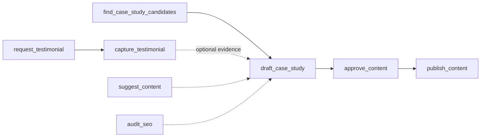

> **Status:** shipped · **Verified-against:** b75c873 (main) · **Last-audited:** 2026-09-06

# Marketing Engine User Guide (Doc 94)

> **Status:** shipped · **Verified-against:** b75c873 (main) · **Last-audited:** 2026-09-06

The **Marketing Engine** (`nce/vertical_modules/marketing/`) turns work every other engine already did into outbound marketing evidence — with zero net-new data entry. It finds delivered projects worth writing up, drafts a case study straight from the cognitive graph (never free-form prose), times testimonial requests to a customer's positive-NPS moment, suggests thought-leadership content, and audits a draft for AI-answer-engine (AEO/GEO) citability. Every factual claim in a draft is anchored to a graph node; nothing is published to a customer-facing surface without a human signing off first.

---

## 1. The pipeline at a glance

Two tracks feed the human approval gate: the **case-study track** (candidates → draft → approve → publish) and the **testimonial track** (request → capture, gated on customer health). `suggest_content` and `audit_seo` are read-only advisors that sit alongside either track.

All eight tools live behind a namespace opt-in: an administrator must set `metadata.marketing.enabled = true` for your tenant before any of these calls succeed (`nce/vertical_modules/marketing/_guard.py:110-144`, `require_marketing_enabled`). If you get a "has not enabled the Marketing Engine" error, see the admin guide §1.

---

## 2. Finding case study candidates — `marketing_find_case_study_candidates`

Read-only, cacheable, no admin credential required (`nce/tool_registry.py:1205-1210`). Scans delivered `PROJECT`/`PROJECT_PROJECT` graph nodes for your namespace and returns candidates ranked by outcome score (`nce/vertical_modules/marketing/candidates.py:20-103`, `do_find_case_study_candidates`).

Parameters:
- `namespace_id` (required)
- `min_outcome_score` (default `7.5`) — candidates below this score are filtered out (`candidates.py:96`)
- `lookback_days` (default `180`) — informational; the current query does not actually filter by `created_at` age, it just returns the 50 most recent delivered-project nodes (`candidates.py:56-64`)

> [!NOTE]
> If your database has no matching `kg_nodes` rows (or the pool isn't connected), the tool falls back to a single hardcoded mock candidate (`PRJ-DEFAULT-1`, "Corporate HQ Auditorium AV-over-IP Deployment") rather than an empty list (`candidates.py:82-93`). Don't be surprised to see this exact project name in a fresh/empty namespace — it's a placeholder, not a real customer.

Each candidate carries `evidence_node_ids` — the graph nodes `draft_case_study` will cite.

---

## 3. Drafting a case study — `marketing_draft_case_study`

Actor tool, `admin_only=True`, `mutation=True` (`nce/tool_registry.py:1211-1216`). This is the retrieval-grounded assembly step: it does **not** free-generate prose and then check it — it builds the draft entirely out of cited graph facts (`nce/vertical_modules/marketing/drafting.py:36-131`, `do_draft_case_study`):

1. Every input dict first passes `assert_no_sensitive_financials` — margin, cost, markup, rebate and similar keys hard-refuse the whole draft (`_guard.py:49-73`, raises `MarketingSensitiveDataLeakError`).
2. The remaining facts are projected through an **allow-list** (`redaction.py:21-45`, `MARKETING_ALLOWED_FIELDS`) — only ~20 named fields (title, room_type, vertical, outcomes, metrics, etc.) survive; everything else is silently dropped, not redacted-in-place.
3. If `anonymize` is true (the default), customer/site names are string-replaced against a small hardcoded lookup table (`redaction.py:89-100` — e.g. `"MegaCorp Oslo" → "ALPHA Enterprise"`). This is a literal substring swap, not a general PII detector — a customer name not in that table will pass through unmasked.
4. A citation is generated for the project, each solution component, and each outcome metric — every one links a `graph_node_id` to a `claim` string (`drafting.py:64-90`).
5. `validate_draft_grounding` (`drafting.py:28-33`) hard-refuses (`MarketingUngroundedClaimError`) if the citation list is empty or any citation is missing a node ID or claim text.
6. The body is assembled into four fixed sections defined in `taxonomy.py:37-57`: **The Challenge**, **The Engineering Solution**, **Verified Outcomes**, **Room Experience**.

The result is staged with `status: "draft"` — it does not go live anywhere. If persisted via the REST route (see admin guide §3), it lands in the `case_studies` table at that same `draft` status.

---

## 4. Testimonials — request, then capture, with two consent tiers

### 4.1 `marketing_request_testimonial` (admin-only, mutation)
Issues a testimonial request for a customer. This is **hard-gated on customer health**: `nps_score` must be `>= 9.0` or the call refuses outright (`_guard.py:92-98`, `assert_positive_nps_only`; enforced in `testimonials.py:75-76`). There is no override — the engine will never trigger outreach toward a low-health or dissatisfied customer. Requires `namespace_id`, `customer_id`, `project_id`, `nps_score`. Creates a `testimonials` row in `status='requested'` with `consent=false`.

### 4.2 `marketing_capture_testimonial` (admin-only, mutation)
Records the customer's actual quote. Requires `namespace_id`, `quote` (non-blank), `consent` (must be `true` — a blank/false/missing consent hard-refuses with `MarketingConsentMissingError`, `testimonials.py:189-193`), and `consent_tier`, which must be one of exactly two values (`testimonials.py:33`):

| Tier | Meaning |
|---|---|
| `web_retractable` | Standard public-web use; can be withdrawn later. |
| `ai_citable_irrevocable` | Higher, durable bar required before the quote can be cited in AI-agent-facing / JSON-LD content — once an AI system has ingested it, your own retraction can't un-train it, so this tier is meant to be a deliberate, harder-to-grant decision, not a rubber stamp. |

Optional: `attribution_name`, `attribution_title`, `consent_scope` (a free-form JSON scope object).

> [!IMPORTANT]
> There is a third function, `do_retract_testimonial`, that flips a testimonial to `status='retracted'` and cascades the retirement to any derived `content_assets` row sharing its `marketing_source_id` (`testimonials.py:296-368`). **It has no MCP tool and no REST route today** — it is callable only by direct Python import. `nce/config_data/internal-cores.json` confirms this is a known, tracked gap (owner `MLV15D-M2`, "scheduled for admin tool surface"). If a customer asks you to withdraw a testimonial right now, an administrator must run it manually or via a script — there is no self-service or admin-UI path yet.

---

## 5. Advisor surfaces (read-only, no approval needed)

### 5.1 `marketing_suggest_content`
Returns up to 10 (default 3) thought-leadership/drip content ideas, each with an angle, target audience, recommended channel, and a suggested outline (`advisor.py:44-198`, `do_suggest_content`). Optional filters: `theme`, `product`. If your namespace has approved/published case studies, the suggestions' `grounded_references` are swapped to point at your real case-study IDs; otherwise you get four built-in AV-industry example themes (hybrid workplace, networked AV, room acoustics, proactive lifecycle) as illustrative placeholders — these are **not** graph-derived facts about your account.

### 5.2 `marketing_audit_seo`
Scores a piece of content (an existing `case_studies`/`content_assets` row via `asset_id`, or ad-hoc `content`/`title`/`url`) for AI-answer-engine citation readiness and returns a Schema.org `TechArticle` JSON-LD block (`advisor.py:201-380`, `do_audit_seo`). See admin guide §7 for the exact scoring rubric. If you pass `asset_id`, the report is also written back into that row's `seo` column.

---

## 6. The human approval gate — nothing publishes itself

### 6.1 `marketing_approve_content`
Records a human sign-off (`approver`, `decision` ∈ `{approved, rejected, changes_requested}`, optional `notes`) against a `case_studies` or `content_assets` row and writes an audit entry to `v3_cognitive_ledger` (`approval.py:25-158`, `do_approve_content`). Only `decision="approved"` moves the row to `status='approved'`; anything else leaves it at `draft` for another pass.

### 6.2 `marketing_publish_content`
Publishes an **approved** artifact. This tool hard-refuses (`MarketingUnapprovedPublishError`) unless the target row's `status == "approved"` **and** it has a non-empty recorded `approver` (`publish.py:135-144`) — there is structurally no autonomous publish tier. If the content is flagged customer content, it separately hard-refuses (`MarketingConsentMissingError`) unless `consent` is recorded true (`publish.py:146-163`).

> [!WARNING]
> **"Publish" does not push anything to a live website, CMS, or any external system.** `PublishTransport` has exactly two members (`publish.py:35-38`): `manual`, which flips the row's status to `published` in the database and hands back a `export_payload` (title/body/approver/timestamp) for a human to copy into whatever channel you actually publish through; and `cms`, which is **not implemented** — calling with `transport="cms"` raises `NotImplementedError("CMS publish transport is deferred (see roadmap §6). Use manual export.")` (`publish.py:73-76`). There is no live website, CMS, or JSON-LD/AEO feed integration behind this tool as of this audit. If you were expecting your case study to appear on the company website automatically, it will not — someone still has to take the `export_payload` and post it themselves.

---

## 7. Brand voice, banned claims, and disclaimers

`taxonomy.py:14-35` (`DEFAULT_BRAND_VOICE`) defines a namespace-independent baseline: tone ("authoritative, technical, outcomes-focused, modern"), five banned claim phrases ("100% bug-free", "zero latency", "unbreakable security", "guaranteed lowest price", "revolutionary magic"), two required disclaimers about measured-result variance, and the default anonymisation placeholders ("Nordic Enterprise Client", "Northern Europe"). This constant is exported (`__init__.py:36`) but is not currently loaded from a per-tenant config file — the design spec's `marketing-brand-voice.json` (tenant-tunable tone/banned-claims file) does not exist in `nce/config_data/` at this commit; every namespace gets the same hardcoded voice today.

---

## 8. Getting started

1. Ask an administrator to confirm `metadata.marketing.enabled = true` for your namespace (admin guide §1).
2. Call `marketing_find_case_study_candidates` to see what's eligible.
3. Call `marketing_draft_case_study` against a candidate's `project_id`.
4. Route the draft to a human reviewer for `marketing_approve_content`.
5. Call `marketing_publish_content` and hand the returned `export_payload` to whoever posts to your actual marketing channels.
6. In parallel, use `marketing_request_testimonial` / `marketing_capture_testimonial` whenever a customer crosses the high-NPS threshold, and `marketing_suggest_content` / `marketing_audit_seo` whenever you need fresh ideas or a pre-publish SEO check.

---

## 9. What this engine will not do for you

- It will not post anything to your website or CMS on your behalf (§6.2).
- It will not detect PII beyond the small hardcoded name/location substitution table (§3) — review anonymized drafts before treating them as safe to share.
- It will not chase a testimonial from an unhappy or neutral customer, ever, regardless of who asks (§4.1) — that outreach belongs to your Support/Customer-Success workflow, not Marketing.
- It will not let you self-service a testimonial withdrawal today (§4.2) — ask an administrator.

For the enablement mechanics, the exact approval/consent enforcement code paths, the REST route contract, and the full list of known gaps, see `docs/engines/marketing-admin.md`.
