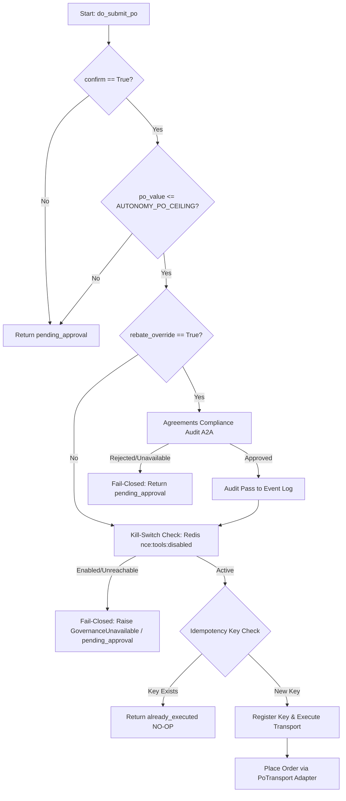

> **Status:** shipped · **Verified-against:** 7304330 (main) · **Last-audited:** 2026-08-17

# Procurement Engine Admin Guide (Doc 68)

> **Status:** shipped · **Verified-against:** 7304330 (main) · **Last-audited:** 2026-08-17

The **Procurement Engine** (`nce/vertical_modules/procurement/`) provides automated sourcing ranking, Total Cost of Ownership (TCO) evaluation, three-way invoice matching, per-supplier compliance recalibration, savings tracking, and purchase order (PO) life-cycle management for the Neuro-Cognitive Engine (NCE).

---

## 1. Enabling the Procurement Engine

To enable the Procurement Engine for a tenant:

1. **Global Configuration:** Set `NCE_PROCUREMENT_ENABLED=true` (enabled by default in `nce/config.py`).
2. **Namespace Opt-In:** Individual tenant namespaces configure the capability in their namespace metadata:
   ```json
   {
     "metadata": {
       "procurement": {
         "enabled": true
       }
     }
   }
   ```
3. **Database Pre-requisites:** Run migrations `036_procurement_bid_prices.sql` and `037_procurement_bids_indexes.sql` to establish the `procurement_bid_prices` cache table and set up row-level security (RLS) policies.

---

## 2. Global Environment Configuration

The following parameters are configured in the central environment (or `.env` file) and parsed by `nce/config.py`:

* **`NCE_PROCUREMENT_ENABLED`** (Type: `bool`, Default: `True`):  
  Master toggle for the Procurement vertical module.
* **`NCE_PROCUREMENT_AUTONOMY_PO_CEILING`** (Type: `float`, Default: `0.0`):  
  The maximum monetary value of a purchase order (inclusive) that the C2 governor may automatically approve and submit to an external supplier transport without requiring a manual human override confirmation. If set to `0.0` (the default), all PO submissions are gated and require manual human confirmation.
* **`NCE_PROCUREMENT_RECALIBRATE_AFTER_N`** (Type: `int`, Default: `100`, Minimum: `1`):  
  The rolling decision window size (number of match decisions recorded in the database) before a supplier's match-threshold recalibration is computed.
* **`NCE_PROCUREMENT_FEED_CACHE_TTL_SECONDS`** (Type: `int`, Default: `86400`):  
  Cache TTL for external pricing/distributor catalog feeds.
* **`NCE_PROCUREMENT_MAX_FEED_BYTES`** (Type: `int`, Default: `314572800`):  
  Maximum permitted feed file size (300 MB limit).
* **`NCE_PROCUREMENT_SYNC_INTERVAL_MINUTES`** (Type: `int`, Default: `1440`):  
  Frequency for product projection sync cycles (daily default).

---

## 3. Contract B Sourcing & PO Validation Gates

The PO submission workflow is managed by the C2 governor via the `@governed(action_type="submit_po")` decorator in [po.py](https://github.com/sindrehaugen/NCE/blob/main/nce/vertical_modules/procurement/po.py). Sourcing spends real money, meaning all submissions pass through a strict sequence of fail-closed verification gates.

### The Autonomy Validation Sequence



### Details of the Validation Gates:

1. **Confirm-Only Default:** Every submission requires `confirm=True`. If `confirm=False`, the execution returns `{"status": "pending_approval", ...}` and the order is never sent to the transport.
2. **Autonomy Ceiling Gate:** If `po_value` is greater than `NCE_PROCUREMENT_AUTONOMY_PO_CEILING`, the order trips the policy gate and is demoted to `pending_approval` status, forcing a human manager check.
3. **Rebate Override Compliance Gate:** If the sourcing selection was decided due to rebate optimization (`rebate_override=True`), NCE contacts the Agreements Module via the A2A client using the `agreements.compliance_audit` tool.
   * **Fail-Closed Policy:** If the A2A client is missing, the tool returns a failure, or the connection times out, the gate fails closed, logs a `rejected` or `unavailable` decision to the `event_log` WORM ledger, and degrades to `pending_approval` (demanding human confirm).
   * **Auditing:** All rebate decisions (approved, rejected, or unavailable) are operationally stored in the event log database via `append_event` under the `config_changed` type.
4. **Kill-Switch Gate:** Checked via Redis key `nce:tools:disabled`. If the key is present or Redis is down, the system fails closed.
5. **Idempotency Gate:** Checks the `action_idempotency` table using a key derived from `(namespace_id, po_number)`. If the key is already registered, the call returns `already_executed` (NO-OP), preventing double-orders on retries.
6. **Transport Block:** At launch, the default transport points to `NetsetPoTransport` (which raises a `NotImplementedError` blocker), meaning no automated external orders can be sent to Netset until the API integration is fully developed.

---

## 4. Internal Domain Cores vs Exposed Surfaces

The Procurement module implements three primary pure-logic calculation cores that execute deterministically without external side effects:

1. **`do_calculate_tco`** ([tco.py](https://github.com/sindrehaugen/NCE/blob/main/nce/vertical_modules/procurement/tco.py)):  
   Calculates the multi-factor Total Cost of Ownership given supplier quote data, BOM line parameters, and config weights.
2. **`do_rank_suppliers`** ([ranking.py](https://github.com/sindrehaugen/NCE/blob/main/nce/vertical_modules/procurement/ranking.py)):  
   Executes the 5-step sourcing ranking pipeline, evaluating own-stock bonus, lead time deadlines, normalized TCO, bid price, and tier/bundling governance.
3. **`do_evaluate_three_way_match`** ([three_way_match.py](https://github.com/sindrehaugen/NCE/blob/main/nce/vertical_modules/procurement/three_way_match.py)):  
   Calculates quantity, price, and total amount deviations, checks substitution levels, and yields matching confidence ($0.0 \text{ to } 100.0$) and clearance tiers (`GREEN`, `YELLOW`, `RED`).

### Unwired / Internal Lifecycle Cores
In addition to the 3 calculation cores, the module contains internal lifecycle and analysis functions that operate within internal domain workflows:
* **`do_generate_po`** ([po.py](https://github.com/sindrehaugen/NCE/blob/main/nce/vertical_modules/procurement/po.py)): Drafts PO nodes in the knowledge graph.
* **`do_submit_po`** ([po.py](https://github.com/sindrehaugen/NCE/blob/main/nce/vertical_modules/procurement/po.py)): Governed order submission via `PoTransport`.
* **`do_resolve_bids`** ([bids.py](https://github.com/sindrehaugen/NCE/blob/main/nce/vertical_modules/procurement/bids.py)): Cache-query engine over `procurement_bid_prices`.
* **`do_aggregate_savings`** ([savings.py](https://github.com/sindrehaugen/NCE/blob/main/nce/vertical_modules/procurement/savings.py)): Read-only savings tracker and leakage detector.
* **`do_record_match_decision` & `do_recalibrate_supplier`** ([recalibration.py](https://github.com/sindrehaugen/NCE/blob/main/nce/vertical_modules/procurement/recalibration.py)): Writes decisions to `v3_cognitive_ledger` and recalculates precision deltas.

These mutating lifecycle functions remain unexposed to public MCP endpoints to prevent unauthorized external spend until production transport integrations are activated.

---

## 5. Weights and Tolerances (Config-as-IP)

Rather than hardcoded rules, NCE uses tenant-configurable weights and tolerances loaded from `nce/config_data/`.

### Sourcing & TCO Weights (`procurement-weights.json`)
```json
{
  "TCO_WEIGHTS": {
    "freight": 0.05,
    "warranty": 0.08,
    "stock": 0.03,
    "delivery_risk": 0.04
  },
  "SCORING_WEIGHTS": {
    "tco": 0.40,
    "delivery_reliability": 0.25,
    "bid_price": 0.20,
    "tier_bundling": 0.10,
    "kickback_proximity": 0.05
  }
}
```

### Match Tolerances (`procurement-tolerances.json`)
```json
{
  "MATCH_TOLERANCE": {
    "GREEN_THRESHOLD": 115,
    "YELLOW_THRESHOLD": 70,
    "zones": {
      "GREEN": {
        "label": "GREEN",
        "min_score": 115,
        "action": "auto_approve"
      },
      "YELLOW": {
        "label": "YELLOW",
        "min_score": 70,
        "action": "manual_review"
      },
      "RED": {
        "label": "RED",
        "min_score": 0,
        "action": "reject"
      }
    }
  },
  "DEFAULT_THRESHOLDS": {
    "green": 115,
    "yellow": 70
  }
}
```

### Mathematical Formulas

#### Total Cost of Ownership (TCO) Formula
The TCO is calculated per supplier candidate inside `nce/vertical_modules/procurement/tco.py`:

$$\text{Price} = \text{Supplier Unit Price} \times \text{BOM Line Quantity}$$
$$\text{Freight} = \text{Price} \times \text{Weight}_{\text{freight}}$$
$$\text{Warranty} = (\text{BOM Unit Price} \times \text{BOM Line Quantity}) \times \text{Weight}_{\text{warranty}}$$
$$\text{Stock} = \text{Price} \times \text{Weight}_{\text{stock}}$$
$$\text{Delivery Risk} = \text{Price} \times \text{Weight}_{\text{delivery\_risk}}$$
$$\text{TCO Total} = \text{Price} + \text{Freight} + \text{Warranty} + \text{Stock} + \text{Delivery Risk}$$

> [!NOTE]
> The warranty cost computation uses the reference buyer cost (`bom_line["unit_price"]`), falling back to the supplier quoted price only if the reference cost is absent. This closes the legacy `warrantyCost=0` bug.

#### Three-Way Match Confidence Score
Compares the Purchase Order (PO), Goods Receipt (GR), and Invoice to yield a confidence value from $0.0$ to $100.0$:

$$\text{Qty Ratio} = \frac{\min(\text{GR Qty}, \text{Invoice Qty})}{\text{PO Qty}}$$
$$\text{Price Ratio} = \frac{\text{Invoice Unit Price}}{\text{PO Unit Price}}$$
$$\text{Amount Ratio} = \frac{\text{Invoice Total}}{\text{PO Total}}$$

$$\text{Qty Deviation} = |1.0 - \text{Qty Ratio}| \times 100$$
$$\text{Price Deviation} = |1.0 - \text{Price Ratio}| \times 100$$
$$\text{Amount Deviation} = |1.0 - \text{Amount Ratio}| \times 100$$

$$\text{Qty Penalty} = \text{Qty Deviation} \times 0.40$$
$$\text{Price Penalty} = \text{Price Deviation} \times 0.35$$
$$\text{Amount Penalty} = \text{Amount Deviation} \times 0.25$$

$$\text{Base Score} = 100.0 - \text{Qty Penalty} - \text{Price Penalty} - \text{Amount Penalty}$$

If the article substitution is categorized as `DIFFERENT`, a flat penalty of **$15.0$** is subtracted:
$$\text{Raw Score} = \text{Base Score} - 15.0 \quad (\text{if article substitution is } \text{DIFFERENT})$$

$$\text{Confidence} = \max(0.0, \min(100.0, \text{Raw Score}))$$

Tiers are resolved based on the clamped confidence:
* **GREEN:** $\text{Confidence} \ge \min(\text{GREEN\_THRESHOLD}, 100.0)$
* **YELLOW:** $\min(\text{GREEN\_THRESHOLD}, 100.0) > \text{Confidence} \ge \min(\text{YELLOW\_THRESHOLD}, 100.0)$
* **RED:** $\text{Confidence} < \min(\text{YELLOW\_THRESHOLD}, 100.0)$

---

## 6. Supplier Article Substitution Matrix

The three-way match evaluation detects article mismatches and labels them to determine if a substitution is valid:

| Substitution Level | Criteria | Penalty |
|---|---|---|
| **`EXACT`** | Invoiced article ID matches PO article ID (case-insensitive). | None |
| **`EQUIVALENT_SKU`** | Invoice carries `equivalent_sku=true` OR has an explicit `substitute_for` matching the PO article. | None (Valid replacement) |
| **`COMPATIBLE`** | Invoice article lists the PO article ID in its `compatible_with` list. | None (Valid replacement) |
| **`DIFFERENT`** | No match or declared equivalencies. Treated as a full mismatch. | **-15.0** points |

---

## 7. Purchase Order Transports (`PoTransport`)

Order submission tasks are separated from the PO draft creation logic via a transport abstraction contract defined in [transports.py](https://github.com/sindrehaugen/NCE/blob/main/nce/vertical_modules/procurement/transports.py):

```python
class PoTransport(abc.ABC):
    @abc.abstractmethod
    async def place_order(
        self,
        po_number: str,
        supplier_id: str,
        line_items: list[dict[str, Any]],
        *,
        namespace_id: str,
        idempotency_key: str,
    ) -> dict[str, Any]:
        """Place a purchase order with the external supplier system."""
```

### Built-in Adapters:
1. **`NettailerPoTransport`** (Nettailer Client):  
   Responsible for forwarding the purchase order to the Netset Nettailer API.
2. **`NetsetPoTransport`** (Stub):  
   A dummy adapter for the outbound Netset Order API. It always raises a `NotImplementedError` outlining the blocked task, preventing silent submission failures at launch.

---

## 8. Savings & Leakage Watchers

The savings tracking system in [savings.py](https://github.com/sindrehaugen/NCE/blob/main/nce/vertical_modules/procurement/savings.py) monitors distributor invoice lines against available BID prices to identify lost savings and leakage candidates.

### Calculation Definitions:
* **Baseline Cost:** Loaded from `procurement_bid_prices` (using `pris` as `best_bid`). If no bid baseline exists for an item, it defaults to the actual unit price paid (neutral score).
* **Realized Savings:**  
  $$\text{Realized Savings} = \sum (\text{Baseline Total} - \text{Actual Total}) \quad \text{for rows where } \text{Actual Total} \le \text{Baseline Total}$$
* **Lost Savings:**  
  $$\text{Lost Savings} = \sum (\text{Actual Total} - \text{Baseline Total}) \quad \text{for rows where } \text{Actual Total} > \text{Baseline Total}$$
* **Leakage Candidates:**  
  Any line item purchase where the actual unit price paid exceeds the best available contract BID price:
  $$\text{Actual Unit Price} > \text{Best Bid}$$
  These are logged in reports with the calculated gap, quantity, and a generated plain-language rationale explaining the leakage.

---

## 9. Adaptive Supplier Threshold Recalibration

To adapt to recurring distributor patterns, NCE dynamically shifts match tolerances using transaction histories logged in `v3_cognitive_ledger`.

1. **Ledger Record:** Each match result is written via `do_record_match_decision` as an insert-only row in `v3_cognitive_ledger`. The payload contains the `supplier_id`, `decision` (`"accept"` or `"override"`), and the match `score`.
2. **Recalibration Window:** When a supplier reaches $N$ decisions (configured by `NCE_PROCUREMENT_RECALIBRATE_AFTER_N`), `do_recalibrate_supplier` computes the supplier's precision:
   $$\text{Precision} = \frac{\text{Accepted Decisions}}{\text{Total Decisions in Window}}$$
3. **Earned Threshold Shift:** The tolerance threshold adjustment is earned based on precision performance:
   $$\text{Threshold Delta} = (\text{Precision} - 0.5) \times 0.1$$
   The delta is strictly clamped to the range $[-0.05, +0.05]$ to keep threshold movement stable.
4. **Execution:** Positive deltas relax thresholds (rewarding supplier precision), while negative deltas tighten thresholds (demanding tighter match precision on invoice discrepancies).

---

## 10. Database Schema & Row-Level Security (RLS)

All Procurement cache tables enforce tenant isolation via Row-Level Security (RLS) linked to the active tenant's transaction GUC set by `get_nce_namespace()`.

```sql
CREATE TABLE IF NOT EXISTS procurement_bid_prices (
    id           UUID        NOT NULL DEFAULT gen_random_uuid(),
    namespace_id UUID        NOT NULL REFERENCES namespaces(id) ON DELETE CASCADE,
    artnr        TEXT        NOT NULL,
    leverandor   TEXT        NOT NULL,
    bid_id       TEXT        NOT NULL,
    prodid       TEXT,
    pris         NUMERIC     NOT NULL,
    valid_to     TIMESTAMPTZ,
    raw          JSONB       NOT NULL DEFAULT '{}'::jsonb,
    synced_at    TIMESTAMPTZ NOT NULL DEFAULT now(),
    PRIMARY KEY (id)
);

CREATE INDEX IF NOT EXISTS idx_procurement_bid_prices_artnr_ns 
    ON procurement_bid_prices (namespace_id, artnr);

ALTER TABLE procurement_bid_prices ENABLE ROW LEVEL SECURITY;
ALTER TABLE procurement_bid_prices FORCE ROW LEVEL SECURITY;

CREATE POLICY tenant_isolation_policy ON procurement_bid_prices
    FOR ALL TO nce_app
    USING (namespace_id IS NOT NULL AND namespace_id = get_nce_namespace())
    WITH CHECK (namespace_id IS NOT NULL AND namespace_id = get_nce_namespace());
```

---

## 11. MCP Tool Reference (6 Tools)

The Procurement Engine registers **6 MCP tools** in `nce/tool_registry.py` via `_h(procurement_mcp_handlers, "handle_*")`:

| Tool Name | Cacheable | Mutation | Admin Only | Description |
|---|:---:|:---:|:---:|---|
| `procurement_calculate_tco` | ✔ | ✘ | ✘ | Calculates TCO cost breakdown for a candidate supplier quote and BOM line. |
| `procurement_rank_suppliers` | ✔ | ✘ | ✘ | Evaluates and ranks candidate suppliers using the 5-step deliberate order. |
| `procurement_evaluate_match` | ✔ | ✘ | ✘ | Executes a 3-way match evaluation across PO, Goods Receipt, and Invoice. |
| `procurement_forecast_rebate` | ✔ | ✘ | ✘ | Frontier advisor: projects year-end supplier rebate bands from BOM spend. |
| `procurement_recommend_move_spend` | ✔ | ✘ | ✘ | Frontier advisor: recommends spend shifts to maximize rebate ROI. |
| `procurement_whatif_spend` | ✔ | ✘ | ✘ | Frontier advisor: simulates hypothetical spend shifts between suppliers. |

---

## 12. REST API Reference (8 Routes)

All routes are mounted via `build_app(extra_routes=...)` and authenticated using HMAC signature headers or admin API key auth:

### Operational Endpoints
* **`POST /api/procurement/tco`** (`api_procurement_calculate_tco`):  
  Computes the TCO breakdown for a given supplier and BOM line configuration.
* **`POST /api/procurement/rank`** (`api_procurement_rank_suppliers`):  
  Executes the 5-step distributor policy scoring to rank available suppliers. Returns a ranked candidate list and any `rebate_override` governance audit tags.
* **`POST /api/procurement/match`** (`api_procurement_evaluate_match`):  
  Performs three-way match confidence scoring for a PO, GR, and Invoice bundle.

### Administration & Sync Status Endpoints
* **`POST /api/procurement/sync`** (`api_procurement_sync_now`):  
  Manually triggers a refresh of the `procurement_bid_prices` cache from Product's projection. Admin-only.
* **`GET /api/procurement/sync/status`** (`api_procurement_sync_status`):  
  Returns the cache status, freshness, and column report for the `procurement_bid_prices` table. Admin-only.

### Frontier Advisor Endpoints (Read-Only)
* **`POST /api/procurement/frontier/forecast-rebate`** (`api_procurement_forecast_rebate`):  
  Forecasts year-end supplier rebate band achievements based on active BOM pipelines.
* **`POST /api/procurement/frontier/recommend-move-spend`** (`api_procurement_recommend_move_spend`):  
  Recommends shift opportunities to redirect spending toward next-tier kickback suppliers.
* **`POST /api/procurement/frontier/whatif-spend`** (`api_procurement_whatif_spend`):  
  Simulates a hypothetical shift in distributor spending and returns the net projected delta savings.
