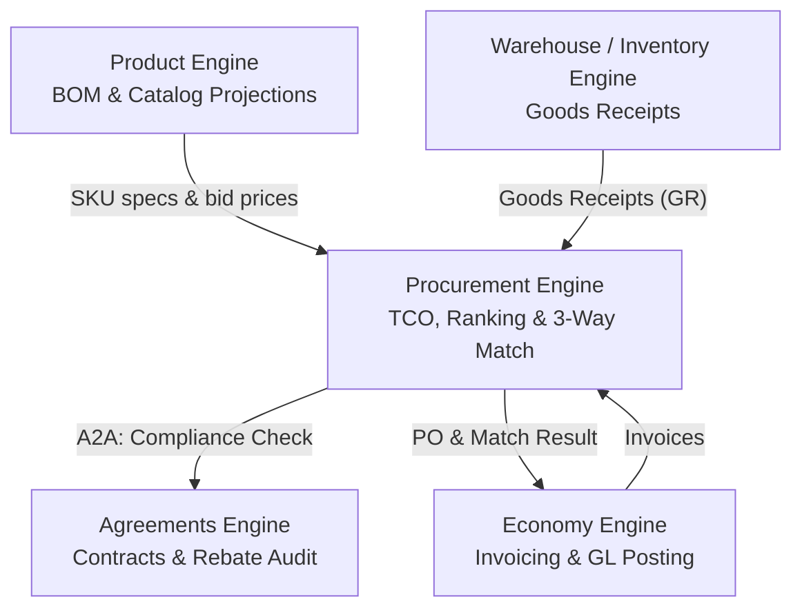
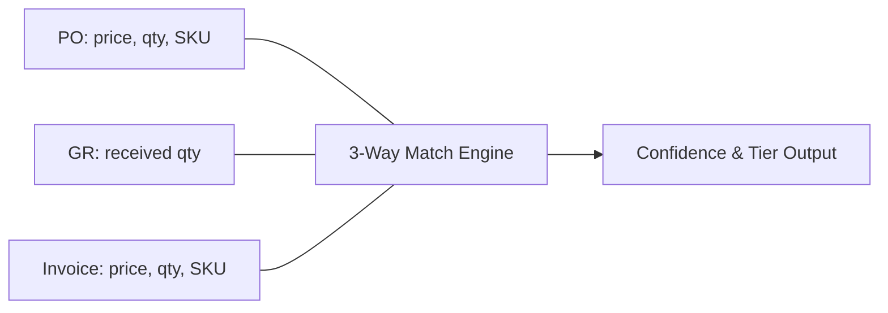

> **Status:** shipped · **Verified-against:** 7304330 (main) · **Last-audited:** 2026-08-17

# Procurement Engine User Guide (Doc 67)

> **Status:** shipped · **Verified-against:** 7304330 (main) · **Last-audited:** 2026-08-17

The **Procurement Engine** (`nce/vertical_modules/procurement/`) is the intelligence layer within the Neuro-Cognitive Engine (NCE) that automates sourcing decisions, evaluates supplier pricing, verifies delivery compliance, and orchestrates purchase orders. By combining multi-factor Total Cost of Ownership (TCO) calculation, a 5-step sourcing ranking order, a tolerance-aware 3-way match, and a strict autonomous spending safety gate (Contract B), the engine bridges the gap between raw hardware bills of materials (BOMs) and structured financial ledger operations.

---

## 1. Core Architectural Boundaries

The Procurement Engine sits between upstream product catalogs, warehouse receiving, and downstream economy posting. It acts as an **Advisor** for sourcing and matching, and a **governed Actor** for draft PO generation and submission.



### The Separated Concerns of NCE Sourcing
1. **Procurement Engine:** Owns PO draft creation, supplier TCO calculation, 5-step sourcing rankings, PO-to-invoice 3-way matches, and per-supplier matching threshold recalibrations.
2. **Agreements Engine:** Holds master signed contracts (reconciliation tiers, SLA requirements). The Procurement Engine queries Agreements via A2A to validate rebate overrides during PO submission.
3. **Economy Engine:** Owns general ledger postings, billing cascades, and financial approval routing. Once the Procurement Engine outputs a 3-way match tier (`GREEN` / `YELLOW` / `RED`), it hands the result over to Economy for the posting cascade.
4. **Product Engine:** Owns supplier price feeds and catalog projections. The Procurement Engine reads cached supplier/BID pricing views (`procurement_bid_prices`) instead of directly parsing high-volume Nettailer CSV feeds.

---

## 2. Total Cost of Ownership (TCO) Calculator

The TCO calculator (`do_calculate_tco` in [tco.py](https://github.com/sindrehaugen/NCE/blob/main/nce/vertical_modules/procurement/tco.py)) is a pure-function engine that calculates a complete commercial cost breakdown for procuring a BOM line from a specific supplier candidate. It eliminates hidden cost blind spots (such as late deliveries or missing warranty terms).

### The TCO Formula
Multipliers are dynamically loaded from `procurement-weights.json` (`TCO_WEIGHTS`). No literal weight coefficients are hardcoded in the logic.

$$\text{TCO Total} = \text{Price} + \text{Freight} + \text{Warranty} + \text{Stock} + \text{Delivery Risk}$$

Where:
* **Price:** $\text{Supplier Unit Price} \times \text{BOM Quantity}$
* **Freight:** $\text{Price} \times \text{freight\_weight}$
* **Warranty:** $(\text{BOM Unit Price} \times \text{BOM Quantity}) \times \text{warranty\_weight}$
* **Stock:** $\text{Price} \times \text{stock\_weight}$
* **Delivery Risk:** $\text{Price} \times \text{delivery\_risk\_weight}$

### The Warranty Cost Milestone
> [!IMPORTANT]
> **Warranty Cost Reference Floor:**
> In previous iterations, warranty calculations were systematically bypassed (set to a default of 0). The engine now enforces that **warranty is a fraction of the buyer's reference cost** (the `bom_line` unit price), rather than the supplier's quoted price.
> 
> If a reference `unit_price` is missing from the `bom_line` dict, the engine conservatively falls back to the `supplier["unit_price"]`. This ensures a non-zero warranty cost applies under all standard conditions, preventing the artificial weighting of low-quality suppliers that offer cheaper quotes with poor warranty coverage.

### Configuration Schema (`procurement-weights.json`)
```json
{
  "TCO_WEIGHTS": {
    "freight": 0.02,
    "warranty": 0.05,
    "stock": 0.03,
    "delivery_risk": 0.04
  }
}
```

---

## 3. Supplier Bid Price Scoring & Ranking (5-Step DELIBERATE Order)

When sourcing a BOM line, candidate suppliers are evaluated using a strict, five-step ranking pipeline (`do_rank_suppliers` in [ranking.py](https://github.com/sindrehaugen/NCE/blob/main/nce/vertical_modules/procurement/ranking.py)). Each step narrows, filters, or annotates the candidate set.

```
       [Candidates]
            │
            ▼
Step 1: Own-Stock Preference  ──► Apply full bonus to local inventory holders
            │
            ▼
Step 2: Delivery-Deadline     ──► Zero reliability score if lead time misses required date
            │
            ▼
Step 3: True TCO Normalization──► Score = min_tco / candidate_tco
            │
            ▼
Step 4: Bid Price Scoring     ──► Score = min_price / candidate_price
            │
            ▼
Step 5: Governance / Rebates  ──► Multi-factor tier × proximity × bundling score
            │
            ▼
      [Ranked List]
```

### Detailed Ranking Pipeline

#### Step 1: Own-Stock Preference
NCE prioritizes components already present in the local warehouse. If `candidate["own_stock"]` is `True`, the candidate receives a score of `1.0` on the own-stock dimension; others receive `0.0`.
* *Bonus Weighting:* The own-stock bonus gets a proportional share of the TCO weight ($w_{\text{own\_stock}} = w_{\text{tco}} \times 0.5$). The remaining TCO weight is adjusted ($w_{\text{tco\_adjusted}} = w_{\text{tco}} \times 0.5$) to ensure weight sums do not exceed $1.0$.

#### Step 2: Delivery-Deadline Filter
Checks candidate `lead_time_days` against the BOM line's `required_by_day`.
* If a candidate misses the deadline, they are not dropped immediately (preventing silent sourcing failures). Instead, their `delivery_reliability` score is zeroed out.
* Conservative default for missing supplier lead times: `9999` days.
* Conservative default for missing supplier delivery reliability: `0.0`.

#### Step 3: True TCO
Evaluates candidates using the TCO Calculator. The candidate with the lowest TCO total among the group sets the baseline:
$$\text{TCO Score} = \frac{\text{Min TCO Total}}{\text{Candidate TCO Total}}$$

#### Step 4: Bid Price Scoring
Price scoring calculates a proportional price score relative to the lowest quoted candidate price:
$$\text{Price Score} = \frac{\text{Min Candidate Price}}{\text{Candidate Price}}$$
This score is then multiplied by the config-defined `bid_price` weight. A cheaper price deterministically improves a supplier's rank.

#### Step 5: Tier × Rebate-Proximity × Bundling
Computes a composite score of supplier quality, commercial tier benefits, and order bundling viability:
$$\text{Step 5 Score} = \frac{\text{Tier Score} + \text{Rebate Proximity} + \text{Bundling Flag}}{3}$$

Where:
* **Tier Score:** $\frac{4 - \text{Supplier Tier}}{3}$ (Tier 1 maps to $1.0$; Tier 4 maps to $0.0$. Missing tiers default to 4).
* **Rebate Proximity:** Represents how close the tenant is to unlocking the next rebate threshold with the supplier (values range from `0.0` to `1.0`; defaults to a neutral `0.5`).
* **Bundling Flag:** $1.0$ if `candidate["bundles_well"]` is `True`, else `0.0`.

---

## 4. Rebate Overrides & Sourcing Governance

Maximizing year-end rebates by moving spend to a higher-tier supplier is a valid optimization vector, but it introduces commercial and compliance considerations.

### Override Flag & Rationale
If the composite winner selected in Step 5 **is different** from the best-TCO winner identified in Step 3, the engine flags this sourcing result with `rebate_override: True` and generates a human-readable `rebate_rationale`.

```python
rebate_override = composite_winner_id != best_tco_id
if rebate_override:
    rebate_rationale = (
        f"Step-5 governance factors (tier × rebate-proximity × bundling) elevated "
        f"supplier '{composite_winner_id}' above the best-TCO supplier "
        f"'{best_tco_id}' (TCO {min_tco:.2f}). "
        f"Composite winner TCO: {composite_winner_tco:.2f}."
    )
```

> [!CAUTION]
> **Audit Trail and Disclosure Rules:**
> Every `rebate_override` is recorded on the PostgreSQL ledger and audited. Sourcing agents and automated workflows verify the `rebate_rationale` prior to approving procurement orders that carry this flag.

---

## 5. Purchase Order (PO) 3-Way Match Rules

The matching pipeline (`do_evaluate_three_way_match` in [three_way_match.py](https://github.com/sindrehaugen/NCE/blob/main/nce/vertical_modules/procurement/three_way_match.py)) evaluates structural alignment between a **Purchase Order (PO)**, a **Goods Receipt (GR)**, and a **Supplier Invoice** to calculate a matching confidence score ($0.0 \text{ to } 100.0$) and a match tier (`GREEN` / `YELLOW` / `RED`).



### Deviations and Penalties
The engine calculates deviations from the PO on three parameters: quantity, unit price, and total invoice amount:

$$\text{Quantity Ratio} = \frac{\min(\text{Received Qty}, \text{Invoiced Qty})}{\text{Ordered Qty}}$$
$$\text{Price Ratio} = \frac{\text{Invoiced Unit Price}}{\text{Ordered Unit Price}}$$
$$\text{Amount Ratio} = \frac{\text{Invoiced Total Amount}}{\text{Ordered Total Amount}}$$

$$\text{Quantity Deviation (}\% \text{)} = |1.0 - \text{Quantity Ratio}| \times 100$$
$$\text{Price Deviation (}\% \text{)} = |1.0 - \text{Price Ratio}| \times 100$$
$$\text{Amount Deviation (}\% \text{)} = |1.0 - \text{Amount Ratio}| \times 100$$

The matching confidence is computed by applying penalty weights to each deviation:
$$\text{Confidence} = 100.0 - (\text{Qty Dev} \times 0.40) - (\text{Price Dev} \times 0.35) - (\text{Amount Dev} \times 0.25)$$
*(Confidence is clamped to the range $[0.0, 100.0]$).*

### Substitution Detection Levels
If the article ID on the invoice differs from the article ID on the PO, the engine triggers substitution detection:

| Substitution Level | Criteria | Valid Replacement? | Match Impact |
|---|---|:---:|---|
| **`EXACT`** | Case-insensitive article ID match. | **Yes** | No penalty applied. |
| **`EQUIVALENT_SKU`** | Invoice carries `equivalent_sku: True` OR `substitute_for` matches PO article ID. | **Yes** | No penalty applied. |
| **`COMPATIBLE`** | Invoice carries a `compatible_with` list containing the PO article ID. | **Yes** | No penalty applied. |
| **`DIFFERENT`** | None of the above match. Full mismatch. | **No** | **-15.0 points** deducted from matching confidence. |

* **Valid Replacements:** A substitution classified as `EXACT`, `EQUIVALENT_SKU`, or `COMPATIBLE` is treated as a valid replacement. The match evaluation continues using the standard deviation formulas without penalty.
* **Invalid Replacements:** Trigger a `DIFFERENT` substitution level, applying the flat -15.0 points penalty before clamping.

### Tier Mapping
Confidence scores are mapped to tiers using thresholds defined in `procurement-tolerances.json`:
* **`GREEN`:** $\text{Confidence} \ge \text{Green Threshold}$ (Default: `115.0` in config, clamped to `100.0` inside code. Perfect matches are always GREEN).
* **`YELLOW`:** $\text{Confidence} \ge \text{Yellow Threshold}$ (Default: `70.0`).
* **`RED`:** $\text{Confidence} < \text{Yellow Threshold}$.

---

## 6. Internal Domain Cores & Separation of Execution

The Procurement module implements three primary pure-logic calculation cores that execute deterministically without external side effects:

1. **`do_calculate_tco`** ([tco.py](https://github.com/sindrehaugen/NCE/blob/main/nce/vertical_modules/procurement/tco.py)): Calculates complete cost-of-ownership structures from supplier quotes and BOM lines.
2. **`do_rank_suppliers`** ([ranking.py](https://github.com/sindrehaugen/NCE/blob/main/nce/vertical_modules/procurement/ranking.py)): Executes the 5-step scoring sequence with own-stock preference and rebate override rationale generation.
3. **`do_evaluate_three_way_match`** ([three_way_match.py](https://github.com/sindrehaugen/NCE/blob/main/nce/vertical_modules/procurement/three_way_match.py)): Reconciles purchase orders, goods receipts, and invoices into numerical confidence scores and clearance tiers.

### Internal Lifecycle & Governor Cores
In addition to the pure calculation cores, the module includes internal lifecycle functions that govern order creation and submission:

* **`do_generate_po`** ([po.py](https://github.com/sindrehaugen/NCE/blob/main/nce/vertical_modules/procurement/po.py)): Sourcing orchestration and draft PO node creation in the knowledge graph.
* **`do_submit_po`** ([po.py](https://github.com/sindrehaugen/NCE/blob/main/nce/vertical_modules/procurement/po.py)): Governed order placement protected by Contract B safety invariants:
  * **Confirm-First Default:** Defaults to `confirm=False` returning `pending_approval`.
  * **Autonomy Value Ceiling:** Compares order value to `NCE_PROCUREMENT_AUTONOMY_PO_CEILING`.
  * **Rebate Override A2A Gate:** Verifies `rebate_override` with the Agreements Engine.
  * **Kill Switch:** Checks Redis key `nce:tools:disabled`.
  * **Idempotency De-duplication:** Derives stable keys to prevent double-ordering.
  * **Transport Adapter:** Dispatches via `PoTransport` (`NettailerPoTransport` or `NetsetPoTransport` stub).
* **`do_resolve_bids`** ([bids.py](https://github.com/sindrehaugen/NCE/blob/main/nce/vertical_modules/procurement/bids.py)): Resolves active supplier agreements and BID prices from the `procurement_bid_prices` cache.
* **`do_aggregate_savings`** ([savings.py](https://github.com/sindrehaugen/NCE/blob/main/nce/vertical_modules/procurement/savings.py)): Aggregates period spend to calculate realised savings, lost savings, and leakage candidates.
* **`do_record_match_decision` & `do_recalibrate_supplier`** ([recalibration.py](https://github.com/sindrehaugen/NCE/blob/main/nce/vertical_modules/procurement/recalibration.py)): Logs match decisions to `v3_cognitive_ledger` and shifts supplier match tolerance thresholds by earned deltas $[-0.05, +0.05]$.

---

## 7. Feedback Loops & Frontier AI Capabilities

The Procurement Engine uses feedback loops to update matching parameters and report on sourcing leakage.

### Per-Supplier Match Recalibration
Rather than utilizing static match thresholds, NCE continuously adjusts tolerances based on historical matching accuracy.

1. **Record Outcome:** Every invoice match resolution is logged to `v3_cognitive_ledger` using `do_record_match_decision` (storing the score and the outcome type: `accept` or `override`).
2. **Evaluate Precision:** Once a supplier accumulates decisions ($N \ge \text{RECALIBRATE\_AFTER\_N}$, default: `100`), the recalibration loop evaluates the historical trust metric:
   $$\text{Precision} = \frac{\text{Automatically Accepted Matches}}{\text{Total Match Decisions in Window}}$$
3. **Earned Tolerance Movement:** Supplier trust changes their matching threshold:
   $$\text{Threshold Delta} = (\text{Precision} - 0.5) \times 0.1$$
   *(Delta is clamped to $[-0.05, +0.05]$).*
   * A high-performing supplier (precision $= 0.9$) relaxes their match threshold by $+0.04$.
   * A poorly performing supplier (precision $= 0.4$) tightens their match threshold by $-0.01$.

### Savings Aggregator & Leakage Detection (`do_aggregate_savings`)
Monitors actual purchasing spend against registered contract agreements to track commercial leakage.

* **Realised Savings:** Paid less than or equal to the benchmark contract rate:
   $$\text{Realised Savings} = \sum (\text{Baseline Price} - \text{Actual Price}) \times \text{Quantity}$$
* **Lost Savings:** Paid more than the benchmark contract rate when a cheaper contract was on file:
   $$\text{Lost Savings} = \sum (\text{Actual Price} - \text{Baseline Price}) \times \text{Quantity}$$
* **Leakage Candidates:** Sourcing lines where the unit price paid exceeded the best bid:
   $$\text{Leakage Candidate Gap} = \text{Actual Unit Price} - \text{Best Bid Unit Price}$$
   These candidates are highlighted in the **Morning Brief** as leakage opportunities.

### Frontier AI Capabilities (`nce/vertical_modules/procurement/frontier.py`)
Provides predictive decision support:
1. **`forecast_rebate`:** Projects year-end rebate band ($\pm 10\%$) based on projected annual spend vs. supplier kickback tiers.
2. **`recommend_move_spend`:** Recommends optimal suppliers for spend consolidation by calculating an ROI score:
   $$\text{ROI Score} = \text{Precision} \times (1.0 - \text{Lost Rate})$$
   Where $\text{Lost Rate} = \frac{\text{Lost Savings}}{\text{Realised Savings}}$ (if $\text{Realised} > 0$, else $0.0$).
3. **`simulate_whatif_spend`:** Deterministically projects savings/rebate delta if a fraction of spend is shifted from one supplier to another.

---

## 8. Knowledge Graph Contributions & Database Schemas

NCE maps procurement objects directly to the transactional Graph database (`kg_nodes` / `kg_edges`).

### Entities and Relationships

```
                     [BOM_LINE]
                         │
                         │ procured_via
                         ▼
                       [PO] ───────────────posted_to─────────────► [INVOICE]
                         │                                             ▲
                         │ from                                        │ matched_by
                         ▼                                             │
                      [VENDOR] ───────────────under──────────────► [PROCUREMENT_MATCH]
                         │
                         │ offers
                         ▼
                       [SKU]
```

* **Node Types:**
  * `PROCUREMENT_QUOTE_LINE`: Sourcing quote option.
  * `PROCUREMENT_MATCH`: Results of the 3-way match, carrying a `confidence` float.
  * `PROCUREMENT_BID`: Active BID pricing agreements.
  * `PO` / `VENDOR` / `SKU` / `PRODUCT`: Backbone entities.
* **Boundary Edge:** `PO -[posted_to]-> INVOICE` is written by the Procurement Engine and consumed by the Economy Engine.
* **Graph Provenance:** Every graph node and edge generated by the procurement workflows is stamped with a `procurement_source_id` to allow cascade deletions if the parent transaction is deleted.

### Database Schema (`procurement_bid_prices`)
A specialized PostgreSQL cache table created to support high-throughput BID price evaluation. It is isolated per tenant using Row-Level Security (RLS).

```sql
CREATE TABLE IF NOT EXISTS procurement_bid_prices (
    id           UUID        NOT NULL DEFAULT gen_random_uuid(),
    namespace_id UUID        NOT NULL REFERENCES namespaces(id) ON DELETE CASCADE,
    artnr        TEXT        NOT NULL,
    leverandor   TEXT        NOT NULL,
    bid_id       TEXT        NOT NULL,
    prodid       TEXT,
    pris         NUMERIC     NOT NULL,
    valid_to     TIMESTAMPTZ,
    raw          JSONB       NOT NULL DEFAULT '{}'::jsonb,
    synced_at    TIMESTAMPTZ NOT NULL DEFAULT now(),
    PRIMARY KEY (id)
);

CREATE INDEX IF NOT EXISTS idx_procurement_bid_prices_artnr_ns 
    ON procurement_bid_prices (namespace_id, artnr);

ALTER TABLE procurement_bid_prices ENABLE ROW LEVEL SECURITY;
ALTER TABLE procurement_bid_prices FORCE ROW LEVEL SECURITY;

CREATE POLICY tenant_isolation_policy ON procurement_bid_prices
    FOR ALL TO nce_app
    USING (namespace_id IS NOT NULL AND namespace_id = get_nce_namespace())
    WITH CHECK (namespace_id IS NOT NULL AND namespace_id = get_nce_namespace());
```

---

## 9. API & Tool Reference

The Procurement Engine exposes **6 MCP tools** and **8 REST routes** mounted on the NCE admin application.

### 9.1 MCP Tools List (6 Tools)

| Tool Name | Cacheable | Mutation | Admin Only | Description |
|---|:---:|:---:|:---:|---|
| `procurement_calculate_tco` | ✔ | ✘ | ✘ | Calculates the multi-factor TCO breakdown for a supplier candidate and BOM line. |
| `procurement_rank_suppliers` | ✔ | ✘ | ✘ | Evaluates and ranks candidate suppliers using the 5-step deliberate order. |
| `procurement_evaluate_match` | ✔ | ✘ | ✘ | Executes a 3-way match evaluation across PO, Goods Receipt, and Invoice. |
| `procurement_forecast_rebate` | ✔ | ✘ | ✘ | Frontier advisor: projects year-end supplier rebate bands from BOM spend. |
| `procurement_recommend_move_spend` | ✔ | ✘ | ✘ | Frontier advisor: recommends spend shifts to maximize rebate ROI. |
| `procurement_whatif_spend` | ✔ | ✘ | ✘ | Frontier advisor: simulates hypothetical spend shifts between suppliers. |

### 9.2 REST Routes List (8 Routes)

| Method | Route Path | Handler Function | Access / Role | Description |
|---|---|---|---|---|
| `POST` | `/api/procurement/tco` | `api_procurement_calculate_tco` | Standard | Computes TCO cost breakdown for a supplier and BOM line. |
| `POST` | `/api/procurement/rank` | `api_procurement_rank_suppliers` | Standard | Ranks candidate suppliers for a BOM line with rebate override checks. |
| `POST` | `/api/procurement/match` | `api_procurement_evaluate_match` | Standard | Evaluates 3-way matching confidence and tier for PO, GR, and Invoice. |
| `POST` | `/api/procurement/sync` | `api_procurement_sync_now` | Admin Only | Triggers an on-demand refresh of the `procurement_bid_prices` cache. |
| `GET` | `/api/procurement/sync/status` | `api_procurement_sync_status` | Admin Only | Returns cache freshness, row count, and column mapping health. |
| `POST` | `/api/procurement/frontier/forecast-rebate` | `api_procurement_forecast_rebate` | Standard | Forecasts rebate achievements based on projected spend pipelines. |
| `POST` | `/api/procurement/frontier/recommend-move-spend` | `api_procurement_recommend_move_spend` | Standard | Identifies high-ROI spend shift opportunities across suppliers. |
| `POST` | `/api/procurement/frontier/whatif-spend` | `api_procurement_whatif_spend` | Standard | Simulates spend reallocation and calculates net delta savings. |

---

## 10. Configuration Keys

The following configuration parameters are defined in `nce/config.py` under the prefix `NCE_PROCUREMENT_*`:

| Configuration Key | Type | Default Value | Description |
|---|---|---|---|
| `NCE_PROCUREMENT_ENABLED` | `bool` | `True` | Global toggle for Procurement Engine capabilities. |
| `NCE_PROCUREMENT_NETTAILER_PRODUCTS_URL` | `str` | `""` | Nettailer product catalog feed export URL. **(Secret, containing auth GUID)** |
| `NCE_PROCUREMENT_FEED_CACHE_TTL_SECONDS` | `int` | `86400` | Expiry TTL (24 hours) for supplier cached prices. |
| `NCE_PROCUREMENT_MAX_FEED_BYTES` | `int` | `314572800` | Maximum feed file size allowed for processing (300 MB limit). |
| `NCE_PROCUREMENT_SYNC_INTERVAL_MINUTES` | `int` | `1440` | Sourcing synchronization interval (daily). |
| `NCE_PROCUREMENT_RECALIBRATE_AFTER_N` | `int` | `100` | Rolling decision count window required to trigger threshold delta calculations. |
| `NCE_PROCUREMENT_AUTONOMY_PO_CEILING` | `float` | `0.0` | Sourcing value ceiling limit. Defaults to 0 (all purchases require manual confirm). |
