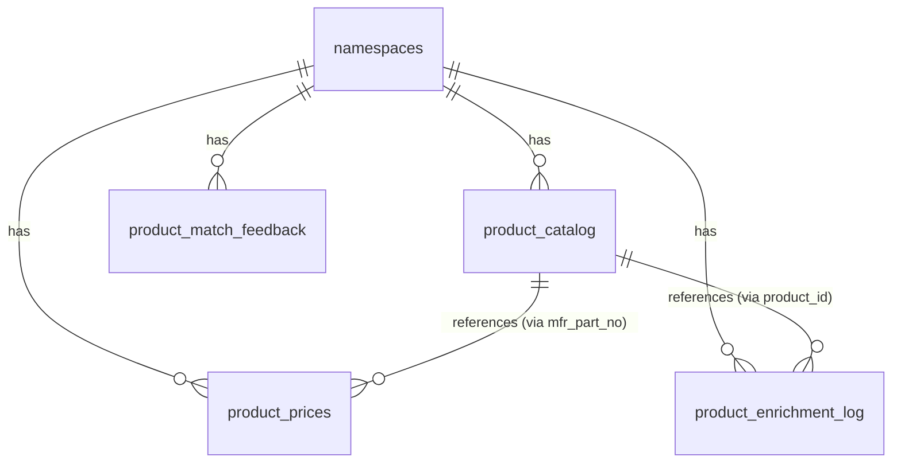
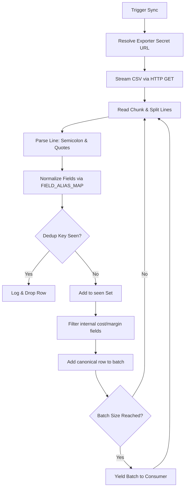
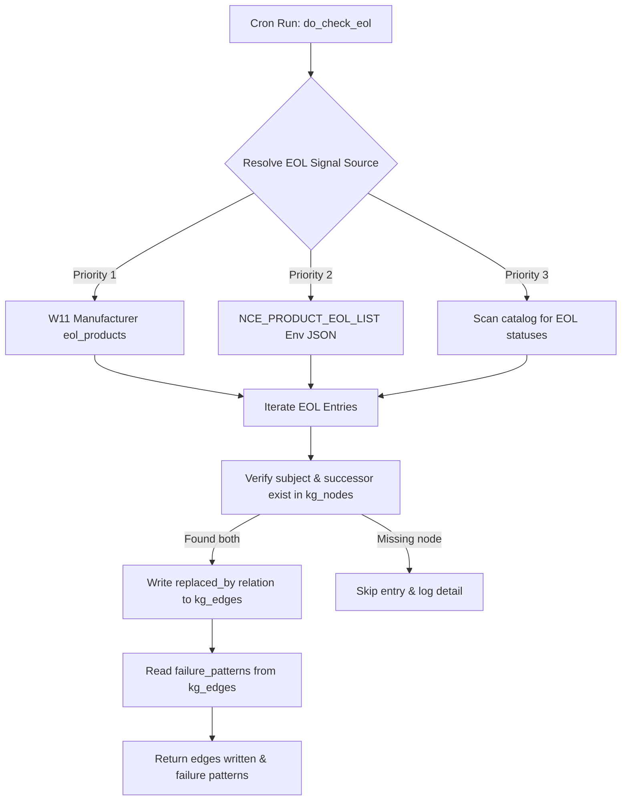

> **Status:** shipped · **Verified-against:** 7304330 (main) · **Last-audited:** 2026-08-17

# Product Engine Admin Guide (Doc 66)

> **Status:** shipped · **Verified-against:** 7304330 (main) · **Last-audited:** 2026-08-17

The **Product Engine** (`nce/vertical_modules/product/`) is the backbone of the NCE product catalog, containing product schema definitions, multi-source ingestion pipelines, pricing calculation nodes, and on-demand AI enrichment logic. This guide provides administrators with technical instructions to enable, configure, and monitor the Product Engine. It details database schemas, Row-Level Security (RLS) policies, feed adapters (such as Nettailer), lifecycle watchers, pricing boundaries, and enrichment queues.

---

## 1. Engine Configuration & Enablement

### 1.1 Global Environment Configurations
The global behaviors, boundaries, and timeouts of the Product Engine are controlled via standard environment variables defined in [_guard.py](https://github.com/sindrehaugen/NCE/blob/main/nce/vertical_modules/product/_guard.py), [nettailer.py](https://github.com/sindrehaugen/NCE/blob/main/nce/vertical_modules/product/sources/nettailer.py), [enrich.py](https://github.com/sindrehaugen/NCE/blob/main/nce/vertical_modules/product/enrich.py), and [watchers.py](https://github.com/sindrehaugen/NCE/blob/main/nce/vertical_modules/product/watchers.py). All parameters are prefix-enforced (`NCE_PRODUCT_*`).

*   **`NCE_PRODUCT_ENABLED`** (Boolean)  
    *   *Description:* Global flag to toggle the Product Engine REST routes, MCP handlers, and Watcher routines.
*   **`NCE_PRODUCT_SOURCES`** (String)  
    *   *Description:* Comma-separated list of active feed/document adapters (e.g., `nettailer,cisco,microsoft`).
*   **`NCE_PRODUCT_NETTAILER_PRODUCT_URL`** (String / Secret)  
    *   *Description:* Semicolon-delimited remote export CSV feed URL from Netset/Nettailer, including a secret GUID. Resolved at call-time via `resolve_secret`; must never be logged.
*   **`NCE_PRODUCT_SYNC_BATCH_SIZE`** (Integer)  
    *   *Description:* Buffer chunk count yielded during feed synchronization to control memory overhead.  
    *   *Default:* `2000` (min: `1`).
*   **`NCE_PRODUCT_HTTP_TIMEOUT`** (Float)  
    *   *Description:* Timeout in seconds for HTTP feed fetching connections.  
    *   *Default:* `30.0` (min: `1.0`).
*   **`NCE_PRODUCT_SEMANTIC_ENABLED`** (Boolean)  
    *   *Description:* Opt-in toggle to use vector embeddings for product searching. Disabled by default until one-time bulk backfill is completed.
*   **`NCE_PRODUCT_ENRICH_MIN_CONFIDENCE`** (Float)  
    *   *Description:* Threshold below which proposed metadata values are routed to the review queue.  
    *   *Default:* `0.70` (range: `0.0` to `1.0`).
*   **`NCE_PRODUCT_EOL_WARN_DAYS`** (Integer)  
    *   *Description:* Warning horizon in days for EOL/EOS product alerts.  
    *   *Default:* `60`.
*   **`NCE_PRODUCT_EOL_LIST`** (JSON String / Secret)  
    *   *Description:* Config-seeded EOL/EOS replacement list utilized when manufacturer API adapters are unconfigured or unavailable.  
    *   *Format:* `[{"mfr_part_no": "...", "manufacturer": "...", "successor_mfr_part_no": "...", "successor_manufacturer": "...", "confidence": 0.9}, ...]`

### 1.2 Tenant Namespace Activation
The Product Engine runs on a strict tenant-isolation model. Tenant namespaces must explicitly opt-in to activate the module. This activation is checked at the MCP handler and REST API boundaries via the `require_product_enabled` check defined in [_guard.py](https://github.com/sindrehaugen/NCE/blob/main/nce/vertical_modules/product/_guard.py).

Activation is governed by the JSONB `metadata` column on the tenant's row in the `namespaces` table:
```json
{
  "product": {
    "enabled": true
  }
}
```

> [!WARNING]
> If `metadata->'product'->>'enabled'` resolves to `false` or is omitted, the namespace guard will raise a `ProductDisabledError`, and all requests or synchronization triggers for that namespace will fail-closed.

---

## 2. Database Schema & Row-Level Security (RLS)

All Product Engine tables enforce tenant-isolation via Row-Level Security (RLS) linked to the active tenant's transaction GUC set by `get_nce_namespace()`.



### 2.1 Table Definitions

#### `product_catalog`
The master repository storing normalized product catalog records. Coded ETIM data is stored in the JSONB `etim_specs` field to capture field-level confidence and provenance.
```sql
CREATE TABLE IF NOT EXISTS product_catalog (
    id                UUID        NOT NULL DEFAULT gen_random_uuid(),
    namespace_id      UUID        NOT NULL REFERENCES namespaces(id) ON DELETE CASCADE,
    gtin              TEXT,
    manufacturer      TEXT        NOT NULL,
    mfr_part_no       TEXT        NOT NULL,
    product_source_id TEXT        NOT NULL,
    lifecycle_status  TEXT        NOT NULL DEFAULT 'active',
    is_deleted        BOOLEAN     NOT NULL DEFAULT false,
    etim_specs        JSONB       NOT NULL DEFAULT '{}'::jsonb,
    created_at        TIMESTAMPTZ NOT NULL DEFAULT now(),
    updated_at        TIMESTAMPTZ NOT NULL DEFAULT now(),
    PRIMARY KEY (id),
    UNIQUE (namespace_id, manufacturer, mfr_part_no)
);

CREATE INDEX IF NOT EXISTS idx_product_catalog_namespace_mfr_mfr_part_no
    ON product_catalog (namespace_id, manufacturer, mfr_part_no);

CREATE INDEX IF NOT EXISTS idx_product_catalog_namespace_gtin
    ON product_catalog (namespace_id, gtin)
    WHERE gtin IS NOT NULL;

CREATE INDEX IF NOT EXISTS idx_product_catalog_namespace_is_deleted
    ON product_catalog (namespace_id, is_deleted);
```

#### `product_prices`
Stores the price index records, incorporating list, cost, and customer-specific BID pricing.
```sql
CREATE TABLE IF NOT EXISTS product_prices (
    id            UUID        NOT NULL DEFAULT gen_random_uuid(),
    namespace_id  UUID        NOT NULL REFERENCES namespaces(id) ON DELETE CASCADE,
    mfr_part_no   TEXT        NOT NULL,
    supplier      TEXT        NOT NULL,
    bid_id        TEXT        NOT NULL,
    list_price    NUMERIC,
    cost_price    NUMERIC,
    created_at    TIMESTAMPTZ NOT NULL DEFAULT now(),
    updated_at    TIMESTAMPTZ NOT NULL DEFAULT now(),
    PRIMARY KEY (id),
    UNIQUE (namespace_id, mfr_part_no, supplier, bid_id)
);

CREATE INDEX IF NOT EXISTS idx_product_prices_namespace_mfr_part_no
    ON product_prices (namespace_id, mfr_part_no);

CREATE INDEX IF NOT EXISTS idx_product_prices_namespace_supplier
    ON product_prices (namespace_id, supplier);
```

#### `product_match_feedback`
An append-only, write-once table capturing user acceptance or override decisions for BOM-to-SKU matching. This feeds the C1 learned resolver feedback loop.
```sql
CREATE TABLE IF NOT EXISTS product_match_feedback (
    id            UUID        NOT NULL DEFAULT gen_random_uuid(),
    namespace_id  UUID        NOT NULL REFERENCES namespaces(id) ON DELETE CASCADE,
    bom_line      TEXT        NOT NULL,
    chosen_sku    TEXT,
    rejected_sku  TEXT,
    decision      TEXT        NOT NULL CHECK (decision IN ('accept', 'override')),
    matched_score NUMERIC,
    created_at    TIMESTAMPTZ NOT NULL DEFAULT now(),
    PRIMARY KEY (id)
);

CREATE INDEX IF NOT EXISTS idx_product_match_feedback_namespace_created
    ON product_match_feedback (namespace_id, created_at DESC);
```

#### `product_enrichment_log`
An append-only log backing the human-in-the-loop review queue for on-demand metadata proposals.
```sql
CREATE TABLE IF NOT EXISTS product_enrichment_log (
    id                UUID        NOT NULL DEFAULT gen_random_uuid(),
    namespace_id      UUID        NOT NULL REFERENCES namespaces(id) ON DELETE CASCADE,
    product_id        UUID        NOT NULL REFERENCES product_catalog(id) ON DELETE CASCADE,
    trigger_context   JSONB       NOT NULL DEFAULT '{}'::jsonb,
    field_name        TEXT        NOT NULL,
    field_value       TEXT,
    confidence        NUMERIC(5,4) NOT NULL CHECK (confidence >= 0 AND confidence <= 1),
    needs_review      BOOLEAN     NOT NULL DEFAULT true,
    product_source_id TEXT,
    created_at        TIMESTAMPTZ NOT NULL DEFAULT now(),
    PRIMARY KEY (id)
);

CREATE INDEX IF NOT EXISTS idx_product_enrichment_log_namespace_product
    ON product_enrichment_log (namespace_id, product_id, created_at DESC);

CREATE INDEX IF NOT EXISTS idx_product_enrichment_log_needs_review
    ON product_enrichment_log (namespace_id, needs_review, created_at DESC)
    WHERE needs_review = true;
```

> [!IMPORTANT]
> **Default Review Gating:**
> The `needs_review` column defaults to `true` (`DEFAULT true`). All AI proposals default to requiring review, preventing unverified or hallucinated specs from being auto-promoted into master catalog records.

### 2.2 Row-Level Security Policies
Every operational table enables RLS and explicitly forces isolation using the tenant context GUC:

```sql
-- Enable and Force RLS
ALTER TABLE product_catalog ENABLE ROW LEVEL SECURITY;
ALTER TABLE product_catalog FORCE ROW LEVEL SECURITY;

ALTER TABLE product_prices ENABLE ROW LEVEL SECURITY;
ALTER TABLE product_prices FORCE ROW LEVEL SECURITY;

ALTER TABLE product_match_feedback ENABLE ROW LEVEL SECURITY;
ALTER TABLE product_match_feedback FORCE ROW LEVEL SECURITY;

ALTER TABLE product_enrichment_log ENABLE ROW LEVEL SECURITY;
ALTER TABLE product_enrichment_log FORCE ROW LEVEL SECURITY;

-- Tenant Isolation Policies
CREATE POLICY tenant_isolation_policy ON product_catalog
    FOR ALL TO nce_app
    USING  (namespace_id IS NOT NULL AND namespace_id = get_nce_namespace())
    WITH CHECK (namespace_id IS NOT NULL AND namespace_id = get_nce_namespace());

CREATE POLICY tenant_isolation_policy ON product_prices
    FOR ALL TO nce_app
    USING  (namespace_id IS NOT NULL AND namespace_id = get_nce_namespace())
    WITH CHECK (namespace_id IS NOT NULL AND namespace_id = get_nce_namespace());

CREATE POLICY tenant_isolation_policy ON product_match_feedback
    FOR ALL TO nce_app
    USING  (namespace_id IS NOT NULL AND namespace_id = get_nce_namespace())
    WITH CHECK (namespace_id IS NOT NULL AND namespace_id = get_nce_namespace());

CREATE POLICY tenant_isolation_policy ON product_enrichment_log
    FOR ALL TO nce_app
    USING  (namespace_id IS NOT NULL AND namespace_id = get_nce_namespace())
    WITH CHECK (namespace_id IS NOT NULL AND namespace_id = get_nce_namespace());
```

### 2.3 Access Control & Grants
The restricted application role `nce_app` is granted minimal operational privileges. Update and delete rights are revoked completely for append-only log tables (`product_match_feedback` and `product_enrichment_log`).

```sql
REVOKE ALL ON TABLE product_catalog FROM nce_app;
GRANT SELECT, INSERT, UPDATE, DELETE ON TABLE product_catalog TO nce_app;

REVOKE ALL ON TABLE product_prices FROM nce_app;
GRANT SELECT, INSERT, UPDATE, DELETE ON TABLE product_prices TO nce_app;

REVOKE ALL ON TABLE product_match_feedback FROM nce_app;
GRANT SELECT, INSERT ON TABLE product_match_feedback TO nce_app;

REVOKE ALL ON TABLE product_enrichment_log FROM nce_app;
GRANT SELECT, INSERT ON TABLE product_enrichment_log TO nce_app;
```

---

## 3. Nettailer Source Feed Synchronization

The Nettailer source adapter [nettailer.py](https://github.com/sindrehaugen/NCE/blob/main/nce/vertical_modules/product/sources/nettailer.py) streams CSV feed files from the Nettailer/Netset exporter, normalizes column aliases, deduplicates records, and yields clean, customer-facing canonical data.



### 3.1 Streaming & Memory Constraints
Loading high-volume export CSVs directly into memory would breach RAM limits. The adapter enforces streaming behavior using HTTPX stream parsing:
1.  Downloads raw data bytes in small chunks asynchronously.
2.  Splits chunks by lines and decodes them into complete UTF-8 sequences. If a multi-byte character falls on a chunk boundary, the adapter caches trailing bytes and decodes them with the subsequent chunk.
3.  Accumulates parsed records into batches defined by `NCE_PRODUCT_SYNC_BATCH_SIZE` (default `2000`) before yielding them, keeping the RAM footprint flat.

### 3.2 Idempotency and Deduplication
1.  **Unique Natural Key:** The dedup key is `(manufacturer, mfr_part_no)`. Columns are lowercased and stripped of whitespace before hashing.
2.  **Deduplication Constraint:** The generator keeps an in-memory `seen` set of processed keys. If the feed contains duplicate rows with the same natural key, only the *first* occurrence is yielded. Subsequent records are dropped.

### 3.3 Security & Secret Handling
The Nettailer feed export URL contains a sensitive GUID token. To prevent leakage:
*   The raw URL is retrieved at execution time using `resolve_secret("NCE_PRODUCT_NETTAILER_PRODUCT_URL")`.
*   The raw URL is **never** printed to logs, exposed via API endpoints, or written back to database tables.

### 3.4 Cost/Margin Stripping
To maintain compliance with **ADR-0017**, internal pricing parameters must never exit the module's boundary.
*   **Internal Fields:** Columns containing cost details (`unit_cost`, `bid_price`, `supplier_price`) are lowercased and mapped to their canonical internal names.
*   **Safe Projection:** Before yielding, the batch is filtered through the `public_row()` function, which strips all fields marked as internal. Only safe, public catalog data is returned externally.

---

## 4. EOL/EOS Watcher Scheduler Task

The lifecycle watcher [watchers.py](https://github.com/sindrehaugen/NCE/blob/main/nce/vertical_modules/product/watchers.py) is a scheduled task that identifies products approaching End-of-Life (EOL) or End-of-Sale (EOS), maps successors, and populates relationship graphs.



### 4.1 Signal Priority Hierarchy
When resolving EOL/EOS signals, the watcher runs through three priority tiers to support graceful degradation:
1.  **Priority 1:** Dynamic list returned by the W11 manufacturer API adapter (`eol_products()`), if active.
2.  **Priority 2:** Static JSON list defined in the `NCE_PRODUCT_EOL_LIST` environment variable.
3.  **Priority 3:** Local scan of `product_catalog` rows where `lifecycle_status` matches known EOL strings (`'eol'`, `'eos'`, `'end_of_life'`, `'end_of_sale'`, `'discontinued'`) and contains a valid `successor_sku` reference.

### 4.2 Graph Modification Constraints
> [!IMPORTANT]
> The Watcher is design-isolated. It **never** mutates rows in the `product_catalog` table or updates price records. 

*   To link EOL products to their replacement successors, it writes `replaced_by` relation edges to the `kg_edges` table via `upsert_product_relation_edge()`.
*   If a product is flagged EOL, the watcher queries the knowledge graph for any `failure_pattern` edges written back by Support or Assets engines (via `get_failure_patterns()`).

### 4.3 Scheduler Decoupling
To avoid structural coupling, the Watcher does **not** import or initialize the system's cron scheduler. Instead, the task is written as a core callable `do_check_eol(engine, args)` that takes the active database pool and tenant `namespace_id` in its parameters.

---

## 5. Pricing Resolution & BID-Price Security Boundaries

Product pricing is handled via the pricing engine [pricing.py](https://github.com/sindrehaugen/NCE/blob/main/nce/vertical_modules/product/pricing.py), which interfaces with the C6 shared pricing service. All cost resolution, discount structures, and contract-specific BID prices are kept strictly behind internal boundaries.

### 5.1 Pricing Hierarchy and Resolution
Price calculations are resolved using a hierarchy:
$$\text{Active Customer BID Price} \succ \text{Supplier List Price} \succ \text{Base Price}$$

The system resolves prices via `nce.pricing.resolve_price`. When calculating the final sales price, the engine fetches the target tenant's margin structure from `product-dg.json` config-as-IP and converts resolved cost to sales price via:
$$\text{Sales Price} = \frac{\text{Resolved Cost}}{1 - \text{DG}\%}$$

### 5.2 Freshness and Staleness Tracking
Calculations are accompanied by a `stale` boolean flag. If the timestamp (`as_of`) of the resolved cost row is older than the configured threshold `NCE_PRICING_MAX_AGE` (seconds), the `stale` flag returns `True`.

### 5.3 ADR-0017 Security Boundaries
To prevent the leakage of sensitive financial data, internal cost rates, margins, and raw BID margins are stripped at the boundary of `do_price_product`. The returned dictionary exposes only customer-facing keys: `sales_price`, `source`, `as_of`, and `stale`.

---

## 6. On-Demand AI Enrichment & Golden Record Survivorship

The Product Engine utilizes a localized on-demand AI enrichment strategy. The catalog is never scanned in bulk by AI modules.

### 6.1 The "Never Bulk" Invariant
Enrichment triggers *only* when a product containing missing fields is added to an active **QUOTE** or **DESIGN** workspace. The API call `do_enrich_product` is scoped to exactly one `product_id`.

### 6.2 Async Fire-and-Backfill Workflow
1.  When a product with missing data enters a workspace, the system returns current local specifications immediately.
2.  The engine enqueues an asynchronous enrichment job and returns to the caller.
3.  The asynchronous job retrieves datasheet specifications or queries manufacturer API adapters, writes proposals to the database, and backfills the catalog.

### 6.3 Confidence Gates & Review Queue
Proposed specs are evaluated against the global `NCE_PRODUCT_ENRICH_MIN_CONFIDENCE` threshold (default `0.70`).
*   **Sub-Threshold Proposals:** If the AI confidence score is below the threshold, the proposal is flagged `needs_review = true` and logged to the `product_enrichment_log` review queue. It is blocked from catalog merging until manually confirmed.
*   **High-Confidence Proposals:** Non-money/legal proposals with confidence at or above the threshold are automatically merged into `product_catalog.etim_specs`.
*   **Money and Legal Capping Guard:** In compliance with financial security guidelines (§9.3 Guard), high-risk fields ALWAYS bypass auto-approval and are flagged for human verification (`needs_review = true`), regardless of AI confidence.
    *   *Money/Legal Fields:* `price`, `cost`, `msrp`, `list_price`, `warranty`, `warranty_terms`, `compliance`, `certification`, `legal`, `contract_terms`.

### 6.4 ETIM-Coded Spec Storage Schema
ETIM features are merged into the `etim_specs` JSONB column. Each field records value, confidence score, verbalized confidence band, and source provenance:
```json
{
  "control_processor_ports": {
    "value": "8-port RS232",
    "confidence": 0.95,
    "verbalized": "very_high",
    "source": "crestron-api-v1"
  }
}
```

---

## 7. MCP Tool Reference (6 Tools)

The Product Engine registers **6 MCP tools** in `nce/tool_registry.py` via `_h(product_mcp_handlers, "handle_*")`:

| Tool Name | Cacheable | Mutation | Admin Only | Description |
|---|:---:|:---:|:---:|---|
| `product_search` | ✔ | ✘ | ✘ | Keyword and full-text search over `product_catalog` (lexical floor with safe projections). |
| `product_get` | ✔ | ✘ | ✘ | Fetches master product record, public list prices, and outbound knowledge graph edges. |
| `product_price` | ✔ | ✘ | ✘ | Resolves customer sales price via C6 shared pricing service and margin math (ADR-0017). |
| `product_related` | ✔ | ✘ | ✘ | Derives and persists related-product edges (`accessory_of`, `warranty_for`, `mounts`, `replaced_by`). |
| `product_match_bom_line` | ✘ | ✘ | ✘ | Resolves free-text BOM lines to SKUs via C1 `resolve()` and records operator feedback. |
| `product_enrich` | ✘ | ✔ | ✘ | On-demand AI enrichment for one product through the C2 `@governed` gate (confirm-only default). |

### Tool Handler Signatures & Arguments:

#### 1. `product_search`
* **Handler:** `handle_product_search` ([mcp_handlers.py](https://github.com/sindrehaugen/NCE/blob/main/nce/vertical_modules/product/mcp_handlers.py))
* **Required Arguments:** `namespace_id` (str, UUID), `query` (str)
* **Optional Arguments:** `limit` (int, default 20, max 50)
* **Returns:** `{"results": [...], "total": int}` (Safe projection: `cost_price`, `bid_id`, `margin` stripped).

#### 2. `product_get`
* **Handler:** `handle_product_get` ([mcp_handlers.py](https://github.com/sindrehaugen/NCE/blob/main/nce/vertical_modules/product/mcp_handlers.py))
* **Required Arguments:** `namespace_id` (str, UUID), `mfr_part_no` (str)
* **Optional Arguments:** `manufacturer` (str)
* **Returns:** `{"product": {...}, "prices": [...], "edges": [...]}`

#### 3. `product_price`
* **Handler:** `handle_product_price` ([mcp_handlers.py](https://github.com/sindrehaugen/NCE/blob/main/nce/vertical_modules/product/mcp_handlers.py))
* **Required Arguments:** `namespace_id` (str, UUID), `mfr_part_no` (str)
* **Optional Arguments:** `customer_id` (str), `quantity` (int)
* **Returns:** `{"sales_price": float, "source": str, "as_of": str, "stale": bool}`

#### 4. `product_related`
* **Handler:** `handle_product_related` ([mcp_handlers.py](https://github.com/sindrehaugen/NCE/blob/main/nce/vertical_modules/product/mcp_handlers.py))
* **Required Arguments:** `namespace_id` (str, UUID), `mfr_part_no` (str)
* **Optional Arguments:** `manufacturer` (str)
* **Returns:** `{"edges_written": int, "relations": [...]}`

#### 5. `product_match_bom_line`
* **Handler:** `handle_product_match_bom_line` ([mcp_handlers.py](https://github.com/sindrehaugen/NCE/blob/main/nce/vertical_modules/product/mcp_handlers.py))
* **Required Arguments:** `namespace_id` (str, UUID), `raw_line` (str)
* **Optional Arguments:** `manufacturer` (str), `mfr_part_no` (str), `decision` (str: `'accept'` or `'override'`), `chosen_sku` (str), `rejected_sku` (str)
* **Returns:** Ranked matches list or confirmation of feedback recorded in `product_match_feedback`.

#### 6. `product_enrich`
* **Handler:** `handle_product_enrich` ([mcp_handlers.py](https://github.com/sindrehaugen/NCE/blob/main/nce/vertical_modules/product/mcp_handlers.py))
* **Required Arguments:** `namespace_id` (str, UUID), `product_id` (str, UUID), `trigger_context` (dict: `{kind, ref_id, missing_fields, source_watermark}`)
* **Optional Arguments:** `confirm` (bool, default `False`), `idempotency_key` (str)
* **Returns:** `{"status": "pending_approval", ...}` (if `confirm=False`) or execution report with updated specs and review queue entries.

---

## 8. REST API Reference (3 Routes)

Mounted via `nce/admin_app.py` and implemented in `nce/admin_handlers/product.py`:

| Method | Route Path | Handler Function | Description |
|---|---|---|---|
| `GET` | `/api/product/search` | `api_product_search` | Keyword and FTS product search over `product_catalog` with safe column projections. |
| `GET` | `/api/product/{id}` | `api_product_get` | Profile lookup by product UUID or part number with live prices and knowledge graph edges. |
| `GET` | `/api/product/enrichment/review` | `api_product_enrichment_review` | Review queue query endpoint returning proposals where `needs_review = true`. |

### Endpoint Details:

#### `GET /api/product/search`
* **Query Parameters:** `namespace_id` (UUID, required), `query` or `q` (string, required), `limit` (integer, optional)
* **Status Codes:** `200 OK`, `400 Bad Request` (missing/invalid namespace or query), `409 Conflict` (product module not enabled for namespace).

#### `GET /api/product/{id}`
* **Path Parameters:** `id` (UUID or `mfr_part_no`)
* **Query Parameters:** `namespace_id` (UUID, required)
* **Status Codes:** `200 OK`, `404 Not Found`, `400 Bad Request`, `409 Conflict`.

#### `GET /api/product/enrichment/review`
* **Query Parameters:** `namespace_id` (UUID, required), `product_id` (UUID, optional), `limit` (integer, optional)
* **Status Codes:** `200 OK`, `400 Bad Request`, `409 Conflict`.
