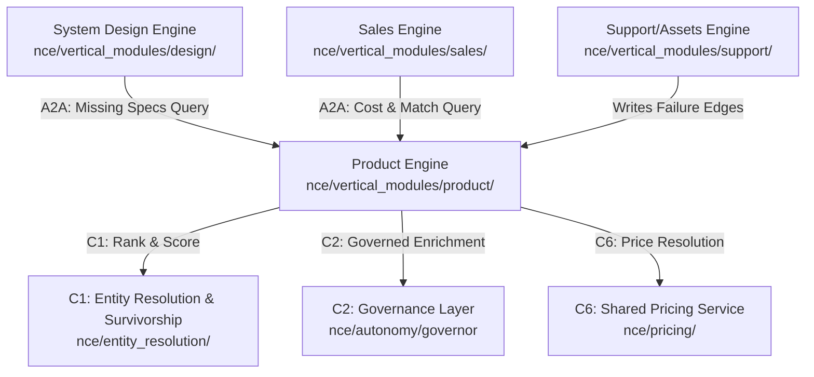
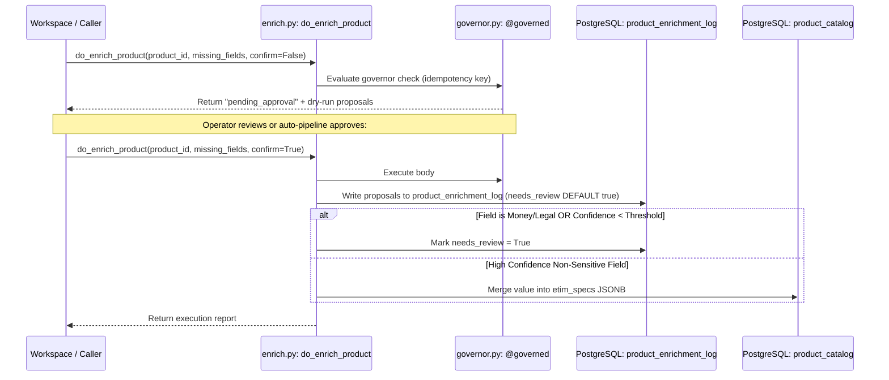

> **Status:** shipped · **Verified-against:** 7304330 (main) · **Last-audited:** 2026-08-17

# Product Engine User Guide (Doc 65)

> **Status:** shipped · **Verified-against:** 7304330 (main) · **Last-audited:** 2026-08-17

The **Product Engine** (`nce/vertical_modules/product/`) serves as the canonical catalog authority and product graph backbone for the Neuro-Cognitive Engine (NCE). It manages the ingest, identity resolution, pricing, relatedness mapping, and on-demand enrichment of product data.

Rather than maintaining a bloated static catalog, NCE combines structured multi-source ingestion (e.g., Nettailer/Netset CSV feeds) with **on-demand AI enrichment**, converting unformatted manufacturer specifications and datasheets into structured, ETIM-coded, and confidence-scored product records at the moment they enter a quote or design workspace.

---

## 1. Core Architectural Boundaries & Separation of Concerns

The Product Engine maintains strict isolation from surrounding vertical modules. It owns the master catalog definitions but delegates adjacent business logic (such as pricing arithmetic or generalized entity matching) to NCE's shared services.



### Separated Domains:
1. **Product Engine:** Owns catalog tables (`product_catalog`, `product_prices`), derives product relations, manages enrichment logs, and normalizes incoming manufacturer definitions.
2. **C1 Entity Resolution & Survivorship:** Standardizes name/brand keys, ranks candidate nodes via trigram matches in Postgres (`pg_trgm`), and resolves field-level conflicts based on source trust, recency, and confidence.
3. **C2 Autonomy Governance:** Wraps mutating workflows (like product enrichment) in a human-in-the-loop transaction gate that enforces manual confirmation and logs executions to the audit ledger.
4. **C6 Shared Pricing Service:** Maintains pricing logic. It calculates actual cost hierarchies (Customer BID > Supplier List > Base) and applies margin percentages, protecting raw costs from leaking.
5. **Support/Assets Engine:** Feeds failure events (`TICKET/ASSET -[failure_pattern]-> PRODUCT`) back into the knowledge graph, which the Product Engine surfaces to alert designers against unreliable components.

---

## 2. Product Search & Retrieval

Product retrieval is accessed through the core functions `do_search_products` and `do_get_product`, which are exposed via REST routes and MCP tools.

### 2.1 Hybrid Search (`do_search_products`)
To support fast retrieval across over 552k product records, the search pipeline executes a hybrid lexical and semantic strategy:
* **Lexical Floor (Tier-1):** Direct PostgreSQL full-text search (`to_tsvector` + `plainto_tsquery`) over indexed columns (`manufacturer`, `mfr_part_no`). If the search term is shorter than 3 characters, the engine falls back to an `ILIKE` pattern match. Safe projections strip internal cost, margin, and BID identifiers per ADR-0017.
* **Semantic Layer (Tier-2):** Controlled by `NCE_PRODUCT_SEMANTIC_ENABLED`. It generates search embeddings using the shared vector space, searching against embedded product specifications and datasheets stored in the `memories` table. If the embedding database is down or not backfilled, it gracefully degrades to the lexical floor.

### 2.2 Profile Retrieval (`do_get_product`)
Retrieving a single product fetches its canonical master details and merges them with live prices and related product edges:
1. Fetches canonical specs from the `product_catalog` table.
2. Fetches live list prices from `product_prices` (excluding raw cost price and BID id).
3. Performs a graph query to collect all outbound edges (`accessory_of`, `warranty_for`, `mounts`, `replaced_by`) from `kg_edges`.

---

## 3. On-Demand Product Enrichment (`@governed` / C2)

Located in `nce/vertical_modules/product/enrich.py`, `do_enrich_product` is the centerpiece of the engine's data-gathering pipeline.

### 3.1 The "Never Bulk Scan" Rule
Enrichment is event-driven and strictly scoped to a single `product_id`. AI models **never** perform bulk updates or scans over the catalog. AI-driven enrichment is triggered only when:
* A product with missing specs is added to a **Quote** workspace.
* A product with missing specs is added to a **Design** workspace.

This constraint keeps database reads minimal and ensures AI credits are only spent on products actively generating business value.

### 3.2 The C2 Governed Enrichment Loop
To prevent unverified AI modifications, `do_enrich_product` is decorated with `@governed(action_type="product_enrich")`. This enforces:
* **Confirm-Only by Default:** The function executes in dry-run mode unless called with `confirm=True`. Unconfirmed calls return a `pending_approval` state.
* **Idempotency Safeguards:** Callers pass or derive a stable `idempotency_key`:
  $$\text{idempotency\_key} = \text{SHA256}(\text{product\_id} + \text{sorted}(\text{missing\_fields}) + \text{source\_watermark})$$
  If a call is replayed with the same key, the governor bypasses execution and returns the cached result.
* **Audit Trail:** Successful executions are recorded in NCE's append-only `event_log` table.



### 3.3 Confidence Thresholds & Verbalization (ADR-0017 / A4)
NCE confidence scores (0.0 to 1.0) represent verbalized self-ratings and consensus models:
* `0.90` – `1.00` $\rightarrow$ `"very_high"`
* `0.75` – `0.89` $\rightarrow$ `"high"`
* `0.55` – `0.74` $\rightarrow$ `"medium"`
* `0.00` – `0.54` $\rightarrow$ `"low"`

If a proposed field value falls below the minimum confidence threshold defined by `NCE_PRODUCT_ENRICH_MIN_CONFIDENCE` (defaults to `0.70`), it is flagged with `needs_review=True` in `product_enrichment_log` and is blocked from updating the catalog.

### 3.4 §9.3 Money/Legal Guard
Downstream financial, certification, and legal fields carry strict risk profiles. Under §9.3, the following fields **can never be auto-merged**, regardless of their AI confidence score:

> **Governed Money & Legal Fields:**
> `price`, `cost`, `msrp`, `list_price`, `warranty`, `warranty_terms`, `compliance`, `certification`, `legal`, `contract_terms`

When an enrichment proposal touches these fields, the engine always writes them to `product_enrichment_log` with `needs_review=True` and redirects them to the operator review queue.

---

## 4. Accessory, Warranty, Mount & Replacement Relationships (`related.py`)

The Product Engine automatically maps compatibility and lifecycle relationships between products on-read and persists them into the graph database.

### 4.1 Graph Contribution
Four directional predicates are written to `kg_edges`. In alignment with NCE graph standards, **confidence scores are stored strictly on the edge**, never on the node:
* `PRODUCT -[accessory_of]-> PRODUCT`
* `PRODUCT -[warranty_for]-> PRODUCT`
* `PRODUCT -[mounts]-> PRODUCT`
* `PRODUCT -[replaced_by]-> PRODUCT`

### 4.2 Model Token Extraction & Matching
To compare products without relying on strict database mappings, `related.py` parses product numbers into model tokens:
1. **`_extract_model_tokens(manufacturer, mfr_part_no)`:** Splits the part number on `[-/ _.]` and upper-cases each token. The upper-cased manufacturer name is prepended as the first token (index 0).
2. **`_classify_relation(subject_tokens, cand_mfr, cand_part)`:**
   * **Warranty:** If the candidate part number contains `WARR`, `WARRANTY`, `CARE`, `MAINT`, `SVC`, `SERVICE`, `SUPPORT`, or `SUP`, it is mapped to `warranty_for` with confidence `conf_warranty` (default `0.90`).
   * **Mounts:** If the candidate part number contains `MOUNT`, `RACK`, `BRACKET`, `TRAY`, `RAIL`, `KIT`, or `RKMNT`, it is mapped to `mounts` with confidence `conf_mount` (default `0.85`).
   * **Accessories:** If the candidate shares the same manufacturer (token index 0 matches) and shares at least `min_shared_tokens` (default `2`) model tokens, it is mapped to `accessory_of`.
3. **`_find_replacements`:** If the subject product's `lifecycle_status` is `eol`, `discontinued`, or `obsolete`, active candidates sharing the manufacturer and part tokens map to `replaced_by` with confidence `conf_replacement` (default `0.95`).

---

## 5. BOM SKU Matching (`do_match_bom_line`)

Located in `nce/vertical_modules/product/matching.py`, `do_match_bom_line` resolves a free-text line item from a Bill of Materials (BOM) to the best matching catalog SKU.

### 5.1 Delegation to C1 Resolve
To ensure consistent matching across the system, the matching module delegates candidate ranking to the C1 entity resolution primitive (`resolve()`):
```python
matches = await resolve(
    conn,
    namespace_id=namespace_id,
    candidate=candidate,
    keys=["manufacturer", "mfr_part_no", "name"],
    node_type="PRODUCT_SKU",
)
```

### 5.2 Feedback Loop (WORM Invariant)
When an operator accepts a match or overrides it with another SKU, the decision is written to `product_match_feedback`:
* The table is **Write-Once-Read-Many (WORM)**: only `INSERT` operations are permitted.
* Feedback logs are consumed by background recalibration routines to improve resolver accuracy over time.

---

## 6. Field-Level Golden Record & Survivorship Rules (C1)

Located in `nce/vertical_modules/product/golden_record.py`, `do_golden_record` determines the winning value for each field of a deduplicated product record.

### 6.1 The C1 Survivorship Chain
When multiple data sources (such as manufacturer datasheets, Netset CSV feeds, or AI enrichment proposals) claim different values for the same field, the engine delegates resolving the winner to the C1 `survive()` primitive:

$$\text{Source Trust} \gg \text{Recency (as\_of)} \gg \text{Confidence}$$

1. **Source Trust:** Each source has an associated trust rating (e.g., manufacturer API = `0.9`, distributor feed = `0.7`, AI enrichment = `0.5`). The source with the highest trust wins.
2. **Recency:** If the trust scores are equal, the value with the newer `as_of` timestamp wins.
3. **Confidence:** If both trust and recency are identical, the value with the higher confidence rating wins.

### 6.2 The Two-Score Quality Model
Before promoting a product, the engine evaluates its data quality:
* **Completeness Score:** A ratio (0.0 to 1.0) indicating how many required fields are present in the product's `etim_specs` JSONB for a target channel (`b2b_portal`, `quote`, `design`).
* **Quality Grade (A to E):** Measures metadata consistency and provenance integrity.

### 6.3 The Publish Gate
To be promoted to a "trusted" status in downstream channels, a product must pass two checks evaluated in `_run_publish_gate()`:
1. **Grade Threshold:** The calculated quality grade must be equal to or better than `TRUSTED_MIN_GRADE` (default `"C"`).
2. **Review Verification:** The product must not have any unreviewed proposals in `product_enrichment_log` (where `needs_review = true`).

---

## 7. Resolved Pricing & DG Calculations (`do_price_product`)

The Product Engine exposes a unified pricing calculation utility `do_price_product` which delegates logic execution to the C6 pricing module.

### 7.1 Tier Resolution & Margin Math
Rather than performing raw calculations in the catalog, the engine routes requests through `resolve_price` and `dg_price`:
1. **`resolve_price`:** Selects the active cost using a freshness-ranked hierarchy:
   $$\text{Customer Contracted BID} > \text{Supplier List Price} > \text{Base Cost}$$
2. **`dg_price`:** Calculates the customer sales price by applying the target contribution margin percentage (DG%) configured in `product-dg.json`:
   $$\text{sales\_price} = \frac{\text{resolved\_cost}}{1 - \text{DG\%}}$$

### 7.2 ADR-0017 Cost-Masking Invariant
To prevent leakage of sensitive financial data, raw costs, margins, and vendor BID ids are strictly kept within the internal domain space. They are stripped from the output, and only customer-facing properties are returned (`sales_price`, `source`, `as_of`, `stale`).

---

## 8. Configuration & Database Reference

### 8.1 Configuration Keys (`NCE_PRODUCT_*`)
All configurations are defined in the tenant namespace to prevent host-specific environment issues:
* `NCE_PRODUCT_ENABLED`: Master flag to enable the engine.
* `NCE_PRODUCT_SOURCES`: Comma-separated list of active adapters (e.g., `nettailer,cisco,microsoft`).
* `NCE_PRODUCT_NETTAILER_PRODUCT_URL`: Semicolon-delimited Nettailer CSV URL including secret GUID. *Resolved via secret manager; never logged.*
* `NCE_PRODUCT_SYNC_BATCH_SIZE`: Batch size for streaming ingest (default: `2000`).
* `NCE_PRODUCT_HTTP_TIMEOUT`: Request timeout for external feeds (default: `30.0` seconds).
* `NCE_PRODUCT_ENRICH_MIN_CONFIDENCE`: The minimum confidence threshold below which enrichment is flagged for human review (default: `0.70`).
* `NCE_PRODUCT_SEMANTIC_ENABLED`: Enables vector search on catalog searches.

### 8.2 Database Tables

#### `product_catalog`
Stores master normalized product specifications.
```sql
CREATE TABLE IF NOT EXISTS product_catalog (
    id                 UUID PRIMARY KEY DEFAULT gen_random_uuid(),
    namespace_id       UUID NOT NULL REFERENCES namespaces(id) ON DELETE CASCADE,
    manufacturer       TEXT NOT NULL,
    mfr_part_no        TEXT NOT NULL,
    gtin               TEXT,
    product_source_id  TEXT NOT NULL,
    lifecycle_status   TEXT NOT NULL DEFAULT 'active',
    is_deleted         BOOLEAN NOT NULL DEFAULT false,
    etim_specs         JSONB NOT NULL DEFAULT '{}'::jsonb,
    created_at         TIMESTAMPTZ NOT NULL DEFAULT now(),
    updated_at         TIMESTAMPTZ NOT NULL DEFAULT now(),
    CONSTRAINT unique_mfr_part_no UNIQUE (namespace_id, manufacturer, mfr_part_no)
);
```

#### `product_prices`
Stores the price tiers associated with each SKU.
```sql
CREATE TABLE IF NOT EXISTS product_prices (
    id            UUID PRIMARY KEY DEFAULT gen_random_uuid(),
    namespace_id  UUID NOT NULL REFERENCES namespaces(id) ON DELETE CASCADE,
    mfr_part_no   TEXT NOT NULL,
    supplier      TEXT NOT NULL,
    bid_id        TEXT NOT NULL,
    list_price    NUMERIC,
    cost_price    NUMERIC,
    created_at    TIMESTAMPTZ NOT NULL DEFAULT now(),
    updated_at    TIMESTAMPTZ NOT NULL DEFAULT now(),
    UNIQUE (namespace_id, mfr_part_no, supplier, bid_id)
);
```

#### `product_enrichment_log`
Audit history and review queue tracking for on-demand AI-driven enrichment.
```sql
CREATE TABLE IF NOT EXISTS product_enrichment_log (
    id                 UUID PRIMARY KEY DEFAULT gen_random_uuid(),
    namespace_id       UUID NOT NULL REFERENCES namespaces(id) ON DELETE CASCADE,
    product_id         UUID NOT NULL REFERENCES product_catalog(id) ON DELETE CASCADE,
    trigger_context    JSONB NOT NULL DEFAULT '{}'::jsonb,
    field_name         TEXT NOT NULL,
    field_value        TEXT,
    confidence         NUMERIC(5, 4) NOT NULL CHECK (confidence >= 0 AND confidence <= 1),
    needs_review       BOOLEAN NOT NULL DEFAULT true,
    product_source_id  TEXT,
    created_at         TIMESTAMPTZ NOT NULL DEFAULT now()
);

CREATE INDEX IF NOT EXISTS idx_product_enrichment_log_needs_review
    ON product_enrichment_log (namespace_id, needs_review, created_at DESC)
    WHERE needs_review = true;
```

> [!IMPORTANT]
> **Review Queue Fail-Closed Invariant:**
> The `needs_review` column carries a schema default of `true` (`needs_review BOOLEAN NOT NULL DEFAULT true`). Every unverified or low-confidence proposal routes to the review queue by default, preventing unintended auto-promotions into `product_catalog`.

#### `product_match_feedback`
Append-only history of operator decisions on BOM matching.
```sql
CREATE TABLE IF NOT EXISTS product_match_feedback (
    id             UUID PRIMARY KEY DEFAULT gen_random_uuid(),
    namespace_id   UUID NOT NULL REFERENCES namespaces(id) ON DELETE CASCADE,
    bom_line       TEXT NOT NULL,
    chosen_sku     TEXT,
    rejected_sku   TEXT,
    decision       TEXT NOT NULL CHECK (decision IN ('accept', 'override')),
    matched_score  NUMERIC,
    created_at     TIMESTAMPTZ NOT NULL DEFAULT now()
);
```

---

## 9. API & Tool Reference

The Product Engine exposes **6 MCP tools** and **3 REST routes** mounted on the NCE admin application.

### 9.1 MCP Tools List (6 Tools)

| Tool Name | Cacheable | Mutation | Admin Only | Description |
|---|:---:|:---:|:---:|---|
| `product_search` | ✔ | ✘ | ✘ | Keyword and full-text search over `product_catalog` (lexical floor with safe projections). |
| `product_get` | ✔ | ✘ | ✘ | Fetches master product record, public list prices, and outbound knowledge graph edges. |
| `product_price` | ✔ | ✘ | ✘ | Resolves customer sales price via C6 shared pricing service and margin math (ADR-0017). |
| `product_related` | ✔ | ✘ | ✘ | Derives and persists related-product edges (`accessory_of`, `warranty_for`, `mounts`, `replaced_by`). |
| `product_match_bom_line` | ✘ | ✘ | ✘ | Resolves free-text BOM lines to SKUs via C1 `resolve()` and records operator feedback. |
| `product_enrich` | ✘ | ✔ | ✘ | On-demand AI enrichment for one product through the C2 `@governed` gate (confirm-only default). |

### 9.2 REST Routes List (3 Routes)

| Method | Route Path | Handler Function | Access / Role | Description |
|---|---|---|---|---|
| `GET` | `/api/product/search` | `api_product_search` | Standard | Searches product catalog by keyword (`query` parameter) with pagination. |
| `GET` | `/api/product/{id}` | `api_product_get` | Standard | Retrieves master product details, list prices, and relationship edges. |
| `GET` | `/api/product/enrichment/review` | `api_product_enrichment_review` | Standard | Lists pending enrichment proposals flagged with `needs_review = true`. |
