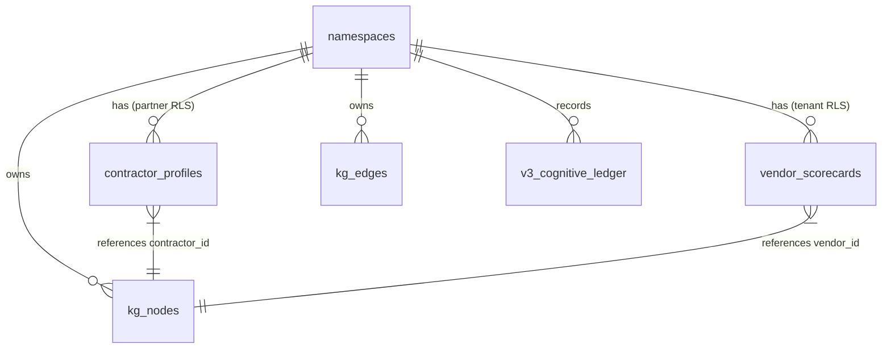
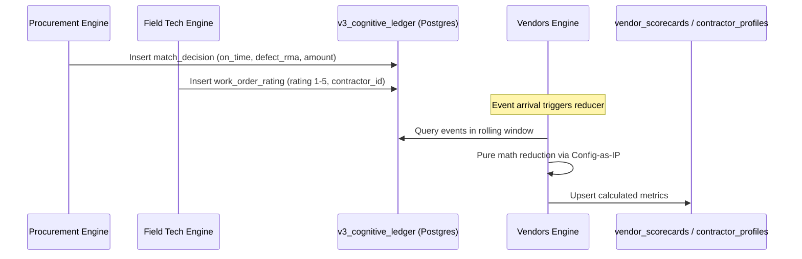

> **Status:** shipped · **Verified-against:** 7304330 (main) · **Last-audited:** 2026-08-17

# Vendors & Contractors Engine Admin Guide (Doc 70)

> **Status:** shipped · **Verified-against:** 7304330 (main) · **Last-audited:** 2026-08-17

The **Vendors & Contractors Engine** (`nce/vertical_modules/vendors/`) provides identity management, reliability tracking, scorecard calculation, and contractor dispatch for NCE counterparties (`VENDOR` and `CONTRACTOR`). This guide details the technical configuration, database schemas, Row-Level Security (RLS) enforcement, Partner Access Model architecture, config-as-IP files, cognitive ledger integration, and watcher automation.

---

## 1. Engine Configuration & Namespace Enablement

### 1.1 Global Environment Variables
Global thresholds, default lookback windows, and sample minimums are configured via standard environment variables defined in `nce/config.py`:

* **`NCE_VENDORS_ENABLED`** (Boolean, default `true`)  
  Global toggle controlling whether Vendors vertical MCP handlers, REST routes, and background watcher tasks are mounted.
* **`NCE_VENDORS_SCORECARD_WINDOW_DAYS`** (Integer, default `365`)  
  Default lookback window in days for rolling scorecard and contractor performance calculations.
* **`NCE_VENDORS_SCORECARD_MIN_SAMPLE`** (Integer, default `5`)  
  Minimum number of verified outcome events (PO matches, Goods Receipts, or Work Order ratings) required before publishing a composite score. Sub-threshold calculations return `insufficient_data: true`.
* **`NCE_VENDORS_CERT_EXPIRY_WARN_DAYS`** (Integer, default `30`)  
  Warning threshold horizon in days for contractor certification expiration watcher alerts.
* **`NCE_VENDORS_RELIABILITY_DEGRADE_PCT`** (Float, default `10.0`)  
  Threshold in percentage points of on-time delivery drop or defect rate increase across chronological halves required to trigger a reliability degradation alert.
* **`NCE_VENDORS_RECOMPUTE_AFTER_N`** (Integer, default `10`)  
  Batching threshold for ledger outcome arrivals before triggering automated scorecard recomputation.

### 1.2 Tenant Namespace Activation
The engine enforces multi-tenant isolation. Tenants activate the module through the JSONB `metadata` column in the `namespaces` table:

```json
{
  "vendors": {
    "enabled": true,
    "min_scorecard_sample": 5,
    "scorecard_window_days": 365
  }
}
```

When a namespace has not enabled the module, tool executions fail closed or report module inactive.

---

## 2. Database Schema, Tables & Row-Level Security (RLS)

The Vendors Engine utilizes a dual-storage model:
1. **Relational & RLS Tables (PostgreSQL):** Tables requiring strict relational constraints, fast indexed lookups, and multi-layered RLS isolation (`vendor_scorecards`, `contractor_profiles`).
2. **Graph Spine & Cognitive Storage (`kg_nodes`, `kg_edges`, `v3_cognitive_ledger`):** Identity nodes (`VENDOR`, `CONTRACTOR`, `CERT`), graph edges, and outcome logs.
3. **Document Payloads (MongoDB `episodes`):** Unstructured feed attributes and admin metadata linked via `payload_ref`.



### 2.1 Table Definitions

#### `vendor_scorecards`
Stores precomputed vendor reliability metrics and current rebate tier standing for fast query execution by Procurement sourcing:

```sql
CREATE TABLE IF NOT EXISTS vendor_scorecards (
    vendor_id         TEXT        NOT NULL,
    namespace_id      UUID        NOT NULL REFERENCES namespaces(id) ON DELETE CASCADE,
    on_time_pct       NUMERIC(5,2),
    defect_rma_rate   NUMERIC(5,2),
    substitution_rate NUMERIC(5,2),
    reliability       NUMERIC(5,2),
    current_tier      TEXT,
    ytd_progress      NUMERIC(5,4),
    sample_n          INTEGER     NOT NULL DEFAULT 0,
    raw               JSONB       NOT NULL DEFAULT '{}'::jsonb,
    computed_at       TIMESTAMPTZ NOT NULL DEFAULT now(),
    PRIMARY KEY (vendor_id, namespace_id)
);

CREATE INDEX IF NOT EXISTS idx_vendor_scorecards_namespace_tier 
    ON vendor_scorecards (namespace_id, current_tier);
```

#### `contractor_profiles`
Maintains contractor master data, billing rates, skills, availability, and external partner scope bindings:

```sql
CREATE TABLE IF NOT EXISTS contractor_profiles (
    contractor_id     TEXT        NOT NULL,
    namespace_id      UUID        NOT NULL REFERENCES namespaces(id) ON DELETE CASCADE,
    partner_scope_id  UUID        NOT NULL,
    profile           JSONB       NOT NULL DEFAULT '{}'::jsonb,
    rates             JSONB       NOT NULL DEFAULT '{}'::jsonb,
    skills            TEXT[]      NOT NULL DEFAULT '{}',
    availability      JSONB       NOT NULL DEFAULT '{}'::jsonb,
    performance_score NUMERIC(5,2),
    updated_at        TIMESTAMPTZ NOT NULL DEFAULT now(),
    PRIMARY KEY (contractor_id, namespace_id)
);

CREATE INDEX IF NOT EXISTS idx_contractor_profiles_namespace_skills 
    ON contractor_profiles USING gin (skills);

CREATE INDEX IF NOT EXISTS idx_contractor_profiles_partner_scope 
    ON contractor_profiles (namespace_id, partner_scope_id);
```

### 2.2 Row-Level Security Policies

All operational tables enable and force Row-Level Security.

```sql
-- 1. Enable and Force RLS
ALTER TABLE vendor_scorecards ENABLE ROW LEVEL SECURITY;
ALTER TABLE vendor_scorecards FORCE ROW LEVEL SECURITY;

ALTER TABLE contractor_profiles ENABLE ROW LEVEL SECURITY;
ALTER TABLE contractor_profiles FORCE ROW LEVEL SECURITY;

-- 2. Standard Tenant Isolation Policy (vendor_scorecards)
CREATE POLICY tenant_isolation_policy ON vendor_scorecards
    FOR ALL TO nce_app
    USING (namespace_id IS NOT NULL AND namespace_id = get_nce_namespace())
    WITH CHECK (namespace_id IS NOT NULL AND namespace_id = get_nce_namespace());

-- 3. Dual Tenant + Partner Isolation Policy (contractor_profiles)
CREATE POLICY partner_isolation_policy ON contractor_profiles
    FOR ALL TO nce_app
    USING (
        namespace_id IS NOT NULL 
        AND namespace_id = get_nce_namespace()
        AND (
            get_nce_partner_scope() IS NULL 
            OR partner_scope_id = get_nce_partner_scope()
        )
    )
    WITH CHECK (
        namespace_id IS NOT NULL 
        AND namespace_id = get_nce_namespace()
        AND (
            get_nce_partner_scope() IS NULL 
            OR partner_scope_id = get_nce_partner_scope()
        )
    );
```

> [!IMPORTANT]
> When executing partner-scoped queries, the application sets the session GUC via `set_external_scope(conn, partner_scope_uuid)`. If the partner scope is active, database-level RLS strictly forbids the session from reading or mutating any contractor row outside that specific `partner_scope_id`.

### 2.3 Graph Ownership Enforcement (Contract A)
In accordance with `nce/config_data/node-ownership.json`, the Vendors Engine asserts ownership for all created graph nodes:
- `assert_owner(conn, namespace_id, "VENDOR", "vendors")`
- `assert_owner(conn, namespace_id, "CONTRACTOR", "vendors")`
- `assert_owner(conn, namespace_id, "CERT", "vendors")`

---

## 3. Config-as-IP Architecture

Business logic scoring rules and redaction filters are decoupled from application code into versioned, auditable JSON files located in `nce/config_data/`.

### 3.1 `vendor-scorecard-weights.json`
Controls the relative weighting of vendor reliability metrics into the composite score:

```json
{
  "_comment": "Namespace-tunable scorecard weights. Sum of active weights should equal 1.0",
  "on_time_weight": 0.4,
  "defect_rma_weight": 0.3,
  "substitution_weight": 0.1,
  "reliability_weight": 0.2
}
```

### 3.2 `contractor-match-weights.json`
Defines the weight vector for contractor ranking during dispatch matching:

```json
{
  "_comment": "Weights for contractor dispatch ranking algorithm",
  "skill_weight": 0.4,
  "location_weight": 0.3,
  "load_weight": 0.1,
  "history_weight": 0.2
}
```

### 3.3 `partner-redaction.json`
Specifies the strict allow-list of fields permitted to pass through to external partner projections:

```json
{
  "_comment": "Allow-list of partner-safe fields. Default-deny on all unlisted keys.",
  "partner": [
    "id",
    "label",
    "node_type",
    "name",
    "city",
    "skills",
    "availability",
    "performance_score",
    "assigned_work_orders",
    "assigned_bom_lines",
    "namespace_id"
  ]
}
```

---

## 4. Cognitive Ledger Integration & Event Flow

The Vendors Engine does not perform bulk sweeps. It responds to outcome events and stores immutable history in `v3_cognitive_ledger`.



### Outcome Event Payloads
Outcome events are written via `do_record_outcome`:
- **Procurement Match Decisions:** Carries `vendor_id`, `on_time` (boolean), `defect_rma` (boolean), `substituted` (boolean), and `amount`.
- **Work Order Ratings:** Carries `contractor_id`, `work_order_id`, `rating` (float 1.0–5.0), and `review_notes`.

---

## 5. Partner Access Model & Multi-Layer Defense-in-Depth

The Partner Access Model ensures external technicians and subcontractors can never access commercial margins, customer pricing, or internal strategic data.

```
┌─────────────────────────────────────────────────────────────────────────┐
│ Layer 1: PostgreSQL Sub-Scope Row-Level Security                        │
│ - partner_isolation_policy enforces (partner_scope_id = GUC)            │
│ - Physically blocks cross-tenant and cross-contractor row visibility    │
├─────────────────────────────────────────────────────────────────────────┤
│ Layer 2: A2A Tool & Principal Scoping                                   │
│ - Principal 'contractor' is authorized ONLY for 'vendors_partner_view'  │
│ - All other 9 MCP tools fail authorization at A2A gateway               │
├─────────────────────────────────────────────────────────────────────────┤
│ Layer 3: C8 Allow-List Projection Redaction                             │
│ - Output filtered through project(payload, "partner")                   │
│ - Drops rates, margins, kickback tiers, and pricing before response     │
└─────────────────────────────────────────────────────────────────────────┘
```

### A2A Principal Authorization Rule (`a2a_server.py:665-670`)
```python
# A2A Principal Authorization Gate
if caller_principal == "contractor":
    if requested_tool != "vendors_partner_view":
        raise UnauthorizedSkillError(
            f"Principal 'contractor' is restricted to 'vendors_partner_view'. Denied '{requested_tool}'."
        )
```

---

## 6. Watcher Automation & Background Schedulers

The engine includes three automated watcher routines designed for scheduling via cron or RQ worker loops:

### 6.1 Certification Expiry Watcher (`do_check_cert_expiry`)
- **Module:** `nce/vertical_modules/vendors/certs.py`
- **Schedule:** Daily at `02:00 UTC`
- **Behavior:**
  1. Queries all `CERT` nodes for the active tenant in `kg_nodes`.
  2. Compares `expiry_date` stored in MongoDB against `today + NCE_VENDORS_CERT_EXPIRY_WARN_DAYS` (default 30 days).
  3. For expiring certificates, checks `outbox_events` to prevent duplicates.
  4. Idempotently publishes `cert.expiry` C4 events:
     ```json
     {
       "event_type": "cert.expiry",
       "aggregate_id": "CERT:TECH-042:SAFETY_101",
       "payload": {
         "cert_id": "CERT:TECH-042:SAFETY_101",
         "contractor_id": "CONTRACTOR:TECH-042",
         "cert_name": "SAFETY_101",
         "expiry_date": "2026-09-15",
         "namespace_id": "3fa85f64-5717-4562-b3fc-2c963f66afa6"
       }
     }
     ```

### 6.2 Reliability Degradation Watcher (`do_detect_reliability_degradation`)
- **Module:** `nce/vertical_modules/vendors/feed.py`
- **Behavior:** Compares on-time delivery percentages and defect rates between chronological halves of recent outcome events. If degradation exceeds `NCE_VENDORS_RELIABILITY_DEGRADE_PCT` (10%), generates proactive alerts.

### 6.3 Kickback Tier-at-Risk Watcher (`do_check_tier_at_risk`)
- **Module:** `nce/vertical_modules/vendors/feed.py`
- **Behavior:** Computes current daily run rate versus required run rate to reach the next volume rebate threshold before December 31st. Surfaces at-risk suppliers to Procurement.

---

## 7. REST Handlers & Surface Verification

### 7.1 Mounted HTTP Endpoints (`nce/admin_handlers/vendors.py`)

| Method | Route | Handler Function | Purpose |
|---|---|---|---|
| `GET` | `/api/vendors/{id}` | `api_vendors_get_vendor` | Fetches vendor identity, metadata, and scorecard summary. |
| `GET` | `/api/vendors/scorecard` | `api_vendors_scorecard` | Returns scorecard dashboard filtered by `vendor_id` or tenant. |

### 7.2 MCP Tool Registry Verification (10 Tools)
All 10 MCP tools are registered in `nce/tool_registry.py` and handled via `nce/vertical_modules/vendors/mcp_handlers.py`:

```python
# Registered Tool Handlers in mcp_handlers.py
handle_vendors_get_vendor(...)
handle_vendors_compute_scorecard(...)
handle_vendors_get_tier_status(...)
handle_vendors_detect_reliability_degradation(...)
handle_vendors_check_tier_at_risk(...)
handle_vendors_match_contractor(...)
handle_vendors_compute_performance(...)
handle_vendors_recall_similar_jobs(...)
handle_vendors_reliability_radar(...)
handle_vendors_calibrate_weights(...)
```

---

## 8. Operational Troubleshooting & Runbooks

### 8.1 Vendor Scorecard Displays `insufficient_data: true`
* **Root Cause:** Total historical outcome events in `v3_cognitive_ledger` for this vendor is less than `NCE_VENDORS_SCORECARD_MIN_SAMPLE` (default `5`).
* **Resolution:** This is standard behavior for newly ingested suppliers. Ensure downstream consumers treat `insufficient_data: true` as neutral (`0.80`) rather than a failing score.

### 8.2 External Contractor Receives HTTP 403 / `-32001`
* **Root Cause:** A contractor principal session attempted to call an unauthorized MCP tool or access unredacted endpoints.
* **Resolution:** Verify client session uses `vendors_partner_view`. Contractor principals are structurally barred from executing any other vertical or shared MCP tool.

### 8.3 PostgreSQL Partner Scope Query Returns Zero Rows
* **Root Cause:** `set_external_scope()` was not executed on the database connection, causing `partner_isolation_policy` to fail closed.
* **Resolution:** Ensure the authentication middleware properly extracts `partner_scope_id` from the bearer token and passes it to `scoped_pg_session()`.
