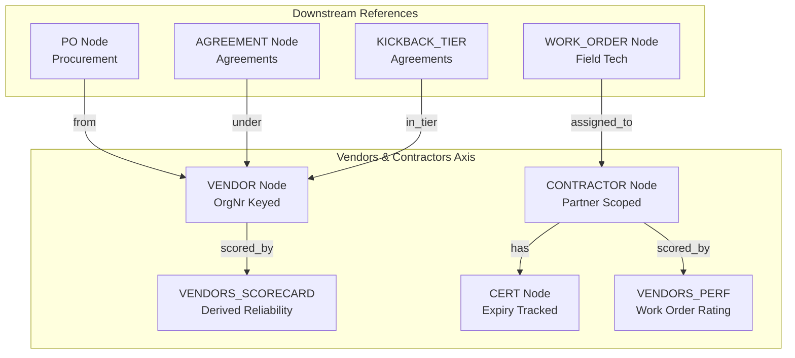

> **Status:** shipped · **Verified-against:** 7304330 (main) · **Last-audited:** 2026-08-17

# Vendors & Contractors Engine User Guide (Doc 69)

> **Status:** shipped · **Verified-against:** 7304330 (main) · **Last-audited:** 2026-08-17

The **Vendors & Contractors Engine** (`nce/vertical_modules/vendors/`) is the master-data and reliability engine for the two counterparty classes that power all NCE operational workflows:
1. **`VENDOR`** — Commercial suppliers, distributors, and equipment manufacturers (e.g., EET, Netset/Nettailer, Crestron, Sony) from whom hardware and software licenses are procured.
2. **`CONTRACTOR`** — External field service technicians, freelance engineers, and installation partners dispatched to customer job sites.

Rather than maintaining static vendor ratings, the Vendors Engine continuously synthesizes live counterparty reliability and performance signals directly from the immutable cognitive ledger (`v3_cognitive_ledger`). The engine exposes **10 MCP tools**, dedicated **REST endpoints** for sourcing dashboards and contractor dispatch, and enforces the **Partner Access Model** to restrict external contractor access.

---

## 1. Counterparty Architecture & Graph Topology

The engine establishes canonical node ownership for counterparty identities within the NCE Knowledge Graph (`kg_nodes` and `kg_edges`). Downstream engines (Procurement, Field Tech, Agreements, Sales) reference these identities without duplicating counterparty master data.



### Graph Ownership & Relations
- `VENDOR` (`VENDOR:ORGNR`): Sole creator is `vendors.registry`. Merges feed-ingested records (from Nettailer/Product feeds) with admin overrides.
- `CONTRACTOR` (`CONTRACTOR:ID`): Managed by `vendors.contractors`. Links directly to external partner authentication scopes (`partner_scope_id`).
- `CERT` (`CERT:CONTRACTOR:NAME`): Attached to contractors via `CONTRACTOR -[has]-> CERT` edges to track safety, manufacturer, and compliance certifications.
- `PO -[from]-> VENDOR`: Sourcing link written by Procurement, referencing canonical vendor identities.
- `VENDOR -[under]-> AGREEMENT`: Links vendor identities to signed commercial terms owned by the Agreements engine.
- `WORK_ORDER -[assigned_to]-> CONTRACTOR`: Dispatch link written by Field Tech.

---

## 2. Vendor Registry & Sourcing Scorecards

### 2.1 `vendors_get_vendor`
Retrieves the complete canonical profile of a vendor, including merged master data, current kickback tier, YTD volume progress, and the latest computed scorecard metrics.

- **MCP Tool:** `vendors_get_vendor`
- **Cacheable:** `true` · **Admin-Only:** `false` · **Mutation:** `false` · **Role:** Advisor
- **Parameters:**
  - `namespace_id` (string, required): Active tenant UUID.
  - `vendor_id` (string, required): Vendor label (e.g., `"VENDOR:987654321"`), UUID, or `vendors_source_id`.

```json
// Tool Call Request
{
  "namespace_id": "3fa85f64-5717-4562-b3fc-2c963f66afa6",
  "vendor_id": "VENDOR:987654321"
}

// Response
{
  "id": "7b8f9e2d-3c4a-4e5f-8a1b-2c3d4e5f6a7b",
  "label": "VENDOR:987654321",
  "vendors_source_id": "NETTAILER-SUPPLIER-4412",
  "name": "EET Group AS",
  "orgnr": "987654321",
  "feed_fields": {
    "currency": "NOK",
    "country": "NO",
    "delivery_terms": "DAP"
  },
  "admin_fields": {
    "account_manager": "Kari Nordmann",
    "priority_partner": true
  },
  "merged_fields": {
    "currency": "NOK",
    "country": "NO",
    "delivery_terms": "DAP",
    "account_manager": "Kari Nordmann",
    "priority_partner": true
  },
  "scorecard": {
    "on_time_pct": 96.5,
    "defect_rma_rate": 1.2,
    "substitution_rate": 0.8,
    "reliability": 95.0,
    "current_tier": "Gold",
    "ytd_progress": 0.78,
    "sample_n": 84,
    "computed_at": "2026-08-17T10:15:30Z"
  }
}
```

### 2.2 `vendors_compute_scorecard`
Executes a pure reducer over historical purchase order match decisions and goods receipt events to compute a multi-factor composite vendor score.

- **MCP Tool:** `vendors_compute_scorecard`
- **Cacheable:** `true` · **Admin-Only:** `false` · **Mutation:** `false` · **Role:** Advisor
- **Parameters:**
  - `namespace_id` (string, required): Active tenant UUID.
  - `vendor_id` (string, required): Target vendor label or identifier.
  - `events` (array of objects, optional): Explicit outcome event list to score. If omitted or evaluated against history, historical events from `v3_cognitive_ledger` are used.
  - `current_tier` (string, optional): Current rebate tier label.
  - `ytd_progress` (number, optional): YTD progress ratio towards next tier.

#### Composite Score Calculation & Weights
The scorecard combines four distinct operational metrics weighted via `vendor-scorecard-weights.json`:

$$\text{Composite Score} = (S_{\text{on\_time}} \times W_{\text{ot}}) + ((100 - R_{\text{defect}}) \times W_{\text{df}}) + ((100 - R_{\text{sub}}) \times W_{\text{sb}}) + (S_{\text{rel}} \times W_{\text{rel}})$$

| Metric | Weight Key | Default Weight | Description |
|---|---|---|---|
| **On-Time Delivery** | `on_time_weight` | `0.40` | Percentage of purchase orders delivered on or before promised delivery date. |
| **Defect / RMA Rate** | `defect_rma_weight` | `0.30` | Percentage of received goods requiring Return Merchandise Authorization (RMA). |
| **Substitution Rate** | `substitution_weight` | `0.10` | Percentage of line items substituted without prior explicit customer authorization. |
| **Subjective Reliability** | `reliability_weight` | `0.20` | Operational reliability rating from receiving technicians and procurement officers. |

#### Sample-Size Gating & Neutrality Discipline
To prevent sparse data from penalizing new or low-volume suppliers, the engine enforces a strict sample threshold via `NCE_VENDORS_SCORECARD_MIN_SAMPLE` (default `5`):
- If $\text{sample\_n} < 5$: The scorecard returns `"insufficient_data": true` and `null` for all score dimensions.
- **Consumer Discipline:** Procurement scoring (5-step TCO algorithm) and dispatch logic MUST treat `insufficient_data: true` as **neutral** (defaulting to 80% / 0.8), never as a failing or zero score.

```json
// Sample Scorecard Response (Sufficient Data)
{
  "vendor_id": "VENDOR:987654321",
  "on_time_pct": 95.0,
  "defect_rma_rate": 2.5,
  "substitution_rate": 1.0,
  "reliability": 94.0,
  "composite_score": 95.8,
  "sample_n": 40,
  "insufficient_data": false,
  "current_tier": "Gold",
  "ytd_progress": 0.85
}
```

---

## 3. Kickback Tiers & Risk Watchers

### 3.1 `vendors_get_tier_status`
Calculates real-time progress toward vendor volume rebate tiers by cross-referencing agreements with accumulated YTD spend in `v3_cognitive_ledger`.

- **MCP Tool:** `vendors_get_tier_status`
- **Cacheable:** `true` · **Admin-Only:** `false` · **Mutation:** `false` · **Role:** Watcher
- **Parameters:**
  - `namespace_id` (string, required): Active tenant UUID.
  - `vendor_id` (string, required): Vendor identifier.

```json
// Response
{
  "vendor_id": "VENDOR:987654321",
  "current_tier": "Gold",
  "ytd_volume": 178500.0,
  "next_tier_threshold": 250000.0,
  "ytd_progress": 0.5233,
  "days_left": 136
}
```

> [!NOTE]
> Default kickback tier ladders if not explicitly defined in the linked Agreements payload:
> - **Bronze:** 10,000 NOK (1.0% rebate)
> - **Silver:** 50,000 NOK (2.0% rebate)
> - **Gold:** 100,000 NOK (3.0% rebate)
> - **Platinum:** 250,000 NOK (5.0% rebate)

### 3.2 `vendors_detect_reliability_degradation`
Analyzes chronological halves of a vendor's ledger outcomes to detect statistically meaningful downward trends before they impact critical installations.

- **MCP Tool:** `vendors_detect_reliability_degradation`
- **Cacheable:** `true` · **Admin-Only:** `false` · **Mutation:** `false` · **Role:** Watcher
- **Parameters:**
  - `namespace_id` (string, required): Active tenant UUID.
  - `vendor_id` (string, required): Target vendor label.
  - `min_sample` (integer, optional, default `4`): Minimum outcome events required.
  - `threshold` (number, optional, default `10.0`): Degradation percentage points required to trigger an alert (`NCE_VENDORS_RELIABILITY_DEGRADE_PCT`).

```json
// Response
{
  "vendor_id": "VENDOR:987654321",
  "degraded": true,
  "on_time_degraded_pct": 14.5,
  "defect_degraded_pct": 2.0,
  "historical_on_time_pct": 98.0,
  "recent_on_time_pct": 83.5,
  "historical_defect_rate": 1.0,
  "recent_defect_rate": 3.0,
  "sample_n": 24,
  "threshold": 10.0
}
```

### 3.3 `vendors_check_tier_at_risk`
Projects annual purchase pace against remaining calendar days to determine if a supplier's kickback rebate tier is at risk of being missed.

- **MCP Tool:** `vendors_check_tier_at_risk`
- **Cacheable:** `true` · **Admin-Only:** `false` · **Mutation:** `false` · **Role:** Watcher
- **Parameters:**
  - `namespace_id` (string, required): Active tenant UUID.
  - `vendor_id` (string, required): Vendor identifier.
  - `ytd_volume` (number, optional): Override volume for simulation.
  - `next_tier_threshold` (number, optional): Override threshold.
  - `days_left` (integer, optional): Override days remaining.

$$\text{Daily Pace} = \frac{\text{YTD Volume}}{\text{Days Elapsed}}, \quad \text{Projected Remaining} = \text{Daily Pace} \times \text{Days Left}$$

```json
// Response
{
  "vendor_id": "VENDOR:987654321",
  "at_risk": true,
  "current_tier": "Silver",
  "ytd_volume": 62000.0,
  "next_tier_threshold": 100000.0,
  "days_left": 90,
  "days_elapsed": 275,
  "pace_per_day": 225.45,
  "projected_remaining_volume": 20290.5,
  "needed_remaining_volume": 38000.0
}
```

---

## 4. Contractor Matching, Performance & Cognitive Recall

### 4.1 `vendors_match_contractor`
Matches and ranks qualified external contractors for a specific work order or installation job based on skills, geography, current active workload, and historical performance.

- **MCP Tool:** `vendors_match_contractor`
- **Cacheable:** `true` · **Admin-Only:** `false` · **Mutation:** `false` · **Role:** Advisor
- **Parameters:**
  - `namespace_id` (string, required): Active tenant UUID.
  - `job` (object, required): Job specification object:
    - `skills` (array of strings, optional): Required skill keywords (e.g., `["dsp", "crestron", "dante"]`).
    - `location` (string or object, optional): Target city or site address (e.g., `"Oslo"`).

#### Matching Formula & Weights
Weights are loaded from `contractor-match-weights.json` and dynamically normalized:

$$\text{Match Score} = (S_{\text{skill}} \times W_{\text{skill}}) + (S_{\text{loc}} \times W_{\text{loc}}) + (S_{\text{load}} \times W_{\text{load}}) + (S_{\text{hist}} \times W_{\text{hist}})$$

| Component | Default Weight | Scoring Logic |
|---|---|---|
| **Skill Match ($S_{\text{skill}}$)** | `0.40` | Overlap ratio: $\frac{|\text{Job Skills} \cap \text{Contractor Skills}|}{|\text{Job Skills}|}$. Defaults to `1.0` if no skills required. |
| **Location Match ($S_{\text{loc}}$)** | `0.30` | Binary/exact string match: `1.0` if contractor base equals job location, else `0.0`. Defaults to `1.0` if no location specified. |
| **Load Factor ($S_{\text{load}}$)** | `0.10` | Inverse load: $\frac{1.0}{1.0 + \text{Active Assignments}}$ from `kg_edges` (`assigned_to` predicate). |
| **History ($S_{\text{hist}}$)** | `0.20` | Normalized performance: $\frac{\text{Performance Score}}{100.0}$. Defaults to neutral `0.80` if score is absent. |

```json
// Tool Call Request
{
  "namespace_id": "3fa85f64-5717-4562-b3fc-2c963f66afa6",
  "job": {
    "skills": ["dante", "q-sys"],
    "location": "Oslo"
  }
}

// Response
{
  "ok": true,
  "matches": [
    {
      "contractor_id": "CONTRACTOR:TECH-042",
      "score": 0.945,
      "skill_score": 1.0,
      "location_score": 1.0,
      "load_score": 0.5,
      "history_score": 0.92,
      "profile": {
        "name": "Erik Solberg",
        "city": "Oslo",
        "phone": "+47 912 34 567"
      },
      "rates": {
        "hourly_standard_nok": 950.0,
        "overtime_nok": 1425.0
      },
      "skills": ["dante", "q-sys", "crestron", "shure"],
      "availability": {
        "status": "available",
        "days_notice": 1
      },
      "performance_score": 92.0
    }
  ]
}
```

### 4.2 `vendors_compute_performance`
Calculates a contractor's rolling performance score (0–100 scale) from verified work-order ratings logged to the cognitive ledger.

- **MCP Tool:** `vendors_compute_performance`
- **Cacheable:** `true` · **Admin-Only:** `false` · **Mutation:** `false` · **Role:** Advisor
- **Parameters:**
  - `namespace_id` (string, required): Active tenant UUID.
  - `contractor_id` (string, required): Contractor identifier (e.g., `"CONTRACTOR:TECH-042"`).
  - `window` (integer, optional, default `365`): Rolling lookback window in days (`NCE_VENDORS_SCORECARD_WINDOW_DAYS`).

$$\text{Performance Score} = \text{Average Rating (1–5)} \times 20.0$$

```json
// Response
{
  "ok": true,
  "contractor_id": "CONTRACTOR:TECH-042",
  "performance_score": 92.0,
  "sample_n": 14,
  "insufficient_data": false
}
```

### 4.3 `vendors_recall_similar_jobs`
Executes semantic vector similarity search (`pgvector`) over historical job memories, past work orders, and field reviews to answer *"how did this contractor perform on similar installations?"*.

- **MCP Tool:** `vendors_recall_similar_jobs`
- **Cacheable:** `true` · **Admin-Only:** `false` · **Mutation:** `false` · **Role:** Advisor
- **Parameters:**
  - `namespace_id` (string, required): Active tenant UUID.
  - `query` (string, required): Natural language description of installation scope or problem (e.g., `"large boardroom multi-mic Dante echo cancellation troubleshooting"`).
  - `contractor_id` (string, optional): Restrict recall to a specific contractor.
  - `top_k` (integer, optional, default `5`): Maximum memories to return.

```json
// Response
[
  {
    "memory_id": "e4a2b1c0-d3e4-4f5a-8b9c-0d1e2f3a4b5c",
    "contractor_id": "CONTRACTOR:TECH-042",
    "work_order_id": "WO-2026-0811",
    "description": "Commissioned 16-channel Shure MXA920 array with Q-SYS Core 110f in corporate boardroom. Solved complex AEC acoustic coupling under deadline.",
    "rating": 5.0,
    "similarity": 0.8924
  }
]
```

---

## 5. Reliability Radar & Scorecard Calibration

### 5.1 `vendors_reliability_radar`
Synthesizes tenant-wide supplier risk and contractor burnout indicators to populate Morning Brief summaries and operational alerts.

- **MCP Tool:** `vendors_reliability_radar`
- **Cacheable:** `true` · **Admin-Only:** `false` · **Mutation:** `false` · **Role:** Advisor
- **Parameters:**
  - `namespace_id` (string, required): Active tenant UUID.

```json
// Response
{
  "ok": true,
  "supplier_risk": [
    {
      "vendor_id": "VENDOR:987654321",
      "risk_level": "high",
      "reasons": [
        "High defect RMA rate (12.4% > 10.0%)",
        "On-time rate degrading (98.0% -> 83.5%)"
      ],
      "composite_score": 68.2
    }
  ],
  "contractor_burnout": [
    {
      "contractor_id": "CONTRACTOR:TECH-019",
      "risk_level": "high",
      "active_load": 5,
      "reasons": [
        "Excessive active load (5 assignments > 3)",
        "Performance rating degrading (4.8 -> 4.1)"
      ],
      "performance_score": 82.0
    }
  ]
}
```

### 5.2 `vendors_calibrate_weights`
Closes the loop between real-world failures and scoring rules by analyzing the ratio of late deliveries versus defective RMAs in the ledger and dynamically adjusting `vendor-scorecard-weights.json`.

- **MCP Tool:** `vendors_calibrate_weights`
- **Cacheable:** `true` · **Admin-Only:** `false` · **Mutation:** `false` · **Role:** Advisor
- **Parameters:**
  - `namespace_id` (string, required): Active tenant UUID.

```json
// Response
{
  "ok": true,
  "calibrated_weights": {
    "on_time_weight": 0.46,
    "defect_rma_weight": 0.24,
    "substitution_weight": 0.10,
    "reliability_weight": 0.20
  },
  "total_issues": 128,
  "late_count": 84,
  "defect_count": 44
}
```

---

## 6. Partner Access Model & Contractor Authorization

External contractors operate under the strict **Partner Access Model** (governed by NCE security standards). External partners are granted restricted visibility to perform field work without accessing confidential financial or commercial intelligence.

```
┌────────────────────────────────────────────────────────┐
│               Partner Access Model Layers               │
├────────────────────────────────────────────────────────┤
│ 1. Sub-Scope RLS: partner_isolation_policy on Postgres │
│ 2. A2A Tool Scoping: ONLY vendors_partner_view bound  │
│ 3. Field-Level Redaction: partner-redaction.json       │
└────────────────────────────────────────────────────────┘
```

### Contractor Principal Authorization Rule
In compliance with the A2A server security specification (`a2a_server.py:665-670`):
> **`vendors_partner_view` is the ONLY skill / MCP tool permitted for caller sessions authenticated with principal type `contractor`.**

If an external contractor agent attempts to invoke any other tool (`vendors_get_vendor`, `vendors_compute_scorecard`, `procurement_*`, `pricing_resolve`, etc.), the A2A security gateway denies execution immediately with a `-32001 Unauthorized Skill` error code.

### Partner-Safe Projection Contract
When `do_partner_view` executes, it extracts data through the `partner-redaction.json` allow-list:
- **Allowed Fields:** `id`, `label`, `node_type`, `name`, `city`, `skills`, `availability`, `assigned_work_orders`, `assigned_bom_lines` (descriptions and part numbers only).
- **Default-Deny Redacted Fields:** `rates`, `cost_price`, `list_price`, `bid_id`, `margin`, `kickback_tier`, `ytd_volume`, `rebate_pct`, `customer_budget`, `commission`.

---

## 7. REST API Endpoints

In addition to MCP tool execution, the engine provides REST routes mounted on the administrative application:

### 7.1 `GET /api/vendors/{id}`
Returns full vendor profile and live scorecard data.
- **Query Parameters:** `namespace_id` (UUID, required).
- **Path Parameter:** `id` (Vendor label, ID, or source ID).
- **Status Codes:** `200 OK`, `404 Not Found` (`{"status": "ok", "vendor": null}`), `422 Unprocessable Entity`.

```bash
curl -X GET "https://nce.example.com/api/vendors/VENDOR:987654321?namespace_id=3fa85f64-5717-4562-b3fc-2c963f66afa6" \
     -H "Authorization: Bearer <ADMIN_TOKEN>"
```

### 7.2 `GET /api/vendors/scorecard`
Returns scorecard metrics for a specific vendor or all active vendors across the tenant namespace.
- **Query Parameters:**
  - `namespace_id` (UUID, required).
  - `vendor_id` (string, optional): When supplied, filters scorecard to the specified vendor.
- **Status Codes:** `200 OK`, `422 Unprocessable Entity`, `500 Internal Server Error`.

```json
// Response: GET /api/vendors/scorecard?namespace_id=...&vendor_id=VENDOR:987654321
{
  "status": "ok",
  "scorecards": [
    {
      "vendor_id": "VENDOR:987654321",
      "on_time_pct": 96.5,
      "defect_rma_rate": 1.2,
      "substitution_rate": 0.8,
      "reliability": 95.0,
      "current_tier": "Gold",
      "ytd_progress": 0.78,
      "sample_n": 84,
      "computed_at": "2026-08-17 10:15:30.123456+00:00"
    }
  ]
}
```

---

## 8. Complete Tool & Route Reference Matrix

| Tool / Route Name | Type | Cacheable | Admin Only | Mutation | Primary AI Role | Description |
|---|---|:---:|:---:|:---:|---|---|
| `vendors_get_vendor` | MCP | `true` | `false` | `false` | Advisor | Fetches vendor identity, merged fields, and scorecard snapshot. |
| `vendors_compute_scorecard` | MCP | `true` | `false` | `false` | Advisor | Computes weighted multi-factor vendor reliability scorecard. |
| `vendors_get_tier_status` | MCP | `true` | `false` | `false` | Watcher | Evaluates vendor kickback tier progress and days left in year. |
| `vendors_detect_reliability_degradation` | MCP | `true` | `false` | `false` | Watcher | Detects negative trends in vendor on-time and defect metrics. |
| `vendors_check_tier_at_risk` | MCP | `true` | `false` | `false` | Watcher | Projects annual pace against next kickback tier threshold. |
| `vendors_match_contractor` | MCP | `true` | `false` | `false` | Advisor | Ranks qualified contractors by skill, location, load, and history. |
| `vendors_compute_performance` | MCP | `true` | `false` | `false` | Advisor | Calculates rolling performance rating (0–100) from ledger ratings. |
| `vendors_recall_similar_jobs` | MCP | `true` | `false` | `false` | Advisor | Semantic similarity search over historical contractor job outcomes. |
| `vendors_reliability_radar` | MCP | `true` | `false` | `false` | Advisor | Identifies supplier risk and contractor burnout hotspots. |
| `vendors_calibrate_weights` | MCP | `true` | `false` | `false` | Advisor | Dynamically calibrates scorecard weights based on incident ratios. |
| `GET /api/vendors/{id}` | REST | — | `true` | `false` | — | HTTP detail endpoint for vendor profile and scorecard. |
| `GET /api/vendors/scorecard` | REST | — | `true` | `false` | — | HTTP dashboard endpoint for single or paged vendor scorecards. |
| `do_partner_view` | Core / A2A | `true` | `false` | `false` | Partner | Single restricted skill available to external contractor principals. |
