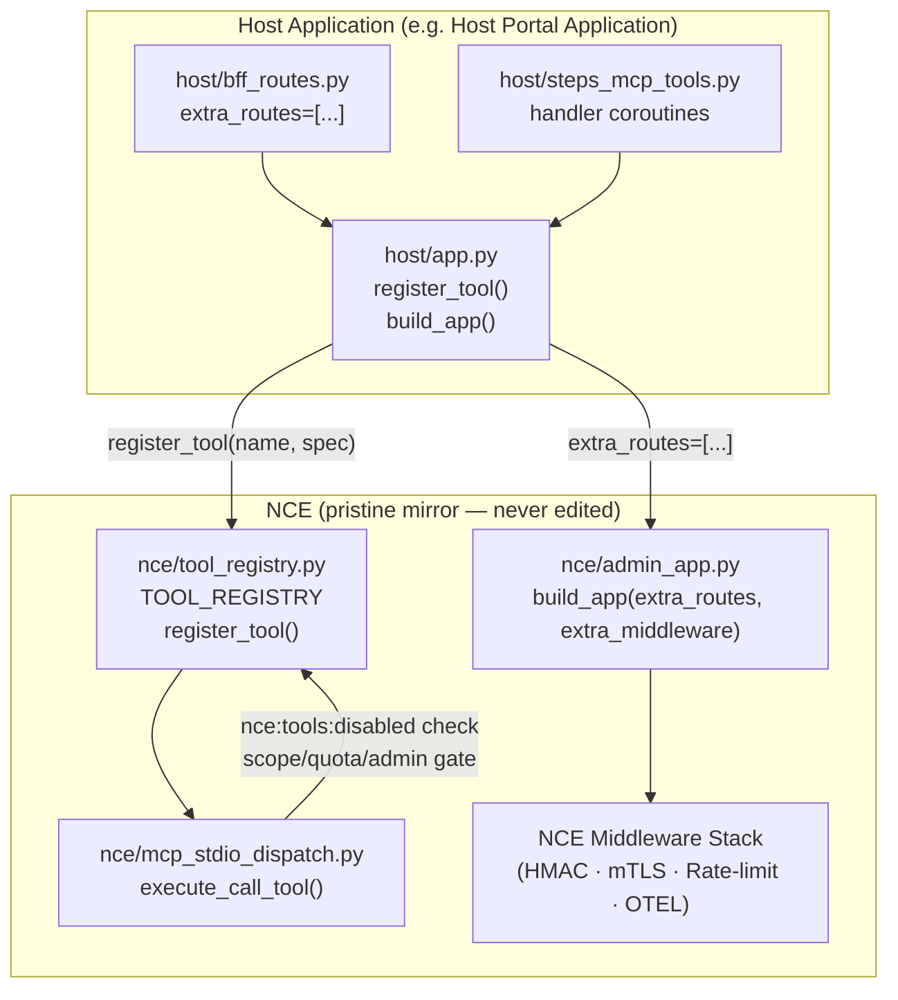

> **Status:** shipped · **Verified-against:** 7304330 (main) · **Last-audited:** 2026-08-17

# Frontend Integration Guide

This guide covers the two shipped host-integration seams delivered as NCE front-end-readiness items **FE-1** and **FE-2** (Batches 153 and 154 respectively). These seams allow a host application to mount its own Starlette routes and register custom MCP tools against a pristine NCE installation without editing any NCE source file.

> **Scope of this document:** shipped seams only (FE-1 and FE-2). Configurable static-asset serving (FE-3) and browser CORS/JWT-audience policy (FE-4) are planned and not yet shipped; they are noted as forthcoming where relevant.

---

## 1. Background and Design Principle

NCE is designed to be vendored as a **pristine mirror** by host applications. The governing rule is that a host never edits NCE source to connect a front end. Every capability a host needs is a first-class, generic extension point inside NCE, configured from outside. Host-specific code lives in host modules deployed alongside a pristine NCE copy.

When a host vendors NCE (for example as `backend/nce` in the Host Portal Application), that copy is overwritten on every sync. Any edit made directly to the vendored NCE is lost by design. FE-1 and FE-2 are the two seams that replace the two categories of direct edits previously made to `admin_app.py` and `admin_handlers/fleet.py`.

**Distinction between NCE-owned verticals and host-specific tools:**

| Extension type | Lives in | Registered by | In the pristine mirror? |
|---|---|---|---|
| NCE-owned vertical (NetBox, D365, Product, …) | `nce/vertical_modules/*` | NCE itself via `TOOL_REGISTRY` | Yes — every host gets it automatically |
| Host-specific tool (Portal steps-modules, etc.) | Host module alongside NCE | Host at startup via `register_tool()` | No — that host only |

The FE-2 `register_tool()` seam is reserved for genuinely host-specific tools. New NCE-native verticals are added to `nce/vertical_modules/` and registered by NCE itself, not by hosts.

---

## 2. FE-1 — App Composition Hook (`build_app`)

### 2.1 Purpose

Before FE-1, a host had to edit `nce/admin_app.py` directly to inject host routes (for example, importing `steps_bff_routes` and prepending them to `build_admin_routes()`). `build_app()` eliminates that need.

### 2.2 API Reference

**Source:** `nce/admin_app.py`

```python
def build_app(
    *,
    extra_routes: Sequence[Route] = (),
    extra_middleware: Sequence[Middleware] = (),
) -> Starlette:
```

**Parameters:**

| Parameter | Type | Default | Description |
|---|---|---|---|
| `extra_routes` | `Sequence[starlette.routing.Route]` | `()` | Host-supplied Starlette `Route` objects. Placed **before** NCE's own routes, allowing a host to shadow or extend paths. NCE routes still resolve for everything not matched by a host route. |
| `extra_middleware` | `Sequence[starlette.middleware.Middleware]` | `()` | Host-supplied `Middleware` objects. Placed **outermost** (before NCE's auth/rate-limit/trace stack) so cross-cutting host middleware such as CORS handles a request (e.g. a preflight `OPTIONS`) ahead of NCE authentication. |

**Return value:** A fully configured `starlette.applications.Starlette` instance with the NCE lifespan, combined route list, and combined middleware stack.

**Zero-argument behaviour:** Calling `build_app()` with no arguments is identical to the historical construction — the route set equals `build_admin_routes()` and the middleware equals `build_admin_middleware()`. The existing `create_admin_app()` helper and the module-level `app` singleton both delegate to `build_app()` with no arguments and are therefore unchanged.

### 2.3 Ordering Guarantees

```
Middleware stack (outermost → innermost):

  [extra_middleware[0]]          ← host middleware (e.g. CORS)
  [extra_middleware[1]]
  ...
  OpenTelemetryTraceMiddleware   ─┐
  AdminHTTPRateLimitMiddleware    │ NCE built-in middleware
  MTLSAuthMiddleware              │ (build_admin_middleware())
  BasicAuthMiddleware             │
  HMACAuthMiddleware             ─┘

Route resolution order (first match wins):

  extra_routes[0]                ← host routes resolved first
  extra_routes[1]
  ...
  /healthz                       ─┐
  /                               │ NCE built-in routes
  /api/health                     │ (build_admin_routes())
  ...                            ─┘
```

A host route placed in `extra_routes` therefore resolves before any NCE route. This means a host can override an existing NCE path if needed, though that should be done with care. Host middleware placed in `extra_middleware` executes before NCE's authentication, which is the correct placement for a CORS middleware that must respond to `OPTIONS` preflight requests before HMAC verification runs.

### 2.4 Security Note

Composed host routes traverse the **same middleware stack** as NCE's own routes. There is no implicit authentication bypass. If a host route requires HMAC authentication it gets it; if it requires mTLS it gets it. The only exception is a host's own outermost middleware (e.g. a CORS middleware) which, by design, sits outside NCE's auth layer so it can emit CORS preflight responses without authentication.

### 2.5 Minimal Example

The following example shows a host's startup module (`host/app.py`) mounting a BFF route without touching `nce/admin_app.py`:

```python
# host/bff_routes.py
from starlette.requests import Request
from starlette.responses import JSONResponse
from starlette.routing import Route


async def handle_steps(request: Request) -> JSONResponse:
    # Host-specific BFF logic here.
    return JSONResponse({"steps": []})


steps_bff_routes = [
    Route("/api/bff/steps", endpoint=handle_steps, methods=["GET"]),
]
```

```python
# host/app.py  — the host's ASGI entry point
from nce.admin_app import build_app
from host.bff_routes import steps_bff_routes

# Mount host routes alongside the NCE admin app.
# NCE source is never modified.
app = build_app(extra_routes=steps_bff_routes)
```

To also inject a CORS middleware (planned for FE-4, but the middleware slot is available now):

```python
from starlette.middleware import Middleware
from starlette.middleware.cors import CORSMiddleware
from nce.admin_app import build_app
from host.bff_routes import steps_bff_routes

app = build_app(
    extra_routes=steps_bff_routes,
    extra_middleware=[
        Middleware(
            CORSMiddleware,
            allow_origins=["https://portal.example.com"],
            allow_methods=["GET", "POST", "OPTIONS"],
            allow_headers=["Authorization", "Content-Type"],
        ),
    ],
)
```

> **Note — FE-3/FE-4 forthcoming (planned):** Configurable static front-end serving (`NCE_FRONTEND_DIR` / `NCE_FRONTEND_INDEX`) and a sanctioned browser JWT-audience/CORS policy are planned as Batches 155 and 156 respectively. The `extra_middleware` slot shown above is available today and is the correct place to inject CORS until the first-class FE-4 surface ships.

---

## 3. FE-2 — Tool Registration Hook (`register_tool`)

### 3.1 Purpose

Before FE-2, a host had to edit `nce/admin_handlers/fleet.py` to import and wire host MCP tools into NCE's dispatch loop. `register_tool()` eliminates that need. A host calls `register_tool()` at startup from its own module; the tool joins `TOOL_REGISTRY` and inherits the full NCE dispatch gating.

### 3.2 API Reference

**Source:** `nce/tool_registry.py`

```python
def register_tool(name: str, spec: ToolSpec, *, replace: bool = False) -> None:
```

**Parameters:**

| Parameter | Type | Default | Description |
|---|---|---|---|
| `name` | `str` | — | The MCP tool name. This is the dispatch key: the string the MCP client sends as the tool name in a `tools/call` JSON-RPC request. Must be a non-empty string. |
| `spec` | `ToolSpec` | — | Immutable metadata for the tool. See `ToolSpec` reference below. |
| `replace` | `bool` (keyword-only) | `False` | When `False` (default), registering a name that already exists raises `ValueError`. Pass `True` to intentionally override an existing entry. |

**Raises:**
- `ValueError` — if `name` is empty, or if `name` is already registered and `replace=False`.

**`ToolSpec` dataclass** (`nce/tool_registry.py`):

```python
@dataclass(frozen=True)
class ToolSpec:
    handler: Callable[..., Any]   # async (engine, arguments) -> str
    admin_only: bool = False
    cacheable: bool = False
    mutation: bool = False
    migration: bool = False
```

| Field | Type | Default | Meaning at dispatch time |
|---|---|---|---|
| `handler` | `async (engine, arguments) -> str` | — | The coroutine that implements the tool. Must accept `(engine: NCEEngine, arguments: dict)` and return a `str`. |
| `admin_only` | `bool` | `False` | When `True`, the dispatch layer calls `_check_admin(arguments)` before invoking the handler. Non-admin callers receive a `Scope forbidden` error. |
| `cacheable` | `bool` | `False` | When `True`, a successful response is written to Redis with TTL `MCP_CACHE_TTL_S` and served from cache on subsequent identical requests. |
| `mutation` | `bool` | `False` | When `True`, the dispatch layer increments the global cache-generation counter after the handler succeeds, invalidating stale cached reads. |
| `migration` | `bool` | `False` | When `True`, the tool is gated by `cfg.NCE_DISABLE_MIGRATION_MCP`; a disabled gate returns a plain message without calling the handler. Typically not used for host tools. |

### 3.3 Dispatch Gating for Host-Registered Tools

A host-registered tool is subject to **identical gating** as any built-in NCE tool. The gating sequence in `execute_call_tool` (`nce/mcp_stdio_dispatch.py`) is:

```
1. nce:tools:disabled Redis hash check (per tool name)
   → if present: return Scope forbidden, "disabled by the administrator"

2. enforce_mcp_tool_auth(name, arguments)   (scope enforcement)

3. TOOL_REGISTRY lookup (spec = TOOL_REGISTRY.get(name))
   → if None: UnknownToolError

4. Migration gate (spec.migration and cfg.NCE_DISABLE_MIGRATION_MCP)

5. Redis response cache check (spec.cacheable)

6. Quota consumption (_consume_quota_for_mcp_tool)

7. spec.admin_only → _check_admin(arguments)

8. spec.handler(engine, arguments)

9. spec.mutation → bump_cache_generation(redis_client)
   spec.cacheable → redis.setex(cache_key, MCP_CACHE_TTL_S, result)
```

The `nce:tools:disabled` Redis hash at step 1 is the administrator kill-switch. Adding a field `hset nce:tools:disabled <tool_name> 1` disables that tool immediately across all workers without a restart. This applies equally to host-registered and built-in tools.

### 3.4 Derived Set Refresh

`register_tool()` calls `_refresh_derived_sets()` after mutating `TOOL_REGISTRY`. This keeps the module-level frozensets (`ADMIN_ONLY_TOOLS`, `MUTATION_TOOLS`, `CACHEABLE_TOOLS`, `MIGRATION_TOOLS`) consistent with the updated registry. Any code that imported one of these sets **by value** before `register_tool()` was called will hold a stale reference; code that reads the sets fresh (by name, via `tool_registry.ADMIN_ONLY_TOOLS`) always sees the current state.

### 3.5 Startup Timing

`register_tool()` must be called **before the ASGI server starts accepting requests**. The idiomatic place is in a Starlette lifespan handler or in the host module that constructs the app, before `build_app()` is called.

```python
# host/app.py
from nce.admin_app import build_app
from nce.tool_registry import ToolSpec, register_tool
from host.bff_routes import steps_bff_routes
from host import steps_mcp_tools  # host handler module


# Register host MCP tools before the ASGI app is constructed.
register_tool(
    "query_steps_module",
    ToolSpec(
        handler=steps_mcp_tools.handle_query,
        # Not admin-only: any authenticated MCP client may call this.
    ),
)

register_tool(
    "store_steps_module",
    ToolSpec(
        handler=steps_mcp_tools.handle_store,
        mutation=True,   # invalidates the cache after a successful write
    ),
)

register_tool(
    "delete_steps_module",
    ToolSpec(
        handler=steps_mcp_tools.handle_delete,
        mutation=True,
        admin_only=True,  # only admin callers may delete
    ),
)

app = build_app(extra_routes=steps_bff_routes)
```

### 3.6 Handler Signature

Every handler passed to `ToolSpec` must be an `async` coroutine with this exact signature:

```python
async def handle_my_tool(engine: NCEEngine, arguments: dict) -> str:
    """Return a plain-text or JSON string; the dispatch layer wraps it in TextContent."""
    ...
```

`engine` is the live `NCEEngine` instance (provides `engine.pg_pool`, `engine.redis_client`, `engine.mongo_client`, `engine.minio_client`). `arguments` is the raw `dict` from the MCP `tools/call` request.

### 3.7 Minimal Full Example

```python
# host/steps_mcp_tools.py
import json
from nce.orchestrator import NCEEngine


async def handle_query(engine: NCEEngine, arguments: dict) -> str:
    namespace_id = arguments.get("namespace_id")
    if not namespace_id:
        return json.dumps({"error": "namespace_id required"})
    async with engine.pg_pool.acquire() as conn:
        rows = await conn.fetch(
            "SELECT id, name FROM steps_module WHERE namespace_id = $1 LIMIT 50",
            namespace_id,
        )
    return json.dumps([dict(r) for r in rows])
```

```python
# host/app.py
from nce.admin_app import build_app
from nce.tool_registry import ToolSpec, register_tool
from host import steps_mcp_tools

register_tool("query_steps_module", ToolSpec(handler=steps_mcp_tools.handle_query))

app = build_app()
```

---

## 4. Acceptance Verification

The following tests ship with NCE and must pass after any change to the composition seams. They serve as the ongoing correctness contract.

### 4.1 FE-1 Tests (`tests/test_app_composition.py`)

| Test | What it verifies |
|---|---|
| `test_build_app_no_args_matches_default_routes` | `build_app()` with no arguments yields exactly `build_admin_routes()`; `create_admin_app()` is equivalent. |
| `test_build_app_extra_routes_are_served_alongside_nce_routes` | A host route passed via `extra_routes` appears in the app route list alongside all NCE routes. |
| `test_build_app_extra_middleware_is_outermost` | Host middleware is the first entry in `app.user_middleware`, sitting outside NCE's own auth stack. |
| `test_admin_app_source_has_no_host_imports` | `nce/admin_app.py` contains no host-specific import markers (`steps_bff`, `steps_mcp_tools`, `nettailer`, `custom_hr`). |

### 4.2 FE-2 Tests (`tests/test_tool_registration_hook.py`)

| Test | What it verifies |
|---|---|
| `test_register_tool_is_dispatchable_and_scope_enforced` | A host tool registered via `register_tool` is present in `TOOL_REGISTRY` and the derived sets (`ADMIN_ONLY_TOOLS`) reflect its flags. |
| `test_duplicate_name_requires_replace` | Registering the same name twice without `replace=True` raises `ValueError`; `replace=True` succeeds and derived sets are updated. |
| `test_empty_name_rejected` | An empty `name` raises `ValueError`. |
| `test_disabled_toggle_applies_to_host_tool` | When a host tool's name is present in the `nce:tools:disabled` Redis hash, `execute_call_tool` returns a `Scope forbidden` response without invoking the handler. |
| `test_registry_source_has_no_host_imports` | `nce/tool_registry.py` and `nce/admin_handlers/fleet.py` contain no host-specific import markers. |

---

## 5. Integration Flow Diagram



---

## 6. What is NOT Covered (Forthcoming)

The following capabilities are specified in `docs/FRONTEND_READINESS.md` but are not yet shipped as of commit `7304330`:

| Item | Spec ID | Description |
|---|---|---|
| Configurable static front-end serving | FE-3 (Batch 155, planned) | `NCE_FRONTEND_DIR` / `NCE_FRONTEND_INDEX` config vars to serve a host-provided SPA from outside the NCE package. Until FE-3 ships, hosts must serve static assets from their own process or a reverse proxy. |
| Browser auth (CORS + JWT audience) | FE-4 (Batch 156, planned) | A configurable front-end JWT audience and CORS allow-origins so a browser can authenticate directly against NCE. Until FE-4 ships, use the `extra_middleware` slot from FE-1 to inject a CORS middleware as a temporary measure. |
| Host configuration namespace | FE-5 (Batch 157, planned) | An extension-config pattern so host modules supply their own env-driven settings without editing `nce/config.py`. Until FE-5 ships, host modules should own and read their own settings objects independently of NCE config. |

---

## 7. Reference

| Symbol | Source file | Description |
|---|---|---|
| `build_app(*, extra_routes, extra_middleware)` | `nce/admin_app.py:434` | FE-1 app factory — compose host routes/middleware with NCE. |
| `build_admin_routes()` | `nce/admin_app.py:115` | Returns the list of all built-in NCE admin `Route` objects. |
| `build_admin_middleware()` | `nce/admin_app.py:85` | Returns the list of all built-in NCE `Middleware` objects. |
| `create_admin_app()` | `nce/admin_app.py:463` | Zero-arg wrapper around `build_app()`. |
| `register_tool(name, spec, *, replace)` | `nce/tool_registry.py:434` | FE-2 registration hook — add a host MCP tool to `TOOL_REGISTRY`. |
| `ToolSpec` | `nce/tool_registry.py:63` | Frozen dataclass: handler + admin_only / cacheable / mutation / migration flags. |
| `TOOL_REGISTRY` | `nce/tool_registry.py:92` | `dict[str, ToolSpec]` — single source of truth for the MCP dispatch loop. |
| `execute_call_tool` | `nce/mcp_stdio_dispatch.py:62` | Dispatch coroutine; applies `nce:tools:disabled`, scope, quota, admin, cache, and mutation gating in that order. |
| `FRONTEND_READINESS.md` | `docs/FRONTEND_READINESS.md` | Living spec for all FE-1 through FE-6 items, execution sequence, and host-mirror dependency. |
