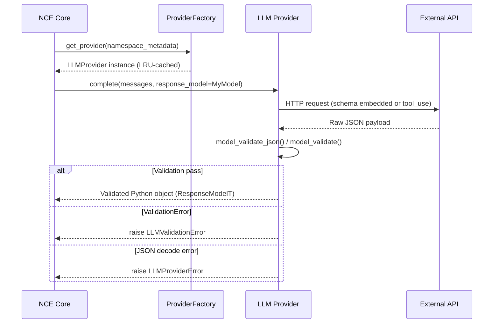

> **Status:** shipped · **Verified-against:** 7304330 (main) · **Last-audited:** 2026-08-17

# LLM Providers and Structured Output

NCE is architected to be Large Language Model (LLM) provider-agnostic. It supports a diverse range of backends for embeddings, semantic search, memory consolidation, and reasoning, with mandatory Pydantic V2 schema validation for all outputs.

## Supported Providers

All provider labels below are keys in `_FACTORIES` inside `nce/providers/factory.py`.

| Label | Concrete class | Default model | Typical use case |
| :--- | :--- | :--- | :--- |
| `local-cognitive-model` | `LocalCognitiveProvider` | `local-cognitive-model` | Default; airgapped / edge deployments. |
| `google_gemini` | `GoogleGeminiProvider` | `gemini-2.0-flash` | General reasoning and consolidation. |
| `anthropic` | `AnthropicProvider` | `claude-opus-4-6` | High-accuracy extraction and research. |
| `openai` | `OpenAICompatProvider` | `gpt-5` | General purpose reasoning. |
| `azure_openai` | `OpenAICompatProvider` | deployment name | Enterprise-grade managed endpoints. |
| `deepseek` | `OpenAICompatProvider` | `deepseek-v4` | Cost-sensitive high-performance tasks. |
| `moonshot_kimi` | `OpenAICompatProvider` | `kimi-2.6` | Large-context cluster processing. |
| `openai_compatible` | `OpenAICompatProvider` | configurable | Self-hosted vLLM, Ollama, LM Studio. |

`local-cognitive-model` is the system default when `NCE_LLM_PROVIDER` is unset.

## Structured Output Strategy (Pydantic V2)

All LLM calls in NCE **must** go through `LLMProvider.complete()`. The method accepts a Pydantic V2 `BaseModel` class as `response_model` and returns a fully validated instance — loose text is never surfaced to callers.

Each provider uses a different mechanism to elicit JSON from the upstream API, but all converge on `model_validate_json()` (or `model_validate()` for dict payloads) before returning:

| Provider | Structured-output mechanism |
| :--- | :--- |
| `LocalCognitiveProvider` | `response_format: {"type": "json_schema"}` (strict mode, schema in request body); validated with `_parse_and_validate` → `model_validate_json()`. |
| `GoogleGeminiProvider` | `generationConfig.responseMimeType: "application/json"` + `responseSchema` field; validated with `_parse_and_validate` → `model_validate_json()`. |
| `AnthropicProvider` | Single synthetic `tool_use` call whose `input_schema` is the Pydantic JSON schema; response dict validated with `model_validate()`. |
| `OpenAICompatProvider` | `response_format.json_schema` (strict mode) where supported; falls back to `json_object` + prompt embedding. Raw content always validated with `_parse_and_validate` → `model_validate_json()`. |

### Validation Signal Flow



### Exception Hierarchy

All exceptions inherit from `LLMProviderError` (defined in `nce/providers/base.py`):

```
LLMProviderError
├── LLMValidationError        — valid JSON, failed Pydantic validation
├── LLMTimeoutError           — upstream call exceeded configured timeout
├── LLMAuthenticationError    — 401/403 — invalid or expired credentials
├── LLMRateLimitError         — 429 — carries optional retry_after (seconds)
├── LLMUpstreamError          — 5xx — transient; retried automatically
├── LLMBadRequestError        — 400 — malformed request; not retried
├── LLMCircuitOpenError       — circuit breaker open; request rejected
└── LLMRetriesExhaustedError  — transient failures exhausted retry budget
```

`LLMValidationError`, `LLMAuthenticationError`, and `LLMBadRequestError` are propagated immediately (not retried). All other transient errors pass through the `execute_with_retry()` wrapper with exponential backoff + full jitter via `tenacity`.

## Provider Configuration

### Resolution Order

`get_provider(namespace_metadata)` in `nce/providers/factory.py` resolves configuration in this order:

1. `namespace_metadata["consolidation"]["llm_provider"]` — per-namespace label override.
2. `namespace_metadata["consolidation"]["llm_model"]` — per-namespace model override.
3. `namespace_metadata["consolidation"]["llm_credentials"]` — per-namespace credential ref.
4. `NCE_LLM_PROVIDER` — global environment default (falls back to `local-cognitive-model`).

Provider instances are LRU-cached by `(label, model, cred_ref)` triplet via `_cached_build_provider`. Call `rebuild_provider_cache()` (e.g. triggered by the admin settings endpoint) to force re-instantiation after a config change.

### Environment Variables

| Variable | Secret | Provider | Purpose |
| :--- | :---: | :--- | :--- |
| `NCE_LLM_PROVIDER` | No | all | Global provider label selection. |
| `NCE_COGNITIVE_BASE_URL` | No | `local-cognitive-model` | Base URL of cognitive container (default `http://localhost:11435`). |
| `NCE_COGNITIVE_API_KEY` | Yes | `local-cognitive-model` | Optional API key for cognitive server. |
| `NCE_GEMINI_API_KEY` | Yes | `google_gemini` | Google AI Studio API key. |
| `NCE_ANTHROPIC_API_KEY` | Yes | `anthropic` | Anthropic Claude API key. |
| `NCE_OPENAI_API_KEY` | Yes | `openai` | OpenAI API key. |
| `NCE_AZURE_OPENAI_API_KEY` | Yes | `azure_openai` | Azure OpenAI API key header. |
| `NCE_AZURE_OPENAI_ENDPOINT` | No | `azure_openai` | Azure resource endpoint URL (required). |
| `NCE_AZURE_OPENAI_DEPLOYMENT` | No | `azure_openai` | Default deployment name. |
| `NCE_DEEPSEEK_API_KEY` | Yes | `deepseek` | DeepSeek API key. |
| `NCE_MOONSHOT_API_KEY` | Yes | `moonshot_kimi` | Moonshot Kimi API key. |
| `NCE_OPENAI_COMPAT_BASE_URL` | No | `openai_compatible` | Base URL for compatible endpoint (required). |
| `NCE_OPENAI_COMPAT_API_KEY` | Yes | `openai_compatible` | API key for compatible endpoint. |
| `NCE_OPENAI_COMPAT_MODEL` | No | `openai_compatible` | Default model name for compatible endpoint. |

All secret variables are `reload_class: WARM` in the settings registry — changes take effect after `rebuild_provider_cache()`, with no restart required.

### Credential Resolution (BYO Keys)

NCE follows a "Bring Your Own Key" model. The `llm_credentials` field in namespace consolidation config accepts these forms:

```python
# Read from a named environment variable (recommended)
"ref:env/NCE_NS_ACME_GEMINI_KEY"

# Literal key — only permitted outside production; logs a warning
"sk-..."

# Vault path — not yet implemented; raises LLMProviderError
"ref:vault/secret/nce/acme/llm"   # PLANNED
```

Resolution logic in `_resolve_credential()` (`nce/providers/factory.py`):

| Form | Behaviour |
| :--- | :--- |
| `None` / empty | Falls back to the provider's standard env var (e.g. `NCE_GEMINI_API_KEY`). |
| `ref:env/<VAR>` | Reads `os.getenv(VAR)`. Raises in production if empty. |
| `ref:vault/<path>` | **Planned** — raises `LLMProviderError` ("not yet implemented"). |
| Literal string | Used as-is in development; raises in production. |

> **Note:** `ref:vault/` is reserved for a future Vault integration and is **not shipped** on main. Any literal `ref:vault/` credential reference will raise `LLMProviderError` at resolution time.

## Local Embedding Backend

The `local-cognitive-model` provider (`LocalCognitiveProvider`) targets the bundled cognitive container image (`ghcr.io/sindrehaugen/nce-cognitive:v1`), which exposes an OpenAI-compatible HTTP API on port `11435`. A `GET /health` probe is available via `is_healthy()`. For embedding tasks the same `NCE_COGNITIVE_BASE_URL` is used; `NCE_COGNITIVE_EMBEDDING_MODEL` and `NCE_COGNITIVE_FALLBACK_MODEL` (`text-embedding-3-small`) control which embedding model is selected.
