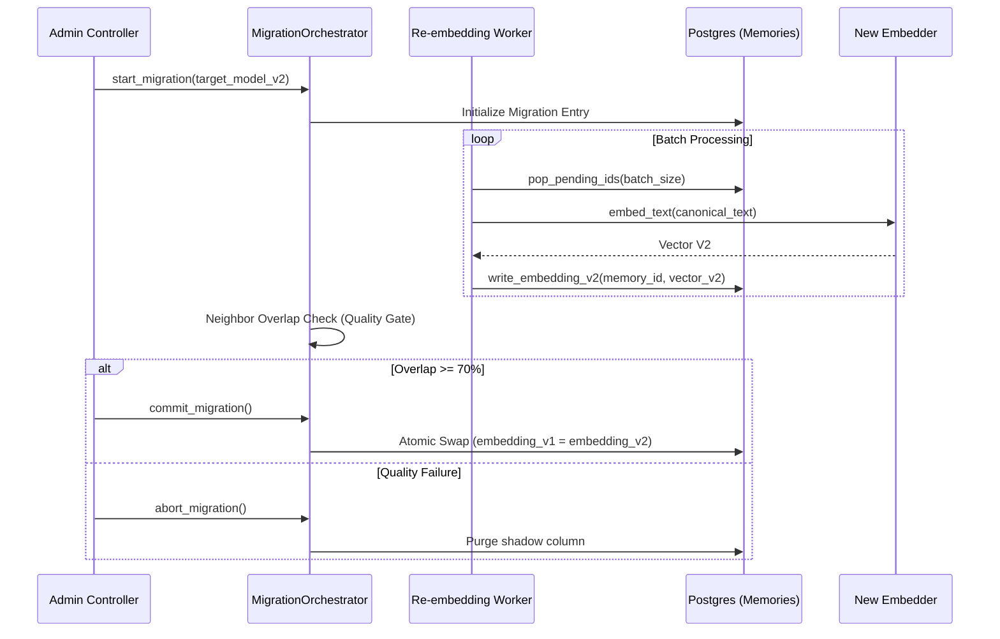

> **Status:** shipped · **Verified-against:** 7304330 (main) · **Last-audited:** 2026-08-17

# System Migrations and Re-embedding

NCE is architected for evolution. It includes specialized infrastructure for managing database schema changes and the heavy task of re-embedding large memory stores when moving to new AI models.

## 1. Re-embedding Migrations (Strategy A)

When the system upgrades its embedding model (e.g., from `v1` to `v2`), existing memory vectors must be recalculated to remain valid for semantic search. NCE uses a **Shadow Column** strategy to ensure zero-downtime during this process.

### Re-embedding Signal Flow

## 2. Quality Gates: Neighbor Overlap

To prevent semantic drift during a model upgrade, NCE calculates a **Jaccard Similarity** score between the top nearest neighbors of a sample set using both models.

-   The `neighbor_overlap_fraction()` function in `nce/reembedding_migration.py` computes the Jaccard similarity of two neighbour-ID sets: `|A ∩ B| / |A ∪ B|`.
-   The default quality threshold is **0.7** (70%). If the overlap score is below this threshold, `commit_primary_to_v2()` raises a `RuntimeError` and blocks the commit until the issue is resolved.
-   The abort path (`abort_and_clear_pending_v2()`) purges all `embedding_v2` shadow values and reverts the migration phase to `ABORTED`, leaving `embedding_v1` intact for continued reads.
-   Run progress is durably checkpointed in the `reembedding_runs` table (migration `012_reembedding_runs.sql`) via keyset cursor columns (`cursor_created_at`, `cursor_id`), enabling resumable batch processing after failures.

## 3. Schema Migrations

Database schema changes are managed via idempotent SQL scripts located in `nce/migrations/`. All scripts are safe to re-run on an existing database.

**Note on gaps:** `002` and `009` are absent from the directory; those numbers were reserved and never committed.

### Migration Inventory

| # | File | Purpose |
|---|------|---------|
| 001 | `001_enable_rls.sql` | Enables Row-Level Security on all tenant tables; creates `nce_app` (login) and `nce_gc` (BYPASSRLS, NOLOGIN) roles; installs `tenant_isolation_policy` on all scoped tables; grants `SELECT, INSERT` only on `event_log` and `pii_redactions` (WORM hardening). |
| 003 | `003_quota_check.sql` | Adds `CHECK (used_amount >= 0)` constraint on `resource_quotas`; repairs pre-existing negative/NULL rows before enforcement. |
| 004 | `004_event_sequences_backfill.sql` | Backfills `event_sequences` counter rows from existing `event_log` rows; required on clusters that existed before the counter table was created. |
| 005 | `005_query_catalog_and_schema_registry.sql` | Creates `query_templates` (intent-based query catalog with HNSW embedding index) and `graph_schema_registry` (vocabulary-level KG type registry). |
| 006 | `006_event_log_correlation.sql` | Adds nullable `correlation_id UUID` column to `event_log` for cross-request / cross-agent tracing. |
| 007 | `007_rename_db_roles.sql` | Renames legacy roles `trimcp_app` → `nce_app` and `trimcp_gc` → `nce_gc` (idempotent; skipped if already renamed or on fresh install). |
| 008 | `008_v3_cognitive_ledger.sql` | Creates `v3_cognitive_ledger` table for Empathic Tensor storage (`vector(6)`); HNSW cosine index; RLS isolation by namespace. |
| 010 | `010_citus_sharding.sql` | Enables Citus extension; configures 2PC (`citus.multi_shard_commit_protocol = '2pc'`), adaptive executor, GUC propagation; adds `namespace_id` to PKs of `memories`, `event_log`, and `v3_cognitive_ledger`; creates distributed tables on `namespace_id` (32 shards); creates reference tables (`namespaces`, `signing_keys`); adds shard-distribution monitoring views. |
| 011 | `011_audit_log.sql` | Creates `audit_log` (permanent, signed GDPR Article 17 deletion audit trail, distinct from `event_log`); adds `valid_to` to `topology_graph` for soft-deletion. |
| 012 | `012_reembedding_runs.sql` | Creates `reembedding_runs` table tracking re-embedding worker status, checkpoints (`cursor_created_at`, `cursor_id`), and model transitions. |
| 013 | `013_event_log_sig_version.sql` | Adds `signature_version SMALLINT DEFAULT 1` to `event_log` for backward-compatible signature format versioning. |
| 014 | `014_replay_runs_digest.sql` | Adds `source_state_digest`, `target_state_digest`, and `digest_match` columns to `replay_runs` for replay-state verification. |
| 015 | `015_settings_table.sql` | Creates the `settings` table for DB-backed runtime configuration (keyed JSONB values, optional encrypted secrets). |
| 016 | `016_a2a_can_delegate.sql` | Adds `can_delegate BOOLEAN DEFAULT FALSE` to `a2a_grants` (Batch 41 delegation model). |
| 017 | `017_a2a_one_time.sql` | Adds `one_time BOOLEAN DEFAULT false` and `usage_count INTEGER DEFAULT 0` to `a2a_grants` for one-shot grant semantics. |
| 018 | `018_memories_envelope_dek.sql` | Adds `wrapped_dek BYTEA` and `dek_key_id TEXT` to `memories` for envelope-encryption (AES-256-GCM DEK wrapped under `NCE_MASTER_KEY`); supports provable forgetting via DEK destruction. |
| 019 | `019_halfvec_embeddings.sql` | Migrates `memories.embedding` and `kg_nodes.embedding` from `vector(768)` (fp32) to `halfvec(768)` (fp16); rebuilds HNSW indexes. Halves on-disk vector and index storage with negligible recall loss. |
| 020 | `020_kg_node_embeddings_grants.sql` | Grants `SELECT, INSERT, UPDATE, DELETE` on `kg_node_embeddings` (and its hash partitions) to `nce_app`; grants `DELETE` on `pii_redactions` to `nce_app`. |
| 021 | `021_embedding_aspects.sql` | Creates `embedding_aspects` (`halfvec(768)`, HASH-partitioned 4-way) for multi-vector / aspect-level semantic search with HNSW index. |
| 022 | `022_muscles_schema_contract.sql` | Schema contract freeze: adds `change_origin` + `origin_event_id` provenance columns to `memories`, `kg_nodes`, `kg_edges`; adds `derivation_depth` to `memories`; creates `processed_outbox_events`, `actor_trust`, `event_parents` (WORM-triggered), `action_approval_queue`, `action_idempotency`. |
| 023 | `023_d365_sync_runs.sql` | Creates `d365_sync_runs` (per-entity Dynamics 365 sync run audit trail, append-only; surfaced by `d365_sync_status` MCP tool). |
| 024 | `024_d365_change_tracking.sql` | Creates `d365_delta_tokens` (per-namespace/entity Dataverse deltaLink store for change-tracking delta sync); adds `d365_source_id` column to `kg_edges` and `kg_nodes` for retirement-by-source-GUID. |

### Application Role: `nce_app`

Migration `007_rename_db_roles.sql` renamed the legacy `trimcp_app` role to `nce_app`. On fresh installs, `nce_app` is created directly by `schema.sql` and `001_enable_rls.sql`. The companion GC role `nce_gc` holds `BYPASSRLS NOLOGIN` and is used exclusively for maintenance sweeps.

## 4. WORM Compliance

For enterprise auditability, the `event_log` table is configured as **WORM (Write Once, Read Many)**.

-   **Grant model:** `nce_app` is granted `INSERT` and `SELECT` only. `UPDATE` and `DELETE` are never granted. This is enforced in both `schema.sql` (`GRANT INSERT, SELECT ON event_log TO nce_app`) and reinforced by `001_enable_rls.sql`.
-   **Trigger guard:** `schema.sql` installs trigger `trg_event_log_worm` (`BEFORE UPDATE OR DELETE FOR EACH ROW`) which calls `prevent_mutation()` — that function raises an exception unconditionally for any `UPDATE` or `DELETE` attempt, even from a superuser connection that bypasses the role grant.
-   **2PC integrity:** Migration `010_citus_sharding.sql` mandates `citus.multi_shard_commit_protocol = '2pc'` for `event_log` writes on Citus deployments, ensuring cross-shard ACID consistency for the immutable ledger.
-   **`event_parents` WORM:** The `event_parents` causal-lineage table (migration `022`) also carries the `trg_event_parents_worm` trigger reusing the same `prevent_mutation()` function; `nce_app` holds `SELECT, INSERT` only.
-   This design ensures that the causal history of the memory store cannot be tampered with at any layer: application role grants, trigger-level enforcement, and (on Citus) two-phase commit all cooperate.
