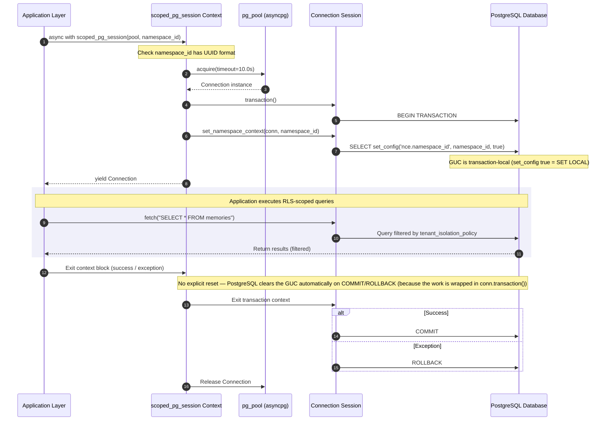
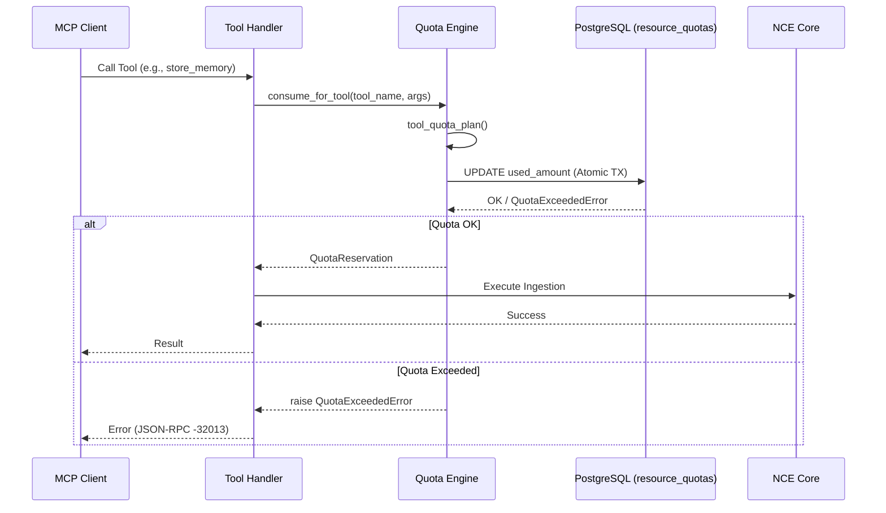

> **Status:** shipped · **Verified-against:** 7304330 (main) · **Last-audited:** 2026-08-17

# Multi-Tenancy and Resource Quotas

NCE is an enterprise-grade multi-tenant memory engine. It enforces strict isolation between different namespaces while managing resource consumption through a high-performance quota system.

---

## 1. Architecture of Isolation

Isolation in NCE is achieved through a combination of application-level logic, cryptographic signatures, and database-level Row-Level Security (RLS) enforcement.

1. **Namespace Resolution**: Every request must provide a `namespace_id` (UUID). The engine resolves this ID and ensures the agent or user has authority to access it.
2. **Row-Level Security (RLS)**: PostgreSQL Row-Level Security ensures that SQL queries can only read or mutate data belonging to the active namespace.
3. **Cryptographic Memory Signatures**: Every stored memory record carries a per-row HMAC-SHA256 signature (`signature` + `signature_key_id` columns). Signing keys are stored globally in the `signing_keys` table. **This table has no `namespace_id` column and no RLS policy** ([`nce/schema.sql`](https://github.com/sindrehaugen/NCE/blob/main/nce/schema.sql)): any `nce_app` connection can read every signing key, regardless of the namespace context set on the session. Key isolation comes from AES-256-GCM envelope encryption of the `encrypted_key` column at rest under `NCE_MASTER_KEY` ([`nce/signing.py`](https://github.com/sindrehaugen/NCE/blob/main/nce/signing.py)). Per-row signatures and RLS protect the *memory rows*; the key material is a shared, globally-readable, master-key-encrypted resource.
4. **External Principal Scoping**: For external contractor or partner access, NCE provides an external scope primitive (`get_nce_external_scope()`) that isolates partner visibility while maintaining tenant-level boundaries on tables like `contractor_profiles`.

---

## 2. RLS Enforcement Flow

To ensure RLS is active on pooled database connections, the application layer sets a transaction-scoped session variable on every database connection check-out:

```python
# nce/auth.py — set_namespace_context()
# set_config(..., true) is the transaction-local equivalent of SET LOCAL.
# Bare SET must never be used — it would leak across pooled connections.
await conn.execute(
    "SELECT set_config('nce.namespace_id', $1, true)",
    str(namespace_id),
)
```

The database policy uses this variable to filter results. A fail-fast PL/pgSQL helper (`get_nce_namespace()`) validates the GUC value and raises immediately if it is unset or malformed:

```sql
-- nce/migrations/001_enable_rls.sql (applied to every tenant table)
CREATE POLICY tenant_isolation_policy ON memories
FOR ALL TO nce_app
USING (namespace_id IS NOT NULL AND namespace_id = get_nce_namespace())
WITH CHECK (namespace_id IS NOT NULL AND namespace_id = get_nce_namespace());
```

### 2a. Authoritative Source of Truth: `EXPECTED_TENANT_RLS_TABLES` (73 Tables)

**The definitive source of truth for RLS-protected tables across NCE is `EXPECTED_TENANT_RLS_TABLES` defined in [`nce/event_log.py`](https://github.com/sindrehaugen/NCE/blob/main/nce/event_log.py) (73 tables), rather than the partial `schema.sql` loop (41 tables) or the initial migration 001 seed (14 tables).**

At runtime, NCE executes `verify_rls_catalog_consistency()` ([`nce/event_log.py`](https://github.com/sindrehaugen/NCE/blob/main/nce/event_log.py)) during server startup, inspecting PostgreSQL's `pg_tables`, `pg_class.relrowsecurity`, and `pg_policies` catalogs to strictly validate all 73 tenant tables against the active schema.

The catalog consistency validator categorizes all tables in the engine into three exhaustive sets:

1. **`EXPECTED_TENANT_RLS_TABLES` (73 tables)**: All standard tenant-isolated tables where rows belong to a single tenant and are partitioned by a `namespace_id` column.
2. **`EXPECTED_SPECIAL_RLS_TABLES` (1 table)**: `a2a_grants`, which enforces a dual-namespace ownership policy (`owner_namespace_id` and `target_namespace_id`).
3. **`EXPECTED_GLOBAL_TABLES` (6 tables)**: Shared tables intentionally without RLS across all tenants (`embedding_models`, `kg_node_embeddings`, `reembedding_runs`, `event_sequences`, `applied_migrations`, `product_catalog`). A table in `EXPECTED_GLOBAL_TABLES` carries no `namespace_id` and no RLS by design. `product_catalog` is the first business table to sit here (the existing five are platform/infrastructure). `applied_migrations` is deployment state — which migration files this database has applied — not tenant data, which is why it carries no `namespace_id` (see `nce/migration_ledger.py`).

> [!NOTE]
> **Hybrid Tenancy Model (`query_templates`):** `query_templates` is the sole hybrid table on the estate. Its `namespace_id` is nullable: global seed query templates are stored with `namespace_id IS NULL`, while tenant-specific templates store the tenant's UUID. Tenant isolation is enforced via predicate `(namespace_id IS NULL OR namespace_id = $N)`, matching the `USING` policy clause.

```
                              ┌─────────────────────────────────────────────────────────┐
                              │            NCE Database Schema Surface                  │
                              │                 (80 Total Tables)                       │
                              └────────────────────────────┬────────────────────────────┘
                                                           │
                     ┌─────────────────────────────────────┼─────────────────────────────────────┐
                     ▼                                     ▼                                     ▼
        ┌─────────────────────────┐           ┌─────────────────────────┐           ┌─────────────────────────┐
        │EXPECTED_TENANT_RLS_TABLES│          │EXPECTED_SPECIAL_RLS_TBLS│           │ EXPECTED_GLOBAL_TABLES  │
        │       (73 Tables)       │           │        (1 Table)        │           │       (6 Tables)        │
        │ Single namespace_id RLS │           │  a2a_grants (Dual-NS)   │           │ Intentionally Global    │
        └─────────────────────────┘           └─────────────────────────┘           └─────────────────────────┘
```

### 2b. Historical Evolution vs. Authoritative Surface

| Surface Definition | Table Count | Scope / Description | Why It Is Not the Source of Truth |
| :--- | :---: | :--- | :--- |
| **Migration [`001_enable_rls.sql`](https://github.com/sindrehaugen/NCE/blob/main/nce/migrations/001_enable_rls.sql)** | 14 | Initial baseline seed (`memories`, `kg_nodes`, `kg_edges`, `pii_redactions`, `memory_salience`, `contradictions`, `snapshots`, `event_log`, `resource_quotas`, `consolidation_runs`, `bridge_subscriptions`, `dead_letter_queue`, `embedding_migrations`, `memory_embeddings`) + `a2a_grants`. | Only seeds initial v1 tables; omits post-v1 migrations ([`002`–`050`](https://github.com/sindrehaugen/NCE/tree/main/nce/migrations/)). |
| **[`schema.sql`](https://github.com/sindrehaugen/NCE/blob/main/nce/schema.sql) `tenant_tables` loop** | 41 | Dynamic PL/pgSQL array loop in `nce/schema.sql`. Additional tables (`replay_runs`, `outbox_events`, `saga_execution_log`, `topology_graph`, `economy_contracts`, `stock_locations`, `inventory_items`, etc.) receive policy statements inline outside the loop. | Incomplete as a standalone list; lacks 32 tables (73 − 41) handled inline or in newer vertical engine migrations. |
| **`EXPECTED_TENANT_RLS_TABLES` ([`nce/event_log.py`](https://github.com/sindrehaugen/NCE/blob/main/nce/event_log.py))** | **73** | Authoritative programmatic specification covering all core, cognitive, governance, diagnostics, shared-core, and vertical-engine tables. Validated by `verify_rls_catalog_consistency()` at startup. | **Definitive source of truth**: Enforced by automated runtime assertions against live database catalog metadata. |

### 2c. Complete Inventory of the 73 Tenant RLS Tables

The 73 tables in `EXPECTED_TENANT_RLS_TABLES` span all 20 functional domains of NCE:

| Subsystem Domain | Count | Table Names | Description |
| :--- | :---: | :--- | :--- |
| **Core Memory & Graph** | 8 | `memories`, `kg_nodes`, `kg_edges`, `pii_redactions`, `memory_salience`, `contradictions`, `snapshots`, `event_log` | Core semantic vectors, relational knowledge graph nodes/edges, episodic event log (WORM), and privacy redactions. |
| **Infrastructure & Saga** | 6 | `resource_quotas`, `outbox_events`, `saga_execution_log`, `consolidation_runs`, `bridge_subscriptions`, `dead_letter_queue` | Distributed multi-DB write sagas, reliable outbox delivery, bridge OAuth tracking, and tenant quotas. |
| **Embeddings & Query** | 6 | `embedding_migrations`, `memory_embeddings`, `embedding_aspects`, `graph_schema_registry`, `query_templates`, `v3_cognitive_ledger` | Dynamic vector aspect representations, schema registry, cognitive ledger, and embedding backfills. |
| **Topology & Auditing** | 3 | `topology_graph`, `audit_log`, `active_learning_queue` | Network topology models, security mutation audit trail, and active learning queues. |
| **Dynamics 365 Bridge** | 4 | `d365_integrations`, `d365_netbox_mappings`, `d365_sync_runs`, `d365_delta_tokens` | Dynamics 365 Dataverse sync profiles, entity mappings, sync execution runs, and delta change tokens. |
| **Muscles & Governance** | 5 | `processed_outbox_events`, `actor_trust`, `event_parents`, `action_approval_queue`, `action_idempotency` | Causal DAG parents (WORM), actor trust scoring, dry-run approval queues, and idempotency tracking. |
| **Diagnostics Engine** | 3 | `diag_ingestions`, `diag_anomalies`, `device_health_rollup` | Hardware diagnostic log ingestions, detected anomalies, and aggregated device health rollups. |
| **Shared-Core Foundation** | 5 | `node_ownership_registry`, `entity_merge_queue`, `source_mode_config`, `divergence_log`, `bom_line_content` | Cross-engine entity resolution, survivorship merges, source mode routing (D365/NCE/Both), divergence logs, and the shared BOM line content store consumed by the design, economy and inventory engines. |
| **Product Engine** | 3 | `product_prices`, `product_match_feedback`, `product_enrichment_log` | PIM catalog entries, price tiers, distributor matching feedback, and supplier enrichment review audit. |
| **Procurement Engine** | 1 | `procurement_bid_prices` | Consumer projection cache for Product BID and supplier pricing models. |
| **System Design Engine** | 3 | `system_design_device_capabilities`, `system_design_geometry`, `system_design_node_state` | Device capability attributes, functional location models, and design BOM constraints; canvas geometry (x/y in grid units, origin top-left, y-down; rack `position`/`face` in NetBox's vocabulary) plus the per-DESIGN optimistic-concurrency version row; and per-node lifecycle state (NetBox status/revision/salience for DEVICE, RACK and CABLE). `system_design_geometry` deliberately holds **two key grains** under one natural key — geometry rows keyed by a node label (`version IS NULL`) and one version row keyed by the design label (`version IS NOT NULL`). In `system_design_node_state` a row exists only where somebody declared something, so absence stays meaningful. |
| **Sales Engine** | 3 | `sales_read_model`, `sales_targets`, `sales_signed_baselines` | Pipeline read models, sales quotas/targets, and immutable signed quote baselines. |
| **Vendors & Contractors** | 2 | `vendor_scorecards`, `contractor_profiles` | Partner contractor profiles (external scoped) and supplier performance scorecards. |
| **Agreements Engine** | 2 | `agreement_review_queue`, `agreement_extraction_runs` | OCR contract extraction runs and legal/financial human review queue. |
| **Economy Engine** | 3 | `economy_bom_actual_costs`, `economy_postings`, `economy_contracts` | BOM line actual cost cascades, balanced general ledger postings (`sum=0`), and recurring contract stores. |
| **Inventory Engine** | 5 | `stock_locations`, `inventory_items`, `inventory_transactions`, `goods_receipts`, `inventory_rma` | Logistics location hierarchies (warehouses/zones/bins/vans), per-SKU inventory stock balances, the append-only movement/valuation ledger, inbound goods-receipt records, and returns/RMA with WEEE disposal state. |
| **Assets Engine** | 2 | `assets`, `telemetry_samples` | Relational asset register seeded from BOM lines (Module 9), keyed per `(namespace_id, bom_line_id)`. |
| **Support Engine** | 3 | `service_tickets`, `sla_clocks`, `customer_health` | Native ServiceTicket store, live SLA countdown clocks, and rolling customer health & churn-risk scoring (Module 10). |
| **Field Tech Engine** | 3 | `work_orders`, `checklists`, `time_entries` | Physical work orders, ISO9001 checklist verification records, and GPS/manual time tracking (Module 12). |
| **Marketing Engine** | 3 | `case_studies`, `testimonials`, `content_assets` | Case studies, customer testimonials with dual-tier consent lifecycle, and content asset library with AEO/GEO metadata (Module 14). |


---

### 2d. Inventory of the 6 Global Reference & Platform Tables

The 6 tables in `EXPECTED_GLOBAL_TABLES` carry no `namespace_id` and have RLS disabled by design:

| Subsystem Domain | Table Name | Description |
| :--- | :--- | :--- |
| **Product Engine** | `product_catalog` | Shared parts library and master equipment catalog (manufacturer, mfr_part_no, specifications). One row per physical part, shared across all tenants. *(Note: `product_prices` remains strictly tenant-scoped).* |
| **Embeddings & Vector** | `embedding_models` | Configured semantic embedding model registry and dimensional specifications. |
| **Embeddings & Vector** | `kg_node_embeddings` | Knowledge graph semantic vector embeddings. |
| **Embeddings & Vector** | `reembedding_runs` | Vector migration and re-embedding execution tracking. |
| **Infrastructure** | `event_sequences` | Monotonic global event sequence number generation. |
| **Infrastructure** | `applied_migrations` | Deployment state tracking which migration scripts have been executed. |

---

## 3. Connection & Transaction Lifecycle Flow



> **Auto-reset depends on the transaction wrapper.** The "no explicit reset" guarantee is only safe because `scoped_pg_session` wraps the entire yielded block in `conn.transaction()` ([`nce/db_utils.py`](https://github.com/sindrehaugen/NCE/blob/main/nce/db_utils.py)). `set_namespace_context` uses `set_config(..., true)` — the `SET LOCAL` equivalent — whose value is scoped to the current transaction and cleared automatically on `COMMIT`/`ROLLBACK`. There is no `SET LOCAL` outside a transaction: if you call `set_config(..., true)` on a bare, autocommit connection it has no lasting effect, and conversely a value set with bare `SET` (without a transaction) would **not** auto-reset and could leak across pooled connections. Never rely on auto-reset outside a transaction — always go through `scoped_pg_session` (or open your own explicit transaction) so the GUC is transaction-local.

---

## 4. Audited RLS-Bypass Path (21 Call Sites)

The isolation model contains a strictly governed bypass mechanism. [`nce/db_utils.py`](https://github.com/sindrehaugen/NCE/blob/main/nce/db_utils.py) defines `unmanaged_pg_connection(pool, *, site=...)`, which acquires a pooled connection without setting `nce.namespace_id` — bypassing tenant RLS entirely. It exists strictly for global metadata reads, schema maintenance, and background maintenance ticks where there is no single namespace to scope to.

This path is strictly guarded: every call site must pass a stable `site` keyword string that is registered in `UNMANAGED_PG_AUDITED_SITES` ([`nce/db_utils.py`](https://github.com/sindrehaugen/NCE/blob/main/nce/db_utils.py)). Any `site` not present in the allowlist raises `ValueError` at runtime.

The allowlist holds exactly **21 audited sites** across 6 operational domains:

```python
# nce/db_utils.py
UNMANAGED_PG_AUDITED_SITES: Final[frozenset[str]] = frozenset(
    {
        "cron.consolidation.namespaces_scan",
        "cron.decay_prune",
        "cron.partition_maintenance",
        "cron.saga_recovery.list_stuck",
        "cron.saga_recovery.mark_failed",
        "cron.saga_recovery.mark_completed_no_memory",
        "tasks.code_indexing.legacy_no_namespace",
        "cron.d365_sync.namespace_scan",
        "cron.d365_sync.update_stats",
        "cron.d365_weekly_sync.namespace_scan",
        "cron.d365_weekly_sync.update_stats",
        "cron.d365_netbox_bridge.namespace_scan",
        "cron.chain_verify.namespace_scan",
        "cron.actor_trust.namespace_scan",
        "reembedding.aspects.backfill",
        "cron.anchor.namespace_scan",
        "cron.anchor.head_read",
        "cron.product_eol_watcher.namespace_scan",
        "cron.agreements_coverage_watcher.namespace_scan",
        "cron.economy_recurring_recognition.namespace_scan",
        "cron.economy_contract_renewal_watcher.namespace_scan",
    }
)
```

### 4a. Audited Bypass Call Sites by Subsystem

| Domain / Subsystem | Site Identifier | Source File Location | Operational Purpose |
| :--- | :--- | :--- | :--- |
| **1. Maintenance & GC** (3) | `cron.consolidation.namespaces_scan` | [`nce/cron.py`](https://github.com/sindrehaugen/NCE/blob/main/nce/cron.py) | Scans active namespaces to enqueue episodic consolidation jobs. |
| | `cron.decay_prune` | [`nce/temporal_decay.py`](https://github.com/sindrehaugen/NCE/blob/main/nce/temporal_decay.py) | Global temporal salience decay prune sweep across all namespaces. |
| | `cron.partition_maintenance` | [`nce/cron.py`](https://github.com/sindrehaugen/NCE/blob/main/nce/cron.py) | Pre-generates upcoming monthly range partitions for event log and memories. |
| **2. Saga Recovery** (3) | `cron.saga_recovery.list_stuck` | [`nce/cron.py`](https://github.com/sindrehaugen/NCE/blob/main/nce/cron.py) | Queries orphaned sagas stuck in `PENDING` status across all tenants. |
| | `cron.saga_recovery.mark_failed` | [`nce/cron.py`](https://github.com/sindrehaugen/NCE/blob/main/nce/cron.py) | Updates state for failed multi-DB write sagas. |
| | `cron.saga_recovery.mark_completed_no_memory` | [`nce/cron.py`](https://github.com/sindrehaugen/NCE/blob/main/nce/cron.py) | Marks completed sagas where memory ingestion was skipped. |
| **3. Tasks & Backfill** (2) | `tasks.code_indexing.legacy_no_namespace` | [`nce/tasks.py`](https://github.com/sindrehaugen/NCE/blob/main/nce/tasks.py) | Fallback worker path for legacy unscoped code index tasks. |
| | `reembedding.aspects.backfill` | [`nce/reembedding_migration.py`](https://github.com/sindrehaugen/NCE/blob/main/nce/reembedding_migration.py) | Shadow-column vector re-embedding background backfill worker. |
| **4. Integrations & Bridges** (5) | `cron.d365_sync.namespace_scan` | [`nce/cron.py`](https://github.com/sindrehaugen/NCE/blob/main/nce/cron.py) | Discovers active D365 integration tenant subscriptions. |
| | `cron.d365_sync.update_stats` | [`nce/cron.py`](https://github.com/sindrehaugen/NCE/blob/main/nce/cron.py) | Updates global D365 synchronization telemetry and run logs. |
| | `cron.d365_weekly_sync.namespace_scan` | [`nce/cron.py`](https://github.com/sindrehaugen/NCE/blob/main/nce/cron.py) | Discovers namespaces requiring weekly full deep-sync sweeps. |
| | `cron.d365_weekly_sync.update_stats` | [`nce/cron.py`](https://github.com/sindrehaugen/NCE/blob/main/nce/cron.py) | Records weekly deep-sync execution telemetry. |
| | `cron.d365_netbox_bridge.namespace_scan` | [`nce/cron.py`](https://github.com/sindrehaugen/NCE/blob/main/nce/cron.py) | Scans NetBox CAD automation bridge integration profiles. |
| **5. Crypto & Governance** (4) | `cron.chain_verify.namespace_scan` | [`nce/cron.py`](https://github.com/sindrehaugen/NCE/blob/main/nce/cron.py) | Merkle WORM event log cryptographic integrity verification sweep. |
| | `cron.actor_trust.namespace_scan` | [`nce/cron.py`](https://github.com/sindrehaugen/NCE/blob/main/nce/cron.py) | Periodic Laplace actor trust scoring update across all agents. |
| | `cron.anchor.namespace_scan` | [`nce/cron.py`](https://github.com/sindrehaugen/NCE/blob/main/nce/cron.py) | External tamper-evident anchor namespace enumeration. |
| | `cron.anchor.head_read` | [`nce/cron.py`](https://github.com/sindrehaugen/NCE/blob/main/nce/cron.py) | Reads per-namespace chain heads for public cryptographic anchoring. |
| **6. Vertical Watchers** (4) | `cron.product_eol_watcher.namespace_scan` | [`nce/cron.py`](https://github.com/sindrehaugen/NCE/blob/main/nce/cron.py) | Product engine End-Of-Life (EOL) catalog notice scanner. |
| | `cron.agreements_coverage_watcher.namespace_scan` | [`nce/cron.py`](https://github.com/sindrehaugen/NCE/blob/main/nce/cron.py) | Agreements engine contract SLA/coverage expiration watcher. |
| | `cron.economy_recurring_recognition.namespace_scan` | [`nce/cron.py`](https://github.com/sindrehaugen/NCE/blob/main/nce/cron.py) | Economy engine MRR/ARR revenue recognition tick. |
| | `cron.economy_contract_renewal_watcher.namespace_scan` | [`nce/cron.py`](https://github.com/sindrehaugen/NCE/blob/main/nce/cron.py) | Economy engine contract renewal notice watcher. |

> **AST Enforcement Test:** The allowlist is validated continuously in CI via [`tests/test_unmanaged_pg_registry.py`](https://github.com/sindrehaugen/NCE/blob/main/tests/test_unmanaged_pg_registry.py), which parses the Python AST across the entire codebase to assert that every call to `unmanaged_pg_connection` specifies a valid string literal present in `UNMANAGED_PG_AUDITED_SITES`.

---

## 5. Worker Principal Segregation (`nce_gc`)

NCE provisions a dedicated worker role `nce_gc` in [`nce/schema.sql`](https://github.com/sindrehaugen/NCE/blob/main/nce/schema.sql) configured with PostgreSQL's `BYPASSRLS` attribute. Background maintenance workers (the garbage collector and re-embedding worker) resolve their connection DSN via `db_utils.resolve_worker_dsn()`:

* **Segregated Credentials**: When `NCE_GC_DSN` is configured, workers connect as `nce_gc` with isolated credentials.
* **Backward Compatibility**: If `NCE_GC_DSN` is unset, the engine falls back to `PG_DSN` (the app role).
* **Scope Guard**: The garbage collector still executes RLS-scoped per namespace via `set_namespace_context`, providing defence-in-depth even when running under worker credentials.

---

## 6. Resource Quotas

NCE protects shared infrastructure from over-consumption or "noisy neighbor" effects via the Quota Engine (Phase 3.2).

### 6a. Quota Engine Signal Flow



### 6b. Managed Resource Types

| Resource | Key | Description |
| :--- | :--- | :--- |
| **LLM Tokens** | `llm_tokens` | Tracks tokens used for vector embeddings, episodic consolidation, and NLI contradiction checks. |
| **Storage** | `storage_bytes` | Monitors total disk usage of raw payloads and metadata. |
| **Memory Units**| `memory_count` | Limits the total number of discrete memories per namespace. |

### 6c. Quota Configuration & Database Constraints

Quota limits are defined in the `resource_quotas` table. If no row exists for a specific namespace/resource combination, no limit is enforced (opt-in model). Database-level constraints prevent counter underflows:

```sql
-- Set a 1GB storage limit for a namespace
INSERT INTO resource_quotas (namespace_id, resource_type, limit_amount)
VALUES ('00000000-0000-4000-8000-000000000001', 'storage_bytes', 1073741824);
```

### 6d. Best-Effort Rollback (`QuotaReservation`)

NCE uses a `QuotaReservation` pattern. If a resource-consuming operation fails *after* the quota has been decremented, the system attempts to roll back the increment:

```python
reservation = await consume_for_tool(...)
try:
    await engine.perform_work()
except Exception:
    await reservation.rollback()  # Reverts counter increments
    raise
```

---

## 7. Migration Notes

- **Migration 007** ([`nce/migrations/007_rename_db_roles.sql`](https://github.com/sindrehaugen/NCE/blob/main/nce/migrations/007_rename_db_roles.sql)): Renames legacy `trimcp_app` / `trimcp_gc` roles to `nce_app` / `nce_gc`. As a side effect it also resets the `nce_app` role password to the hardcoded constant `'nce_app_secret'` (matching `schema.sql`). Operators who have rotated their password in production must re-apply their rotated credentials after executing migration 007.
- **Migration 029 & 044** ([`029_c3_external_scope_rls.sql`](https://github.com/sindrehaugen/NCE/blob/main/nce/migrations/029_c3_external_scope_rls.sql), [`044_contractor_profiles.sql`](https://github.com/sindrehaugen/NCE/blob/main/nce/migrations/044_contractor_profiles.sql)): Introduces partner-scoped external principal isolation via `get_nce_external_scope()`, ensuring contractor profiles are scoped to both the active tenant and the external partner identity.
