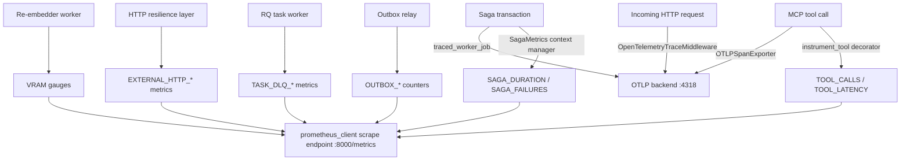

> **Status:** shipped · **Verified-against:** 7304330 (main) · **Last-audited:** 2026-08-17

# NCE Observability Guide

Comprehensive reference for Prometheus metrics, OpenTelemetry tracing, health endpoints, and recommended dashboards and alerts for NCE deployments.

For GPU/VRAM-specific monitoring of the re-embedding worker, see the focused sub-document: [VRAM Monitoring](vram_monitoring.md).

---

## Table of Contents

1. [Architecture overview](#1-architecture-overview)
2. [Enabling observability](#2-enabling-observability)
3. [Prometheus metrics catalog](#3-prometheus-metrics-catalog)
4. [OpenTelemetry tracing](#4-opentelemetry-tracing)
5. [Health and metrics endpoints](#5-health-and-metrics-endpoints)
6. [Recommended Grafana dashboards](#6-recommended-grafana-dashboards)
7. [Prometheus alert rules](#7-prometheus-alert-rules)
8. [Graceful degradation](#8-graceful-degradation)

---

## 1. Architecture overview



All instrumentation lives in `nce/observability.py`. The module uses a `_StubMetric` fallback so it is safe to import even when `prometheus_client` or `opentelemetry-sdk` are not installed — all metric calls become no-ops.

---

## 2. Enabling observability

Observability is controlled by four environment variables (see [Configuration Reference §15](configuration_reference.md#15-observability)):

| Variable | Default | Description |
|---|---|---|
| `NCE_OBSERVABILITY_ENABLED` | `true` | Master switch. When `false`, no metrics are recorded and no spans are started. |
| `NCE_PROMETHEUS_PORT` | `8000` | Port on which `prometheus_client.start_http_server` binds the scrape endpoint. |
| `NCE_OTEL_EXPORTER_OTLP_ENDPOINT` | `http://localhost:4318` | OTLP HTTP endpoint. Traces are sent to `{endpoint}/v1/traces`. |
| `NCE_OTEL_SERVICE_NAME` | `nce-python` | `service.name` resource attribute reported to the OTel backend. |

`init_observability()` is called once at server startup. It starts the Prometheus HTTP server and initialises the OTel `TracerProvider` with a `BatchSpanProcessor` backed by an `OTLPSpanExporter`. Subsequent calls within the same process are no-ops (guarded by `_tracer_initialized`).

---

## 3. Prometheus metrics catalog

All metric names are prefixed with `nce_`. The scrape endpoint is `http://<host>:<NCE_PROMETHEUS_PORT>/metrics` (default port `8000`).

### 3.1 MCP tool metrics

| Metric | Type | Labels | Description |
|---|---|---|---|
| `nce_tool_calls_total` | Counter | `tool_name`, `status` | Total MCP tool invocations. `status` is `success` or `error`. |
| `nce_tool_latency_seconds` | Histogram | `tool_name` | End-to-end wall-clock latency of MCP tool calls. Buckets: 0.01, 0.05, 0.1, 0.5, 1.0, 2.5, 5.0, 10.0, 30.0, 60.0, +Inf. |

Instrumentation is applied via the `@instrument_tool(tool_name)` decorator or the `instrument_tool_call(tool_name)` async context manager in `nce/observability.py`. Each invocation also starts an OTel span named `mcp_tool:<tool_name>`.

### 3.2 Saga / distributed transaction metrics

| Metric | Type | Labels | Description |
|---|---|---|---|
| `nce_saga_duration_seconds` | Histogram | `operation`, `result` | Duration of distributed saga transactions. `result` is `success` or `failure`. Buckets: 0.1, 0.5, 1.0, 2.0, 5.0, 10.0, 20.0, +Inf. |
| `nce_saga_failures_total` | Counter | `stage` | Individual saga step failures. `stage` identifies the pipeline stage (e.g. `pg`, `mongo`, `redis`). |

Use the `SagaMetrics(operation)` context manager (in `nce/observability.py`) to record these. Call `SagaMetrics.record_failure(stage=...)` for step-level failure counters.

### 3.3 Embedding and re-embedding metrics

| Metric | Type | Labels | Description |
|---|---|---|---|
| `nce_embedding_count` | Counter | `model_id` | Total individual chunks embedded, partitioned by embedding model. |
| `nce_reembedding_progress` | Gauge | `worker_id` | Progress of the background re-embedding worker (task-level units). |
| `nce_embedding_fallbacks_total` | Counter | _(none)_ | Fallback or hash-stub triggerings when the primary embedding path fails. |

VRAM-specific gauges for the re-embedding worker (`nce_reembedder_vram_allocated_bytes`, `nce_reembedder_vram_reserved_bytes`, `nce_reembedder_vram_peak_bytes`) are documented in full in [VRAM Monitoring](vram_monitoring.md).

### 3.4 Database / connection pool metrics

| Metric | Type | Labels | Description |
|---|---|---|---|
| `nce_scoped_session_latency_seconds` | Histogram | _(none)_ | Latency of `scoped_session` acquisition plus `SET LOCAL` RLS statement. Buckets: 0.0001, 0.0005, 0.001, 0.002, 0.005, 0.01, 0.02, 0.05, +Inf. |

### 3.5 Transactional outbox metrics

| Metric | Type | Labels | Description |
|---|---|---|---|
| `nce_outbox_delivered_total` | Counter | `event_type` | Outbox events successfully published by the relay. |
| `nce_outbox_delivery_failures_total` | Counter | `event_type` | Relay delivery attempts that failed (may be retried). |
| `nce_outbox_dlq_total` | Counter | `event_type` | Outbox events routed to the dead letter queue after exhausting relay attempts. |

### 3.6 Task queue / dead letter queue metrics

| Metric | Type | Labels | Description |
|---|---|---|---|
| `nce_task_dlq_total` | Counter | `task_name` | Background tasks routed to the DLQ after exhausting retries (configurable via `TASK_MAX_RETRIES`). |
| `nce_task_dlq_backlog` | Gauge | `task_name` | Current number of pending (un-replayed, un-purged) DLQ entries. |

### 3.7 Partition maintenance metrics

| Metric | Type | Labels | Description |
|---|---|---|---|
| `nce_event_log_partition_months_ahead` | Gauge | _(none)_ | Number of future monthly `event_log` partitions ahead of the current month. Set at admin-server startup and updated by the partition maintenance job. Alert when this drops below 2. |

### 3.8 Merkle chain integrity metric

| Metric | Type | Labels | Description |
|---|---|---|---|
| `nce_merkle_chain_valid` | Gauge | _(none)_ | Merkle chain validity: `1` = valid, `0` = corrupted. Alert immediately on `0`. |

### 3.9 Signing key cache metrics

| Metric | Type | Labels | Description |
|---|---|---|---|
| `nce_signing_key_cache_hit_total` | Counter | _(none)_ | Signing key cache hits. |
| `nce_signing_key_cache_miss_total` | Counter | _(none)_ | Signing key cache misses. |

Cache hit ratio: `rate(nce_signing_key_cache_hit_total[5m]) / (rate(nce_signing_key_cache_hit_total[5m]) + rate(nce_signing_key_cache_miss_total[5m]))`.

### 3.10 Extraction security metrics

| Metric | Type | Labels | Description |
|---|---|---|---|
| `nce_extraction_mime_mismatch_total` | Counter | _(none)_ | Attachments rejected due to extension/magic-byte MIME mismatch (Item E). |
| `nce_extraction_rejected_too_large_total` | Counter | _(none)_ | Attachments rejected due to size limit (controlled by `NCE_MAX_ATTACHMENT_BYTES`). |

### 3.11 Circuit breaker metrics

| Metric | Type | Labels | Description |
|---|---|---|---|
| `nce_circuit_breaker_state` | Gauge | `provider` | Current circuit breaker state: `0` = closed (normal), `1` = half-open, `2` = open (blocking). |
| `nce_circuit_breaker_failures` | Gauge | `provider` | Current consecutive failure count inside the circuit breaker for the given provider. |

### 3.12 External HTTP resilience metrics

| Metric | Type | Labels | Description |
|---|---|---|---|
| `nce_external_http_attempts_total` | Counter | `operation` | Total individual HTTP attempts including all retries. |
| `nce_external_http_retries_total` | Counter | `operation` | Total retry attempts (excludes the initial attempt). |
| `nce_external_http_failures_total` | Counter | `operation`, `error_type` | HTTP calls that raised a client error or exhausted retries. |
| `nce_external_http_latency_seconds` | Histogram | `operation` | End-to-end wall-clock latency including all retry attempts. |

### 3.13 MinIO cleanup metrics

| Metric | Type | Labels | Description |
|---|---|---|---|
| `nce_minio_orphan_cleanup_failures_total` | Counter | _(none)_ | MinIO object deletions that failed during orphan cleanup. |

### 3.14 Quota metrics

| Metric | Type | Labels | Description |
|---|---|---|---|
| `nce_quota_consumed_total` | Gauge | `namespace_id`, `resource_type`, `agent_id` | Current consumed resource amount for a namespace/agent quota. |
| `nce_quota_remaining` | Gauge | `namespace_id`, `resource_type`, `agent_id` | Current remaining resource limit for a namespace/agent quota. |

---

## 4. OpenTelemetry tracing

### 4.1 Initialisation

`init_observability()` in `nce/observability.py` initialises the OTel pipeline:

```python
resource = Resource(attributes={"service.name": cfg.NCE_OTEL_SERVICE_NAME})
provider = TracerProvider(resource=resource)
processor = BatchSpanProcessor(
    OTLPSpanExporter(endpoint=f"{cfg.NCE_OTEL_EXPORTER_OTLP_ENDPOINT}/v1/traces")
)
provider.add_span_processor(processor)
trace.set_tracer_provider(provider)
```

The tracer is retrieved via `get_tracer()`, which returns a no-op mock when `opentelemetry-sdk` is not installed.

### 4.2 ASGI trace middleware

`OpenTelemetryTraceMiddleware` (in `nce/observability.py`) is a Starlette ASGI middleware that extracts W3C `traceparent` headers from incoming requests and activates the remote trace context for the duration of the request. It is mounted **outermost** in the admin middleware stack — before auth — so the trace context is established before any handler runs:

```
Middleware(OpenTelemetryTraceMiddleware)   # outermost
Middleware(AdminHTTPRateLimitMiddleware)
Middleware(MTLSAuthMiddleware, ...)
Middleware(BasicAuthMiddleware, ...)
Middleware(HMACAuthMiddleware, ...)
```

When no `traceparent` header is present the middleware is a no-op.

### 4.3 Outbound trace propagation

`inject_trace_headers(headers)` injects the active W3C `traceparent` (and optionally `tracestate`) into an outbound HTTP request dict. Safe to call when observability is disabled.

```python
from nce.observability import inject_trace_headers

headers = inject_trace_headers({"content-type": "application/json"})
async with httpx.AsyncClient() as client:
    await client.post(url, headers=headers, json=body)
```

### 4.4 RQ worker trace propagation

`enqueue_traced(queue, func, *args, **kwargs)` enqueues an RQ job while injecting the active trace context into `job.meta`. The `traced_worker_job(operation_name)` context manager / decorator on the worker side extracts that context and starts a new child span named `rq_worker:<operation_name>`. This ensures background jobs are correlated with the enqueuing request's trace.

### 4.5 MCP tool spans

`@instrument_tool(tool_name)` and `async with instrument_tool_call(tool_name)` both start a span named `mcp_tool:<tool_name>` with attribute `nce.tool = tool_name`. Exceptions are recorded on the span with `StatusCode.ERROR`.

### 4.6 Required packages

| Package | Purpose |
|---|---|
| `opentelemetry-sdk` | Core SDK (`TracerProvider`, `BatchSpanProcessor`) |
| `opentelemetry-exporter-otlp-proto-http` | OTLP HTTP exporter (`OTLPSpanExporter`) |
| `opentelemetry-api` | `propagate`, `trace`, `context` |

All OTel imports are wrapped in a `try/except ImportError` block. If any package is absent, `HAS_OTEL` is `False` and all trace operations become no-ops.

---

## 5. Health and metrics endpoints

All endpoints are served by `admin_server.py` on default port **8003**. Source: `nce/admin_app.py`.

### 5.1 Liveness probe — `/healthz`

```
GET /healthz
```

**Authentication:** none. `BasicAuthMiddleware` explicitly excludes this path via `excluded_prefixes=("/api/", "/healthz")` (`admin_app.py:120-127`). `HMACAuthMiddleware` does not use `excluded_prefixes` at all — it carries only `protected_prefix="/api/"` (`admin_app.py:128-133`), so `/healthz` is outside its scope because the path does not match `/api/`, not because of any explicit exclusion. Intended for load balancers and orchestrator health probes.

**Response:**

```json
{"status": "ok"}
```

HTTP `200` always (the handler `get_healthz` in `nce/admin_app.py` returns unconditionally).

### 5.2 Readiness / deep health — `/api/health`

```
GET /api/health
```

**Authentication:** HMAC (`HMACAuthMiddleware`). Requires the `NCE_API_KEY` header.

**Behaviour:** Calls `engine.check_health()`, which probes all configured datastores. If any `databases` key in the response has value `"down"`, an alert is dispatched via `NotificationDispatcher`.

**Response:** JSON object from `engine.check_health()`. The exact schema is engine-internal; operators should treat any `"down"` value in the `databases` map as a readiness failure.

### 5.3 Deprecated alias — `/api/health/v1`

```
GET /api/health/v1
```

Deprecated alias for `/api/health`. Returns identical data. Will be removed in a future release.

### 5.4 Prometheus scrape endpoint

```
GET http://<host>:<NCE_PROMETHEUS_PORT>/metrics
```

Default port: **8000**. Served directly by `prometheus_client.start_http_server`. Not part of the admin Starlette app — it listens on a separate port. No authentication by default; restrict access at the network layer (firewall, VPC security group, or reverse proxy).

---

## 6. Recommended Grafana dashboards

### 6.1 Dashboard variables

Define the following dashboard template variables for reuse across panels:

| Variable | Query | Description |
|---|---|---|
| `$tool` | `label_values(nce_tool_calls_total, tool_name)` | MCP tool name filter |
| `$provider` | `label_values(nce_circuit_breaker_state, provider)` | External provider filter |
| `$namespace` | `label_values(nce_quota_consumed_total, namespace_id)` | Namespace filter |
| `$worker` | `label_values(nce_reembedder_vram_allocated_bytes, worker_id)` | Re-embedder worker filter |

### 6.2 MCP tool performance panel

Timeseries panel — call rate and error rate:

```
# Call rate by tool
sum by (tool_name) (rate(nce_tool_calls_total[5m]))

# Error rate by tool
sum by (tool_name) (rate(nce_tool_calls_total{status="error"}[5m]))

# P99 latency by tool
histogram_quantile(0.99, sum by (tool_name, le) (rate(nce_tool_latency_seconds_bucket[5m])))
```

### 6.3 Saga health panel

```
# Saga failure rate by stage
sum by (stage) (rate(nce_saga_failures_total[5m]))

# P95 saga duration by operation
histogram_quantile(0.95, sum by (operation, le) (rate(nce_saga_duration_seconds_bucket[5m])))
```

### 6.4 Outbox relay panel

```
# Delivery rate
rate(nce_outbox_delivered_total[5m])

# Failure rate
rate(nce_outbox_delivery_failures_total[5m])

# DLQ accumulation rate
rate(nce_outbox_dlq_total[5m])
```

### 6.5 Circuit breaker panel

Stat panel (one row per provider):

```
nce_circuit_breaker_state
```

Map values to display text: `0` = Closed, `1` = Half-open, `2` = Open. Use colour thresholds: green at 0, amber at 1, red at 2.

### 6.6 DLQ backlog panel

```
nce_task_dlq_backlog
```

Display as a gauge. Alert threshold at backlog > 0.

### 6.7 Quota utilisation panel

```
# Utilisation ratio
nce_quota_consumed_total / (nce_quota_consumed_total + nce_quota_remaining)
```

Filter by `$namespace` variable.

### 6.8 Partition runway panel

Stat panel:

```
nce_event_log_partition_months_ahead
```

Colour threshold: red below 2, amber at 2, green above 2.

---

## 7. Prometheus alert rules

The following is a complete, production-ready `prometheus_rules.yml` covering NCE's critical metric surfaces. Adjust thresholds to your SLA.

```yaml
groups:

  - name: nce_tool_health
    rules:
      - alert: NceToolHighErrorRate
        expr: |
          sum by (tool_name) (rate(nce_tool_calls_total{status="error"}[5m]))
          /
          sum by (tool_name) (rate(nce_tool_calls_total[5m]))
          > 0.05
        for: 5m
        labels:
          severity: warning
        annotations:
          summary: "MCP tool {{ $labels.tool_name }} error rate above 5%"
          description: "Error ratio {{ $value | humanizePercentage }} over the last 5 minutes."

      - alert: NceToolHighLatency
        expr: |
          histogram_quantile(0.99,
            sum by (tool_name, le) (rate(nce_tool_latency_seconds_bucket[10m]))
          ) > 10
        for: 5m
        labels:
          severity: warning
        annotations:
          summary: "MCP tool {{ $labels.tool_name }} P99 latency > 10s"

  - name: nce_saga_health
    rules:
      - alert: NceSagaFailureSpike
        expr: sum by (stage) (rate(nce_saga_failures_total[5m])) > 0.1
        for: 5m
        labels:
          severity: critical
        annotations:
          summary: "Saga failures elevated at stage {{ $labels.stage }}"

  - name: nce_outbox
    rules:
      - alert: NceOutboxDlqAccumulating
        expr: rate(nce_outbox_dlq_total[10m]) > 0
        for: 10m
        labels:
          severity: warning
        annotations:
          summary: "Outbox events being routed to DLQ for event_type {{ $labels.event_type }}"

      - alert: NceOutboxDeliveryFailures
        expr: |
          sum by (event_type) (rate(nce_outbox_delivery_failures_total[5m]))
          /
          (sum by (event_type) (rate(nce_outbox_delivered_total[5m])) + 0.001)
          > 0.1
        for: 5m
        labels:
          severity: warning
        annotations:
          summary: "Outbox delivery failure ratio > 10% for {{ $labels.event_type }}"

  - name: nce_dlq
    rules:
      - alert: NceTaskDlqBacklog
        expr: nce_task_dlq_backlog > 0
        for: 1m
        labels:
          severity: warning
        annotations:
          summary: "DLQ backlog > 0 for task {{ $labels.task_name }}"

  - name: nce_circuit_breaker
    rules:
      - alert: NceCircuitBreakerOpen
        expr: nce_circuit_breaker_state == 2
        for: 1m
        labels:
          severity: critical
        annotations:
          summary: "Circuit breaker OPEN for provider {{ $labels.provider }}"

  - name: nce_integrity
    rules:
      - alert: NceMerkleChainCorrupted
        expr: nce_merkle_chain_valid == 0
        for: 0m
        labels:
          severity: critical
        annotations:
          summary: "Merkle chain integrity check failed — possible data corruption"

      - alert: NcePartitionRunwayLow
        expr: nce_event_log_partition_months_ahead < 2
        for: 30m
        labels:
          severity: warning
        annotations:
          summary: "event_log partition runway below 2 months (current: {{ $value }})"

  - name: nce_external_http
    rules:
      - alert: NceExternalHttpHighFailureRate
        expr: |
          sum by (operation, error_type) (rate(nce_external_http_failures_total[5m]))
          /
          sum by (operation) (rate(nce_external_http_attempts_total[5m]))
          > 0.1
        for: 5m
        labels:
          severity: warning
        annotations:
          summary: "External HTTP failure rate > 10% for operation {{ $labels.operation }}"

  - name: nce_quota
    rules:
      - alert: NceQuotaNearExhaustion
        expr: |
          nce_quota_remaining
          /
          (nce_quota_consumed_total + nce_quota_remaining + 0.001)
          < 0.10
        for: 5m
        labels:
          severity: warning
        annotations:
          summary: >
            Quota nearly exhausted for namespace {{ $labels.namespace_id }}
            / agent {{ $labels.agent_id }} / resource {{ $labels.resource_type }}
```

For VRAM-specific alert rules, see [VRAM Monitoring — Alert Thresholds](vram_monitoring.md#alert-thresholds-recommended).

---

## 8. Graceful degradation

NCE's observability layer is designed to be fully optional at the dependency level:

| Missing dependency | Behaviour |
|---|---|
| `prometheus_client` not installed | `HAS_PROMETHEUS = False`. All metric objects are replaced with `_StubMetric` instances whose `.inc()`, `.observe()`, `.set()`, `.labels()` methods are no-ops. The scrape endpoint is not started. |
| `opentelemetry-sdk` not installed | `HAS_OTEL = False`. `get_tracer()` returns `_MockTracer`. All span operations are no-ops. `inject_trace_headers` returns headers unchanged. `OpenTelemetryTraceMiddleware` passes requests through without context extraction. |
| `NCE_OBSERVABILITY_ENABLED=false` | Even when libraries are installed, `init_observability()` returns immediately. All instrumentation helpers short-circuit on the `cfg.NCE_OBSERVABILITY_ENABLED` guard. |
| `torch` or CUDA not available | VRAM metrics are silently skipped. See [VRAM Monitoring — Graceful Degradation](vram_monitoring.md#graceful-degradation). |

This means the NCE stack can be deployed in minimal environments (no Prometheus, no OTel collector) without code changes or startup failures.
