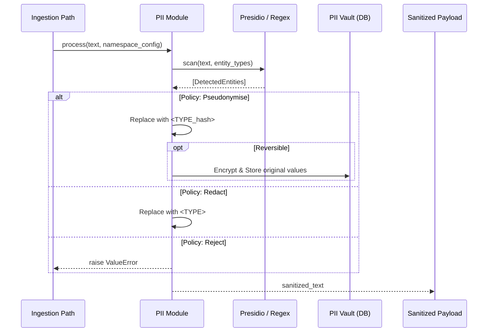

> **Status:** shipped · **Verified-against:** 7304330 (main) · **Last-audited:** 2026-08-17

# PII Detection and Redaction

NCE provides an automated PII (Personally Identifiable Information) safety net. It identifies and masks sensitive data before it reaches the LLM provider or is permanently archived in long-term memory.

## The Redaction Pipeline

The PII module operates as a middleware in the ingestion path. It scans incoming text for entities like names, emails, phone numbers, and financial information.

### Redaction Signal Flow



## Detection Engines

NCE uses a multi-layered detection strategy:

-   **Microsoft Presidio** (primary): High-confidence entity recognition using NLP models (`presidio_analyzer.AnalyzerEngine`). Invoked first; if the package is not installed the engine falls back to regex transparently.
-   **Regex fallback**: Dependency-free patterns covering `EMAIL`, `PHONE`, and `CREDIT_CARD` (with Luhn check). Used when Presidio is unavailable; confidence score defaults to `0.8`.
-   **Norwegian locale (`locale="no"`)**: Always applied in addition to the generic set when the namespace locale is `no`. Adds three entity types:

| Entity type | Pattern | Validation |
| :--- | :--- | :--- |
| `NO_FODSELSNUMMER` | 11 contiguous digits | Mod-11 double check-digit (both indices 9 and 10) |
| `NO_ORG_NUMBER` | 9 digits, first digit 8 or 9 | None beyond digit/length |
| `NO_PHONE_MOBILE` | 8 digits starting with 4 or 9, optional `+47`/`0047` prefix | None beyond pattern |

Overlapping spans are resolved by `_merge_overlapping_entities`, which sorts by `(e.start, -(e.end - e.start))` and greedily keeps the **longest span at each start position**; the entity score is **not** used as a tiebreaker (`nce/pii.py:155`). The scan is offloaded to a thread pool via `asyncio.to_thread` so CPU-bound work never blocks the async event loop. Raw PII values are scrubbed from local frame variables before any exception propagates (GDPR Art. 25 compliance).

### Operational Limits (ADMIN)

The synchronous scanner enforces two hard caps; exceeding either raises `ValueError` and aborts the scan (`nce/pii.py`):

| Limit | Constant | Value | Behaviour on breach |
| :--- | :--- | :--- | :--- |
| Max input size | `_MAX_TEXT_BYTES` | 1 MB (`1_000_000` UTF-8 bytes) | `ValueError` before scanning (`nce/pii.py:183-187`) |
| Max entities per scan | `_MAX_ENTITIES` | 1,000 | Raw values cleared, then `ValueError` advising to split the text (`nce/pii.py:268-274`) |

## Redaction Policies

Each namespace can define its own PII policy. The enum is `PIIPolicy` (`nce/models.py`, `StrEnum`) with the following lowercase string values:

| Policy value | Action |
| :--- | :--- |
| `redact` | Replaces each detected entity with a generic label, e.g. `<PHONE_NUMBER>`. No vault entry is created. |
| `pseudonymise` | Replaces each entity with a deterministic token, e.g. `<PERSON_<base64url-22chars>>`. Token is HMAC-SHA256 (first 16 bytes, base64url-encoded, ~22 chars) keyed with a per-namespace secret derived from `NCE_MASTER_KEY` or an explicit `pseudonym_hmac_key`. Identical type+value pairs always yield the same token within a namespace. When `reversible=True`, the original value is AES-256-GCM encrypted and stored in the vault. |
| `reject` | Raises `ValueError` and blocks the entire request if any PII entity is detected. No data is stored. |
| `flag` | Passes text through **unchanged** and returns `PIIProcessResult(redacted=False)` (`nce/pii.py:362-372`). Because `memories.pii_redacted` is set directly from `pii_result.redacted` (`nce/orchestrators/memory.py:631`), the `flag` policy leaves `pii_redacted` **False** — it does not raise the flag. The detected entity *types* are still reported in `entities_found` (and persisted to `pii_entities_found`), but the text itself is never masked and no vault entry is created. |

## Reversible Redaction (The Vault)

When a `pseudonymise` policy is marked as `reversible`, NCE encrypts each original sensitive value with AES-256-GCM (`encrypt_signing_key` from `nce/signing.py`) and stores the ciphertext in the `pii_redactions` table (`nce/schema.sql`, Phase 0.3):

```sql
CREATE TABLE IF NOT EXISTS pii_redactions (
    id              UUID DEFAULT gen_random_uuid(),
    namespace_id    UUID NOT NULL REFERENCES namespaces(id),
    memory_id       UUID NOT NULL,
    token           TEXT NOT NULL,
    encrypted_value BYTEA NOT NULL,
    entity_type     TEXT NOT NULL,
    created_at      TIMESTAMPTZ NOT NULL DEFAULT now(),
    PRIMARY KEY (id, created_at)
) PARTITION BY RANGE (created_at);
```

Indexes cover `memory_id`, `token`, and `namespace_id` to avoid full partition scans (FIX-054).

### Unredaction (`unredact_memory`)

The `unredact_memory` MCP tool (`nce/tool_registry.py`: `admin_only=True, mutation=True`) reverses pseudonymisation for a specific memory. The flow is:

1. A scoped PG session (RLS) verifies the namespace `pii.reversible` flag and fetches vault rows from `pii_redactions` for the given `memory_id`.
2. The MongoDB payload is fetched and, if a wrapped DEK is present, decrypted via `maybe_decrypt_raw_data`.
3. Each `encrypted_value` BYTEA is decrypted with `decrypt_signing_key` under `NCE_MASTER_KEY`; tokens are substituted back into the raw text.
4. An audit event of type `"unredact"` is appended to `event_log` in a transaction, recording `memory_id` and `tokens_unredacted`.

> **Note on `tokens_unredacted`:** this field is set to `len(vault_list)` — the number of vault rows **fetched** for the memory, i.e. an *attempt* count, not a guaranteed count of successful decryptions (`nce/orchestrators/memory.py:1187`). Individual decryption failures are swallowed with `log.warning("Failed to decrypt token ...")` and the loop continues (`nce/orchestrators/memory.py:1173-1174`), so a token whose `encrypted_value` cannot be decrypted is still counted even though its substitution did not occur.

The tool requires the `admin` scope (`nce/auth.py`: `MCP_ADMIN_TOOL_NAMES`) and is registered with `admin_only=True` in the tool registry.
