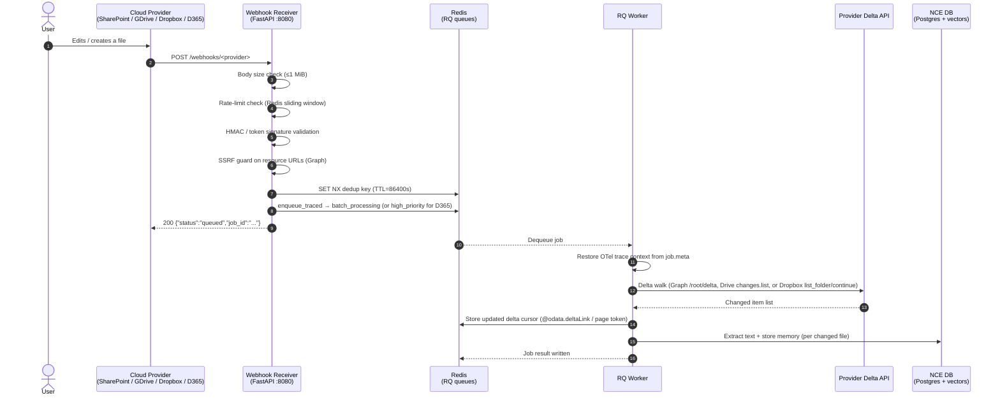

> **Status:** shipped · **Verified-against:** 7304330 (main) · **Last-audited:** 2026-08-17

# NCE Push Architecture

Document Bridge push-ingest flow: provider webhook → FastAPI receiver → Redis (RQ) → worker → DB.
Subscription renewal for long-lived bridges is handled by the **`nce.cron`** scheduler.

---

## Webhook Receiver (`nce/webhook_receiver/main.py`)

A standalone FastAPI application (`app = FastAPI(title="NCE Webhook Receiver")`).

### Endpoints

| Method | Path | Provider | Auth check |
|--------|------|----------|------------|
| `GET` | `/webhooks/dropbox` | Dropbox | Returns `challenge` query param (verification handshake) |
| `POST` | `/webhooks/dropbox` | Dropbox | `X-Dropbox-Signature` HMAC-SHA256 against `DROPBOX_APP_SECRET` |
| `POST` | `/webhooks/graph` | SharePoint | `clientState` HMAC-compare against `GRAPH_CLIENT_STATE`; `?validationToken=` challenge for subscription setup |
| `POST` | `/webhooks/drive` | Google Drive | `X-Goog-Channel-Token` HMAC-compare against `DRIVE_CHANNEL_TOKEN`; `sync` state returns early |
| `POST` | `/webhooks/dynamics365` | Dataverse | `x-ms-signaturecontent` HMAC-SHA256 via `D365WebhookValidator`; requires `NCE_D365_ENABLED=true` |
| `GET` | `/health` | — | Container liveness |

### Request guards

- **Body size:** rejected at `>WEBHOOK_MAX_BODY_BYTES` (default 1 MiB; set via `WEBHOOK_MAX_BODY_BYTES`).
- **Rate limit:** per-IP sliding window, `WEBHOOK_RATE_LIMIT` req / `WEBHOOK_RATE_PERIOD_SECONDS` s (defaults 120/60). Uses a Redis Lua atomic window with in-memory fallback; in production, if Redis is unavailable the request is rejected (fail-closed).
- **SSRF guard:** MS Graph `resource` URLs are validated via `validate_webhook_payload_url` before enqueue.
- **Proxy trust:** `X-Forwarded-For` is honoured only when `NCE_WEBHOOK_TRUST_PROXY=true`.

### Ack timing

The receiver returns `200` immediately after signature validation and enqueue (before any delta fetch). Dataverse requires a response within ~30 s; the comment in the code explicitly notes this.

### In-process deduplication

Before enqueueing, `enqueue_process_bridge_event` derives a stable Redis key per provider:

| Provider | Key material |
|----------|-------------|
| Dropbox | SHA-256 of sorted `list_folder.accounts` list |
| SharePoint | SHA-256 of sorted `{id}|{resource}|{changeType}` triples |
| Google Drive | SHA-256 of `channel_id|resource_id|message_number|resource_state` |

A `SET NX EX` claim is attempted (`WEBHOOK_DEDUP_TTL_SECONDS`, default 86400 s). If the key already exists the payload is dropped (`"dedup-skipped"`). If Redis is unreachable:
- `WEBHOOK_DEDUP_FAIL_OPEN=false` (default, enforced in prod): drop.
- `WEBHOOK_DEDUP_FAIL_OPEN=true`: pass through.

> **Note:** This in-receiver dedup covers duplicate webhook deliveries within the TTL window. The `processed_outbox_events` table (migration 022) exists in the schema but the dedup behavior backed by that table is **planned** (RL Batch 110) and is not active in shipped code.

### Enqueue

`enqueue_process_bridge_event` calls `enqueue_traced` (OTel context propagation) and pushes to the `batch_processing` RQ lane (`priority=0`) with `job_timeout="30m"`.

D365 events are pushed to the `high_priority` lane (`priority=1`) with `job_timeout="15m"` because CRM events are time-sensitive.

```python
# batch lane (dropbox / sharepoint / gdrive)
q = get_priority_queue(0, _redis_client())   # → "batch_processing"
job = enqueue_traced(q, process_bridge_event, kwargs={"provider": ..., "payload": ...}, job_timeout="30m")

# high-priority lane (dynamics365)
q = get_priority_queue(1, _redis_client())   # → "high_priority"
job = enqueue_traced(q, "nce.tasks.process_d365_event", kwargs={"payload": ...}, job_timeout="15m")
```

---

## RQ Queue Lanes (`nce/extractors/dispatch.py`)

| Lane name | Constant | Used for |
|-----------|----------|----------|
| `high_priority` | `HIGH_PRIORITY_QUEUE` | Real-time API calls, D365 webhook events |
| `batch_processing` | `BATCH_QUEUE` | Webhook bridge events, bulk re-index runs |

Workers dequeue `high_priority` first (see `start_worker.py`).

---

## Worker Task Flow (`nce/tasks.py`)

### `process_bridge_event(provider, payload)`

Decorated with `@traced_worker_job("process_bridge_event")` (restores OTel trace from `job.meta`).

```
process_bridge_event(provider, payload)
  └── dispatch_bridge_event(provider, payload)    # nce/bridges/__init__.py
        ├── "sharepoint"  → process_sharepoint_event(payload)
        │     └── SharePointBridge.walk_delta()
        │           └── Graph /root/delta pages → yields changed items
        ├── "gdrive"      → process_gdrive_event(payload)  [run_in_executor]
        │     └── GoogleDriveBridge.walk_delta()
        │           └── Drive v3 changes.list pages → yields changed entries
        └── "dropbox"     → process_dropbox_event(payload)  [run_in_executor]
              └── DropboxBridge.walk_delta()
                    └── list_folder/continue cursor walk → yields entries
```

Each bridge's `walk_delta` reads and writes a **delta cursor** stored in Redis (key pattern: provider-specific, e.g. `SharePointBridge._cursor_key(site_id, drive_id)`). The `@odata.deltaLink` is stored after each completed page walk, so the next invocation resumes from the checkpoint rather than re-scanning.

The current `process_sharepoint_event`, `process_gdrive_event`, and `process_dropbox_event` implementations enumerate changed items and log them; downstream extract-and-store (calling `download_file` + text extraction + `store_memory`) is wired at the bridge layer and invoked during the walk.

### Poison-pill / DLQ

On unhandled exception:
1. `_track_attempt(redis, job_id)` increments the Redis attempt counter.
2. If `attempt <= cfg.TASK_MAX_RETRIES`: re-raise → RQ re-enqueues.
3. If retries exhausted (`attempt > TASK_MAX_RETRIES`): payload is persisted to `dead_letter_queue` table via `store_dead_letter`, function returns `{"status": "dead_lettered"}` (no re-raise).

`ValueError` from `dispatch_bridge_event` (e.g. unknown provider) is caught separately and returned as `{"status": "error"}` without retry.

### `process_d365_event(payload)`

Same poison-pill/DLQ pattern. Extracts `entity_type` and `operation` via `D365WebhookValidator.extract_entity_context`, then dispatches to `DataverseIngestionWorker`.

---

## End-to-End Sequence



---

## Subscription Renewal Scheduler (`nce/cron.py` + `nce/bridge_renewal.py`)

Long-lived webhook subscriptions (SharePoint Graph, Google Drive watch channels) expire and must be renewed before the `expires_at` deadline.

### Scheduler job

Registered in `async_main()` as APScheduler `AsyncIOScheduler`:

```python
scheduler.add_job(
    _renewal_tick,
    IntervalTrigger(minutes=renewal_minutes),   # cfg.BRIDGE_CRON_INTERVAL_MINUTES (default 45)
    args=[pool],
    id="bridge_subscription_renewal",
    coalesce=True,
    max_instances=1,
)
```

`renewal_minutes` is read from `cfg.BRIDGE_CRON_INTERVAL_MINUTES` (default **45 min**, env `BRIDGE_CRON_INTERVAL_MINUTES`). It can be hot-rescheduled at runtime via `reschedule_jobs()` without restarting the process.

### `_renewal_tick`

Acquires a distributed `CronLock` (`bridge_subscription_renewal`) to prevent concurrent renewal runs across multiple cron instances.

Calls `renew_expiring_subscriptions(pool)`.

### `renew_expiring_subscriptions` (`nce/bridge_renewal.py`)

```sql
SELECT * FROM bridge_subscriptions
WHERE status = 'ACTIVE'
  AND expires_at IS NOT NULL
  AND expires_at < NOW() + $1::interval   -- lookahead = BRIDGE_RENEWAL_LOOKAHEAD_HOURS (default 12h)
ORDER BY expires_at ASC
LIMIT 100
```

Per row:

| Provider | Action | On failure |
|----------|--------|-----------|
| `sharepoint` | `renew_sharepoint()` — PATCH Graph subscription, update `expires_at` | `mark_degraded()` sets `status='DEGRADED'` |
| `gdrive` | `renew_gdrive()` — re-POST watch channel, update `expires_at` | `mark_degraded()` |
| `dropbox` | `renew_dropbox()` — Dropbox webhooks don't expire; counted as `skipped` | — |

Returns `{"renewed": N, "failed": N, "skipped": N, "candidates": N}`.

---

## Configuration Reference

| Env variable | Default | Effect |
|---|---|---|
| `DROPBOX_APP_SECRET` | — (required) | HMAC key for Dropbox signature validation |
| `GRAPH_CLIENT_STATE` | — (required) | Shared secret validated in every Graph notification |
| `DRIVE_CHANNEL_TOKEN` | — (required) | Token compared against `X-Goog-Channel-Token` |
| `NCE_D365_WEBHOOK_SECRET` | `""` (optional) | HMAC key for Dataverse `x-ms-signaturecontent` |
| `NCE_D365_ENABLED` | `false` | Enables `/webhooks/dynamics365` endpoint |
| `WEBHOOK_MAX_BODY_BYTES` | `1048576` | Maximum accepted payload size |
| `WEBHOOK_RATE_LIMIT` | `120` | Requests allowed per window per IP+path |
| `WEBHOOK_RATE_PERIOD_SECONDS` | `60` | Sliding window duration |
| `WEBHOOK_DEDUP_TTL_SECONDS` | `86400` | Dedup key TTL in Redis |
| `WEBHOOK_DEDUP_FAIL_OPEN` | `false` | If `true`, allow through when Redis is unavailable (forbidden in prod) |
| `NCE_WEBHOOK_TRUST_PROXY` | `false` | Honour `X-Forwarded-For` for IP rate-limiting |
| `BRIDGE_CRON_INTERVAL_MINUTES` | `45` | Renewal scheduler tick interval |
| `BRIDGE_RENEWAL_LOOKAHEAD_HOURS` | `12` | How far ahead to scan for expiring subscriptions |
