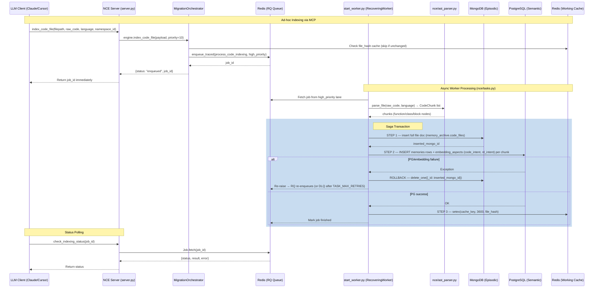

> **Status:** shipped · **Verified-against:** 7304330 (main) · **Last-audited:** 2026-08-17

# NCE Recursive Indexing Flow

This document covers **async code indexing** via MCP + RQ. For the full **v1.0** runtime (temporal queries, A2A, scheduled re-embedding, GC), see [architecture-v1.md](./architecture-v1.md).

NCE ingests source code in two ways:

| Mode | Entry point | Queue lane |
|---|---|---|
| Ad-hoc via MCP | `index_code_file` tool → `handle_index_code_file` | `high_priority` |
| Bulk recursive | `index_all.py` → `NCEEngine.index_code_file()` | `batch_processing` |

---

## MCP Tools

Both tools are registered in `nce/tool_registry.py` and declared in `nce/mcp_stdio_tools.py`.

### `index_code_file`

Indexes a single source file into the Tri-Stack. Returns a `job_id` immediately; actual processing is async.

| Parameter | Type | Required | Notes |
|---|---|---|---|
| `filepath` | string | yes | Max 512 chars; no path traversal |
| `raw_code` | string | yes | Max `NCE_MAX_CODE_INDEX_BYTES` (default 2 MiB) |
| `language` | string | yes | Any value in `ALLOWED_LANGUAGES` (see below) |
| `namespace_id` | string | no | UUID; multi-tenant isolation scope |
| `user_id` | string | no | Required when `private=true` |
| `private` | boolean | no | Default `false` via MCP; when true, scopes index to `user_id` |

**Registry entry** (`nce/tool_registry.py:136`):
```python
"index_code_file": ToolSpec(
    _h(code_mcp_handlers, "handle_index_code_file"),
    mutation=True,
),
```

MCP calls always enqueue with `priority=10`, which routes to the `high_priority` RQ lane.

### `check_indexing_status`

Polls the status of a background indexing job.

| Parameter | Type | Required |
|---|---|---|
| `job_id` | string | yes |

**Registry entry** (`nce/tool_registry.py:140`):
```python
"check_indexing_status": ToolSpec(
    _h(code_mcp_handlers, "handle_check_indexing_status"),
),
```

Returns a dict with `job_id`, `status` (`queued` / `started` / `finished` / `failed` / `not_found`), `result`, and `error`.

---

## Supported Languages

`ALLOWED_LANGUAGES` is defined in `nce/constants.py`. The full set as of main:

`python`, `javascript`, `typescript`, `go`, `rust`, `java`, `c`, `cpp`, `csharp`, `ruby`, `php`, `swift`, `kotlin`, `scala`, `shell`, `bash`, `sql`, `yaml`, `json`, `toml`, `dockerfile`, `markdown`, `html`, `css`, `lua`, `r`, `julia`, `haskell`, `elixir`, `erlang`, `dart`, `perl`, `objectivec`, `zig`, `nim`, `ocaml`, `clojure`, `groovy`, `terraform`

---

## AST Parser (`nce/ast_parser.py`)

`parse_file(raw_code, language)` yields `CodeChunk` objects. Each chunk has:

| Field | Values |
|---|---|
| `node_type` | `"function"` \| `"class"` \| `"block"` |
| `name` | symbol name or line range label |
| `start_line` / `end_line` | integer line numbers |
| `code_string` | sanitized source text |

**Backend selection:**
1. Tree-sitter via `tree-sitter-language-pack` (enterprise bundle) — extracts top-level functions and classes.
2. Line-based fallback — used when Tree-sitter is unavailable or finds no top-level symbols. Chunks are bounded by `_FALLBACK_CHUNK_LINES = 200` lines / `_FALLBACK_CHUNK_CHARS = 4000` chars.

---

## Async Processing Flow (Ad-hoc MCP Path)



---

## Saga Ordering

The worker in `nce/tasks.py` follows a strict three-step commit sequence:

| Step | Store | Operation | Rollback on failure |
|---|---|---|---|
| 1 | MongoDB | `insert_one` full file payload into `memory_archive.code_files` | — |
| 2 | PostgreSQL | `INSERT` into `memories` (vector embedding + FTS) and `embedding_aspects` (`code_intent`, `nl_intent`) per chunk; wrapped in `conn.transaction()` | Delete Mongo doc inserted in Step 1 |
| 3 | Redis | `setex(cache_key, 3600, file_hash)` — marks file as up-to-date | — (idempotent; re-run is safe) |

**Rollback rule:** if any exception is raised after Step 1, the worker deletes the orphaned MongoDB document (`collection.delete_one({_id: inserted_result.inserted_id})`). PG is protected by an explicit `conn.transaction()`, so partial chunk rows are never committed.

**Dead-letter queue (DLQ):** after `cfg.TASK_MAX_RETRIES` failed attempts (tracked in Redis), the payload is written to the `dead_letter_queue` PG table and the job exits cleanly instead of re-raising, preventing an infinite CPU spin-loop.

---

## RQ Worker (`start_worker.py`)

`start_worker.py` launches a `RecoveringWorker` — an `rq.Worker` subclass that sweeps the `StartedJobRegistry` on each maintenance tick and requeues abandoned in-flight jobs from crashed workers.

**Queue lane priority** (`QUEUE_NAMES` tuple; dequeued left-to-right):

```python
QUEUE_NAMES = ("high_priority", "batch_processing", "default")
```

| Lane | Used by |
|---|---|
| `high_priority` | MCP `index_code_file` calls (priority=10) |
| `batch_processing` | `index_all.py` bulk runs, webhooks, bridge resyncs |
| `default` | Legacy backward-compat only |

**Job retention:**

| State | TTL |
|---|---|
| Finished | 24 h (`RESULT_TTL`) |
| Failed | 7 days (`FAILURE_TTL`) |

---

## Bulk Path (`index_all.py`)

`index_all.py` walks the repo directly via `os.walk`, skipping `.venv`, `__pycache__`, `.git`, and similar non-source directories. It calls `NCEEngine.index_code_file()` (not the MCP protocol) at a concurrency of 10 simultaneous files (`asyncio.Semaphore(10)`), processing in chunks of 20 files. After each chunk it polls all enqueued `job_id` values until they reach a terminal state (`finished` / `failed` / `canceled` / `not_found`), then applies a 1-second cooldown before the next chunk.

**Usage:**

```bash
# Index with the default namespace
python index_all.py

# Index with a specific namespace UUID
python index_all.py <namespace_id>

# Or via environment variable
TRIMCP_NAMESPACE_ID=<uuid> python index_all.py
```

Currently indexes only `.py` files. Language is hardcoded to `"python"` in `index_all.py`.

---

## Configuration Reference

| Variable | Default | Description |
|---|---|---|
| `NCE_MAX_CODE_INDEX_BYTES` | 2 MiB (2 097 152) | Max raw bytes per `index_code_file` call |
| `NCE_MAX_CODE_CHUNKS_PER_FILE` | 500 | Max AST chunks extracted per file |
| `TASK_MAX_RETRIES` | (see `nce/config.py`) | Attempts before routing to DLQ |
| `REDIS_URL` | — | RQ + cache connection |
