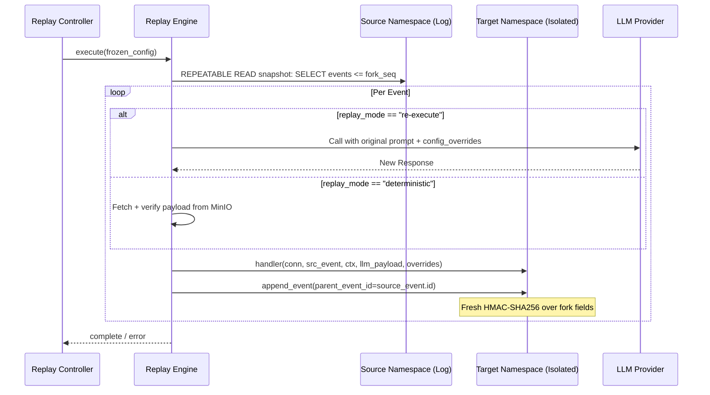

> **Status:** shipped · **Verified-against:** 7304330 (main) · **Last-audited:** 2026-08-17

# Memory Replay Engine

The Memory Replay Engine (Phase 2.3) allows observational streaming and active simulation of memory timelines. It is the primary tool for debugging complex agent behaviours and testing new cognitive strategies.

## Replay Modes

NCE ships three distinct replay modes, each mapping to a separate class in `nce/replay.py`.

| Mode | Class | Writes to target? | LLM re-execution? |
|---|---|---|---|
| Observational | `ObservationalReplay` | No | No |
| Forked | `ForkedReplay` | Yes (isolated namespace) | Optional |
| Reconstructive | `ReconstructiveReplay` | Yes (empty namespace) | No |

### 1. Observational Replay

Read-only stream of `event_log` rows for a namespace/seq range. Engine state is never modified. Internally uses an asyncpg server-side cursor (`prefetch=50`) so the full event log is never loaded into Python heap. Every streamed row is HMAC-verified before yielding; a `DataIntegrityError` aborts the stream immediately.

Yielded items per run:

```
{"type": "event",    <event_fields> }
{"type": "progress", "run_id": "...", "events_streamed": N}
{"type": "complete", "run_id": "...", "events_streamed": N}
{"type": "error",    "run_id": "...", "message": "..."}
```

### 2. Forked Replay (Simulation)

Replays source events into an isolated **target namespace**, potentially changing the outcome. The fork is controlled by a `FrozenForkConfig` (Pydantic `frozen=True`), which guarantees WORM-compliant replay integrity — `setattr` is blocked at the model level for the lifetime of the run.

Two sub-modes:

- **`deterministic`** — LLM responses are served from the MinIO payload cache (`event_log.llm_payload_uri`), making the fork byte-identical to the source run up to `fork_seq`. The cached payload's SHA-256 hash is re-verified against `event_log.llm_payload_hash` before use.
- **`re-execute`** — The LLM provider is called fresh, optionally with `config_overrides` (keys: `llm_provider`, `llm_model`, `llm_credentials`, `llm_temperature`), so the fork intentionally diverges.

### 3. Reconstructive Replay

Applies source events to an empty target namespace to reproduce byte-identical state at `end_seq`. Unlike `ForkedReplay`, no LLM payload resolution is performed — all events are applied deterministically. On completion, SHA-256 state digests are computed for both namespaces and stored in `replay_runs` (`source_state_digest`, `target_state_digest`, `digest_match`).

## Forked Replay Signal Flow



## Alternate Causal Provenance

A key feature of forked replay is **Alternate Causal Provenance**.

- Each replayed event receives a new UUID (`uuid5(target_namespace_id, str(source_event_id))`), a new `event_seq`, and a new `occurred_at` timestamp.
- The `parent_event_id` field is set to the **source event's UUID**, linking the fork event back to the original timeline.
- A **fresh HMAC-SHA256 signature** is computed over the fork's own fields: `fork namespace_id`, `fork event_seq`, `fork occurred_at`, and `source parent_event_id`. This is the "alternate causal provenance" contract specified in the module docstring (`nce/replay.py:20-22`).
- LLM payloads for deterministic forks are copied to a new MinIO URI under `nce-llm-payloads/fork/<target_ns>/<source_event_id>.json`, independently addressable from the source payload.

## Handler Registry

The engine uses a **decorator registry** (`_HANDLER_REGISTRY`) to map event types to execution logic. The `_register` decorator is defined at `nce/replay.py:563`:

```python
def _register(event_type: str) -> Callable[[HandlerFn], HandlerFn]:
    """Decorator: register a coroutine as the handler for *event_type*."""
    def _dec(fn: HandlerFn) -> HandlerFn:
        _HANDLER_REGISTRY[event_type] = fn
        return fn
    return _dec
```

Handler coverage is validated exhaustively at `ForkedReplay.__init__` and `ReconstructiveReplay.__init__` time via `_validate_handler_coverage()`, which compares registry keys against the full `EventType` union. A missing handler raises `ReplayHandlerMissingError` before any events are processed.

### Registered Handlers

| Event type | Handler / strategy | State mutation |
|---|---|---|
| `store_memory` | `_handle_store_memory` | INSERT into `memories`; copies MongoDB doc; carries salience |
| `forget_memory` | `_handle_forget_memory` | UPDATE `memories` SET `valid_to` |
| `boost_memory` | `_handle_boost_memory` | UPSERT `memory_salience` |
| `resolve_contradiction` | `_handle_resolve_contradiction` | UPDATE `contradictions` |
| `consolidation_run` | `_handle_consolidation_run` | INSERT `memories` + KG nodes/edges + `memory_salience` |
| `pii_redaction` | `_handle_pii_redaction` | Provenance only |
| `snapshot_created` | `_handle_snapshot_created` | Provenance only |
| `unredact` | `_handle_unredact` | Provenance only |
| 13 namespace/migration types | `_handle_fork_provenance_only` | Provenance only |
| 11 audit/saga/sharing types | `_handle_fork_provenance_only` | Provenance only |

The "provenance-only" contract means the event is written to the fork's `event_log` for audit lineage but no additional state mutation is applied.

To add support for a new event type, register a handler in `nce/replay.py`:

```python
@_register("my_new_event")
async def _handle_my_new_event(
    conn: asyncpg.Connection,
    src: _EventRow,
    ctx: ReplayContext | uuid.UUID,
    llm_payload: dict | None,
    config_overrides: dict | None,
) -> dict[str, Any]:
    # Apply state change to target namespace
    return {"status": "applied"}
```

## Persistence: `replay_runs` Table

Replay runs are tracked in the `replay_runs` table, defined in `nce/schema.sql:652`. The digest columns (`source_state_digest`, `target_state_digest`, `digest_match`) were added by migration `014_replay_runs_digest.sql`.

```sql
CREATE TABLE IF NOT EXISTS replay_runs (
    id                   UUID PRIMARY KEY DEFAULT gen_random_uuid(),
    source_namespace_id  UUID NOT NULL REFERENCES namespaces(id),
    target_namespace_id  UUID REFERENCES namespaces(id),
    mode                 TEXT NOT NULL,       -- observational | reconstructive | forked
    replay_mode          TEXT NOT NULL DEFAULT 'deterministic',
    start_seq            BIGINT NOT NULL,
    end_seq              BIGINT,
    divergence_seq       BIGINT,
    config_overrides     JSONB,
    status               TEXT NOT NULL,       -- running | success | failed | aborted
    events_applied       BIGINT NOT NULL DEFAULT 0,
    started_at           TIMESTAMPTZ NOT NULL DEFAULT now(),
    finished_at          TIMESTAMPTZ,
    error                TEXT,
    source_state_digest  TEXT,               -- added by migration 014
    target_state_digest  TEXT,               -- added by migration 014
    digest_match         BOOLEAN              -- added by migration 014
);
```

RLS is enforced: `tenant_isolation_policy` gates all rows on `source_namespace_id = get_nce_namespace()`.

Progress is written every 10 events (`_PROGRESS_INTERVAL = 10`).

## Resumption and Idempotency

If a forked or reconstructive replay is interrupted, the run can be resumed by re-calling `execute()` with `_existing_run_id`. Before processing any events, the engine queries the target namespace for the highest `event_seq` already tagged with the `replay_run_id`:

```sql
SELECT COALESCE(MAX(event_seq), 0)
FROM event_log
WHERE namespace_id = $target
  AND params->>'replay_run_id' = $run_id
```

It then advances `start_seq` to `(prior_max + 1)`, skipping already-applied events. Each event is applied in its own Saga transaction on a dedicated connection, so a crash never leaves a partial event partially written.

## MCP Tools

Four MCP tools are registered in `nce/mcp_stdio_tools.py` (all require `admin_api_key`):

| Tool | Required args | Description |
|---|---|---|
| `replay_observe` | `namespace_id` | Stream events read-only; optional `start_seq`, `end_seq`, `agent_id_filter`, `max_events` (default 500) |
| `replay_fork` | `source_namespace_id`, `target_namespace_id`, `fork_seq` | Fork a namespace; optional `start_seq`, `replay_mode` (default `deterministic`), `config_overrides`, `agent_id_filter`; returns `run_id` immediately |
| `replay_reconstruct` | `source_namespace_id`, `target_namespace_id`, `end_seq` | Reconstruct byte-identical state; optional `start_seq`, `agent_id_filter`; returns `run_id` immediately |
| `replay_status` | `run_id` | Poll status and progress of any active or completed replay run |

A fifth related tool `get_event_provenance` (requires `memory_id`) returns the full `parent_event_id` causal chain for a memory, traversed up to 50 hops with each hop HMAC-verified.

### `replay_fork` example

```json
{
  "source_namespace_id": "aaaaaaaa-...",
  "target_namespace_id": "bbbbbbbb-...",
  "fork_seq": 120,
  "replay_mode": "re-execute",
  "config_overrides": {
    "llm_provider": "anthropic",
    "llm_model": "claude-opus-4-5",
    "llm_temperature": 0.2
  },
  "admin_api_key": "..."
}
```

Returns immediately:

```json
{"run_id": "cccccccc-..."}
```

Poll with `replay_status` until `status` is `"success"` or `"failed"`.
