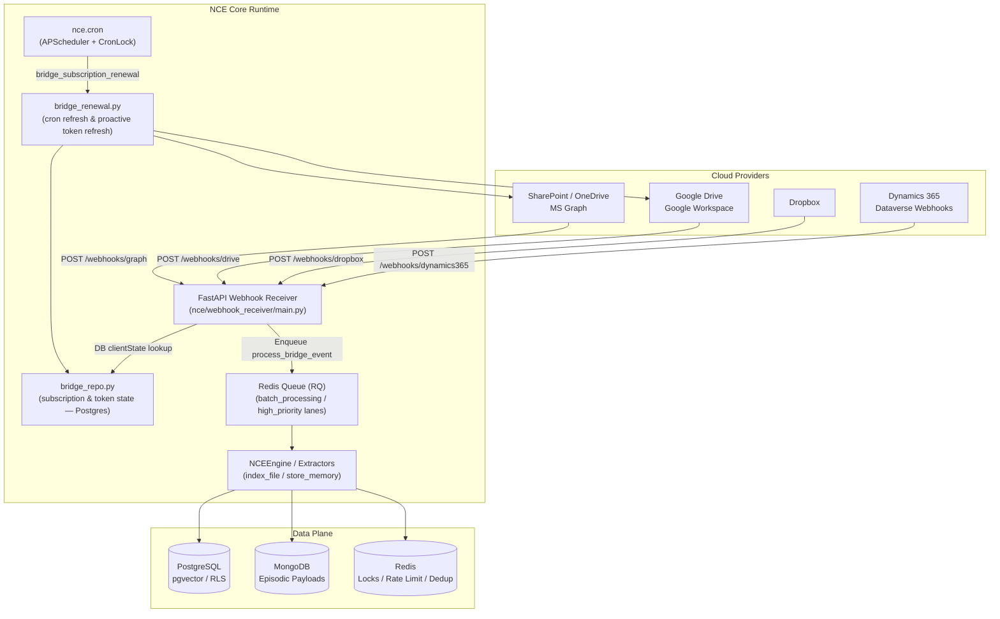
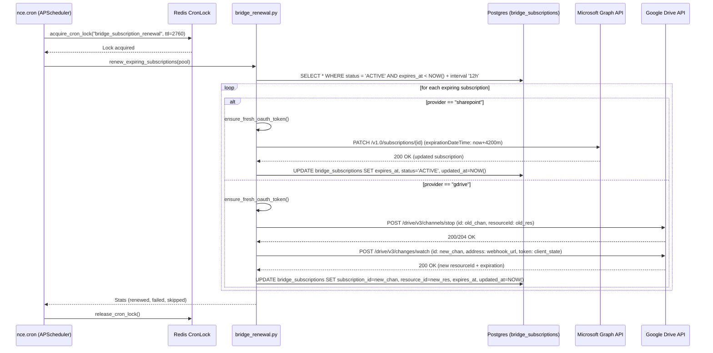
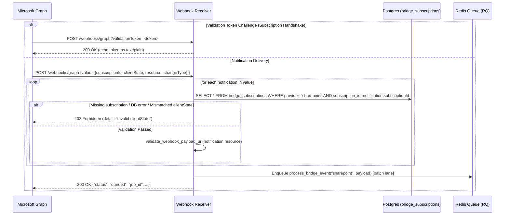
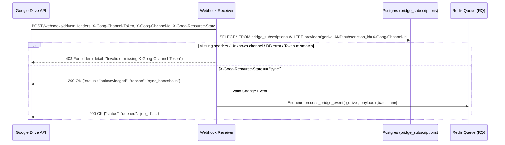
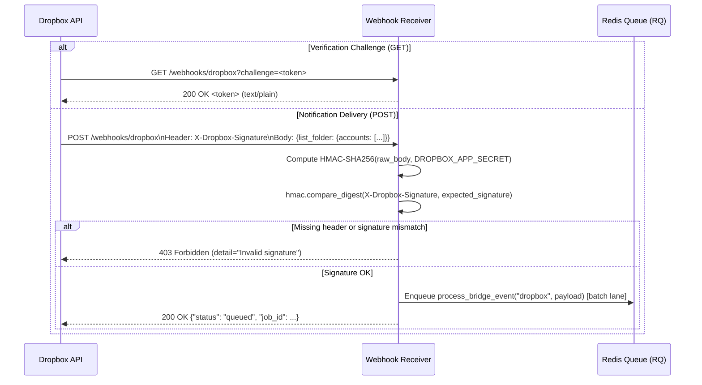
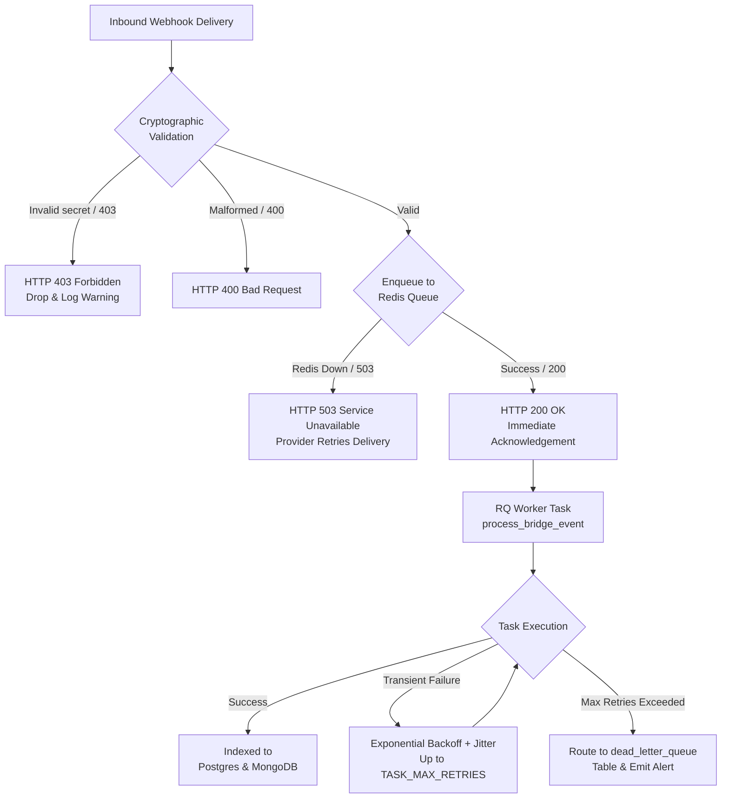

> **Status:** shipped · **Verified-against:** 7304330 (main) · **Last-audited:** 2026-08-17

# NCE Service Integrations

End-to-end data flow, retry logic, security verification, and state management for all supported downstream document bridges:
**SharePoint / OneDrive** (Microsoft Graph), **Google Workspace / Drive**, and **Dropbox**, as well as the webhook-driven **Dynamics 365 / Dataverse** service endpoint.

For step-by-step OAuth setup and provider registration, see [bridge_setup_guide.md](bridge_setup_guide.md).  
For all environment variables, see [configuration_reference.md](configuration_reference.md).

---

## 1. Architecture Overview

The bridge system operates on a **push (webhook) model**: NCE registers subscriptions or watch channels with external cloud providers, and the providers deliver change notifications to NCE's FastAPI webhook receiver (`nce/webhook_receiver/main.py`). Only changed documents are fetched and indexed incrementally into the storage layer — eliminating periodic polling waste and API rate limit exhaustion.



---

## 2. Subscription Lifecycle & Renewal Mechanics

Bridge subscriptions have **finite lifetimes** imposed by external provider APIs. NCE automatically manages lifecycle transitions and executes automated renewals before expiration.

| Provider | Max Subscription Lifetime | Renewal Approach | Failure State |
|---|---|---|---|
| **SharePoint / OneDrive** | ~3 days (4 200 min cap) | Cron job calls `PATCH https://graph.microsoft.com/v1.0/subscriptions/{id}` with new `expirationDateTime` | Marked `DEGRADED` on failure |
| **Google Drive** | ~7 days (6 d 23 h cap) | Cron job stops old channel (`POST /drive/v3/channels/stop`) and registers a new watch (`POST /drive/v3/changes/watch`) with new `channel_id` UUID | Marked `DEGRADED` on failure |
| **Dropbox** | Permanent (no expiry) | Permanent app webhook; no subscription expiration (change tracking via cursor only) | N/A |

### 2a. Renewal Cron: `bridge_subscription_renewal`

The renewal cron runs inside `nce.cron` (APScheduler `AsyncIOScheduler`) with the following mechanics:
- **Cadence:** Every `BRIDGE_CRON_INTERVAL_MINUTES` minutes (default: **45 minutes**, `IntervalTrigger(minutes=45)`).
- **Distributed Concurrency Lock:** Acquired via `acquire_cron_lock("bridge_subscription_renewal", ttl=2760)` using Redis `SET nx=True ex=ttl`. Prevents duplicate renewal runs across multiple NCE replicas.
- **Lookahead Window:** Queries `bridge_subscriptions` where `status = 'ACTIVE'` and `expires_at < NOW() + BRIDGE_RENEWAL_LOOKAHEAD_HOURS` (default: **12 hours**).
- **Proactive OAuth Token Refresh:** Before issuing provider API calls, `ensure_fresh_oauth_token()` checks if the access token will expire within 5 minutes. If expiring, it performs a proactive refresh using the stored refresh token under a distributed Redis lock (`bridge_refresh:{provider}:{bridge_id}`).
- **Failure Handling:** If a provider API rejects renewal (e.g. invalid credentials or deleted resource), `mark_degraded()` updates the subscription row status to `DEGRADED` and dispatches a throttled system alert (`cron.bridge_subscription_renewal`).



---

## 3. Incoming Webhook Flow & Cryptographic Verification

All inbound webhook endpoints are hosted on the FastAPI webhook receiver (`nce/webhook_receiver/main.py`). The receiver uses **per-bridge cryptographic secrets** and **constant-time verification** (`hmac.compare_digest`) to prevent spoofing and timing attacks.

### 3a. SharePoint / OneDrive (Microsoft Graph)

**Receiver Path:** `POST /webhooks/graph`



**Verification Details:**
1. **Challenge Response:** When Microsoft Graph validates the endpoint (at subscription creation or renewal), it passes a `?validationToken=<token>` query parameter. The receiver immediately echoes the token with HTTP 200 `text/plain`.
2. **Per-Bridge Database Lookup:** For notification deliveries, the receiver extracts `subscriptionId` and `clientState` from each notification object. It queries `bridge_subscriptions` for the active SharePoint row matching that external `subscription_id`.
3. **Constant-Time Verification:** The incoming `clientState` is compared against `row["client_state"]` using `hmac.compare_digest(client_state, expected)`.
4. **Fail-Closed Security:** If `clientState` is missing, the subscription ID is unknown, the token does not match, or the database lookup fails, the receiver returns **HTTP 403 Forbidden** (`detail="Invalid clientState"`). Global environment fallback secrets are strictly rejected.
5. **SSRF & URL Validation:** The `resource` URL in the notification is validated against SSRF rules via `validate_webhook_payload_url(resource)`. Invalid URLs raise HTTP 400 Bad Request.

---

### 3b. Google Drive (Google Workspace)

**Receiver Path:** `POST /webhooks/drive`



**Verification Details:**
1. **Header Authentication:** Google Drive delivers the per-bridge token in `X-Goog-Channel-Token` and the channel UUID in `X-Goog-Channel-Id`.
2. **Per-Bridge Database Lookup:** The receiver fetches the active Google Drive row from `bridge_subscriptions` where `subscription_id = channel_id`.
3. **Constant-Time Verification:** Compares `X-Goog-Channel-Token` with `row["client_state"]` via `hmac.compare_digest(channel_token, expected)`.
4. **Fail-Closed Security:** Missing headers, unknown channel IDs, token mismatches, or database errors reject immediately with **HTTP 403 Forbidden** (`detail="Invalid or missing X-Goog-Channel-Token"`).
5. **Sync Handshake:** When Google Drive issues the initial channel creation verification (`X-Goog-Resource-State: sync`), the receiver verifies the token first, then returns HTTP 200 `{"status": "acknowledged", "reason": "sync_handshake"}` without enqueuing worker tasks.
6. **Change Notification:** Inbound changes (`X-Goog-Resource-State: update` / `change` / `trash`) are enqueued to the `batch_processing` RQ lane.

---

### 3c. Dropbox

**Receiver Path:** `GET /webhooks/dropbox` and `POST /webhooks/dropbox`



**Verification Details:**
1. **Verification Challenge:** Handled on `GET /webhooks/dropbox?challenge=<challenge>` by echoing the challenge token as plain text with HTTP 200.
2. **Payload Signature Verification:** Inbound `POST /webhooks/dropbox` requests include the `X-Dropbox-Signature` header containing the HMAC-SHA256 hex digest of the raw request body keyed with `DROPBOX_APP_SECRET`.
3. **Constant-Time Comparison:** The computed signature is compared against the header using `hmac.compare_digest(signature, expected_signature)`.
4. **Fail-Closed Security:** Missing signature headers or signature mismatches reject with **HTTP 403 Forbidden**.

---

### 3d. Dynamics 365 / Dataverse Service Endpoint

**Receiver Path:** `POST /webhooks/dynamics365`

When `NCE_D365_ENABLED=true`, the webhook receiver accepts Microsoft Dataverse Service Endpoint push notifications:
- **Signature Verification:** Validates the `x-ms-signaturecontent` header against `NCE_D365_WEBHOOK_SECRET` via `D365WebhookValidator.validate_signature`.
- **Immediate Response:** Returns HTTP 200 immediately to meet Dataverse's ~30-second webhook timeout requirement.
- **Priority Queue Lane:** Enqueues `nce.tasks.process_d365_event` to the `high_priority` RQ queue lane.

---

## 4. Resilience, Rate Limiting & Echo Suppression

### 4a. Webhook Rate Limiting

The webhook receiver applies a sliding-window rate limit to all `/webhooks/` routes:
- **Redis Lua Script (`_RATE_LIMIT_LUA`):** Atomic sorted-set rate limiter checking `WEBHOOK_RATE_LIMIT` requests per `WEBHOOK_RATE_PERIOD_SECONDS` (default: 120 req / 60 s).
- **Failover:** In non-production environments, falls back to an in-memory sliding window if Redis is unavailable. In production (`NCE_ENV=prod`), Redis failure fails closed to prevent denial-of-service.

### 4b. Payload Deduplication

To prevent duplicate processing from network re-transmissions:
- Deduplication keys are stored in Redis with TTL `WEBHOOK_DEDUP_TTL_SECONDS` (default: 86400 s / 24 h):
  - **SharePoint:** `nce:webhook:dedup:sharepoint:sha256(sorted(id|resource|changeType))`
  - **Google Drive:** `nce:webhook:dedup:gdrive:sha256(channel_id|resource_id|message_number|resource_state)`
  - **Dropbox:** `nce:webhook:dedup:dropbox:sha256(sorted(accounts))`
  - **Dynamics 365:** `nce:webhook:dedup:d365:sha256(PrimaryEntityName|PrimaryEntityId|MessageName|CreatedOn)`

### 4c. Echo Suppression (`register_echo` / `check_echo`)

When NCE mutates an entity in an external downstream system (e.g. modifying a file or updating a CRM record), it registers a temporary echo tombstone in Redis:
```python
register_echo(system="sharepoint", entity_id=file_id, origin_event_id=event_id)
```
When the cloud provider subsequently delivers a webhook notification for that mutation, the background task checks `check_echo(system, entity_id)`. If an active echo entry exists (default TTL `NCE_ECHO_TTL_S=600s`), semantic re-ingestion is suppressed, avoiding infinite ingestion feedback loops.

---

## 5. Retry Logic & Error Escalation



1. **Immediate Acknowledgment:** The receiver validates and enqueues the payload, returning **HTTP 200** to the provider in under 50 ms. Downstream processing errors in workers never cause cloud providers to resend notifications.
2. **Provider Retries on Infrastructure Outage:** If Redis is down, the receiver returns **HTTP 503**, causing the cloud provider to retry delivery according to its exponential backoff schedule.
3. **Async RQ Worker Retries:** Worker tasks retry up to `TASK_MAX_RETRIES` (default: 3) with exponential backoff and full jitter. Exhausted retries are captured in the `dead_letter_queue` Postgres table for administrative triage.

---

## 6. Database State Model

### `bridge_subscriptions` (PostgreSQL)

```sql
CREATE TABLE bridge_subscriptions (
    id                      UUID PRIMARY KEY DEFAULT gen_random_uuid(),
    user_id                 TEXT NOT NULL,
    namespace_id            UUID NOT NULL REFERENCES namespaces(id) ON DELETE CASCADE,
    provider                TEXT NOT NULL CHECK (provider IN ('sharepoint', 'gdrive', 'dropbox')),
    subscription_id         TEXT,           -- External provider ID (Graph subscriptionId / Drive channel UUID)
    resource_id             TEXT NOT NULL,  -- Watched resource (e.g. site_id|drive_id, Google resourceId, Dropbox dbid)
    cursor                  TEXT,           -- Delta token / change cursor for incremental sync
    client_state            TEXT NOT NULL,  -- Per-bridge cryptographic secret generated via secrets.token_urlsafe(32)
    expires_at              TIMESTAMPTZ,    -- Expiration timestamp (NULL for permanent bridges like Dropbox)
    status                  TEXT NOT NULL CHECK (status IN ('REQUESTED', 'VALIDATING', 'ACTIVE', 'DEGRADED', 'EXPIRED', 'DISCONNECTED')),
    oauth_access_token_enc  BYTEA,          -- AES-256-GCM encrypted JSON payload {access_token, refresh_token, expires_at}
    created_at              TIMESTAMPTZ NOT NULL DEFAULT NOW(),
    updated_at              TIMESTAMPTZ NOT NULL DEFAULT NOW()
);
```

### Encryption & Token Security

- All OAuth tokens (`access_token`, `refresh_token`, and token `expires_at` timestamp) are stored exclusively in the `oauth_access_token_enc` column as **AES-256-GCM encrypted byte payloads** using the master encryption key (`require_master_key()`).
- Database reads and writes are managed through `bridge_repo.save_token()` and `bridge_repo.get_token()`. Unencrypted tokens are never written to disk or logs.

---

## 7. Local Development & Tunneling

Cloud provider webhooks require a publicly accessible HTTPS URL. For local testing:

```bash
# 1. Start a local tunnel (e.g. via ngrok)
ngrok http 8080

# 2. Configure the public base URL in your .env
export BRIDGE_WEBHOOK_BASE_URL=https://<your-subdomain>.ngrok-free.app

# 3. Set the Dropbox webhook secret
export DROPBOX_APP_SECRET=your_dropbox_app_secret

# 4. Start the webhook receiver
uvicorn nce.webhook_receiver.main:app --port 8080 --reload
```

> [!WARNING]
> Without `BRIDGE_WEBHOOK_BASE_URL`, subscription registration for SharePoint and Google Drive will fail. The renewal cron job (`renew_expiring_subscriptions`) only renews active subscriptions and does not poll; push webhooks are required for document ingestion.
