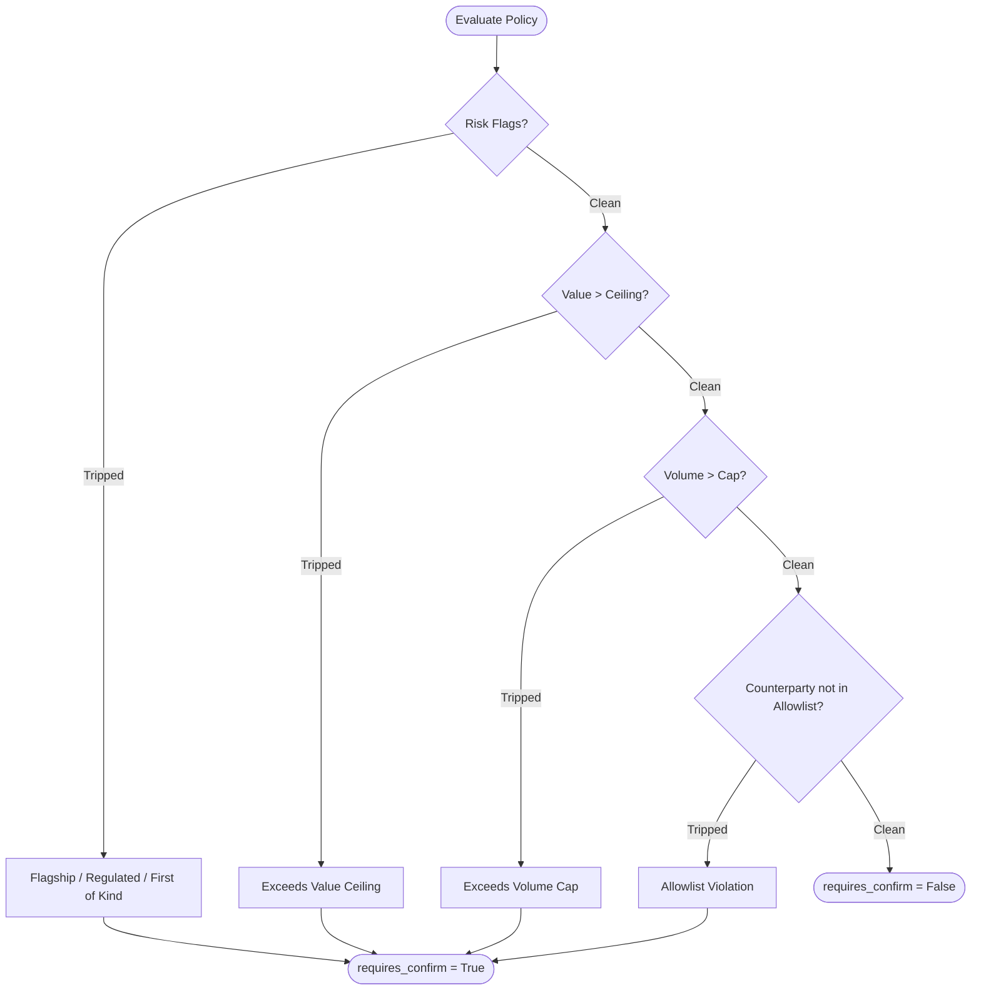

> **Status:** shipped · **Verified-against:** 7304330 (main) · **Last-audited:** 2026-08-17

# Doc 59 — Shared Core Autonomy Governance Guide

> **Status:** shipped · **Verified-against:** 7304330 (main) · **Last-audited:** 2026-08-17

The NCE Shared Core Autonomy Governance model (component **C2**) provides a centralized, deterministic execution wrapper designed to enforce safety bounds on autonomous operations across all engines. Governed mutating operations must navigate a strict series of checks designed to limit the risk of run-away automation, poison-record creation, and un-audited state mutations.

This guide outlines the system design, the `@governed` decorator, policy evaluation logic, idempotency, kill switches, and transactional safety guarantees.

---

## 1. System Overview & Contract B

As defined in the Shared-Core Foundation, **Contract B** mandates that every **Actor/Autonomous** tool passing mutating commands must traverse a unified gate:
1. **Default to Human Confirmation**: Operations do not execute autonomously unless explicitly pre-authorized and within safety bounds.
2. **Earned Autonomy**: Tools can earn the path of autonomous execution by validating precision and remaining within value/volume ceilings.
3. **Unified Audit Trail**: Every action must be recorded to the `v3_cognitive_ledger` (via the NCE core `event_log`).
4. **Idempotency Enforcement**: Prevent duplicate side effects across engine boundaries and during network-replay conditions.

### Architectural Separation of Concerns
The C2 autonomy gate is split into two modules within the core `nce/autonomy` directory:
- **`nce.autonomy.policy` (Pure Logic)**: I/O-free policy engine. It processes raw inputs (scalars, flags, allowlists) and returns policy decisions. It has no dependencies on databases, Redis, HTTP, or async runtimes.
- **`nce.autonomy.governor` (Execution Gate)**: Handles decorator mechanics, argument binding, connection checks, database and Redis I/O, kill-switch validation, and transactional auditing.

---

## 2. The `@governed` Decorator

The `@governed` decorator wraps any asynchronous mutating handler. It inspects keyword and positional parameters at call-time using python's `inspect.signature` mapping, matching runtime arguments to defined policy boundaries.

### Decorator Parameters
```python
def governed(
    *,
    action_type: str,
    idempotency_key_arg: str = "idempotency_key",
    confirm_arg: str = "confirm",
    conn_arg: str = "conn",
    namespace_id_arg: str = "namespace_id",
    redis_client_arg: str = "redis_client",
    value_arg: str = "value",
    value_ceiling: float | None = None,
    volume_state_arg: str = "volume_state",
    volume_rate_cap: float | None = None,
    counterparty_arg: str = "counterparty",
    allowlist: Sequence[str] | None = None,
    risk_flags_arg: str = "risk_flags",
)
```

### Basic Decorator Usage
```python
import uuid
import asyncpg
from typing import Any
from nce.autonomy.governor import governed

@governed(action_type="submit_po", value_ceiling=5000.0)
async def submit_purchase_order(
    conn: asyncpg.Connection,
    namespace_id: uuid.UUID,
    *,
    idempotency_key: str,
    confirm: bool = False,
    value: float,
    counterparty: str,
) -> dict[str, Any]:
    # Domain-specific mutating side effects go here
    ...
```

---

## 3. Confirm-First Posture

The governance system operates on a **confirm-first** default stance. If the resolved value of the `confirm` parameter (controlled by the parameter named in `confirm_arg`) is `False`, the handler is **never** executed. 

### Behavior and Payload
- **No Side Effects**: The wrapped function is bypassed entirely.
- **Pending Payload**: The decorator intercepts the call and immediately returns a structured JSON payload indicating that human approval is required:
  ```json
  {
    "status": "pending_approval",
    "idempotency_key": "k1-unique-id",
    "action_type": "submit_po"
  }
  ```
- **Fired Policy Payload**: If the caller passed `confirm=True` but a policy gate tripped, the decorator returns a similar pending response detailing the cause:
  ```json
  {
    "status": "pending_approval",
    "idempotency_key": "k1-unique-id",
    "action_type": "submit_po",
    "reason": "value=6000.0 exceeds ceiling=5000.0"
  }
  ```

---

## 4. Policy Gates (`policy.py`)

When `confirm=True` is supplied, the governor evaluates the action constraints using `evaluate_policy()`. Gates are **additive** rather than alternative; if *any* single gate trips, the decision demands human confirmation (`requires_confirm=True`).

The policy evaluation logic checks rules in this exact order:



### Gate 1: Risk Flags
- **Trigger**: Risk labels passed as a sequence (e.g. `["flagship", "regulated"]`).
- **Forced Confirm Flags**: `RISK_FLAGS_FORCE_CONFIRM = frozenset({"flagship", "first_of_kind", "regulated"})`
- **Behavior**: If the action carries any of these labels, it forces human confirmation **regardless of value band or volume thresholds**.

### Gate 2: Value Ceiling
- **Trigger**: Checked when both `value` (monetary or scalar magnitude of the action) and `value_ceiling` are configured (not `None`).
- **Rule**: Fired if `value > value_ceiling`.

### Gate 3: Volume / Rate Cap
- **Trigger**: Checked when both `volume_state` (rolling accumulated activity window metric) and `volume_rate_cap` are configured.
- **Rule**: Fired if `volume_state > volume_rate_cap`.

### Gate 4: Counterparty Allowlist
- **Trigger**: Checked when `counterparty`, `allowlist` (sequence of valid strings), and `len(allowlist) > 0` are present.
- **Rule**: Fired if `counterparty not in allowlist`.

---

## 5. Idempotency & Auditing

Double-execution of financial or operational side effects (e.g. posting duplicate purchase orders) is prevented using a database-backed idempotency table.

### Database Table: `action_idempotency`
The governor stores successfully initiated actions in a dedicated Postgres relation:

| Column | Type | Description |
| :--- | :--- | :--- |
| `idempotency_key` | `TEXT` | Unique key generated by the caller/source client (Primary Key composite with namespace) |
| `namespace_id` | `UUID` | Scope/tenant identifier (RLS context) |
| `action_type` | `VARCHAR` | Stable name of the governed operation (e.g., `submit_po`) |

### Idempotency Flow
1. **Uniqueness Resolution**: Before executing the wrapped function, the governor runs `_idempotency_key_exists()` to check if the combination of `(namespace_id, idempotency_key)` is already present in `action_idempotency`.
2. **Duplicate Detection (NO-OP)**: If the key exists, execution is skipped and the governor returns:
   ```json
   {
     "status": "already_executed",
     "idempotency_key": "k1-unique-id"
   }
   ```
3. **Race Condition Handling**: During a rapid parallel race, the database handles enforcement. The governor attempts an insert using `_record_idempotency_key()`. If another thread inserts the key in the interim, the driver raises an `asyncpg.UniqueViolationError`. The governor catches this exception and gracefully returns the `already_executed` response.

### Core Ledger Auditing
On the first execution, after the key is successfully recorded and the wrapped function successfully returns, an audit entry is generated.
- The governor invokes `append_event()` from `nce.event_log`.
- **System Event Mapping**:
  - `event_type`: `"config_changed"`
  - `agent_id`: `"governor"`
  - `params`: 
    ```python
    {
        "actor": "governor",
        "changes": {
            "governed_action": action_type,
            "idempotency_key": idempotency_key,
        }
    }
    ```

---

## 6. The Kill Switch Gate

The governor incorporates a high-priority kill switch mechanism powered by a shared Redis hash. This is checked immediately upon confirming execution, prior to policy evaluation.

### Redis Configuration
- **Hash Key**: `nce:tools:disabled`
- **Global Disable Field**: `*`
- **Per-Action Disable Field**: The `action_type` label passed to the decorator (e.g. `submit_po`).

### Fail-Closed Semantics
The kill switch operates under a **fail-closed** model:
- **Redis Check**: The governor invokes `hexists("nce:tools:disabled", action_type)` and `hexists("nce:tools:disabled", "*")`.
- **Unreachable Redis**: If the Redis client is unreachable (e.g., network timeout, connection drops, driver exception), the governor raises a `KillSwitchError`. **An error is never treated as "enabled".** The operation is blocked.
- **De-wired State**: If `redis_client` resolves to `None`, the governor assumes the caller explicitly bypassed Redis. It logs a warning (`[governor] kill-switch gate NOT wired`) and proceeds.

---

## 7. Database Transaction Protection

To prevent "poison keys" (partially completed or un-audited state anomalies), the governor enforces strict transactional boundaries on the database connection.

### The Poison Key Hazard
If the governor recorded an idempotency key to `action_idempotency` outside of a transaction, that key would commit instantly. If the subsequent handler execution or the `append_event()` logging call failed immediately afterwards, the system would be left in an inconsistent state:
- The side effect did not run.
- The event log contains no audit trail.
- **Result**: The key is permanently recorded in `action_idempotency`, preventing the caller from ever retrying the operation.

```
[POISON KEY SCENARIO]
   Non-transactional Connection
   ├── 1. INSERT idempotency key (Committed Instantly!)
   ├── 2. Execute Handler (Raises Exception / Crash)
   └── 3. Transaction rolled back? NO (No transaction was active)
   Result: Key is locked forever. Operation cannot be retried.
```

### Transaction Enforcement
To address this hazard, the decorator checks the active state of the transaction before executing any side effects:
```python
if not conn.is_in_transaction():
    raise GovernanceError(
        f"@governed handler '{fn.__name__}': conn is not inside an active "
        "transaction — call inside scoped_pg_session to prevent a poison "
        "idempotency key on audit failure."
    )
```

By enforcing `conn.is_in_transaction()`, all operations run within a single atomic scope:

```
[SECURE TRANSACTIONAL FLOW]
   scoped_pg_session (Caller Transaction)
   ├── 1. Check if conn.is_in_transaction() -> True
   ├── 2. SELECT 1 FROM action_idempotency
   ├── 3. INSERT INTO action_idempotency (Not committed yet!)
   ├── 4. Await handler execution
   ├── 5. append_event(...) (Audit trail appended)
   └── 6. Caller Commits Transaction (Atomically commits all steps)
          * If any step (3, 4, or 5) fails, the entire transaction rolls back.
          * The idempotency key is cleared, allowing safe retries.
```

If any execution step, the user-supplied handler, or the audit step fails, the parent connection rollback discards the idempotency record. The key remains unregistered, allowing the caller to safely retry the transaction.
