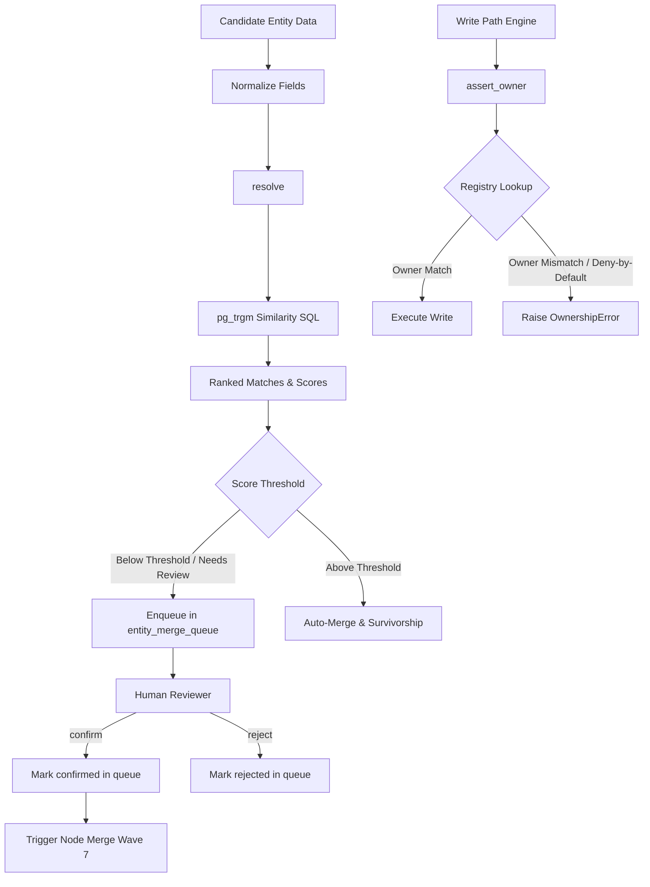

> **Status:** shipped · **Verified-against:** 7304330 (main) · **Last-audited:** 2026-08-17

# Doc 60 — Shared Core Entity Resolution Guide

> **Status:** shipped · **Verified-against:** 7304330 (main) · **Last-audited:** 2026-08-17

This document defines the architecture, database schema, domain logic, and API surface for the **C1 — Entity-Resolution & Node-Ownership Registry** component of the Neuro-Cognitive Engine (NCE) Shared-Core Foundation. 

Entity resolution prevents silent graph corruption, resolves duplicate nodes, controls single-writer invariants, and manages conflict resolution using audit-compliant provenance rules.

---

## 1. Architectural Overview

The C1 Component provides a dual-surface mechanism:
1. **Machine-Readable Single-Writer Registry:** Restricts which engine can create or modify specific node types, preventing cross-engine conflicts.
2. **Fuzzy-Match & Human-Review Merge Queue:** Identifies candidates using trigonometric similarity (`pg_trgm`) and routes low-confidence/sub-threshold merges to human reviewers.



> [!IMPORTANT]
> **No-Auto-Merge Invariant:** The merge queue status changes (`confirm` / `reject`) **only** update the queue row itself (`status`, `decided_by`, `decided_at`). They do **not** write to `kg_nodes` or `kg_edges`. Actual graph merges and survivorship executions are isolated to down-stream pipelines.

---

## 2. Database Schema & RLS Configuration

The C1 component relies on two core tables, both partition-isolated using PostgreSQL Row-Level Security (RLS) under the `tenant_isolation_policy` pattern.

### 2.1 Table: `node_ownership_registry`
Enforces single-writer engine ownership over shared node types.

```sql
CREATE TABLE IF NOT EXISTS node_ownership_registry (
    id                    UUID        NOT NULL DEFAULT gen_random_uuid(),
    namespace_id          UUID        NOT NULL REFERENCES namespaces(id) ON DELETE CASCADE,
    node_type             TEXT        NOT NULL,
    transition            TEXT,
    owner_engine          TEXT        NOT NULL,
    created_at            TIMESTAMPTZ NOT NULL DEFAULT now(),
    PRIMARY KEY (id)
);
```

#### Indexes
* `idx_node_ownership_registry_namespace_type_transition` on `(namespace_id, node_type, transition)`: Speeds up write-path lookup operations.

#### RLS Policy
```sql
ALTER TABLE node_ownership_registry ENABLE ROW LEVEL SECURITY;
ALTER TABLE node_ownership_registry FORCE ROW LEVEL SECURITY;

CREATE POLICY tenant_isolation_policy ON node_ownership_registry
    FOR ALL TO nce_app
    USING (namespace_id IS NOT NULL AND namespace_id = get_nce_namespace())
    WITH CHECK (namespace_id IS NOT NULL AND namespace_id = get_nce_namespace());
```

---

### 2.2 Table: `entity_merge_queue`
Holds proposed entity merges requiring manual inspection.

```sql
CREATE TABLE IF NOT EXISTS entity_merge_queue (
    id                    UUID            NOT NULL DEFAULT gen_random_uuid(),
    namespace_id          UUID            NOT NULL REFERENCES namespaces(id) ON DELETE CASCADE,
    node_type             TEXT            NOT NULL,
    candidate_payload     JSONB           NOT NULL,
    target_node_id        UUID,
    score                 DOUBLE PRECISION NOT NULL,
    status                TEXT            NOT NULL DEFAULT 'pending' CHECK (status IN ('pending', 'confirmed', 'rejected')),
    created_at            TIMESTAMPTZ     NOT NULL DEFAULT now(),
    decided_by            TEXT,
    decided_at            TIMESTAMPTZ,
    PRIMARY KEY (id)
);
```

#### Indexes
* `idx_entity_merge_queue_namespace_status` on `(namespace_id, status)`: Used to retrieve active review items.
* `idx_entity_merge_queue_created_at` on `(namespace_id, created_at DESC)`: Supports timeline-ordered pagination.

#### RLS Policy
```sql
ALTER TABLE entity_merge_queue ENABLE ROW LEVEL SECURITY;
ALTER TABLE entity_merge_queue FORCE ROW LEVEL SECURITY;

CREATE POLICY tenant_isolation_policy ON entity_merge_queue
    FOR ALL TO nce_app
    USING (namespace_id IS NOT NULL AND namespace_id = get_nce_namespace())
    WITH CHECK (namespace_id IS NOT NULL AND namespace_id = get_nce_namespace());
```

#### Role Grants (Both Tables)
```sql
REVOKE ALL ON TABLE node_ownership_registry, entity_merge_queue FROM nce_app;
GRANT SELECT, INSERT, UPDATE, DELETE ON TABLE node_ownership_registry, entity_merge_queue TO nce_app;
```

---

## 3. Normalization Mappings

Normalizing fields before comparison reduces duplicate match failures caused by case, spacing, or naming variations.

### 3.1 Normalization Flow (`nce/entity_resolution/normalizers.py`)
1. **Casefold & Strip:** The input string is stripped of leading/trailing whitespace and lowercased via `.strip().casefold()`.
2. **Alias Map Lookup:** The system loads matching mapping configurations dynamically from `nce/config_data/{name}-normalization.json`.
3. **Caching:** Configuration maps are loaded on-demand and cached in `_NORMALIZER_CACHE` to avoid repeated I/O operations.
4. **Fallback:** If no mapping is found or the configuration is unreadable, the casefolded/stripped string passes through unmodified (silent degradation).

```python
def normalize(value: str, name: str) -> str:
    normalized = value.strip().casefold()
    alias_map = load_normalizer(name)
    return alias_map.get(normalized, normalized)
```

### 3.2 Manufacturer Mapping Configuration (`manufacturer-normalization.json`)
The following configuration provides standard normalized aliases for hardware manufacturers:

```json
{
  "cisco systems": "cisco",
  "hewlett packard": "hp",
  "hewlett-packard": "hp"
}
```

---

## 4. Entity Resolution & Matcher

The core matching logic is executed in a read-only, pg-trgm-delegated database lookup.

### 4.1 Resolution Logic (`nce/entity_resolution/resolver.py`)
The `resolve()` function ranks and scores candidates against existing knowledge graph nodes:

* **Trigger-Free Similarity Calculation:** Operates entirely inside a read-only select, delegating string-distance metrics directly to pg_trgm `similarity()`.
* **Multi-Key Scoring:** Normalizes values for each key in `candidate`. For multiple keys, the final match score is an unweighted average of their similarities against `kg_nodes.label`.
* **Top-N Cap:** Limits results to a maximum of 25 (`_TOP_N = 25`) matching nodes, sorted by score descending.
* **Redundant Safety Guards:** Accepts both `conn` (obtained via `scoped_pg_session`) and an explicit `namespace_id` parameter to enforce isolation at the query level.
* **PII Logging Guard:** Candidate dictionary values are never logged at `INFO` level to prevent leak of sensitive entity attributes.

#### SQL Similarity Structure
```sql
SELECT
    n.id                      AS node_id,
    ((similarity($3, n.label) + similarity($4, n.label)) / 2.0) AS score
FROM   kg_nodes n
WHERE  n.namespace_id = $1
  AND  n.entity_type  = $2
ORDER BY score DESC
LIMIT  25
```

---

## 5. Node Ownership & Lifecycle Registry

The write path guards the graph against cross-engine modifications through ownership checks.

### 5.1 Single-Writer Invariant (`nce/entity_resolution/ownership.py`)
The `assert_owner()` function acts as a write guard. It asserts that the executing engine has authorization to write to the requested node type:

1. **Deny-by-Default:** If no registry row exists for the node type, the write is rejected.
2. **Precedence Hierarchy:**
   * Look for a transition-specific row (e.g. `node_type = 'device'`, `transition = 'create'`).
   * Fallback to the node-type-wide row (where `transition IS NULL`).
3. **Lookup ordering:** Uses SQL sorting (`ORDER BY (transition IS NULL) ASC`) to bubble transition-specific matches ahead of null-transition fallbacks.

```python
async def assert_owner(
    conn: asyncpg.Connection,
    namespace_id: str | UUID,
    node_type: str,
    writer_engine: str,
    transition: str | None = None,
) -> None:
    owner_engine = await _lookup_owner(conn, namespace_id, node_type, transition)
    if owner_engine is None or owner_engine != writer_engine:
        raise OwnershipError(
            node_type=node_type,
            writer_engine=writer_engine,
            owner_engine=owner_engine,
            transition=transition
        )
```

### 5.2 Seeding Table (`node-ownership.json`)
The registry is seeded using the `seed_node_ownership_registry()` helper, which iterates through the standard engine ownership topology:

| Node Type | Owner Engine | Default Transition |
|---|---|---|
| `PRODUCT_SKU` | `product` | `null` |
| `PO`, `PROCUREMENT_MATCH` | `procurement` | `null` |
| `FUNCTIONAL_LOCATION`, `DESIGN`, `DESIGN_LINE`, `DEVICE`, `PORT`, `SIGNAL_CHAIN`, `RACK`, `CABLE` | `system_design` | `null` |
| `PROJECT_PROJECT`, `PROJECT_GATE`, `PROJECT_TASK`, `PROJECT_CASE_STUDY` | `project` | `null` |
| `CUSTOMER`, `LEAD`, `OPPORTUNITY`, `DEAL`, `QUOTE`, `SIGNED_BASELINE` | `sales` | `null` |
| `VENDOR`, `CONTRACTOR`, `CERT`, `VENDORS_CERT` | `vendors` | `null` |

---

## 6. Merge Queue Operations

The merge queue holds proposed merges for human intervention, separating high-risk identity merges from simple attribute enrichment reviews.

### 6.1 Core API (`nce/entity_resolution/merge_queue.py`)
* `enqueue(conn, *, namespace_id, node_type, candidate, target, score)`: Places a sub-threshold proposed merge record in `pending` status.
* `list_pending(conn, *, namespace_id)`: Fetches pending rows sorted oldest-first (`created_at ASC`) to process the backlog in arrival order.
* `confirm(conn, *, namespace_id, queue_id, decided_by)`: Marks the row as `confirmed` and writes the operator ID. Throws `LookupError` if the row is not pending.
* `reject(conn, *, namespace_id, queue_id, decided_by)`: Marks the row as `rejected` and writes the operator ID.

> [!WARNING]
> Both `confirm()` and `reject()` execute a single-table mutation guard. They only modify `entity_merge_queue` status fields. They **never** edit or write to `kg_nodes` or `kg_edges` directly.

---

## 7. Field-Level Survivorship & Provenance

When multiple conflicting values exist for an entity's fields, survivorship resolution selects the surviving value.

### 7.1 Precedence Chain (`nce/entity_resolution/survivorship.py`)
Conflict resolution evaluates candidates through a flat, deterministic precedence cascade (stable sorting):
1. **Source Trust:** The candidate with the highest numeric `source_trust` (float in `[0, 1]`) wins.
2. **Recency:** If trust is tied, the most recent timestamp (`as_of` parsed to timezone-aware UTC) wins.
3. **Confidence:** If trust and recency are tied, the highest field-level `confidence` (float in `[0, 1]`) wins.
4. **Stable Fallback:** If all metrics are completely tied, the first candidate in the list wins.

### 7.2 Cognitive Ledger Audit Trails
To record *why* a value was chosen, the system invokes `append_survivorship_provenance()`, appending a record into `v3_cognitive_ledger`.

* **Model Version:** Hardcoded to `survivorship/v1` to differentiate from machine-learning cognitive traces.
* **Audit Payload:** Serialized inside the `tlx_scores` JSONB column. Captures the winning value, source, winning reason, and a full snapshot of all evaluated candidates.
* **Empathic Tensor:** Set to `[0.0, 0.0, 0.0, 0.0, 0.0, 0.0]` (a zero-tensor placeholder required by database constraints).

#### Provenance payload structure:
```json
{
  "event": "field_survivorship",
  "entity_id": "device_102",
  "field_name": "hostname",
  "winning_value": "sw-cisco-core-01",
  "winning_source": "netbox",
  "reason": "source_trust",
  "candidates": [
    {
      "source": "netbox",
      "source_trust": 0.9,
      "as_of": "2026-06-24T12:00:00+00:00",
      "confidence": 0.95
    },
    {
      "source": "ping_discovery",
      "source_trust": 0.5,
      "as_of": "2026-06-24T15:30:00+00:00",
      "confidence": 0.8
    }
  ]
}
```

---

## 8. MCP API Surface

The C1 Entity Resolution module exposes its core capabilities via the NCE MCP server. Each tool handles argument validation and executes database queries within a namespace-scoped pg_session.

### 8.1 Registered MCP Tool Handlers (`nce/entity_resolution/mcp_handlers.py`)

#### `handle_resolve`
Triggers fuzzy-matching.
* **Arguments:** `namespace_id` (str), `candidate` (dict), `keys` (list[str]), `node_type` (str).
* **Returns:** JSON object containing `status` and `matches` (list of `node_id`, `score`, `matched_on`).

#### `handle_merge_queue_list`
Lists the active human review queue.
* **Arguments:** `namespace_id` (str).
* **Returns:** JSON object containing `status` and `pending` queue entries sorted oldest-first.

#### `handle_merge_queue_confirm`
Confirms a proposed merge.
* **Arguments:** `namespace_id` (str), `queue_id` (str), `decided_by` (str).
* **Returns:** JSON object containing `status` and confirmed `queue_id`.

#### `handle_merge_queue_reject`
Rejects a proposed merge.
* **Arguments:** `namespace_id` (str), `queue_id` (str), `decided_by` (str).
* **Returns:** JSON object containing `status` and rejected `queue_id`.
