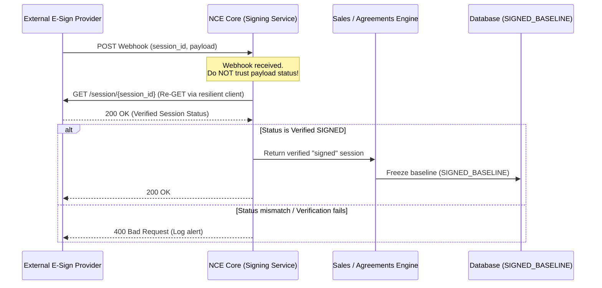
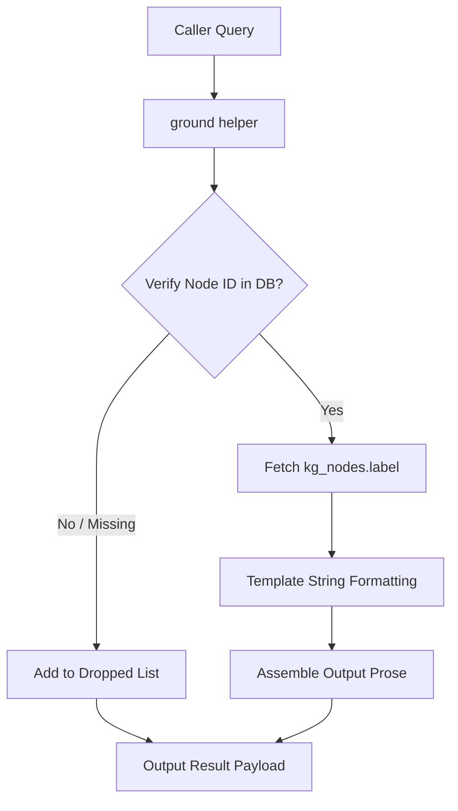

> **Status:** shipped · **Verified-against:** 7304330 (main) · **Last-audited:** 2026-08-17
# Shared Core Pricing, Signing, and Grounding Guide (Doc 64)

This guide details the design, configuration, implementation, and security models of the Neuro-Cognitive Engine (NCE) shared-core components for **Pricing (C6)**, **Signing (C7)**, and **Structural-Enforcement Grounding (C9a/C9b)**. These services are implemented in the `nce/` core and are shared by all downstream vertical engines.

---

## 1. C6 — Shared Pricing Service

The shared pricing service consolidates discount gross (DG) pricing and precedence-based cost resolution into a single reusable core. It prevents duplicate pricing implementations and ensures strict enforcement of cost and margin confidentiality.

### 1.1. Core DG Pricing Formula
The core pricing formula calculates a customer-facing sales price from internal cost and discount gross percentage (DG%).

$$sales\_price = \frac{cost}{1 - dg\_pct}$$

Implemented in [dg.py](https://github.com/sindrehaugen/NCE/blob/main/nce/pricing/dg.py):
```python
def dg_price(cost: float, dg_pct: float) -> float:
    """
    Calculate sales price from cost and DG% (discount gross).
    Formula: sales_price = cost / (1 - dg_pct)
    """
    if dg_pct < 0 or dg_pct >= 1:
        raise ValueError(
            f"dg_pct must be in [0, 1); got {dg_pct}. "
            f"At dg_pct >= 1, division by zero is undefined."
        )
    return cost / (1 - dg_pct)
```

> [!CAUTION]
> **Confidentiality Invariant (ADR-0017):**
> Cost and margin (including intermediate outputs of `dg_price` and `resolve_price`) are strictly confidential internal values. They **MUST NEVER** cross to customer-facing surfaces. Downstream consumers are responsible for applying field-level redactors (C8) to filter out cost fields before external responses are dispatched.

### 1.2. Configuration and Namespace Loading
The per-namespace DG% is loaded from a JSON configuration file located at `nce/config_data/product-dg.json`.
- **Loading logic:** `load_dg(namespace: str) -> float` loads this file, reads the value, and validates that it falls within the `[0, 1)` range.
- **Fail-closed behaviour:** If the configuration file is missing, or a namespace key is absent, the loader raises `FileNotFoundError` or `KeyError` respectively.

### 1.3. Price Resolution Precedence
The price resolution engine uses a connection acquired inside `scoped_pg_session` to ensure database reads respect PostgreSQL Row Level Security (RLS). 

Cost resolution follows a strict precedence chain:
$$\text{Customer BID} > \text{Supplier List Price} > \text{Base Price}$$

Implemented in [resolver.py](https://github.com/sindrehaugen/NCE/blob/main/nce/pricing/resolver.py):
```python
async def resolve_price(
    conn: Any,
    *,
    namespace_id: str,
    product: dict[str, Any],
    customer: dict[str, Any],
) -> PriceResult:
    # Precedence: customer BID > supplier list > base.
```

The resolver returns a `PriceResult` payload:
```python
PriceResult = dict[str, Any]
"""
{
    "cost":   float,              # Resolved cost (ADR-0017 — redact before external use)
    "source": str,                # "bid" | "supplier_list" | "base"
    "as_of":  datetime.datetime,  # Timestamp of the winning price row
    "stale":  bool,               # True when (now - as_of) > NCE_PRICING_MAX_AGE
}
"""
```

### 1.4. Freshness and Stale Signal
- **Enforcement:** A price is flagged as `stale` if its `as_of` timestamp is older than `NCE_PRICING_MAX_AGE` seconds.
- **Environment Variable:** `NCE_PRICING_MAX_AGE` (defined in [config.py](https://github.com/sindrehaugen/NCE/blob/main/nce/config.py#L1001), default `86400` seconds / 24 hours).
- **Resolver Invariant:** A stale price is **returned verbatim, never dropped or hidden**. The calling engine must check the `stale` flag and decide whether to proceed, re-negotiate, or trigger a background refresh.

### 1.5. Pricing MCP Tool
The pricing service is exposed via the MCP stdio handler `handle_pricing_resolve` (defined in [mcp_handlers.py](https://github.com/sindrehaugen/NCE/blob/main/nce/pricing/mcp_handlers.py)):
- **Input parameters:** `namespace_id` (UUID string), `product` (dict containing `supplier_list_price`, `supplier_list_as_of`, `base_price`, `base_as_of`), and `customer` (dict containing `bid_price`, `bid_as_of`).
- **Internal execution:** Executes inside a transaction context via `scoped_pg_session(engine.pg_pool, namespace_id)`.
- **Output:** Returns a JSON response containing `status`, `cost`, `source`, `as_of` (ISO 8601), and the `stale` flag.

---

## 2. C7 — Shared Signing Service

The shared signing service manages e-signing workflow ceremonies. It wraps multiple external e-sign platforms behind a single unified interface, allowing engines to request signatures and handle webhook completions without coupling to vendor-specific SDKs.

### 2.1. Architectural Distinction: SignTransport vs. Doc 22 HMAC
It is critical to distinguish between the **C7 SignTransport Ceremony** and the **Doc 22 HMAC/V2 Data-Integrity Signing Layer**:

| Attribute | Doc 22 Cryptographic Signing (Integrity) | C7 SignTransport (Workflow Ceremony) |
| :--- | :--- | :--- |
| **Purpose** | Guarantees tamper-evidence and causal provenance of raw data rows. | Manages the legal contract signing process with third parties. |
| **Substrate** | Symmetric HMAC-SHA256 and Post-Quantum Asymmetric ML-DSA-44. | External e-sign APIs (Oneflow, Criipto, Signicat) or Manual mock. |
| **Key Material** | Versioned DB-stored keys or the raw master-key `NCE_MASTER_KEY`. | Managed by external identity rails (e.g. BankID, QES, CLM-backend). |
| **Output Location**| Stored in `signature` and `signature_key_id` columns in DB tables. | Yields workflow state changes (`pending`, `signed`, `declined`). |
| **Verification** | Re-computed locally on read, recall, or event replay. | Verified via a back-channel "fire-and-pull" API callback. |

### 2.2. The SignTransport Protocol Interface
The abstract interface is defined as a Python runtime-checkable protocol in [transport.py](https://github.com/sindrehaugen/NCE/blob/main/nce/signing_service/transport.py):

```python
@runtime_checkable
class SignTransport(Protocol):
    def request_signature(
        self, doc: bytes, signer: dict[str, Any], method: TransportMethod
    ) -> dict[str, Any]:
        """Initiate a signing session. Returns a session dict with REQUIRED_SESSION_KEYS."""
        ...

    def on_signed(self, session_id: str, callback_payload: dict[str, Any]) -> dict[str, Any]:
        """Handle a 'signed' webhook event and verify state via re-GET."""
        ...

    def on_declined(self, session_id: str, callback_payload: dict[str, Any]) -> dict[str, Any]:
        """Handle a 'declined' webhook event and verify state via re-GET."""
        ...
```

- **Supported Methods (`TransportMethod`):** `"oneflow"`, `"criipto"`, `"signicat"`, and `"manual"`.
- **Required Session Keys:** Every returned session dict MUST contain `session_id` (str), `status` (str: `pending` | `signed` | `declined`), and `fingerprint` (str).

### 2.3. Document Fingerprinting
The fingerprint is calculated as the lowercase hex SHA-256 digest of the document bytes (`sha256_fingerprint(doc)`). 
- **Deterministic:** The same document bytes always yield the same fingerprint.
- **Identity Handle:** This acts as a content-identity handle to ensure the document was not altered between request and signature. It is **not** a cryptographic signing operation (which is outsourced to the provider's BankID or QES rail).

### 2.4. Webhook Security: Fire-and-Pull Flow
To prevent spoofing attacks (where a malicious actor sends fake webhook HTTP requests to trigger deal transitions), the system enforces a strict **fire-and-pull** flow:



> [!IMPORTANT]
> **Fire-and-Pull Verification Rule:**
> Inbound webhooks triggers (`on_signed` / `on_declined`) **MUST NOT** trust the status in the webhook request payload. The transport implementation must perform an out-of-band re-GET (using `nce.http_resilience.request_with_retry`) to retrieve the source-of-truth session object from the provider API.

### 2.5. Manual Transport Implementation
For local development, testing, and CI environments, NCE provides `ManualTransport` in [manual.py](https://github.com/sindrehaugen/NCE/blob/main/nce/signing_service/manual.py).
- **Zero Credentials:** Operates entirely in memory and requires no third-party API keys.
- **Simulated Re-GET:** Implements the fire-and-pull pattern by querying its internal in-memory session dictionary, mimicking the out-of-band GET request.
- **Audit Logging:** Logs all transitions (`requested`, `signed`, `declined`) to an in-process audit list. Callers can retrieve a copy of the log using `get_audit_trail()` to persist it or analyze test results.

---

## 3. Structural-Enforcement Helpers (C9)

Structural-enforcement helpers protect system rules at the database and memory layer. Unlike traditional architectures, they do not rely on LLM prompts or heuristic checks; compliance is enforced structurally in Python domain code.

### 3.1. C9a — Retrieval-Grounded Generation Helper
The retrieval-grounded generation helper guarantees that prose generated by cognitive engines is built exclusively from factual database rows, preventing model hallucination.



Implemented in [grounded.py](https://github.com/sindrehaugen/NCE/blob/main/nce/structural/grounded.py):
- **Core Function:** `ground(conn, *, namespace_id, claims, template) -> dict`
- **Fact-Sourcing Invariant:** Fact text is sourced **only** from the database (`kg_nodes.label`) inside a scoped PG session:
  ```sql
  SELECT id, label FROM kg_nodes WHERE id = $1 AND namespace_id = $2
  ```
- **Dropped Claims:** The caller passes a list of node IDs. If a node is missing or does not exist in the active namespace, the claim is dropped from the output prose and appended to a `dropped` list. The caller-supplied claim cannot pass a custom fact string to the final text.
- **Prose Assembly:** Backed node labels are joined with a double space `"  "` and injected into a single `{facts}` placeholder inside the template.

---

### 3.2. C9b — No-Person-Grain Comparison Query Guard
The no-person-grain guard blocks ranking, scoring, or comparisons of individual employees, contractors, or resources (enforcing compliance with EU AI Act and HR safety policies).

Implemented in [no_person_grain.py](https://github.com/sindrehaugen/NCE/blob/main/nce/structural/no_person_grain.py):

#### Aggregation Grains
The system defines four levels of granularity:
```python
class AggregationGrain(Enum):
    PERSON = auto()  # Individual - STRICTLY PROHIBITED for comparison
    TEAM = auto()    # Team or department unit
    PERIOD = auto()  # Time-based boundary (week, month, quarter)
    ENGINE = auto()  # Operational engine or service boundary
```

#### Verification Flow
```python
@dataclass(frozen=True)
class QueryIntent:
    has_person_dimension: bool      # Targets EMPLOYEE / CONTRACTOR / RESOURCE
    is_comparison_or_ranking: bool  # Requests comparative ordering or scoring
    requested_grain: AggregationGrain
```

```python
# Allowed grains for comparative/ranking queries
_SAFE_GRAINS = frozenset({AggregationGrain.TEAM, AggregationGrain.PERIOD, AggregationGrain.ENGINE})
```

- **Enforcement (`apply_guard`):** 
  If `has_person_dimension` and `is_comparison_or_ranking` are both `True`, the query is flagged as a person-grain comparison. 
  - **Default-Deny:** The requested grain MUST belong to the `_SAFE_GRAINS` allowlist.
  - If the caller requests `AggregationGrain.PERSON` (or any unlisted grain), the guard immediately raises a `PersonGrainRejected` exception, terminating execution.
  - If the grain is in the allowlist (e.g., `TEAM`), the query is coerced and aggregated at that level.

> [!WARNING]
> **No-Bypass Exception:**
> There is no code path or override that allows individual person comparison rows to be returned. Non-comparative queries (e.g. retrieving a single person's details or certifications) do not set `is_comparison_or_ranking` to true and are not blocked.

---

## 4. Developer Verification and Testing

To verify the components locally, run the corresponding pytest suites:

```powershell
# Run the complete test suite for shared core components
pytest nce/tests/test_pricing.py
pytest nce/tests/test_signing_service.py
pytest nce/tests/test_structural_guards.py
```

### Verification Checklist
- [ ] For C6, verify that all responses containing pricing information redact `cost` and `margin` fields before hitting external APIs.
- [ ] For C7, verify that the webhook router implements the fire-and-pull callback using `request_with_retry` and does not trust incoming webhook request bodies directly.
- [ ] For C9a, verify that unbacked node IDs are logged and excluded from generated output templates.
- [ ] For C9b, verify that any new query logic involving person comparative rankings applies `apply_guard` before executing.
