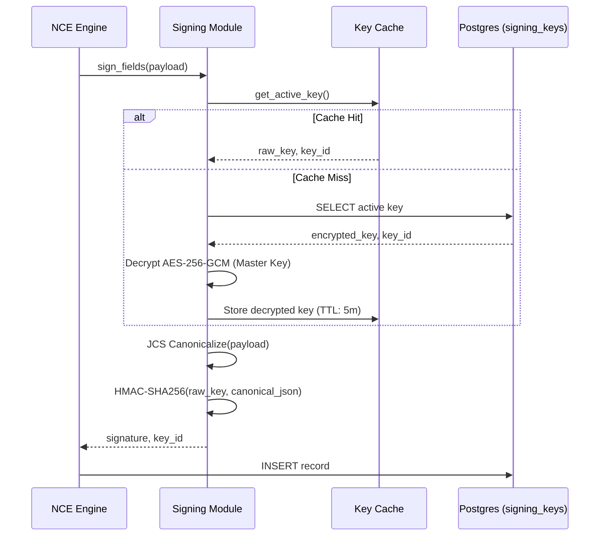

> **Status:** shipped · **Verified-against:** 7304330 (main) · **Last-audited:** 2026-08-17

# Cryptographic Signing and Integrity

NCE maintains a tamper-evident audit trail for every memory and event. This is achieved through a mandatory HMAC-SHA256 signing layer (symmetric) and, for new event_log rows, an ML-DSA-44 (FIPS 204) post-quantum asymmetric layer, both guaranteeing integrity and causal provenance.

## The Signing Mechanism

Every record in the `memories` and `event_log` tables includes a `signature` and a `signature_key_id`.

### Write-Path Signal Flow



## Key Management and Security

### 1. Master Key (NCE_MASTER_KEY)

Signing keys are not stored in plaintext. They are wrapped using **AES-256-GCM** with a key-encryption key derived from `NCE_MASTER_KEY` at startup.

-   The server will **refuse to start** if `NCE_MASTER_KEY` is missing or shorter than **32 UTF-8 bytes** (`_MASTER_KEY_LEN = 32` in `nce/signing.py`; independently enforced at config import time in `nce/config.py`).
-   The wrapping key is **not** a bare SHA-256 digest of the master secret. The derivation depends on which blob format is being written or read (see wire formats below).

#### Wrapping-Key Derivation (by blob version)

| Blob version | Magic prefix | KDF | Parameters | Notes |
|---|---|---|---|---|
| v3 (preferred) | `TC3\x01` | **Argon2id** | time=3, mem=64 MiB, para=4, len=32 | OWASP 2025 minimum; requires `argon2-cffi` |
| v4 (fallback) | `TC4\x01` | PBKDF2-HMAC-SHA256 | 600,000 iterations, per-blob random 16-byte salt | OWASP 2026 minimum; used when `argon2-cffi` is absent |
| v2 (legacy compat) | `TC2\x01` | PBKDF2-HMAC-SHA256 | **100,000 iterations (default floor)**, per-blob random 16-byte salt | NIST minimum; configurable via `NCE_PBKDF2_ITERATIONS`; still decryptable, no longer written |
| v1 (legacy) | _(none)_ | SHA-256 digest only | No salt | Pre-v2 blobs; still decryptable for migration, never written |

New writes always produce **v3** (Argon2id) when `argon2-cffi` is installed, or **v4** (PBKDF2 @ 600K) otherwise. All four formats remain decryptable for backward compatibility.

Each encrypted blob layout: `<prefix (4 bytes)> || salt (16 bytes) || nonce (12 bytes) || ciphertext+GCM-tag`. Legacy v1 blobs omit prefix and salt.

> **Note — v2 iteration count is a configurable default, not an immutable property.** The v2 (`TC2\x01`) PBKDF2 iteration count of **100,000** is the *default floor*. It is read from `cfg.NCE_PBKDF2_ITERATIONS` (`nce/signing.py:113-116`), whose default is `100_000` with a hard `minimum=100_000` (`nce/config.py:524`) — operators may raise it but never lower it below the NIST minimum. This setting affects the **v2 path only** (the v4 new-write path uses the separate `NCE_PBKDF2_ITERATIONS_V4`, default 600,000). **Caution:** because the iteration count is baked into how the wrapping key is derived and is *not* stored in the blob, changing `NCE_PBKDF2_ITERATIONS` after v2 blobs have been written makes those existing v2 blobs undecryptable (key derivation no longer reproduces the original AES key). Treat any change to this value as a one-way decision unless no v2 blobs exist.

#### ⚠ Operational Gotcha / Known Failure Mode: Silent Fallback on Decryption

> [!WARNING]
> **Undecryptable v3 (`TC3\x01`) Blobs Due to Missing `argon2-cffi`**
>
> If `argon2-cffi` is missing from the runtime environment (i.e. `_HAS_ARGON2 = False` in `nce/signing.py`), `_argon2id_derive_aes_key()` **silently falls back to PBKDF2 @ 600K** (`_pbkdf2_derive_aes_key_v4`):
>
> ```python
> def _argon2id_derive_aes_key(master_key: MasterKey, salt: bytes) -> bytes:
>     if not _HAS_ARGON2:
>         return _pbkdf2_derive_aes_key_v4(master_key, salt)
>     ...
> ```
>
> **Consequences on the Decrypt Path:**
> - When `decrypt_signing_key()` encounters a v3 blob (`TC3\x01`), it detects the v3 magic prefix and calls `_argon2id_derive_aes_key(master_key, salt)`.
> - Without `argon2-cffi`, `_argon2id_derive_aes_key()` executes the silent fallback and derives the AES key using PBKDF2 instead of Argon2id.
> - The derived PBKDF2 key does **not** match the original Argon2id key used during encryption.
> - AES-256-GCM authentication fails, raising:
>   `SigningKeyDecryptionError: Failed to decrypt signing key with master key (invalid key or corrupted data).`
>
> **Operator Misrouting Hazard:**
> Because the exception text attributes failure to *"invalid key or corrupted data"*, operators frequently misdiagnose this as a **lost master key** (`NCE_MASTER_KEY` mismatch), data corruption in `signing_keys.encrypted_key`, or broken secret storage. In reality, `NCE_MASTER_KEY` is completely valid, but the runtime environment is missing `argon2-cffi` (e.g. due to deploying without C extensions or using an incomplete virtualenv).
>
> **Remediation:**
> Ensure `argon2-cffi>=25.1.0` is installed in the active Python environment (`pip install argon2-cffi` or sync from `requirements.lock`). If deploying in minimal or containerised environments, ensure binary wheels or C compiler build dependencies are present.

### 2. ML-DSA-44 Post-Quantum Asymmetric Signing

In addition to HMAC-SHA256, the module ships a **ML-DSA-44** (FIPS 204 / CRYSTALS-Dilithium) asymmetric layer for new `event_log` rows.

-   Algorithm identifier: `ML-DSA-44` (128-bit classical security, FIPS 204 parameter set).
-   Key pair: 32-byte seed (private) and 1312-byte raw public key.
-   The seed is stored encrypted at rest via `encrypt_signing_key` (same AES-256-GCM wrapping as HMAC keys).
-   Signing: deterministic (`mldsa_sign`); verification: `mldsa_verify` returns `True` on success.
-   Requires `cryptography >= 50.0.0` (pinned to `50.0.0` in `requirements.lock`). Falls back gracefully — existing HMAC-SHA256 rows remain fully verifiable if ML-DSA is unavailable.

### 3. JCS Canonicalization (RFC 8785)

To ensure the signature is deterministic, NCE uses the **JSON Canonicalization Scheme (JCS)**. This ensures that even if keys in the JSON payload are reordered or whitespace changes, the resulting byte array used for signing remains identical. The `jcs` library is the preferred implementation; a sort-keys JSON fallback is used if `jcs` is unavailable (safe for NCE payloads, which never contain bare floats).

### 4. Key Rotation

NCE supports zero-downtime key rotation via the `rotate_key()` function.

-   All currently `active` signing keys are atomically set to `retired` (with `retired_at` timestamp) in the same DB transaction that inserts the new `active` key.
-   Retired keys are **retained** in `signing_keys` indefinitely to allow verification of historical records signed under them.
-   On completion, all cached `MutableKeyBuffer` entries are explicitly zeroed and the in-memory `_SigningKeyCache` is cleared. The next `get_active_key()` call reloads from the database.
-   New records always use the latest `active` key.

## Verification

There are **two distinct signing paths**, and they verify differently. Applying the wrong procedure to the wrong path produces false-tamper results.

### Path A — Memory & event signatures (via `signing_keys`)

Records in the `memories` and `event_log` tables are signed with `sign_fields()` using a per-record signing key from the `signing_keys` table, and they store a `signature_key_id`. During memory recall or event replay, verify such a record by:

1.  Retrieving the `signature_key_id` from the record.
2.  Fetching the corresponding signing key (active or retired) — e.g. `get_key_by_id()`.
3.  Re-computing the HMAC-SHA256 over the JCS-canonical fields (`sign_fields` / `verify_fields`) and comparing it to the stored signature with a constant-time check.

For this path, any mismatch indicates that the data has been modified since it was originally written to the stack.

### Path B — Audit-log entries (via raw master-key HMAC)

> **Do NOT apply the 3-step procedure above to audit-log entries.** Doing so yields false-tamper results, because audit-log entries are signed completely differently.

`sign_audit_log_entry()` (`nce/signing.py:969-990`) does **not** use the `signing_keys` table at all. It HMACs the JCS-canonical payload **directly with the raw master key**:

```python
canonical_bytes = canonical_json(payload)
with require_master_key() as master_key:
    sig = hmac.new(bytes(master_key.key_bytes), canonical_bytes, hashlib.sha256).hexdigest()
return sig
```

Key consequences (`nce/signing.py:987-989`):

-   There is **no `signature_key_id`** for these entries — none is computed and none is stored. Steps 1-2 of Path A are inapplicable.
-   The signing key is `NCE_MASTER_KEY` itself (the raw bytes), **not** a derived or table-stored key.
-   Verify by recomputing the HMAC with the **current** master key over the same canonical payload and comparing (use a constant-time comparison) to the stored hex signature.

> **A mismatch is NOT proof of tampering for Path B.** Because these signatures are bound to the live master-key value (not a versioned, retained key), audit-log entries written under a *previous* master key become **unverifiable after a master-key rotation/change** — the current master key no longer reproduces the original HMAC. A mismatch on this path can mean either tampering **or** that the master key has changed since the entry was written, so it cannot be treated as conclusive evidence of tampering.
