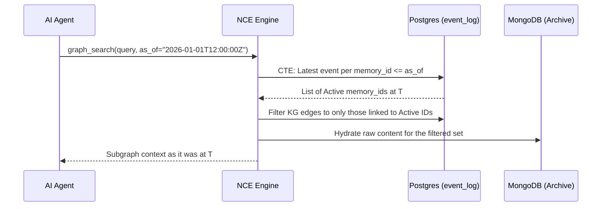
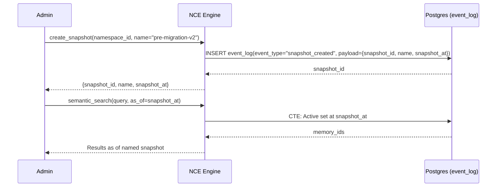

> **Status:** shipped · **Verified-against:** 7304330 (main) · **Last-audited:** 2026-08-17

# Memory Time Travel

Time Travel is a core capability of NCE that allows agents and administrators to query the memory store as it existed at any specific point in history.

## The Temporal Foundation

Time travel is built upon NCE's **WORM (Write Once, Read Many) Event Log**. Unlike traditional databases that overwrite state, NCE logs every memory creation, update, or deletion as a discrete, immutable event.

## How it Works: `as_of` Queries

The following tools all accept an optional `as_of` parameter (ISO-8601 UTC timestamp):

| Tool | Description |
|---|---|
| `semantic_search` | Vector similarity search over memories at point in time |
| `graph_search` | BFS Knowledge Graph traversal at point in time |
| `neuromorphic_search` | Spreading-activation KG traversal at point in time |
| `get_recent_context` | Most-recent episodic memories at point in time |
| `explain_past_decision` | Bi-temporal belief-state reconstruction with signed receipts |
| `verify_memory` | Integrity and causal-provenance check at point in time |
| `compare_states` | Diff between two timestamps (uses `as_of_a` / `as_of_b`) |

All `as_of` values must be ISO 8601 UTC strings, e.g. `"2026-01-15T10:00:00Z"`. Omitting `as_of` queries current state.

### State Reconstruction Signal Flow

When a query is received with an `as_of` timestamp, the engine performs a "Temporal Reconstruction":



## Reconstruction Rules

The engine applies the following logic to reconstruct the "Active Set" at time $T$. These rules are grounded in the event types defined in `nce/event_types.py`:

| Rule | Event type | Effect |
|---|---|---|
| **Include** | `store_memory` | Memory is active if the latest event before $T$ is `store_memory` |
| **Exclude** | `forget_memory` | Memory is excluded if latest event before $T$ is `forget_memory`, or no events exist before $T$ |
| **Update salience** | `boost_memory` | Salience score from the most recent `boost_memory` event before $T$ is applied |

> Note: `re_embed` is not an event type on main. Embedding migrations write a new `store_memory`-family event via the migration saga; salience adjustment is tracked solely through `boost_memory`.

### MongoDB Versioning (Technical Detail)

While MongoDB stores the "heavy" payload, the **PostgreSQL Event Log** serves as the authoritative version index. Every state change creates a new event row. During reconstruction, NCE uses the `payload_ref` from the matched event log entry to hydrate the correct version of the raw data from MongoDB, ensuring bit-identical historical recall.

The `store_memory` event's required params include `payload_ref`, which is the MongoDB reference used during hydration (`nce/event_types.py`, `EVENT_REQUIRED_PARAM_KEYS["store_memory"]`).

## Named Snapshots

NCE ships three tools for creating and managing named point-in-time references ("snapshots"). A snapshot tags a specific `snapshot_at` timestamp under a human-readable `name` so agents and operators can refer to stable historical states without embedding raw timestamps in every call.

### Snapshot Tools

```
create_snapshot(namespace_id, name, snapshot_at?, agent_id?, metadata?)
list_snapshots(namespace_id)
delete_snapshot(namespace_id, snapshot_id)
```

Creating a snapshot emits a `snapshot_created` event into the WORM event log (event type defined in `nce/event_types.py`), with required payload keys `snapshot_id`, `name`, and `snapshot_at`.

### Snapshot Lifecycle



### Snapshot Tool Reference

| Tool | Required params | Optional params |
|---|---|---|
| `create_snapshot` | `namespace_id`, `name` | `snapshot_at`, `agent_id`, `metadata` |
| `list_snapshots` | `namespace_id` | — |
| `delete_snapshot` | `namespace_id`, `snapshot_id` | — |

Snapshots do not copy data — they are lightweight event-log markers. Passing the recorded `snapshot_at` value to any `as_of`-capable tool produces the corresponding historical view.

### State Comparison

The `compare_states` tool diffs two arbitrary points in time within a namespace:

```
compare_states(namespace_id, as_of_a, as_of_b, query?, top_k?)
```

Both `as_of_a` and `as_of_b` are required. `snapshot_at` values returned by `list_snapshots` can be passed directly.

## Use Cases

- **Auditing and Forensic Analysis**: Investigate the exact information an agent had when it made a specific decision.
- **Regression Testing**: Test agent behavior against historical datasets without manually resetting the database.
- **Scenario Simulation**: Provide a baseline for "What-If" analysis using the Memory Replay Engine.
- **Migration Safety**: Tag a `pre-migration-v2` snapshot before any embedding migration, then compare before/after with `compare_states`.
